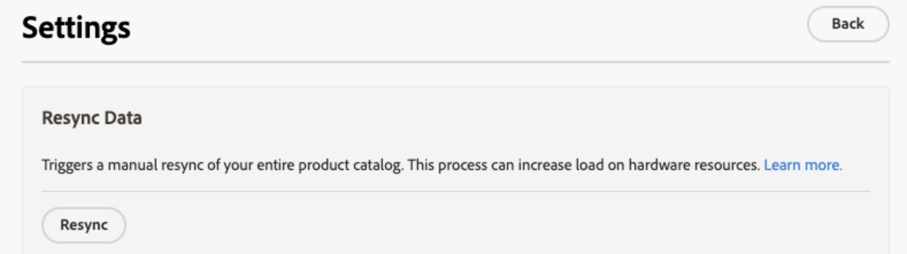

# データ管理ダッシュボード

Data Management ダッシュボードでは、Commerce データベースからCommerce SaaS サービスに転送される製品データの同期ステータスの概要が表示されます。 製品の同期ステータスを監視し、統合ダッシュボードからデータの再同期を開始できます。 この機能は、ストアフロントの商品データの可用性に関する貴重なインサイトを提供し、買い物客に迅速に表示できるようにします。

>[!NOTE]
>
>カタログデータをAdobe Commerce Optimizerに書き出すために[Adobe Commerce Optimizer Connector](https://experienceleague.adobe.com/en/docs/commerce/aco-optimizer-connector/overview)をインストールした場合は、Data Management ダッシュボードではなく、Commerce Optimizer Studioの[Data Sync ページ &#x200B;](https://experienceleague.adobe.com/en/docs/commerce/optimizer/setup/data-sync)を使用して、正常なデータ同期を確認します。

## オーディエンス

Data Management Dashboardは、アクティブなライセンスを持つ[[!DNL Product Recommendations v6.0.0]](https://experienceleague.adobe.com/en/docs/commerce/product-recommendations/guide-overview)、[[!DNL Live Search v4.1.0]](https://experienceleague.adobe.com/en/docs/commerce/live-search/guide-overview)、[[!DNL Catalog Service v1.17]](https://experienceleague.adobe.com/en/docs/commerce/catalog-service/guide-overview)を使用しているすべてのCommerce マーチャントに追加料金なしで利用できます。

データ管理ダッシュボードは、*システム*/データ転送/*データ管理ダッシュボード*&#x200B;にあります。

ダッシュボードには、次のフィールドが含まれます。

| フィールド | 説明 |
|--- |--- |
| 範囲 | 同期データ用の特定のweb サイト。 |
| [!DNL Product Recommendations] | 同期ステータス、同期済み製品数、および[の](https://experienceleague.adobe.com/en/docs/commerce-admin/config/catalog/inventory#stock-options)displayable[!DNL Product Recommendations]同期製品のテーブルを表示します。 |
| [!DNL Live Search] | 同期ステータス、同期済み製品数、および[の](https://experienceleague.adobe.com/en/docs/commerce-admin/config/catalog/inventory#stock-options)displayable[!DNL Live Search]同期製品のテーブルを表示します。 |
| [!DNL Catalog Service] | 同期ステータス、同期済み製品数、および[!DNL Catalog Service]の同期済み製品のテーブルを表示します。 |
| 設定 | カタログ データを[手動で再同期できるダイアログを開きます](#resync-catalog-data)。 |
| 同期ステータス | 過去3時間以内にCommerce データベースから任意のSaaS サービスに転送された製品の数を表示します。 カタログの更新頻度が低い場合、この値は頻繁にゼロになります。 同期が進行中の場合は、**[!UICONTROL Refresh]**&#x200B;をクリックして、更新されたカウントを取得します。 |
| 製品数 | サービスで使用可能なカタログ製品の合計数を反映します。 [!DNL Product Recommendations]および[!DNL Live Search] ダッシュボードには、_表示可能_&#x200B;商品の合計数が表示されます。 [!DNL Catalog Service]はdisplayableで製品をフィルタリングしないので、[!DNL Catalog Service]と[!DNL Live Search]または[!DNL Product Recommendations]の両方がインストールされている場合、2つのダッシュボードで製品数に2つの異なる値を表示できます。 |
| 同期済み製品 | コア Commerce インデックスの商品に関する詳細を提供します。 デフォルトでは、このテーブルは「最終更新日」でソートされます。 特定の製品を検索するには、**[!UICONTROL Search by SKU]** フィールドを使用します。 表示する列を制御するには、テーブルの右側にある&#x200B;**[!UICONTROL Customize Table]**&#x200B;をクリックします。 |

## データ管理ダッシュボードの使用

Commerce データベースの製品を更新すると、製品データはシステム設定に従ってSaaS サービスに転送されます。 同期プロセスが開始されると、**製品数**&#x200B;は、SaaS サービスに送信された製品数を示します。

>[!IMPORTANT]
>
>同期を完了するのにかかる時間は、カタログサイズと更新されるデータ量によって異なります。

処理された製品数が更新された製品数と一致すると、同期が完了したことを示します。

>[!NOTE]
>
>Adobeには、開発者やシステムインテグレーターがCommerce SaaS サービスの同期操作の管理と追跡およびエラーのトラブルシューティングに使用できるコマンドラインインターフェイスとシステムログも用意されています。 詳しくは、[SaaS データ書き出しガイド &#x200B;](https://experienceleague.adobe.com/en/docs/commerce/saas-data-export/overview)を参照してください。

### 同期済み製品のリスト

同期済み製品の詳細を表示するには、テーブルから製品をクリックします。

### カタログデータの再同期

Commerce SaaS サービスを常に最新の製品情報に保つために、[&#x200B; カタログデータの同期スケジュール &#x200B;](https://experienceleague.adobe.com/en/docs/commerce-operations/configuration-guide/cli/manage-indexers#reindex)を実装する必要があります。

Commerce データベースからSaaS サービスへのカタログデータの再同期を[手動で](#manually-resync-catalog)開始できますが、ハードウェアリソースの負荷が増加する可能性があるため、お勧めしません。 ただし、次のシナリオでは、カタログを手動で再同期する必要がある場合があります。

- 新製品の追加、製品詳細の更新、カテゴリの変更など、製品カタログに大きな変更が加えられたときはいつでも

- ストアフロントへの商品データの表示において、矛盾やパフォーマンスの問題が発生した場合

- CommerceデータベースとSaaS サービス間の統合の更新や変更をフォローする

- 製品データの管理または同期プロセスに影響するカスタマイズまたは設定をデプロイする場合

これらのガイドラインに準拠し、必要に応じてカタログデータを積極的に再同期することで、Adobe Commerceのエコシステム全体でデータの一貫性、正確性、信頼性を維持できます。

#### カタログを手動で再同期

カタログデータを再同期する必要がある場合は、ページの右側にある&#x200B;**[!UICONTROL Settings]**&#x200B;をクリックして、再同期を開始できるダイアログを表示します。 カタログデータを再同期すると、サービスはCommerce データベースからSaaS サービスにデータを強制的にリフェッチします。

