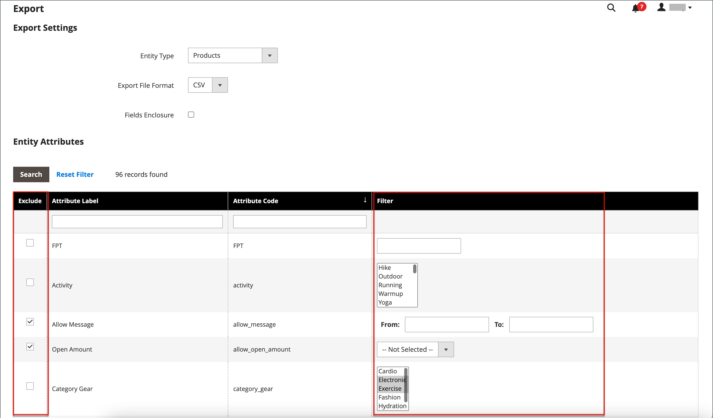

# データを書き出し

データベースの構造を理解するには、データを書き出してスプレッドシートで開くことが最適な方法です。 このプロセスに慣れたら、大量の情報を効率的に管理する方法として使用できます。

特殊文字（等号、記号より大きいまたは小さい、一重引用符と二重引用符、バックスラッシュ、パイプ、アンパサンド記号など）は、データ転送中に問題を引き起こす可能性があります。 このような特殊文字を正しく解釈するには、_エスケープシーケンス_ としてマークします。 例えば、データに `code="str"`、`code="str2"` などのテキスト文字列が含まれている場合、テキストを二重引用符で囲むと、元の二重引用符がデータの一部と理解されます（`"code="str""`）。 システムが二重引用符の二重セットに遭遇すると、外側の二重引用符セットが実際のデータを囲んでいることを認識します。

データの書き出しは、非同期の操作で、バックグラウンドで実行されるので、操作が完了するのを待たずに管理で作業を続行できます。 タスクが完了すると、メッセージが表示されます。

## 書き出し条件

書き出しフィルターは、属性値に基づいて、書き出しファイルに含めるデータを指定するために使用します。 さらに、書き出しに含める、または書き出しから除外する属性データを指定できます。

{width="600" zoomable="yes"}

### フィルターを書き出し

フィルターを使用して、書き出しファイルに含める SKU を指定できます。 例えば、「製造国」フィルターに値を入力した場合、書き出された CSV ファイルには、その国で製造された製品のみが含まれます。

フィルターのタイプは、データタイプに対応します。 日付フィールドでは、カレンダー  から日付を選択できます。 詳しくは、[&#x200B; 属性入力タイプ &#x200B;](../catalog/attributes-input-types.md) を参照してください。

日付の形式は [locale](../getting-started/store-details.md#locale-options) によって決まります。

SKU など特定の値を持つレコードのみを含めるには、その値を「フィルター」フィールドに入力します。 一部のフィールド（「価格」、「重量」、「新製品として製品を設定」など）には、開始値/終了値の範囲があります。

### 属性を除外

最初の列のチェックボックスは、エクスポートファイルから属性を除外するために使用します。 属性が除外されている場合は、エクスポートデータ内の関連する列は含まれますが、空になります。

| 除外 | フィルター | 結果 |
|--- |--- |--- |
|  | 不可 | 書き出されるファイルには、既存のすべてのレコードの各属性が含まれます。 |
|  | はい | エクスポートファイルには、フィルターで許可されたレコードのみを含んだ各属性が含まれています。 |
|  | 不可 | エクスポートファイルには、除外属性の列は含まれず、既存のすべてのレコードが含まれます。 |
|  | はい | エクスポートファイルには、除外属性の列は含まれておらず、フィルターで許可されたレコードのみが含まれています。 |

{style="table-layout:auto"}

## データを書き出し

1. _管理者_ サイドバーで、**[!UICONTROL System]**/_[!UICONTROL Data Transfer]_/**[!UICONTROL Export]**&#x200B;に移動します。

1. _書き出し設定_ セクションで、**[!UICONTROL Entity Type]** を次のいずれかに設定します。

   - `Advanced Pricing`
   - `Products`
   - `Customer Finances`
   - `Customers Main File`
   - `Customer Addresses`
   - `Stock Sources`

   {width="600" zoomable="yes"}

1. CSV のデフォルト **[!UICONTROL Export File Format]** をそのまま使用します。

1. データ内にある特殊文字を _エスケープシーケンス_ として囲む場合は、「**[!UICONTROL Fields Enclosure]**」チェックボックスをオンにします。

1. 必要に応じて、エンティティ属性の表示を変更します。

   デフォルトでは、「エンティティ属性」セクションには、使用可能なすべての属性がアルファベット順に表示されます。 標準の [&#x200B; リストコントロール &#x200B;](../getting-started/admin-grid-controls.md) を使用して、特定の属性を検索したり、リストを並べ替えたりできます。 [ 検索 ] および [ フィルタのリセット ] コントロールは、リストの表示をコントロールしますが、書き出しファイルに含める属性の選択には影響しません。

   {width="600" zoomable="yes"}

1. 属性値に基づいて書き出したデータをフィルタリングするには、次の手順を実行します。

   - 特定の属性値を持つレコードのみをエクスポートするには、必要な値を **[!UICONTROL Filter]** 列に入力します。 次の例では、特定の SKU のみを書き出しています。

   - 書き出しから属性を削除するには、行の先頭にある「**[!UICONTROL Exclude]**」チェックボックスを選択します。 例えば、`sku` 列と `image` 列のみを書き出すには、1 つおきの属性のチェックボックスを選択します。 列はエクスポートファイルに表示されますが、値は表示されません。

1. 下にスクロールして、ページの右下隅にある「**[!UICONTROL Continue]**」をクリックします。

   タスクが完了すると、ファイルはメッセージキューを介して処理されます（cron ジョブが実行中であることを確認してください）。 書き出されたファイルは `var/export/ folder` に保存されます。 メッセージキューの詳細については、[&#x200B; 設定ガイド &#x200B;](https://experienceleague.adobe.com/docs/commerce-operations/configuration-guide/message-queues/manage-message-queues.html?lang=ja) の _メッセージキューの管理_ を参照してください。

   書き出された CSV ファイルをスプレッドシートとして保存または開き、データを編集してストアに読み込むことができます。

   >[!NOTE]
   >
   >デフォルトでは、書き出されたすべてのファイルは `<Magento-root-directory>/var/export` フォルダーにあります。 リモートストレージモジュールが有効な場合、書き出されたすべてのファイルは `<remote-storage-root-directory>/import_export/export` フォルダーにあります。

## リソースのトラブルシューティング

データの書き出しに関する問題のトラブルシューティングについて詳しくは、Commerce サポートナレッジベースの次の記事を参照してください。

- [&#x200B; 書き出された製品の.csv ファイルが表示されない &#x200B;](https://experienceleague.adobe.com/docs/commerce-knowledge-base/kb/troubleshooting/miscellaneous/exported-products-.csv-file-does-not-appear.html?lang=ja)
