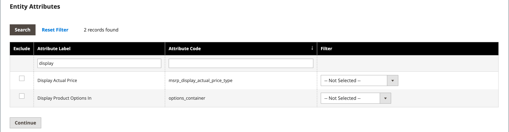

# データの書き出し

データベースの構造に慣れるための最良の方法は、データを書き出してスプレッドシートで開くことです。 このプロセスに慣れたら、大量の情報を効率的に管理する方法として使用できます。

特殊文字（等号、記号より大きい記号、より小さい記号、単一引用符および二重引用符、バックスラッシュ、パイプ、アンパサンド記号など）は、データ転送時に問題を引き起こす可能性があります。 このような特殊文字が正しく解釈されるように、_エスケープシーケンス_&#x200B;としてマークできます。 例えば、データに`code="str"`、`code="str2"`などの文字列が含まれている場合、テキストを二重引用符で囲むと、元の二重引用符がデータの一部であると認識されます：`"code="str""`。 システムが二重引用符の二重集合に遭遇すると、二重引用符の外部集合が実際のデータを囲んでいることを理解します。

データ書き出しは非同期操作で、バックグラウンドで実行されるため、操作が完了するのを待たずに管理者で作業を続けることができます。 タスクが完了すると、メッセージが表示されます。

## 書き出し基準

書き出しフィルターは、属性値に基づいて、書き出しファイルに含めるデータを指定するために使用されます。 さらに、書き出しに含める属性データまたは除外する属性データを指定できます。

{width="600" zoomable="yes"}

### フィルターの書き出し

フィルターを使用して、書き出しファイルに含めるSKUを決定できます。 例えば、「製造国」フィルターに値を入力すると、書き出されたCSV ファイルには、その国で製造された製品のみが含まれます。

フィルターのタイプは、データタイプに対応します。 日付フィールドの場合は、カレンダーから日付を選択できます。 詳しくは、[属性入力タイプ &#x200B;](../catalog/attributes-input-types.md)を参照してください。

日付の形式は、[&#x200B; ロケール &#x200B;](../getting-started/store-details.md#locale-options)によって決まります。

SKUなど、特定の値を持つレコードのみを含めるには、「フィルター」フィールドに値を入力します。 「価格」、「重み」、「製品を新規として設定」などの一部のフィールドには、値の範囲が指定されています。

### 属性を除外

最初の列のチェックボックスは、書き出しファイルから属性を除外するために使用されます。 属性を除外すると、エクスポートデータ内の関連付けられた列は含まれますが、空白になります。

| 除外 | フィルター | 結果 |
|--- |--- |--- |
|  | いいえ | 書き出されたファイルには、既存のすべてのレコードの各属性が含まれます。 |
|  | はい | 書き出しファイルには、フィルターで許可されるレコードのみを含む各属性が含まれます。 |
|  | いいえ | 書き出しファイルには、除外された属性の列は含まれませんが、既存のすべてのレコードは含まれます。 |
|  | はい | 書き出しファイルには、除外された属性の列は含まれず、フィルターで許可されるレコードのみが含まれます。 |

{style="table-layout:auto"}

## データの書き出し

1. _管理者_ サイドバーで、**[!UICONTROL System]** > _[!UICONTROL Data Transfer]_>**[!UICONTROL Export]**&#x200B;に移動します。

1. _書き出し設定_ セクションで、**[!UICONTROL Entity Type]**&#x200B;を次のいずれかに設定します。

   - `Advanced Pricing`
   - `Products`
   - `Customer Finances`
   - `Customers Main File`
   - `Customer Addresses`
   - `Stock Sources`

   {width="600" zoomable="yes"}

1. CSVのデフォルト **[!UICONTROL Export File Format]**&#x200B;を受け入れます。

1. データ内で見つかる可能性のある特殊文字を&#x200B;_エスケープシーケンス_&#x200B;として囲む場合は、**[!UICONTROL Fields Enclosure]** チェックボックスを選択します。

1. 必要に応じて、エンティティ属性の表示を変更します。

   デフォルトでは、エンティティ属性セクションには、使用可能なすべての属性がアルファベット順に一覧表示されます。 標準の[&#x200B; リストコントロール &#x200B;](../getting-started/admin-grid-controls.md)を使用して、特定の属性を検索し、リストを並べ替えることができます。 検索とリセットフィルターは、リストの表示を制御しますが、書き出しファイルに含める属性の選択には影響しません。

   {width="600" zoomable="yes"}

1. 属性値に基づいて書き出されたデータをフィルタリングするには、次の操作を行います。

   - 特定の属性値を持つレコードのみを書き出すには、**[!UICONTROL Filter]**&#x200B;列に必要な値を入力します。 次の例では、特定のSKUのみを書き出します。

   - 書き出しから属性を省略するには、行の先頭にある&#x200B;**[!UICONTROL Exclude]** チェックボックスを選択します。 例えば、`sku`と`image`列のみを書き出すには、他のすべての属性のチェックボックスを選択します。 列はエクスポートファイルに表示されますが、値は表示されません。

1. 下にスクロールして、ページの右下隅にある「**[!UICONTROL Continue]**」をクリックします。

   タスクが完了すると、ファイルはメッセージキューを通じて処理されます（cron ジョブが実行されていることを確認してください）。 書き出されたファイルは`var/export/ folder`に保存されます。 メッセージキューについて詳しくは、_設定ガイド_&#x200B;の「[&#x200B; メッセージキューの管理](https://experienceleague.adobe.com/docs/commerce-operations/configuration-guide/message-queues/manage-message-queues.html?lang=ja)」を参照してください。

   書き出したCSV ファイルをスプレッドシートとして保存または開き、データを編集してストアに読み込むことができます。

   >[!NOTE]
   >
   >デフォルトでは、書き出されたすべてのファイルは`<Magento-root-directory>/var/export` フォルダーにあります。 リモート ストレージ モジュールが有効になっている場合、書き出されたすべてのファイルは`<remote-storage-root-directory>/import_export/export` フォルダーにあります。

## リソースのトラブルシューティング

データ書き出しの問題のトラブルシューティングについては、次のCommerce サポート技術情報を参照してください。

- [エクスポートした製品.csv ファイルが表示されない](https://experienceleague.adobe.com/docs/commerce-knowledge-base/kb/troubleshooting/miscellaneous/exported-products-.csv-file-does-not-appear.html)
