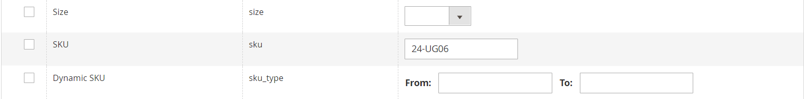

# 階層の価格のインポート

製品ごとに [&#x200B; 階層価格 &#x200B;](../catalog/product-price-tier.md) を手動で入力する代わりに、価格データを [&#x200B; インポート &#x200B;](data-import.md) する方が効率的な場合があります。 開始する前に、テンプレートとして使用できる、書き出された階層価格データのサンプルファイルを作成します。

{width="700" zoomable="yes"}

## 手順 1：階層価格データのエクスポート

次の例では、1 つの製品の階層価格データを書き出します。 次に、書き出されたデータを、階層価格データの一括読み込みのテンプレートとして使用できます。 詳細価格データのエクスポートについて詳しくは、[&#x200B; 詳細価格データ &#x200B;](data-attributes-product.md#advanced-pricing-attributes) を参照してください。

{width="600" zoomable="yes"}

1. _管理者_ サイドバーで、**[!UICONTROL System]**/_[!UICONTROL Data Transfer]_/**[!UICONTROL Export]**&#x200B;に移動します。

1. _[!UICONTROL Export Settings]_&#x200B;で、**[!UICONTROL Entity Type]**&#x200B;を `Advanced Pricing` に設定します。

1. **[!UICONTROL Entity Attributes]** グリッドで、下にスクロールして SKU 属性を選択し、以下の操作を行います。

   - 割引率に基づく階層価格の場合、書き出す各製品の SKU をコンマで区切って入力します。

     {width="600" zoomable="yes"}

   - 固定金額に基づく階層価格については、各製品の SKU を入力します。

   - 下にスクロールして、「**[!UICONTROL Continue]**」をクリックします。

1. Web ブラウザーのダウンロード先にあるエクスポートファイルを探して開きます。

   {width="600" zoomable="yes"}

**_エクスポートされた階層価格データ_**

書き出されたデータには、次の列が含まれます。

- `sku`
- `tier_price_website`
- `tier_price_customer_group`
- `tier_price_qty`
- `tier_price`
- `tier_price_value_type`

書き出されたデータを、階層価格データの読み込みのテンプレートとして使用します。

## 手順 2：データを更新する

1. 必要に応じて、各製品の階層価格データを更新します。

   階層価格アップデートのない製品は、CSV ファイルから削除できます。 変更されていない製品を再インポートする必要はありません。

1. 更新された CSV ファイルを **[!UICONTROL Save]** きます。

>[!NOTE]
>
>インポート ファイルのサイズは 2 MB 以下にする必要があります。

## 手順 3：更新したデータのインポート

1. _管理者_ サイドバーで、**[!UICONTROL System]**/_[!UICONTROL Data Transfer]_/**[!UICONTROL Import]**&#x200B;に移動します。

1. _読み込み設定_ で、**[!UICONTROL Entity Type]** を `Advanced Pricing` に設定します。

1. **[!UICONTROL Import Behavior]** を `Add/Update` に設定します。

1. **[!UICONTROL File to Import]** の下の **[!UICONTROL Choose File]** をクリックし、ディレクトリからインポートするファイルを選択します。

1. 右上隅の「**[!UICONTROL Check Data]**」をクリックします。

1. ファイルが有効な場合は、[**[!UICONTROL Import]**] をクリックします。

   それ以外の場合は、メッセージにリストされているデータの各問題を修正し、ファイルを再度インポートしてください。
