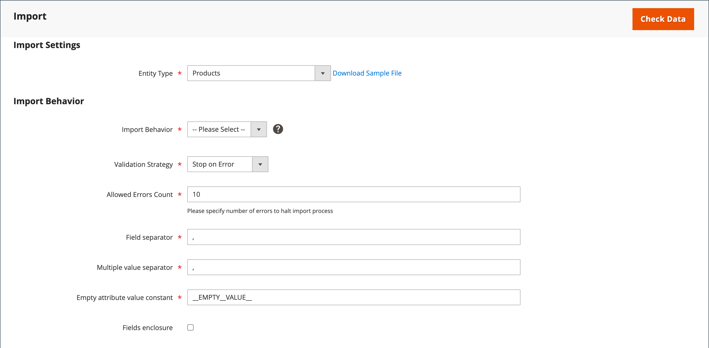

# データのインポート

すべての製品タイプのデータをストアに読み込むことができます。 さらに、製品、高度な価格データ、顧客データ、顧客住所データ、製品画像をインポートできます。 インポートでは、次の操作がサポートされています。

- 追加/更新
- 置換
- 削除

## インポートのガイドライン

### 新しいエンティティ

- エンティティが CSV ファイルで指定された属性値と共に追加されます。
- デフォルト値が設定されていない必須の属性の場合、値がない場合や有効でない値が存在する場合は、エンティティ（対応する行または行）をインポートできません。
- デフォルト値が設定されている必須の属性の場合、エンティティ（対応する行または行）がインポートされ、値がない場合や有効でない場合はデフォルト値が属性に設定されます。
- 複雑なデータが無効な場合、エンティティ（対応する行）はインポートできません。

### 既存のエンティティ

- 複雑なデータでない属性の場合、不要な属性の空の値を含め、インポートファイルの値が既存の値に置き換えられます。
- 必要な属性に値がない場合、または無効な値がある場合、既存の値は置き換えられません。
- エンティティの複雑なデータが無効な場合は、「インポート動作」ドロップダウンメニューで「エンティティの削除」が選択されている場合を除き、エンティティ（対応する行または行）をインポートできません。

### 複雑なデータ

インポートファイルで指定された属性が存在し、その値が定義された値のセットから導き出される場合、次の処理が行われます。

- 値が定義された値のセットにまだ含まれていない場合、行はインポートされ、デフォルト値（定義されている場合）が属性に設定されます。
- 値が既に定義済みのセットに含まれている場合、対応する行はインポートできません。
- インポートファイルで、システムでまだ定義されていない属性名が指定されている場合、その属性は作成されず、その値はインポートされません。

### 無効なファイル

- すべての行が無効な場合、ファイルはインポートできません。
- インポートファイル内で、存在しないサービスデータや複雑なデータ名 ( 例： `_<non-existing name>` 見出し。

## インポート操作

| 操作 | 説明 |
| --------- | ----------- |
| 追加/更新 | 新しい製品データは、データベース内の既存のエントリの既存の製品データに追加されます。 以下を除くすべてのフィールド `sku` を更新できます。  インポートデータで指定された新しい税区分が自動的に作成されます。  インポートファイルで指定された新しい製品カテゴリが自動的に作成されます。  インポートファイルで指定された新しい SKU は自動的に作成されます&#x200B;  **_注意：_**製品の場合は、読み込みによる SKU を除くすべてのフィールドを更新できます。  **_重要：_** Web サイトやカテゴリなど、複数のフィールド値を _追加/更新_ インポートの動作。 これらのフィールドが CSV ファイルにリストされていない場合、インポート後もデータベースに残ります。 |
| 置換 | 既存の製品データは、新しいデータで置き換えられます。  **_重要：_**既存の製品データが消去され、システム内のすべての参照が失われるので、データを置き換える際は注意が必要です。  インポートデータの SKU が既存のエンティティの SKU と一致する場合、SKU を含むすべてのフィールドが削除され、CSV データを使用して新しいレコードが作成されます。 CSV ファイルがデータベースに存在しない SKU を参照している場合は、エラーが発生します。 エラーを表示するには、「データをチェック」をオンにします。 |
| 削除 | インポートデータ内のデータベースに存在するエンティティは、データベースからすべて削除されます。  削除すると、SKU を除くインポートデータのすべての列が無視されます。 データ内のその他の属性はすべて無視できます。  CSV ファイルがデータベースに存在しない SKU を参照している場合は、エラーが発生します。 エラーを表示するには、「データをチェック」をオンにします。 |

{style="table-layout:auto"}

## 読み込みプロセス

インポートファイルのサイズは、 `php.ini` ファイルをサーバー上に置きます。 上のシステムメッセージ _インポート_ page は現在のサイズ制限を示します。 デフォルトのサイズは 2 MB です。

特殊文字（等号、大なり記号および小なり記号、一重引用符および二重引用符、バックスラッシュ、パイプ、アンパサンド記号など）は、データ転送時に問題を引き起こす可能性があります。 このような特殊文字を正しく解釈するために、 _エスケープシーケンス_. 例えば、データに次のような文字列が含まれている場合、 `code="str"`, `code="str2"`を指定した場合、テキストを二重引用符で囲むことを選択すると、元の二重引用符がデータの一部と認識されます。 二重引用符のセットを検出した場合、外側の二重引用符が実際のデータを含んでいることを認識します。

製品データをインポートする際、新しい製品データがデータベース内の既存の製品データエントリに追加されます。 SKU を除くすべてのフィールドは、読み込み時に更新できます。 既存のすべての製品データは、読み込まれた新しいデータに置き換えられます。 データを置き換える場合は注意が必要です。 既存の製品データはすべて消去され、システム内のすべての参照が失われます。

{width="600" zoomable="yes"}

### 手順 1：データの準備

1. 次の日： _管理者_ サイドバー、移動 **[!UICONTROL System]** > _[!UICONTROL Data Transfer]_>**[!UICONTROL Import]**.

1. の下 _読み込み設定_，設定 **[!UICONTROL Entity Type]** を次のいずれかに変更します。

   - `Advanced Pricing`
   - `Products`
   - `Customer Finances`
   - `Customers and Addresses`
   - `Customers Main File`
   - `Customer Addresses`
   - `Stock Sources`

1. クリック **[!UICONTROL Download Sample File]**.

1. Web ブラウザーのダウンロード場所で書き出しファイルを探し、ファイルを開きます。

   サンプルファイルには、製品タイプのプレースホルダデータを含む列見出しが含まれています。

   {width="600" zoomable="yes"}

1. サンプルファイルの構造を調べ、それを使用して CSV インポートファイルを準備し、列の見出しが正しく記述されていることを確認します。

1. インポートファイルのサイズがメッセージに表示される制限を超えていないことを確認します。

   {width="600"}

1. インポートデータに製品画像へのパスが含まれている場合は、画像ファイルが適切な場所にアップロードされていることを確認してください。

   コマースサーバー上のデフォルトの場所は次のとおりです。 `pub/media/import`.

   画像が外部サーバーに存在する場合は、その画像を含むディレクトリへの完全な URL が存在することを確認します。

### 手順 2：インポート動作の選択

{width="600" zoomable="yes"}

1. 設定 **[!UICONTROL Import Behavior]** を次のいずれかに変更します。

   - `Add/Update` （製品の場合、「SKU」を除くすべてのフィールドを読み込みによって更新できます）。
   - `Replace`
   - `Delete`

1. データのインポート時にエラーが発生した場合の処理を決定するには、次のいずれかを選択します。

   - `Stop on Error`
   - `Skip error entries`

1. の場合 **[!UICONTROL Allowed Errors Count]**」には、インポートがキャンセルされる前に発生する可能性のあるエラーの数を入力します。

   デフォルト値は 10 です。

1. コンマ (`,`) **[!UICONTROL Field separator]**.

1. コンマ (`,`) **[!UICONTROL Multiple value separator]**.

   CSV ファイルでは、コンマがデフォルトの区切り文字になっています。 別の文字を使用する場合は、CSV ファイル内のデータが指定した文字と一致していることを確認してください。

1. デフォルト値を受け入れる `_EMPTY_VALUE_` 対象： **[!UICONTROL Empty attribute value constant]**.

1. データ内の特殊文字を _エスケープシーケンス_&#x200B;を選択し、 **[!UICONTROL Fields Enclosure]** チェックボックス。

### 手順 3：インポートファイルを特定する

{width="600" zoomable="yes"}

1. クリック **[!UICONTROL Choose File]** をクリックして、インポートするファイルを選択します。

1. 読み込む準備が整った CSV ファイルを見つけ、「 **[!UICONTROL Open]**.

1. の場合 **[!UICONTROL Images File Directory]**、アップロードした画像が保存される Commerce サーバー上の場所の相対パスを入力します。

   例： `product_images`.

   >[!NOTE]
   >
   >Adobe CommerceとMagento Open Sourceの使用 `2.3.2` release（で指定したパス） _[!UICONTROL Images File Directory]_読み込み用の連結を画像ベースディレクトリに設定します。 `<Magento-root-folder>/var/import/images`. 例えば、 `product_images` ファイルを `<Magento-root-directory>/var/import/images/product_images` フォルダー。 インポートイメージベースディレクトリは、 `\Magento\ImportExport\etc\config.xml` ファイル。 リモートストレージモジュールが有効な場合は、ファイルを `<remote-storage-root-directory>/var/import/images/product_images` フォルダー。

   製品画像の読み込みについて詳しくは、 [製品画像の読み込み](data-import-product-images.md).

### 手順 4：データのインポートを確認する

1. 右上隅で、 **[!UICONTROL Check Data]**.

1. 検証プロセスが完了するまでしばらく待ちます。

   インポートデータが有効な場合は、次のメッセージが表示されます。

   {width="600"}

1. ファイルが有効な場合は、 **[!UICONTROL Import]**.

   それ以外の場合は、メッセージに表示されるデータの問題を修正し、もう一度ファイルをインポートしてみてください。

1. エラーが発生しない限り、インポートプロセスはデータの最後まで続きます。

   検証結果にエラーメッセージが表示される場合は、データの問題を修正し、ファイルを再度インポートします。

   {width="600"}

   インポートが完了すると、メッセージが表示されます。

## 履歴を読み込み

Commerce は、開始日時、ユーザー、実行時間、インポートされたファイルへのリンクを含む、ストアにインポートされたデータの記録を保持します。 The _実行時間_ は、インポート処理の期間です。

**_インポート履歴を表示するには：_**

次の日： _管理者_ サイドバー、移動 **[!UICONTROL System]** > _[!UICONTROL Data Transfer]_>**[!UICONTROL Import History]**.

{width="600" zoomable="yes"}

>[!NOTE]
>
>デフォルトでは、インポート履歴ファイルは、 `<Magento-root-directory>/var/import_history` フォルダー。 リモートストレージモジュールが有効な場合、インポート履歴ファイルは `<remote-storage-root-directory>/import_export/import_history` フォルダー。

| フィールド | 説明 |
|--- |--- |
| [!UICONTROL ID] | 転送を指定するために使用される内部番号。 |
| [!UICONTROL Start Date & Time] | 転送がおこなわれた特定の日時。 |
| [!UICONTROL User] | 転送をおこなった顧客。 |
| [!UICONTROL Imported file] | 読み込んだファイルをダウンロードするためのリンク。 |
| [!UICONTROL Error file] | 対応するエラーファイル。 |
| [!UICONTROL Execution Time] | インポート処理の時間間隔。 |
| [!UICONTROL Summary] | 作成、更新、削除された項目の数、またはエラーメッセージ。 |

{style="table-layout:auto"}

次の手順で _インポート済み/エラー_ ファイルを選択し、 **[!UICONTROL Download]**.
