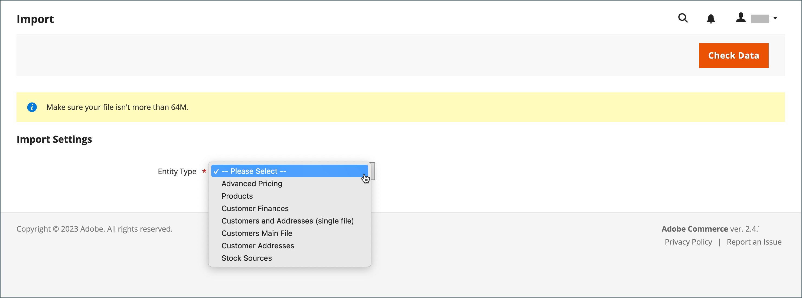
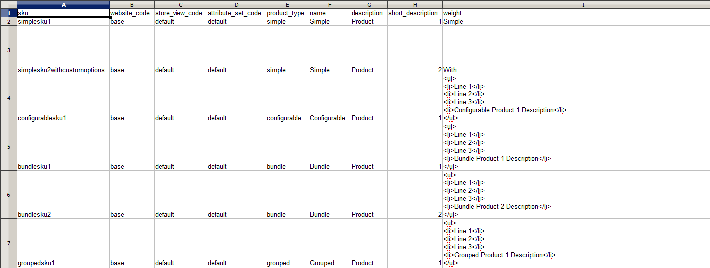
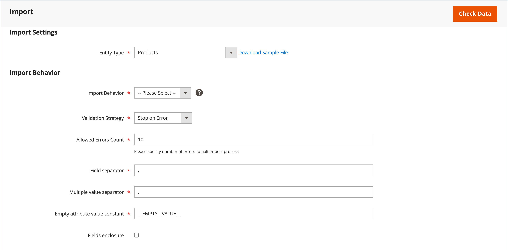
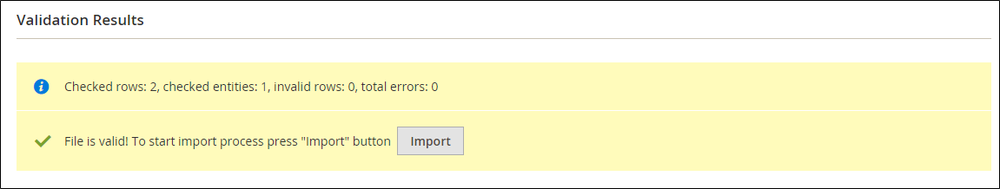
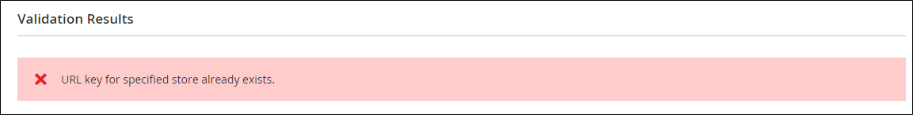
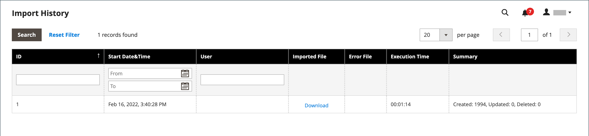

# データのインポート

あらゆる種類の商品のデータをストアにインポートできます。 さらに、製品、高度な価格データ、顧客データ、顧客アドレスデータ、製品画像をインポートできます。 読み込みは次の操作をサポートしています。

- 追加/更新
- 置換
- 削除

## ガイドラインの読み込み

### 新しいエンティティ

- エンティティは、CSV ファイルで指定された属性値で追加されます。
- デフォルト値が設定されていない必須属性の場合、値がない場合や無効な値がある場合、エンティティ（対応する行または行）を読み込むことはできません。
- デフォルト値が設定されている必要な属性の場合、エンティティ（対応する行または行）が読み込まれ、値がない場合や無効な値が設定されている場合は、デフォルト値が属性に設定されます。
- 複雑なデータが無効な場合、エンティティ（対応する行または行）を読み込むことはできません。

### 既存エンティティ

- 複雑なデータではない属性の場合、読み込みファイルの値（必須ではない属性の空の値を含む）は、既存の値を置き換えます。
- 必須の属性に値がない場合、または無効な値がある場合、既存の値は置き換えられません。
- エンティティの複雑なデータが無効な場合、エンティティ（対応する行または行）を読み込むことはできません。ただし、エンティティの削除が「ビヘイビアーの読み込み」ドロップダウンメニューで選択されている場合を除きます。

>[!NOTE]
>
>大きなカタログの場合、カテゴリの割り当てやURL キーを変更していない場合は、読み込みファイルの`categories`列と`url_key`列を省略します。 いずれかの列が存在する場合、Adobe Commerceは、ファイル内のすべての商品のURL書き換えを再生成します。 この余分な作業により、読み込みが長くなり、Adobe Commerce on Cloudでタイムアウトエラーが発生する可能性があります。

### 複雑なデータ

読み込みファイルで指定された属性が存在し、その値が定義された値セットから派生する場合、次の条件が適用されます。

- 値が定義された値セットにまだ含まれていない場合、行を読み込み、定義されている場合はデフォルト値を属性に設定できます。
- 値が定義済みセットに既に含まれている場合、対応する行を読み込むことはできません。
- 読み込みファイルで、システムで定義されていない属性名が指定されている場合、その属性名は作成されず、その値は読み込まれません。

### 無効なファイル

- すべての行が無効な場合、ファイルを読み込むことはできません。
- 読み込みファイルでは、既存でないサービスデータまたは複雑なデータ名が指定されています（例：`_<non-existing name>`見出しの列）。

Adobe Commerceの読み込みプロセスで、バイト順序記号（BOM）を使用するUTF-8でエンコードされたファイルが正しく認識されない場合があります。 BOMを含むファイルは、インポートプロセス中に問題やエラーを引き起こす可能性があります。

## 操作のインポート

| 操作 | 説明 |
| --------- | ----------- |
| 追加/更新 | データベース内の既存のエントリの既存の製品データに、新しい製品データが追加されます。 `sku`以外のすべてのフィールドを更新できます。  読み込みデータで指定された新しい税区分が自動的に作成されます。  読み込みファイルで指定された新しい製品カテゴリが自動的に作成されます。  読み込みファイルで指定された新しいSKUが自動的に作成されます&#x200B;  **_メモ:_**&#x200B;製品の場合、読み込みを通じてSKUを除くすべてのフィールドを更新できます。  **_重要:_** web サイトやカテゴリなどの複数のフィールド値を、_追加/更新_の読み込み動作を使用して削除することはできません。 これらのフィールドがCSV ファイルにリストされていない場合、インポート後もデータベースに残ります。 |
| 置換 | 既存の製品データは新しいデータに置き換えられます。  **_Important:_**&#x200B;既存の製品データが消去され、システム内のすべての参照が失われるため、データを置き換える際には注意してください。  読み込みデータのSKUが既存のエンティティのSKUと一致する場合、SKUを含むすべてのフィールドが削除され、CSV データを使用して新しいレコードが作成されます。 CSV ファイルがデータベースに存在しないSKUを参照すると、エラーが発生します。 データを確認してエラーを表示できます。 |
| 削除 | データベース内に存在するインポートデータ内のエンティティはすべて、データベースから削除されます。  Deleteは、SKUを除き、インポート データ内のすべての列を無視します。 データ内の他のすべての属性を無視できます。  CSV ファイルがデータベースに存在しないSKUを参照すると、エラーが発生します。 データを確認してエラーを表示できます。 |

{style="table-layout:auto"}

## インポートプロセス

インポートファイルのサイズは、サーバー上の`php.ini` ファイルの設定によって決まります。 _読み込み_ ページのシステムメッセージは、現在のサイズ制限を示します。 デフォルトのサイズは2 MBです。

特殊文字（等号、記号より大きい記号、記号より小さい記号、一重引用符および二重引用符、バックスラッシュ、パイプ、アンパサンド記号など）は、データ転送時に問題が発生する可能性があります。 このような特殊文字が正しく解釈されるように、_エスケープシーケンス_&#x200B;としてマークできます。 例えば、データに`code="str"`、`code="str2"`などの文字列が含まれている場合、テキストを二重引用符で囲むことで、元の二重引用符がデータの一部であると認識されます。 システムが二重引用符の二重集合に遭遇すると、二重引用符の外部集合が実際のデータを囲んでいることを理解します。

製品データを読み込むと、データベース内の既存の製品データエントリに新しい製品データが追加されます。 SKUを除くすべてのフィールドは、読み込みを通じて更新できます。 既存のすべての製品データは、読み込んだ新しいデータに置き換えられます。 データを置き換える場合は注意してください。 既存の製品データはすべて消去され、システム内のすべての参照が失われます。

{width="600" zoomable="yes"}

### 手順1：データの準備

1. _管理者_ サイドバーで、**[!UICONTROL System]** > _[!UICONTROL Data Transfer]_>**[!UICONTROL Import]**&#x200B;に移動します。

1. _設定の読み込み_&#x200B;で、**[!UICONTROL Entity Type]**&#x200B;を次のいずれかに設定します。

   - `Advanced Pricing`
   - `Products`
   - `Customer Finances`
   - `Customers and Addresses`
   - `Customers Main File`
   - `Customer Addresses`
   - `Stock Sources`

1. **[!UICONTROL Download Sample File]**&#x200B;をクリックします。

1. Web ブラウザーのダウンロード場所でエクスポートファイルを探し、ファイルを開きます。

   サンプルファイルには、製品タイプのプレースホルダーデータを含む列見出しが含まれています。

   {width="600" zoomable="yes"}

1. サンプルファイルの構造を確認し、CSV インポートファイルを準備するために使用します。列見出しが正しくスペルされていることを確認します。

1. インポートファイルのサイズが、メッセージに表示されている制限を超えていないことを確認します。

   {width="600"}

1. インポートデータに製品画像へのパスが含まれる場合は、画像ファイルが適切な場所にアップロードされていることを確認します。

   Commerce サーバーの既定の場所は`pub/media/import`です。

   画像が外部サーバー上に存在する場合は、画像を含むディレクトリへの完全なURLを持っていることを確認します。

### 手順2：読み込み動作の選択

{width="600" zoomable="yes"}

1. **[!UICONTROL Import Behavior]**&#x200B;を次のいずれかに設定します：

   - `Add/Update` （製品の場合、読み込みによるSKU以外のすべてのフィールドを更新できます）。
   - `Replace`
   - `Delete`

1. データの読み込み時にエラーが発生した場合に何が起こるかを判断するには、次のいずれかを選択します。

   - `Stop on Error`
   - `Skip error entries`

1. **[!UICONTROL Allowed Errors Count]**&#x200B;の場合、読み込みがキャンセルされる前に発生する可能性のあるエラーの数を入力します。

   デフォルト値は10です。

1. **[!UICONTROL Field separator]**&#x200B;のコンマ （`,`）の既定値を受け入れます。

1. **[!UICONTROL Multiple value separator]**&#x200B;のコンマ （`,`）の既定値を受け入れます。

   CSV ファイルでは、コンマがデフォルトの区切り文字です。 別の文字を使用するには、CSV ファイルのデータが指定した文字と一致していることを確認します。

1. **[!UICONTROL Empty attribute value constant]**&#x200B;の既定値`_EMPTY_VALUE_`を受け入れます。

1. データ内で見つかる可能性のある特殊文字を&#x200B;_エスケープシーケンス_&#x200B;として囲む場合は、**[!UICONTROL Fields Enclosure]** チェックボックスを選択します。

### 手順3：読み込みファイルの特定

{width="600" zoomable="yes"}

1. **[!UICONTROL Choose File]**&#x200B;をクリックして、読み込むファイルを選択します。

1. 読み込む準備ができたCSV ファイルを見つけて、**[!UICONTROL Open]**&#x200B;をクリックします。

1. **[!UICONTROL Images File Directory]**&#x200B;に、アップロードした画像が保存されているCommerce サーバー上の場所への相対パスを入力します。

   例：`product_images`。

   >[!NOTE]
   >
   >Adobe CommerceおよびMagento Open Source `2.3.2` リリース以降、_[!UICONTROL Images File Directory]_&#x200B;で指定されたパスは、画像のベースディレクトリ `<Magento-root-folder>/var/import/images`に読み込むために連結されます。 例えば、`product_images` ファイルを`<Magento-root-directory>/var/import/images/product_images` フォルダーに配置します。 画像の読み込みの基本ディレクトリは、`\Magento\ImportExport\etc\config.xml` ファイルで設定できます。 リモート ストレージ モジュールが有効になっている場合は、`<remote-storage-root-directory>/var/import/images/product_images` フォルダーにファイルを読み込みます。

   製品画像のインポートについて詳しくは、[製品画像のインポート &#x200B;](data-import-product-images.md)を参照してください。

### 手順4：読み込みデータの確認

1. 右上隅の「**[!UICONTROL Check Data]**」をクリックします。

1. 検証プロセスが完了するまで少し待ちます。

   インポートデータが有効な場合は、次のメッセージが表示されます。

   {width="600"}

1. ファイルが有効な場合は、**[!UICONTROL Import]**&#x200B;をクリックします。

   それ以外の場合は、メッセージにリストされているデータに関する各問題を修正し、ファイルの読み込みを再試行してください。

1. インポートプロセスは、エラーが発生しない限り、データの最後まで続きます。

   検証結果にエラーメッセージが表示された場合は、データの問題を修正し、ファイルを再度インポートします。

   {width="600"}

   読み込みが完了すると、メッセージが表示されます。

## 履歴を読み込み

Commerceには、開始日時、ユーザー、実行時間、インポートされたファイルへのリンクなど、ストアにインポートされたデータの記録が保持されます。 _実行時間_&#x200B;は、インポートプロセスの期間です。

**_読み込み履歴を表示するには:_**

_管理者_ サイドバーで、**[!UICONTROL System]** > _[!UICONTROL Data Transfer]_>**[!UICONTROL Import History]**&#x200B;に移動します。

{width="600" zoomable="yes"}

>[!NOTE]
>
>既定では、インポート履歴ファイルは`<Magento-root-directory>/var/import_history` フォルダーにあります。 リモート ストレージ モジュールが有効になっている場合、インポート履歴ファイルは`<remote-storage-root-directory>/import_export/import_history` フォルダーにあります。

| フィールド | 説明 |
|--- |--- |
| [!UICONTROL ID] | 転送を指定するために使用される内部番号。 |
| [!UICONTROL Start Date & Time] | 転送が行われた特定の日時。 |
| [!UICONTROL User] | 転送を行った顧客。 |
| [!UICONTROL Imported file] | 読み込んだファイルをダウンロードするためのリンク。 |
| [!UICONTROL Error file] | 対応するエラーファイル。 |
| [!UICONTROL Execution Time] | 読み込みプロセスの時間間隔。 |
| [!UICONTROL Summary] | 作成、更新、削除されたアイテムの数、またはエラーメッセージ。 |

{style="table-layout:auto"}

_Imported/Error_ ファイルをダウンロードするには、**[!UICONTROL Download]**&#x200B;をクリックします。
