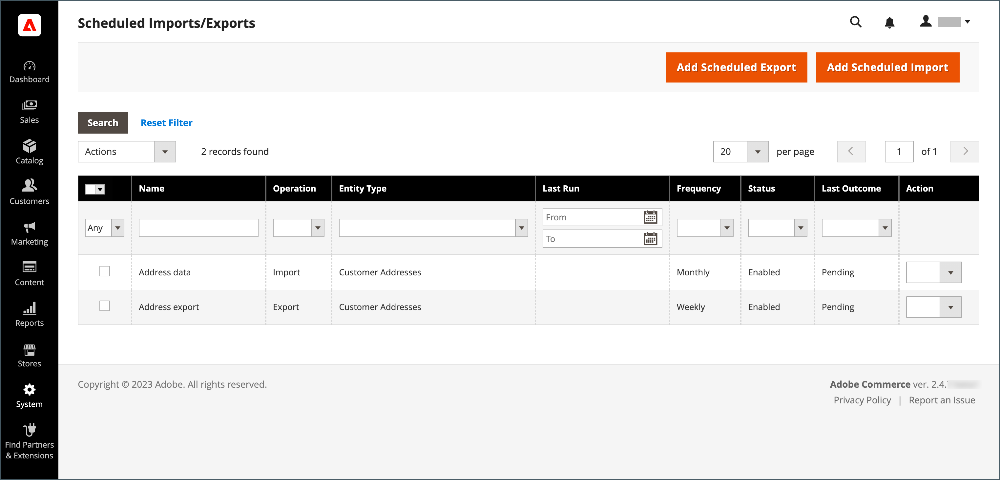
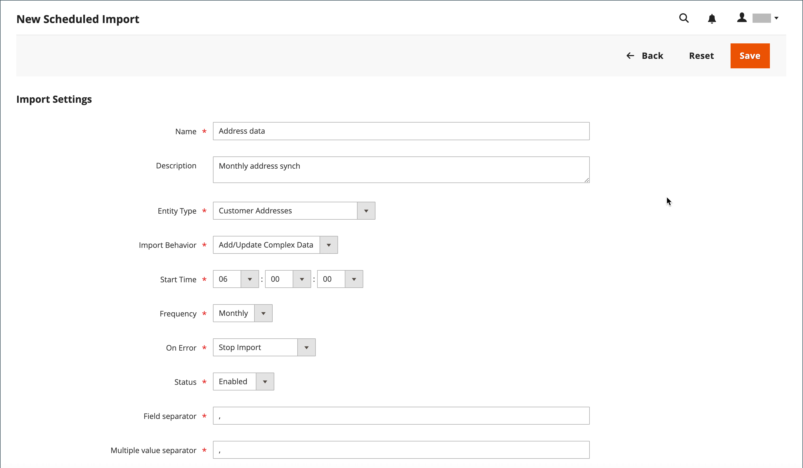
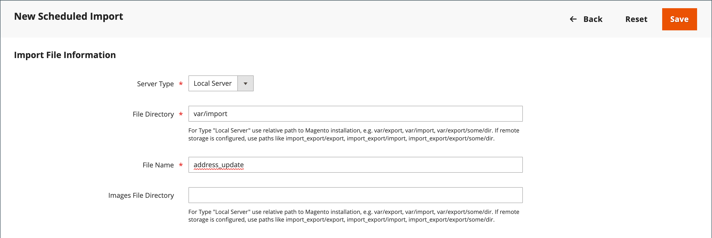
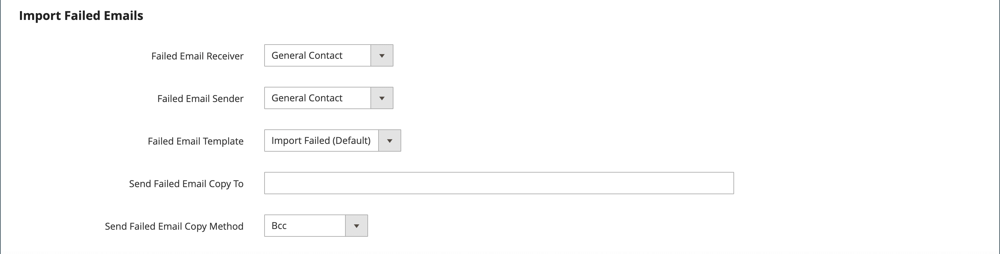
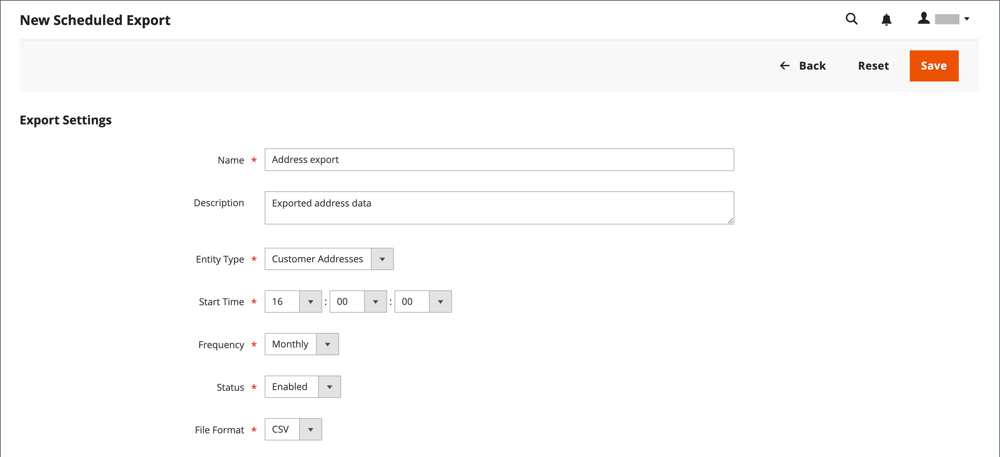
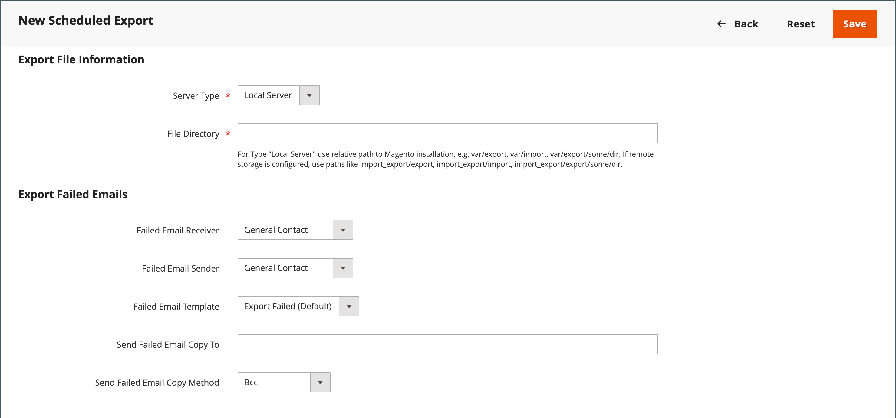

# 定期インポートとエクスポート

{{ee-feature}}

スケジュールされたインポートとエクスポートは、日単位、週単位、月単位で実行できます。 インポートまたはエクスポートするファイルは、ローカルのAdobe Commerce サーバーまたはリモート FTP サーバーに格納できます。 スケジュールされた読み込み/書き出しはデフォルトで実装されており、追加の設定は必要ありません。 スケジュールされたすべてのインポートとエクスポートは、Cron ジョブスケジューラーによって管理されます。

## スケジュールされた読み込み/書き出しにアクセス

1. _管理者_ サイドバーで、**[!UICONTROL System]** > _[!UICONTROL Data Transfer]_>**[!UICONTROL Scheduled Imports/Exports]**&#x200B;に移動します。

   {width="700" zoomable="yes"}

1. 新しいスケジュール済み読み込みまたは書き出しジョブを作成するには、適切なボタンをクリックし、スケジュール済みジョブのタイプの手順に従います。

   - [スケジュールされた書き出しの追加](#schedule-an-export)
   - [定期インポートを追加](#schedule-an-import)

1. レコードが保存されると、ジョブが&#x200B;_[!UICONTROL Scheduled Import/Export]_&#x200B;グリッドに表示されます。

   >[!NOTE]
   >
   >スケジュールされた読み込み/書き出しを作成または更新すると、システム設定が変更されます。 保存後、管理者ページの上部に表示されるキャッシュ無効化の通知に対処し、新しいスケジュールまたは更新されたスケジュールを適用するためにキャッシュをフラッシュしてください。

1. [!BADGE PaaSのみ]{type=Informative url="https://experienceleague.adobe.com/en/docs/commerce/user-guides/product-solutions" tooltip="Adobe Commerce on Cloud プロジェクト（Adobeで管理されるPaaS インフラストラクチャ）とオンプレミス プロジェクトにのみ適用されます。"} スケジュールされた各ジョブの後、ファイルのコピーがAdobe Commerce ローカルサーバーの`var/log/import_export` ディレクトリに配置されます。

   各操作の詳細はログに書き込まれません。 エラーが発生すると、失敗したインポート/エクスポート ジョブの通知が、エラーの説明とともに送信されます。

## 読み込みのスケジュール

使用可能なインポートファイル形式とインポートエンティティのタイプについて、スケジュールされたインポートプロセスは手動インポートプロセスと似ています。

- 読み込みファイルは.CSV形式にする必要があります
- 製品と顧客のデータをインポートすることで

定期インポートを使用する利点は、インポートパラメーターを指定した後、データファイルを自動的に複数回インポートでき、スケジュールは1回のみです。

各インポート操作の詳細はログに書き込まれませんが、エラーが発生した場合は、エラーの説明が記載された&#x200B;_インポート失敗_&#x200B;電子メールが届きます。 前回のスケジュール済みインポートジョブの結果は、スケジュール済みインポート/エクスポートページの「最終結果」列に表示されます。

[!BADGE PaaSのみ]{type=Informative url="https://experienceleague.adobe.com/en/docs/commerce/user-guides/product-solutions" tooltip="Adobe Commerce on Cloud プロジェクト（Adobeで管理されるPaaS インフラストラクチャ）とオンプレミス プロジェクトにのみ適用されます。"}各インポート操作の後、インポートファイルのコピーが、Adobe CommerceまたはMagento Open Sourceがデプロイされているサーバーの`var/log/import_export` ディレクトリに配置されます。 タイムスタンプ、インポートされたエンティティ（製品または顧客）のマーカー、操作のタイプ（この場合はインポート）がインポートファイル名に追加されます。

スケジュールされた各インポートジョブの後、再インデックス操作が自動的に実行されます。 フロントエンドでは、更新されたデータがデータベースに移動した後に説明やその他のテキスト情報の変更が反映され、価格の変更は再インデックス操作の後にのみ反映されます。

### 手順1：読み込み設定の完了

1. _管理者_ サイドバーで、**[!UICONTROL System]** > _[!UICONTROL Data Transfer]_>**[!UICONTROL Scheduled Import/Export]**&#x200B;に移動します。

1. 右上隅の「**[!UICONTROL Add Scheduled Import]**」をクリックします。

1. スケジュール設定とインポートオプションを設定します。

   - **[!UICONTROL Name]** — スケジュールされた読み込みの名前を入力します。

   - **[!UICONTROL Description]** — インポートの目的と使用方法を説明する簡単な説明を入力します。

   - **[!UICONTROL Entity Type]** – 次のいずれかに設定します。

      - `Products`
      - `Advanced Pricing`
      - `Customers and Addresses (single file)`
      - `Customer Addresses`
      - `Customer Finances`
      - `Customers Main File`
      - `Stock Sources`

   - **[!UICONTROL Import Behavior]** – 次のいずれかに設定します。

      - `Add/Update Complex Data` — データベース内の既存のエントリの既存の複雑なデータに新しい複雑なデータを追加または更新します。 これがデフォルト値です。
      - `Replace` — データベース内の既存のエンティティに対して既存の複合を書き込みます。
      - `Delete Entities` — データベース内の既存のエントリを削除します。
      - `Custom Action` - データベース内の既存のエンティティをカスタマイズします。

     >[!NOTE]
     >
     >_[!UICONTROL Advanced Pricing]_、_[!UICONTROL Products]_、_[!UICONTROL Customers and Addresses (single file)]_&#x200B;および&#x200B;_[!UICONTROL Stock Sources]_&#x200B;のエンティティ タイプの場合、これらのインポート動作が表示されます：`Add/Update`、`Replace`、および`Delete`。 _顧客財務_、_顧客メインファイル_、および&#x200B;_顧客とアドレス_&#x200B;のエンティティの種類について、次の読み込み動作が表示されます：`Add/Update Complex Data`、`Delete Entities`、および`Custom Action`。

   - **[!UICONTROL Start Time]** — インポートを開始する予定の時間、分、秒に設定します。

   - **[!UICONTROL Frequency]** – 次のいずれかに設定：`Daily`、`Weekly`、または`Monthly`

   - **[!UICONTROL On Error]** – 次のいずれかに設定します：`Stop Import`または`Continue Processing`

   - **[!UICONTROL Status]** — スケジュールされたインポートをアクティブにするには、`Enabled`に設定します。

   - **[!UICONTROL Field Separator]** — インポートファイル内のフィールドを区切るために使用される文字を入力します。 デフォルトの文字はコンマです。

   - **[!UICONTROL Multiple Value Separator]** — フィールド内で複数の値を区切るために使用される文字を入力します。

   {width="600" zoomable="yes"}

### 手順2：読み込みファイル情報を完了する

1. **[!UICONTROL Server Type]**&#x200B;を次のいずれかに設定します：

   - `Local Server` - Adobe Commerceがインストールされているサーバーと同じサーバーからデータを読み込みます。
   - `Remote FTP` - リモート サーバーからデータを読み込みます。

   {width="600" zoomable="yes"}

   >[!NOTE]
   >
   >リモートストレージモジュールが有効になっている場合、`Local Server`は自動的に`Remote Storage`に切り替わります。

1. インポート ファイルの元の&#x200B;**[!UICONTROL File Directory]**&#x200B;を入力します。

   - `Local Server` - Commerce インストールで相対パスを入力します。 例：`var/import`。 リモート ストレージ モジュールが設定されている場合は、`import_export/import`を使用します。
   - `Remote FTP server` - リモート サーバーのインポート フォルダーの完全なURLとパスを入力します。

1. 読み込む&#x200B;**[!UICONTROL File Name]**&#x200B;を入力します。

1. **[!UICONTROL Images File Directory]**&#x200B;に、製品画像が保存されているディレクトリへのパスを入力します。

   ローカル サーバーで、相対パス（`var/import`）を入力します。 リモートストレージで、`import_export/import`または`import_export/import/some/dir`などの相対パスを入力します。

### 手順3：インポートに失敗した電子メールの設定

{width="600" zoomable="yes"}

1. 読み込み中にエラーが発生した場合に通知を受け取るストア連絡先に&#x200B;**[!UICONTROL Failed Email Receiver]**&#x200B;を設定します。

1. **[!UICONTROL Failed Email Sender]**&#x200B;を、通知の送信者として表示されるストア連絡先に設定します。

1. 通知に使用するテンプレートに&#x200B;**[!UICONTROL Failed Email Template]**&#x200B;を設定します。

1. **[!UICONTROL Send Failed Email Copy To]**&#x200B;に、通知のコピーを受け取るユーザーの電子メールアドレスを入力します。

   複数のメールアドレスをコンマで区切ります。

1. **[!UICONTROL Failed Email Copy Method]**&#x200B;を次のいずれかに設定します：

   - `Bcc` – 失敗した読み込み通知のブラインドな礼儀コピーを送信します。 受信者の名前と住所は、元のメール配信に含まれますが、表示からは隠されています。
   - `Separate Email` – 失敗したインポート通知のコピーを別の電子メールとして送信します。

1. 完了したら、**[!UICONTROL Save]**&#x200B;をクリックします。

   新しいスケジュールされたインポート ジョブが&#x200B;_[!UICONTROL Scheduled Import/Export]_&#x200B;ページのリストに追加されます。 このページから、テストと編集のために即座に実行できます。 インポートファイルは、各インポートジョブの実行前に検証されます。

>[!NOTE]
>
>スケジュールされた読み込み/書き出しを作成または更新すると、システム設定が変更されます。 保存後、管理者ページの上部に表示されるキャッシュ無効化の通知に対処し、新しいスケジュールまたは更新されたスケジュールを適用するためにキャッシュをフラッシュしてください。

### フィールドの説明

#### [!UICONTROL Import Settings]

| フィールド | 説明 |
| ----- | ----------- |
| [!UICONTROL Name] | インポートの名前。 多数の異なるスケジュール済みインポートが作成された場合に区別するのに役立ちます。 |
| [!UICONTROL Description] | （オプション）説明を入力できます。 |
| [!UICONTROL Entity Type] | 読み込むデータを定義します。 |
| [!UICONTROL Import Behavior] | インポートするエンティティがデータベースに存在する場合の複雑なデータの処理方法を定義します。 製品向けの複雑なデータには、カテゴリー、web サイト、カスタムオプション、価格帯、関連製品、アップセル、クロスセル、関連製品データなどが含まれます。 顧客の複雑なデータには住所が含まれます。 オプション： **[!UICONTROL Add/Update Complex Data]**– 新しい複雑なデータが、データベース内の既存のエントリの既存の複雑なデータに追加または更新されます。 これは既定値です。 **[!UICONTROL Add/Update]** - データベース内の既存のエントリに新しいデータが追加されます。 `sku`を除くすべてのフィールドを製品に対して更新できます。 カテゴリやweb サイトなど、CSV ファイルにリストされていない複数のフィールド値は、読み込み後もデータベースに残ります。 **[!UICONTROL Replace]**– 既存のエンティティの既存の複雑なデータが置き換えられます。 **[!UICONTROL Delete Entities]** - インポートされたエンティティがデータベースに存在する場合、それらはデータベースから削除されます。 **[!UICONTROL Custom Action]**– 既存の複雑なエンティティは、インポートプロセス中にカスタマイズされます。 |
| [!UICONTROL Start Time] | 読み込みの開始時間、分、秒を設定します。 |
| [!UICONTROL Frequency] | インポートを実行する頻度を定義します。 オプション：`Daily` / `Weekly` / `Monthly` |
| [!UICONTROL On Error] | ファイルの検証中にエラーが見つかった場合に備えて、システムの動作を定義します。 オプション： **インポートの停止** – 検証中にエラーが見つかった場合、ファイルはインポートされません。 これがデフォルト値です。 **処理を続行** – 検証中にエラーが見つかりましたが、インポートが可能な場合は、ファイルがインポートされます。 |
| [!UICONTROL Status] | 読み込みはデフォルトで有効になっています。 ステータスを`Disabled`に設定すると、一時停止できます。 |
| [!UICONTROL Field Separator] | フィールドの区切りに使用する文字を指定します。 デフォルト値：`,` （コンマ） |
| [!UICONTROL Multiple Value Separator] | フィールド内の複数の値を区切るために使用される文字を指定します。 デフォルト値：`,` （コンマ） |

{style="table-layout:auto"}

#### [!UICONTROL Import File Information]

| フィールド | 説明 |
| ----- | ----------- |
| [!UICONTROL Server Type] | Commerceがデプロイされている同じサーバー上のファイル（`Local Server`を選択）またはリモート FTP サーバー（`Remote FTP`を選択）から読み込むことができます。 _[!UICONTROL Remote FTP]_&#x200B;を選択すると、資格情報とファイル転送設定の追加オプションが表示されます。 リモートストレージモジュールが有効になっている場合、`Local Server`の種類は自動的に`Remote Storage`に切り替わります。 |
| [!UICONTROL File Directory] | 読み込みファイルの保存先ディレクトリを指定します。 Server Typeが&#x200B;_[!UICONTROL Local Server]_&#x200B;に設定されている場合は、Commerce インストールディレクトリに対する相対パスを指定します。 例：`var/import`または`import_export/import` （リモートストレージ用） |
| [!UICONTROL File Name] | 読み込みファイルの名前を指定します。 |
| [!UICONTROL Images File Directory] | 製品画像が保存されるディレクトリへのパスを入力します。 ローカルサーバーの場合は、相対パスを入力します。 例：`var/import`または`import_export/import` （リモートストレージ用） |

{style="table-layout:auto"}

#### [!UICONTROL Import Failed Emails]

| フィールド | 説明 |
| ----- | ----------- |
| [!UICONTROL Failed Email Receiver] | インポートが失敗した場合にメール通知（インポートに失敗したメール）を送信するメールアドレスを指定します。 |
| [!UICONTROL Failed Email Sender] | インポートに失敗した電子メールの送信者として使用される電子メールアドレスを指定します。 |
| [!UICONTROL Failed Email Template] | インポートに失敗した電子メールのテンプレートを選択します。 デフォルトでは、「読み込みに失敗しました（ロケールからデフォルトのテンプレートを読み込む）」オプションのみが使用できます。 カスタムテンプレートは、_[!UICONTROL System]_>_[!UICONTROL Transactional Emails]_&#x200B;の下に作成できます。 |
| [!UICONTROL Send Failed Email Copy To] | インポートに失敗した電子メールのコピーを送信する電子メールアドレス。 |
| [!UICONTROL Send Failed Email Copy Method] | インポートに失敗した電子メールのコピー送信方法を選択します。 |

{style="table-layout:auto"}

## 書き出しのスケジュール

スケジュールされた書き出しは、使用可能な書き出しファイル形式および書き出し可能なエンティティのタイプで、手動[書き出し](data-export.md)と似ています。

- CSV形式に書き出すことができます
- 商品データと顧客データを

スケジュール済み書き出しを使用する利点は、書き出しパラメーターを指定した後、データを自動的に複数回エクスポートでき、スケジュールは1回のみです。

各エクスポートの詳細はログに書き込まれませんが、エラーが発生した場合は、エラーの説明を含む「書き出し失敗」メールが届きます。 前回の書き出しジョブの結果は、スケジュールされた読み込み/書き出しページの「最終結果」列に表示されます。

[!BADGE PaaSのみ]{type=Informative url="https://experienceleague.adobe.com/en/docs/commerce/user-guides/product-solutions" tooltip="Adobe Commerce on Cloud プロジェクト（Adobeで管理されるPaaS インフラストラクチャ）とオンプレミス プロジェクトにのみ適用されます。"}書き出し後、書き出しファイルはユーザー定義の場所に配置され、コピーはAdobe CommerceまたはMagento Open Sourceがデプロイされているサーバー上の`var/log/import_export` ディレクトリに配置されます。 書き出されたエンティティ（製品または顧客）のタイムスタンプとマーカー、操作のタイプ（この場合は書き出し）が書き出しファイル名に追加されます。

### 手順1：書き出し設定の完了

1. _管理者_ サイドバーで、**[!UICONTROL System]** > _[!UICONTROL Data Transfer]_>**[!UICONTROL Scheduled Import/Export]**&#x200B;に移動します。

1. 右上隅の「**[!UICONTROL Add Scheduled Export]**」をクリックし、次の操作を行います。

   - スケジュールされた書き出しに&#x200B;**[!UICONTROL Name]**&#x200B;を入力します。

   - 書き出しの目的と使用方法を説明する概要&#x200B;**[!UICONTROL Description]**&#x200B;を入力します。

   - **[!UICONTROL Entity Type]**&#x200B;を次のいずれかに設定します：

      - `Advanced Pricing`
      - `Products`
      - `Customer Financing`
      - `Customers Main File`
      - `Customer Addresses`
      - `Stock Sources`

     ページ下部の&#x200B;_[!UICONTROL Entity Attributes]_&#x200B;セクションが更新され、選択したエンティティ タイプが反映されます。

   - 書き出しを開始する予定の時間、分、秒に&#x200B;**[!UICONTROL Start Time]**&#x200B;を設定します。

   - **[!UICONTROL Frequency]**&#x200B;を次のいずれかに設定します：

      - `Daily`
      - `Weekly`
      - `Monthly`

1. スケジュールされた書き出しをアクティブにするには、**[!UICONTROL Status]**&#x200B;を`Enabled`に設定します。

1. `CSV`を既定の&#x200B;**[!UICONTROL File Format]**&#x200B;として受け入れます。

   {width="600" zoomable="yes"}

### 手順2：書き出しファイル情報を完了する

1. **[!UICONTROL Server Type]**&#x200B;を次のいずれかに設定します：

   - `Local Server` - Commerceがインストールされているサーバーと同じサーバーに書き出しファイルを保存します。
   - `Remote FTP` — エクスポート ファイルをリモート サーバーに保存します。

   {width="600" zoomable="yes"}

   >[!NOTE]
   >
   >リモートストレージモジュールが有効になっている場合、`Local Server`は自動的に`Remote Storage`に切り替わります。

1. **[!UICONTROL File Directory]**&#x200B;の場合、書き出しファイルを保存するディレクトリを次のように入力します。

   - **[!UICONTROL Local Server]**&#x200B;の場合は、Commerce インストール内の相対パス（`var/export`など）を入力します。 リモート ストレージ モジュールが設定されている場合は、`import_export/export`を使用します。
   - **[!UICONTROL Remote FTP server]**&#x200B;の場合、宛先サーバーのターゲットフォルダーへの完全なURLとパスを入力します。

1. _[!UICONTROL Remote FTP]_&#x200B;サーバーが選択されている場合は、サーバーへの接続資格情報を入力し、追加の設定を選択します。

   - **[!UICONTROL FTP Host[:Port]]**&#x200B;に、リモート FTP ホスト アドレスを入力します。
   - **[!UICONTROL User Name]**&#x200B;に、リモート サーバーへのアクセスに使用するユーザー名を入力します。
   - **[!UICONTROL Password]**&#x200B;に、指定したユーザー名アカウントのパスワードを入力します。
   - **[!UICONTROL File Mode]**&#x200B;に対して、`Binary`または`ASCII`を選択します。
   - **[!UICONTROL Passive Mode]**&#x200B;に対して、`No`または`Yes`を選択します。

### 手順3：書き出し失敗メールの設定

1. 書き出し中にエラーが発生した場合に通知を受け取るストア連絡先に&#x200B;**[!UICONTROL Failed Email Receiver]**&#x200B;を設定します。

1. **[!UICONTROL Failed Email Sender]**&#x200B;を、通知の送信者として表示されるストア連絡先に設定します。

1. 通知に使用するテンプレートに&#x200B;**[!UICONTROL Failed Email Template]**&#x200B;を設定します。

1. **[!UICONTROL Send Failed Email Copy To]**&#x200B;に、通知のコピーを受け取るユーザーの電子メールアドレスを入力します。

   複数のメールアドレスの場合は、コンマで区切ります。

1. **[!UICONTROL Failed Email Copy Method]**&#x200B;を次のいずれかに設定します：

   - `Bcc` – 盲目的の表敬文を送信します。 受信者の名前と住所は、元のメール配信に含まれますが、表示には表示されません。
   - `Separate Email` — コピーを別の電子メールとして送信します。

### 手順4：エンティティ属性の選択

1. 「_[!UICONTROL Entity Attributes]_」セクションで、書き出しデータに含める属性を選択します。

   - エクスポート データを属性値でフィルタリングするには、_[!UICONTROL Filter]_&#x200B;列に属性値を入力します。
   - 特定の属性値を持つ製品または顧客を除外するには、除外する属性の値を入力し、「スキップ」列のチェックボックスを選択します。

1. 完了したら、**[!UICONTROL Save]**&#x200B;をクリックします。

   新しいスケジュール済み書き出しジョブが&#x200B;_[!UICONTROL Scheduled Import/Export]_&#x200B;ページのリストに追加されます。 このページから、テスト用にすぐに実行し、編集できます。

>[!NOTE]
>
>スケジュールされた読み込み/書き出しを作成または更新すると、システム設定が変更されます。 保存後、管理者ページの上部に表示されるキャッシュ無効化の通知に対処し、新しいスケジュールまたは更新されたスケジュールを適用するためにキャッシュをフラッシュしてください。

### フィールドの説明

#### [!UICONTROL Export Settings]

| フィールド | 説明 |
| ----- | ----------- |
| [!UICONTROL Name] | 書き出しの名前。 多数の異なるスケジュール済み書き出しが作成された場合に区別するのに役立ちます。 |
| [!UICONTROL Description] | （オプション）スケジュールされた書き出しの説明。 |
| [!UICONTROL Entity Type] | 書き出すデータを指定します。 選択が完了すると、エンティティ属性が下に表示されます。 オプション：`Advanced Pricing` / `Products` / `Customer Finances` / `Customers Main File` / `Customer Addresses` / `Stock Sources` |
| [!UICONTROL Start Time] | 書き出しの開始時間、分、秒を設定します。 |
| [!UICONTROL Frequency] | 書き出しジョブを実行する頻度を定義します。 オプション：`Daily` / `Weekly` / `Monthly` |
| [!UICONTROL Status] | 新しいスケジュールされた書き出しは、デフォルトで有効になっています。 ステータスを「無効」に設定して一時停止できます。 オプション：`Enabled` / `Disabled` |
| [!UICONTROL File Format] | 書き出しファイルの形式を選択します。 現在、`.CSV` オプションのみが使用できます。 |

{style="table-layout:auto"}

#### [!UICONTROL Export Settings Information]

| フィールド | 説明 |
| ----- | ----------- |
| [!UICONTROL Server Type] | 書き出しファイルの場所を指定します。 Options: **Local Server** — Commerceがデプロイされているサーバーと同じサーバーに書き出しファイルを配置します。 リモートストレージモジュールが有効になっている場合、`Local Server`は`Remote Storage`に切り替わります。 **リモート FTP** – 書き出しファイルをリモートサーバーに配置します。 資格情報とファイル転送設定の追加オプションが表示されます。 |
| [!UICONTROL File Directory] | 書き出しファイルを配置するディレクトリを指定します。 _[!UICONTROL Server Type]_&#x200B;が`Local Server`に設定されている場合は、Commerceのインストールパスに対する相対パスを指定します。 例えば、リモートストレージの場合は`var/export`または`import_export/export`です。 |

{style="table-layout:auto"}

#### [!UICONTROL Export Failed Emails]

| フィールド | 説明 |
| ----- | ----------- |
| [!UICONTROL Failed Email Receiver] | 書き出しが失敗した場合にメール通知（書き出しに失敗したメール）を送信するメールアドレスを指定します。 |
| [!UICONTROL Failed Email Sender] | 書き出しに失敗した電子メール送信者として使用される電子メールアドレスを指定します。 |
| [!UICONTROL Failed Email Template] | 失敗した書き出しメールのテンプレートを選択します。 デフォルトでは、`Export Failed (Default Template from Locale)` オプションのみが使用できます。 |
| [!UICONTROL Send Failed Email Copy To] | 失敗した書き出しメールのコピーが送信される電子メールアドレス。 |
| [!UICONTROL Send Failed Email Copy Method] | 書き出しに失敗した電子メールのコピー送信方法を指定します。 |

{style="table-layout:auto"}
