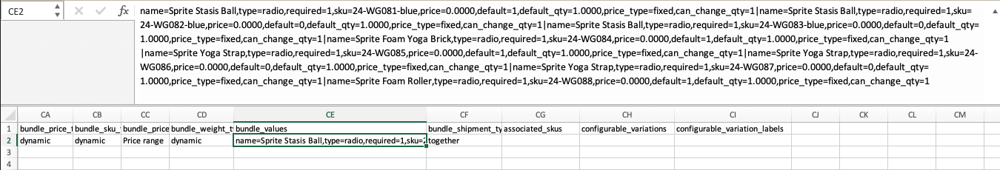

# バンドル製品を読み込む

バンドル製品は、品目を選択し、顧客が購入する品目を選択できるようにします。 バンドルを構成するすべての項目は、カタログ内に次のいずれかとして存在します。 [シンプルな製品](../catalog/product-create-simple.md) または [仮想製品](../catalog/product-create-virtual.md). 通常、バンドル製品は管理者から作成および更新されます。 ただし、データを読み込んでバンドル製品を作成することも、既存のバンドル製品を書き出し、データを編集して、それらをカタログに読み込むこともできます。 Sprite Yoga Companion Kit は、次の例で使用されるサンプルデータのバンドル製品です。

{width="700" zoomable="yes"}

## バンドル項目の順序の変更

バンドルプロダクト内のアイテムの順序を変更する方法は 2 つあります。

### 方法 1：ドラッグ&amp;ドロップ

を操作する場合 [バンドル](../catalog/product-create-bundle.md) 製品は、管理者から項目やセクションを位置にドラッグ&amp;ドロップできます。

{width="600" zoomable="yes"}

### 方法 2：製品データを編集する

バンドルプロダクトの構造を理解する最善の方法は、プロダクトをエクスポートし、スプレッドシートでデータを調べることです。 製品をエクスポートし、各品目のデータに位置パラメータを追加することで、バンドル項目の順序を変更できます。 項目データは、 `bundle_values` 書き出された製品の列。 スプレッドシートで開くと、製品に関連するすべての項目が長い文字列として単一のセルに格納されます。 The `bundle_values` 列には、各項目の次の要素が含まれます。

- 項目セクションの名前
- 入力コントロール
- 必須項目インジケーター
- SKU
- カラー
- 価格
- デフォルトのオプションインジケーター
- デフォルトの数量
- 価格のタイプ
- 編集可能な数量インジケーター

#### 手順 1：バンドル製品の書き出し

この手順では、Sprite Yoga Companion Kit は、 ([CSV](data-csv.md) ファイル。 カタログに含まれる他の任意のバンドル製品を使用できます。

1. 次の日： _管理者_ サイドバー、移動 **[!UICONTROL System]** > _[!UICONTROL Data Transfer]_>**[!UICONTROL Export]**.

1. の下 _書き出し設定_，設定 **[!UICONTROL Entity Type]** から `Products`.

1. 製品属性のリストで、下にスクロールして **[!UICONTROL SKU]** および書き出すバンドル製品の SKU を入力します。

   SKU が `24-WG080` この例の製品の場合。

1. 下にスクロールしてセクションの下部に移動し、 **[!UICONTROL Continue]**.

1. Adobe Analytics の _[!UICONTROL Action]_列_[!UICONTROL File name]_ グリッド、クリック **[!UICONTROL Select]** を選択します。 `Download`.

   ファイルは、ブラウザーで使用されているダウンロード場所に表示されます。

#### 手順 2：データの編集

1. ダウンロードした CSV ファイルをスプレッドシートで開きます。

1. 右端までスクロールし、 `bundle_values` 列。

   Adobe Analytics の `bundle_values` データの場合、各要素はコンマで区切られ、各バンドル項目は縦棒で次の要素と区切られます。 （最後の項目は縦棒で終わりません）。 書き出されたバンドルデータは、次の例のようになります。

   {width="600" zoomable="yes"}

1. 編集を容易にするために、 `bundle_values` データを作成してテキストエディターに貼り付け、各項目の後に改行を追加して、各項目を別々の行に配置します。

1. データの編集後、改行を慎重に削除し、編集したデータをに貼り付け直します。 `bundle_values` 列。

   次の図では、 `position=[number]` ストアリスト内の項目の順序を変更するために、各ヨガストラップにパラメーターが追加されます。

   {width="500" zoomable="yes"}

1. データの編集後、 **[!UICONTROL Save]** CSV ファイル。

#### 手順 3：更新された製品を読み込む

1. 次の日： _管理者_ サイドバー、移動 **[!UICONTROL System]** > _[!UICONTROL Data Transfer]_>**[!UICONTROL Import]**.

1. の下 _[!UICONTROL Import Settings]_，設定&#x200B;**[!UICONTROL Entity Type]**から `Products`.

1. 設定 **[!UICONTROL Import Behavior]** から `Replace`.

   このオプションは、変更を追加の項目として追加するのではなく、バンドル製品の以前のデータを上書きします。

1. 下にスクロールして、 _インポートするファイル_ 「 」セクションで、「 」をクリックします。 **[!UICONTROL Choose File]**.

1. 編集した CSV ファイルを選択します。

1. クリック **[!UICONTROL Check Data]** データがチェックされるまでしばらく待ちます。

1. ファイルが有効な場合は、 **[!UICONTROL Import]**.

1. 処理が完了したら、に移動します。 **[!UICONTROL System]** > _[!UICONTROL Tools]_>**[!UICONTROL Cache Management]**をクリックします。**[!UICONTROL Flush Cache Storage]**.

   これにより、更新された製品がストアフロントですぐに使用できるようになります。
