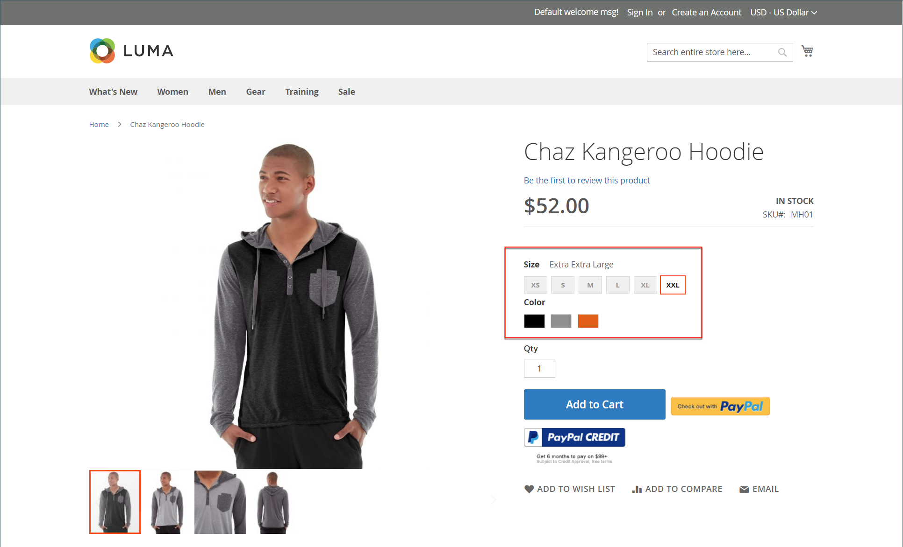
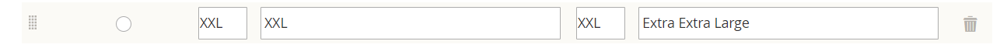
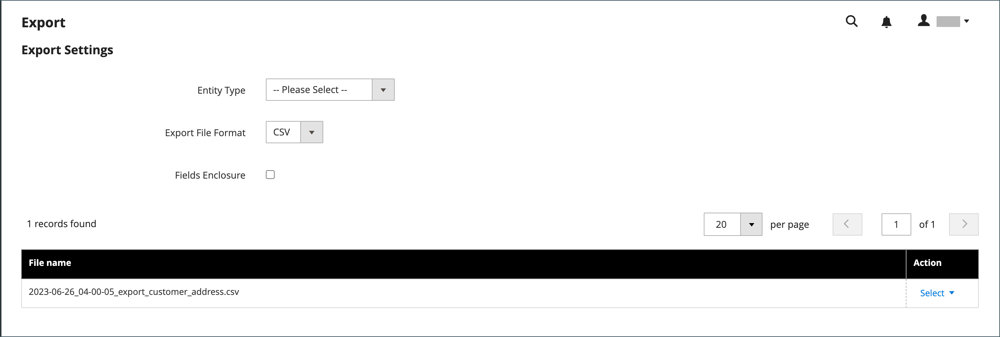
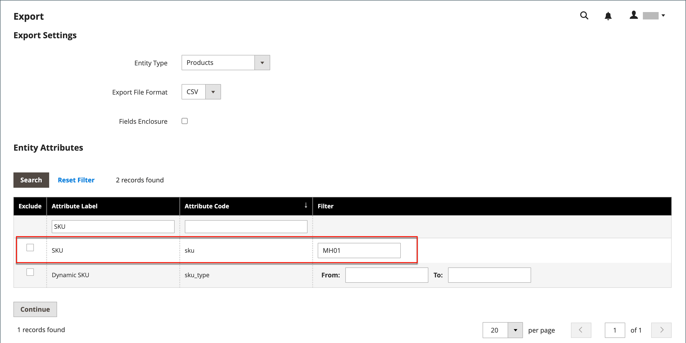
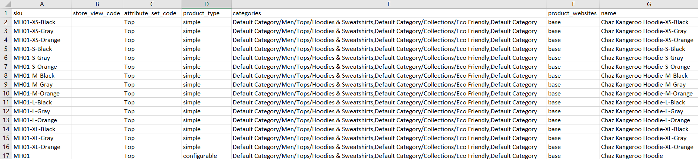
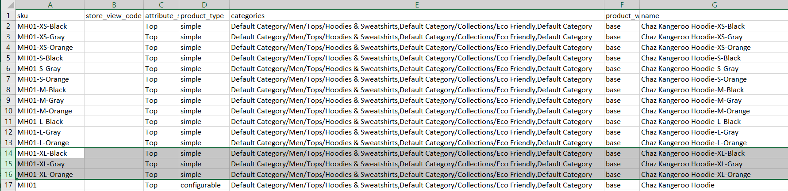
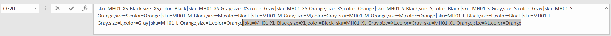
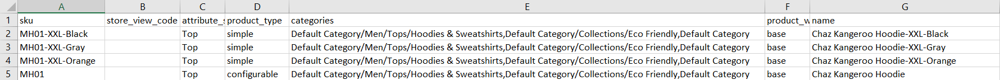
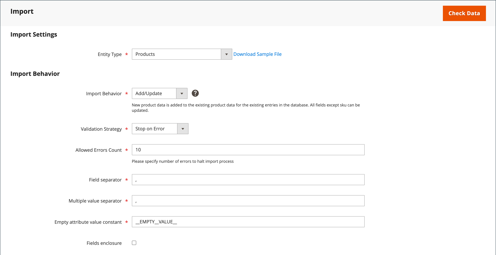
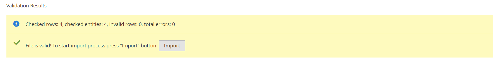

# コンフィグ可能な製品のインポート

設定可能な製品データがどのように構造化されているかを理解する最良の方法は、設定可能な製品とそのバリエーションを書き出し、スプレッドシートでデータを調べることです。

次の例では、各色の新しいサイズの製品バリエーションのセットを追加します。 まず、設定可能な製品を書き出し、データ構造を調べます。 その後、データを更新し、カタログに読み込みます。 データの書き出しを実行しない場合は、例で使用されているCSV ファイルをダウンロードできます。

{width="700" zoomable="yes"}

## 手順1：属性設定と値の確認

1. 開始する前に、製品バリエーションに使用される属性に必要なプロパティ設定があることを確認してください。

   - [**[!UICONTROL Scope]**](../getting-started/websites-stores-views.md#scope-settings) - `Global`
   - [**[!UICONTROL Catalog Input Type for Store Owner]**](data-attributes-product.md) – 製品バリエーションに使用される属性の入力タイプは、次のいずれかである必要があります。

      - `Dropdown`
      - `Visual Swatch`
      - `Text Swatch`
      - `Multi-Select`

   - **[!UICONTROL Values Required]** - `Yes`

1. サイズやカラーを追加したり、既存の属性に他の変更を加えたりする場合は、必ず新しい値で属性を更新してください。

1. _管理者_ サイドバーで、**[!UICONTROL Stores]** > _[!UICONTROL Attributes]_>**[!UICONTROL Product]**&#x200B;に移動します。

1. リストで属性を検索し、編集モードで開きます。

1. 新しい値を属性に追加します。

   次の例では、テキストスウォッチに新しいサイズが追加されています。

   {width="500" zoomable="yes"}

1. 完了したら、**[!UICONTROL Save Attribute]**&#x200B;をクリックします。

1. 属性を追加する場合は、開始する前に、[属性を作成](../catalog/attribute-product-create.md)する手順に従ってください。

## 手順2：設定可能な製品の書き出し

1. _管理者_ サイドバーで、**[!UICONTROL Catalog]** > **[!UICONTROL Products]**&#x200B;に移動します。

1. 書き出す設定可能な製品を探します。

   - **[!UICONTROL Filters]**&#x200B;をクリックします。
   - **[!UICONTROL Type]**&#x200B;を`Configurable Product`に設定し、**[!UICONTROL Apply Filters]**&#x200B;をクリックします。
   - テスト書き出しに使用する設定可能な製品を選択し、**[!UICONTROL SKU]**&#x200B;をメモしてください。

1. _管理者_ サイドバーで、**[!UICONTROL System]** > _[!UICONTROL Data Transfer]_>**[!UICONTROL Export]**&#x200B;に移動します。

   {width="600" zoomable="yes"}

1. _[!UICONTROL Export Setting]s_&#x200B;で、次の操作を行います。

   - **[!UICONTROL Entity Type]**&#x200B;を`Products`に設定します。

   - **[!UICONTROL Export File Format]**&#x200B;を`CSV`に設定します。

1. _[!UICONTROL Entity Attributes]_&#x200B;で、下にスクロールするか、属性ラベルフィルターを使用して&#x200B;**[!UICONTROL SKU]**&#x200B;属性を見つけ、次の操作を行います。

   - 書き出しを選択した設定可能な製品のSKUを入力し、**[!UICONTROL Continue]**&#x200B;をクリックします。

     {width="600" zoomable="yes"}

   - Web ブラウザーのダウンロード場所でファイルを探し、スプレッドシートとして開きます。

     CSV ファイルには、単純な製品バリエーションごとに個別の行が含まれ、設定可能な製品には1つの行が含まれます。 `product_type column`には、1つの設定可能な製品に関連付けられている複数のシンプルな製品バリエーションが表示されます。

     {width="600" zoomable="yes"}

   - ワークシートの右端までスクロールして、次の列を見つけます。

      - `configurable_variations` – 設定可能な製品レコードと各バリエーションとの1対多の関係を定義します。
      - `configurable_variation_labels` – 各バリエーションを識別するラベルを定義します。

     この例では、データは列CGとCHにあります。 バリエーションの数に応じて、`configurable_variations`列のデータの文字列を長くすることができます。 データは、関連する製品バリエーションのインデックスとして使用され、次の構造を持ちます。

     ```text
     sku={{SKU_VALUE}},attribute1={{VALUE}},attribute2={{VALUE}}| sku={{SKU_VALUE}},attribute1={{VALUE}},attribute2={{VALUE}}
     ```

     各SKUはパイプ記号（|）で区切られ、属性はコンマで区切られます。 各属性の値は、属性ラベルではなく、属性コードで表されます。 実際のデータはこのように表示されます。

     ```text
     sku=MH01-XS-Black,size=XS,color=Black|sku=MH01-XS-Gray,size=XS,color=Gray|sku=MH01-XS-Orange,size=XS,color=Orange</pre>
     ```

1. 設定可能な製品データの構造を理解すると、データを編集したり、新しいバリエーションをCSV ファイルに直接追加したりできます。

   詳しくは、[複合データ &#x200B;](data-attributes-product.md#complex-product-data-attributes)を参照してください。

## 手順3：データの編集

次の例では、XL サイズのセットをワークシートにコピーして貼り付け、各色の新しいサイズの製品バリエーションのセットを作成します。

1. 新しい製品のテンプレートとして使用する製品バリエーションのセットをコピーします。

   {width="600" zoomable="yes"}

1. コピーした行レコードをワークシートに挿入します。

   これで、シンプルな製品バリエーションの2つの同一のセットができました。

   {width="600" zoomable="yes"}

1. 必要に応じて、新しいバリエーションの次の列のデータを更新します。

   - `sku`
   - `name`
   - `url_key`
   - `additional_attributes`

   この例では、すべての`XL`参照が`XXL`に変更されます。

1. 設定可能な製品レコードの`product_variations`列の情報を更新して、新しいバリエーションが設定可能な製品の一部として含まれるようにします。

   設定可能な製品レコードを含む行で、`product_variations` データを含むセルをクリックします。 次に、数式バーで、パイプ記号から始まる最後のパラメーターのセットをコピーします。

   {width="600" zoomable="yes"}

1. パラメーターをデータの最後に貼り付け、必要に応じて新しいバリエーションに編集します。

   この例では、新しいXXL サイズの`sku`および`size` パラメーターが更新されます。

1. データをカタログに読み込む前に、変更されていない行をすべて削除します。

   この例では、新しいサイズの3つの新しいバリエーションと、更新された設定可能な製品を含む行のみがカタログに読み込まれます。 その他の行はCSV ファイルから削除できます。 ただし、列ラベルを含むヘッダー行は削除しないでください。

   インポートする{width="600" zoomable="yes"}

1. **[!UICONTROL Save]** CSV ファイル。

   データはカタログに読み込む準備ができました。

   >[!NOTE]
   >
   >読み込みファイルのサイズは2 MBを超えることはできません。

## 手順4：更新されたデータのインポート

1. _管理者_ サイドバーで、**[!UICONTROL System]** > _[!UICONTROL Data Transfer]_>**[!UICONTROL Import]**&#x200B;に移動します。

1. _[!UICONTROL Import Settings]_&#x200B;で、**[!UICONTROL Entity Type]**&#x200B;を`Products`に設定します。

1. _[!UICONTROL Import Behavior]_&#x200B;で、**[!UICONTROL Import Behavior]**&#x200B;を`Add/Update`に設定します。

   {width="600" zoomable="yes"}

1. _[!UICONTROL File to Import]_&#x200B;で、**[!UICONTROL Choose File]**&#x200B;をクリックし、インポート用に準備したCSV ファイルに移動して、ファイルを選択します。

   {width="600" zoomable="yes"}

1. 右上隅の「**[!UICONTROL Check Data]**」をクリックします。

1. ファイルが有効な場合は、**[!UICONTROL Import]**&#x200B;をクリックします。

   それ以外は、データに見つかった問題を修正して、もう一度試してください。

   {width="600" zoomable="yes"}

1. 読み込みが完了したら、ページの上部にあるメッセージの&#x200B;**[!UICONTROL Cache Management]**&#x200B;をクリックし、無効なすべてのキャッシュを更新します。

   新しい製品バリエーションは、管理者とストアフロントのカタログで利用できるようになりました。 この例では、パーカーがすべての色でサイズ XXLで使用できるようになりました。
