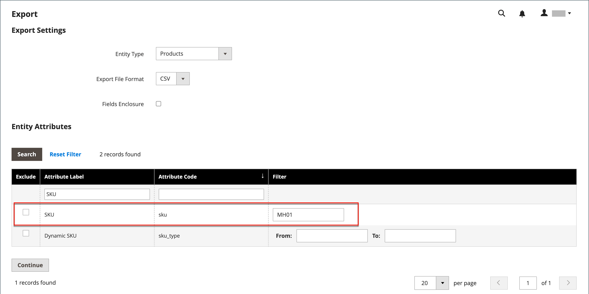
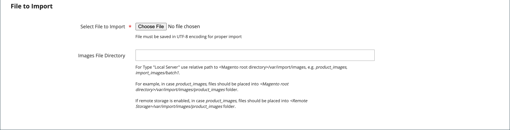

# 設定可能な製品を読み込む

設定可能な製品データの構造を理解する最善の方法は、設定可能な製品とそのバリエーションを書き出し、スプレッドシートでデータを調べることです。

次の例では、各色に新しいサイズの製品バリエーションのセットを追加します。 まず、設定可能なプロダクトを書き出し、データ構造を調べます。 次に、データを更新し、カタログに再度読み込みます。 データのエクスポートの演習を完了しない場合は、この例で使用されている CSV ファイルをダウンロードできます。

{width="700" zoomable="yes"}

## 手順 1：属性設定と値の確認

1. 開始する前に、製品バリエーションに使用される属性が必須のプロパティ設定を持っていることを確認してください。

   - [**[!UICONTROL Scope]**](../getting-started/websites-stores-views.md#scope-settings) - `Global`
   - [**[!UICONTROL Catalog Input Type for Store Owner]**](data-attributes-product.md)  — 製品のバリエーションに使用される属性の入力タイプは、次のいずれかである必要があります。

      - `Dropdown`
      - `Visual Swatch`
      - `Text Swatch`
      - `Multi-Select`

   - **[!UICONTROL Values Required]** - `Yes`

1. サイズや色を追加する場合や、既存の属性にその他の変更を加える場合は、必ず新しい値で属性を更新してください。

1. 次の日： _管理者_ サイドバー、移動 **[!UICONTROL Stores]** > _[!UICONTROL Attributes]_>**[!UICONTROL Product]**.

1. リストで属性を探し、編集モードで開きます。

1. 属性に新しい値を追加します。

   次の例では、新しいサイズがテキストスウォッチに追加されます。

   {width="500" zoomable="yes"}

1. 完了したら、「 **[!UICONTROL Save Attribute]**.

1. 属性を追加する場合は、 [属性の作成](../catalog/attribute-product-create.md) 始める前に

## 手順 2：設定可能な製品を書き出す

1. 次の日： _管理者_ サイドバー、移動 **[!UICONTROL Catalog]** > **[!UICONTROL Products]**.

1. 書き出す設定可能な製品を検索します。

   - クリック **[!UICONTROL Filters]**.
   - 設定 **[!UICONTROL Type]** から `Configurable Product` をクリックします。 **[!UICONTROL Apply Filters]**.
   - テスト書き出しに使用する設定可能な製品を選択し、 **[!UICONTROL SKU]**.

1. 次の日： _管理者_ サイドバー、移動 **[!UICONTROL System]** > _[!UICONTROL Data Transfer]_>**[!UICONTROL Export]**.

   {width="600" zoomable="yes"}

1. の下 _[!UICONTROL Export Setting]s_、次の操作を実行します。

   - 設定 **[!UICONTROL Entity Type]** から `Products`.

   - 設定 **[!UICONTROL Export File Format]** から `CSV`.

1. の下 _[!UICONTROL Entity Attributes]_をクリックし、下にスクロールするか、属性ラベルフィルターを使用して&#x200B;**[!UICONTROL SKU]**attrubute を実行し、以下の手順を実行します。

   - 書き出し用に選択した設定可能な製品の SKU を入力し、「 **[!UICONTROL Continue]**.

     {width="600" zoomable="yes"}

   - Web ブラウザーのダウンロード場所でファイルを探し、スプレッドシートとして開きます。

     CSV ファイルには、単純な製品バリエーションごとに個別の行と、設定可能な製品の行が 1 つずつあります。 The `product_type column` は、1 つの設定可能な製品に関連付けられた複数の単純な製品バリエーションを表示します。

     {width="600" zoomable="yes"}

   - ワークシートの右端までスクロールし、次の列を見つけます。

      - `configurable_variations`  — 設定可能な製品レコードと各バリエーションとの間の 1 対多の関係を定義します。
      - `configurable_variation_labels`  — 各バリエーションを識別するラベルを定義します。

     この例では、データは CG 列と CH 列で見つかります。 バリエーションの数に応じて、 `configurable_variations` 列に長さを指定できます。 データは、関連する製品バリエーションのインデックスとして使用され、次の構造を持ちます。

     ```text
     sku={{SKU_VALUE}},attribute1={{VALUE}},attribute2={{VALUE}}| sku={{SKU_VALUE}},attribute1={{VALUE}},attribute2={{VALUE}}
     ```

     各 SKU はパイプ記号 (|) で区切られ、属性はコンマで区切られます。 各属性の値は、属性ラベルではなく、属性コードで表されます。 実際のデータは次のように表示されます。

     ```text
     sku=MH01-XS-Black,size=XS,color=Black|sku=MH01-XS-Gray,size=XS,color=Gray|sku=MH01-XS-Orange,size=XS,color=Orange</pre>
     ```

1. 設定可能な製品データの構造を理解したら、データを編集したり、CSV ファイルに新しいバリエーションを直接追加したりできます。

   詳しくは、 [複雑なデータ](data-attributes-product.md#complex-product-data-attributes).

## 手順 3：データの編集

次の例では、XL サイズのセットをワークシートにコピーして貼り付け、各色の新しいサイズに対する製品のバリエーションのセットを作成します。

1. 新しい製品のテンプレートとして使用する製品バリエーションのセットをコピーします。

   {width="600" zoomable="yes"}

1. コピーした行のレコードをワークシートに挿入します。

   これで、2 つの同じセットのシンプルな製品バリエーションが作成されました。

   {width="600" zoomable="yes"}

1. 必要に応じて、新しいバリエーションの次の列のデータを更新します。

   - `sku`
   - `name`
   - `url_key`
   - `additional_attributes`

   この例では、 `XL` 参照は次のように変更されます。 `XXL`.

1. の情報を更新します。 `product_variations` 設定可能な製品レコードの列。新しいバリエーションが設定可能な製品の一部として含まれます。

   設定可能な製品レコードを含む行で、 `product_variations` データ。 次に、式バーで、パイプ記号から始まる最後のパラメータセットをコピーします。

   {width="600" zoomable="yes"}

1. データの末尾にパラメーターを貼り付け、新しいバリエーションの必要に応じて編集します。

   この例では、 `sku` および `size` 新しい XXL サイズに合わせてパラメータが更新されます。

1. データをカタログに再び読み込む前に、変更されていない行を削除します。

   この例では、新しいサイズの 3 つの新しいバリエーションと、更新された設定可能な製品を含む行のみがカタログに再び読み込まれます。 他の行は CSV ファイルから削除できます。 ただし、列ラベルの付いたヘッダー行は削除しないでください。

   {width="600" zoomable="yes"}

1. **[!UICONTROL Save]** CSV ファイル。

   データをカタログに読み込む準備が整いました。

   >[!NOTE]
   >
   >インポートファイルのサイズは 2 MB 以下にする必要があります。

## 手順 4：更新されたデータをインポート

1. 次の日： _管理者_ サイドバー、移動 **[!UICONTROL System]** > _[!UICONTROL Data Transfer]_>**[!UICONTROL Import]**.

1. の下 _[!UICONTROL Import Settings]_，設定&#x200B;**[!UICONTROL Entity Type]**から `Products`.

1. の下 _[!UICONTROL Import Behavior]_，設定&#x200B;**[!UICONTROL Import Behavior]**から `Add/Update`.

   {width="600" zoomable="yes"}

1. の下 _[!UICONTROL File to Import]_をクリックし、**[!UICONTROL Choose File]**をクリックし、読み込み用に準備した CSV ファイルに移動して、ファイルを選択します。

   {width="600" zoomable="yes"}

1. 右上隅で、 **[!UICONTROL Check Data]**.

1. ファイルが有効な場合は、 **[!UICONTROL Import]**.

   それ以外の場合は、データで見つかった問題を修正して、もう一度試してください。

   {width="600" zoomable="yes"}

1. インポートが完了したら、「 **[!UICONTROL Cache Management]** をクリックし、無効なキャッシュをすべて更新します。

   新しい製品バリエーションが、管理者とストアフロントのカタログで使用できるようになりました。 この例では、すべての色に対してサイズ XXL のホードを使用できます。
