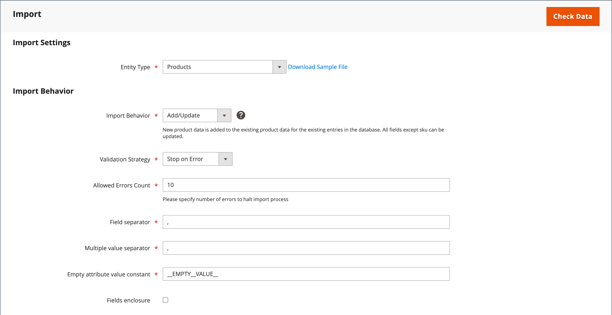

# 設定可能な製品のインポート

設定可能な商品データの構造を理解する最善の方法は、設定可能な商品とそのバリエーションを書き出し、スプレッドシートでデータを調べることです。

次の例では、新しいサイズの商品バリエーションのセットを各カラーに追加します。 まず、設定可能なプロダクトをエクスポートして、データ構造を調べます。 次に、データを更新し、カタログに読み込みます。 データの書き出しの演習を行わない場合は、例で使用されている CSV ファイルをダウンロードできます。

{width="700" zoomable="yes"}

## 手順 1：属性の設定と値を確認する

1. 開始する前に、製品バリエーションに使用される属性に、必要なプロパティ設定があることを確認します。

   - [**[!UICONTROL Scope]**](../getting-started/websites-stores-views.md#scope-settings) - `Global`
   - [**[!UICONTROL Catalog Input Type for Store Owner]**](data-attributes-product.md)  – 製品バリエーションに使用する属性の入力タイプは、次のいずれかである必要があります。

      - `Dropdown`
      - `Visual Swatch`
      - `Text Swatch`
      - `Multi-Select`

   - **[!UICONTROL Values Required]** - `Yes`

1. サイズや色を追加する場合や、既存の属性に他の変更を加える場合は、必ず新しい値で属性を更新してください。

1. 日 _Admin_ サイドバー、に移動 **[!UICONTROL Stores]** > _[!UICONTROL Attributes]_>**[!UICONTROL Product]**.

1. リストで属性を見つけ、編集モードで開きます。

1. 新しい値を属性に追加します。

   次の例では、新しいサイズがテキストスウォッチに追加されます。

   {width="500" zoomable="yes"}

1. 完了したら、 **[!UICONTROL Save Attribute]**.

1. 属性を追加する場合は、次の手順に従います [属性の作成](../catalog/attribute-product-create.md) 始める前に。

## 手順 2：設定可能な商品のエクスポート

1. 日 _Admin_ サイドバー、に移動 **[!UICONTROL Catalog]** > **[!UICONTROL Products]**.

1. 書き出す設定可能な製品を見つけます。

   - クリック **[!UICONTROL Filters]**.
   - を設定 **[!UICONTROL Type]** 対象： `Configurable Product` をクリックして、 **[!UICONTROL Apply Filters]**.
   - テスト書き出しに使用する設定可能な製品を選択し、をメモします **[!UICONTROL SKU]**.

1. 日 _Admin_ サイドバー、に移動 **[!UICONTROL System]** > _[!UICONTROL Data Transfer]_>**[!UICONTROL Export]**.

   {width="600" zoomable="yes"}

1. 次の下 _[!UICONTROL Export Setting]秒_、次の手順を実行します。

   - を設定 **[!UICONTROL Entity Type]** 対象： `Products`.

   - を設定 **[!UICONTROL Export File Format]** 対象： `CSV`.

1. 次の下 _[!UICONTROL Entity Attributes]_、下にスクロールするか、属性ラベルフィルターを使用してを見つけます。**[!UICONTROL SKU]**次の手順を実行します。

   - 書き出すために選択した設定可能な商品の SKU を入力し、クリックします **[!UICONTROL Continue]**.

     {width="600" zoomable="yes"}

   - Web ブラウザーのダウンロード場所でファイルを探し、スプレッドシートとして開きます。

     CSV ファイルには、シンプルな製品バリエーションごとに別々の行と、設定可能な製品ごとに 1 つの行があります。 この `product_type column` 1 つの設定可能な製品に関連付けられた複数のシンプルな製品バリエーションを表示します。

     {width="600" zoomable="yes"}

   - ワークシートの右端までスクロールして、次の列を探します。

      - `configurable_variations`  – 設定可能な商品レコードと各バリエーションとの 1 対多の関係を定義します。
      - `configurable_variation_labels`  – 各バリエーションを識別するラベルを定義します。

     この例では、データは CG 列および CH 列にあります。 バリエーションの数に応じて、内のデータ文字列 `configurable_variations` 列は長くすることができます。 データは、関連する製品バリエーションへのインデックスとして使用されます。このデータの構造は以下のとおりです。

     ```text
     sku={{SKU_VALUE}},attribute1={{VALUE}},attribute2={{VALUE}}| sku={{SKU_VALUE}},attribute1={{VALUE}},attribute2={{VALUE}}
     ```

     各 SKU はパイプ記号（|）で区切られ、属性はコンマで区切られます。 各属性の値は、属性ラベルではなく属性コードで表されます。 実際のデータは次のように表示されます。

     ```text
     sku=MH01-XS-Black,size=XS,color=Black|sku=MH01-XS-Gray,size=XS,color=Gray|sku=MH01-XS-Orange,size=XS,color=Orange</pre>
     ```

1. 設定可能なプロダクトデータの構造を理解したら、データを編集したり、新しいバリエーションを CSV ファイルに直接追加したりできます。

   詳しくは、 [複雑なデータ](data-attributes-product.md#complex-product-data-attributes).

## 手順 3：データの編集

次の例では、XL サイズのセットをコピーしてワークシートに貼り付け、各色で新しいサイズの製品バリエーションのセットを作成します。

1. 新製品のテンプレートとして使用する製品バリエーションのセットをコピーします。

   {width="600" zoomable="yes"}

1. コピーした行レコードをワークシートに挿入します。

   これで、シンプルな製品バリエーションの同一のセットが 2 つ作成されました。

   {width="600" zoomable="yes"}

1. 必要に応じて、新しいバリエーションの次の列のデータを更新します。

   - `sku`
   - `name`
   - `url_key`
   - `additional_attributes`

   この例では、すべての `XL` 参照がに変更されます `XXL`.

1. の情報を更新します `product_variations` 新しいバリエーションが設定可能な製品の一部として含まれるように、設定可能な製品レコードの列。

   設定可能な製品レコードがある行で、を含むセルをクリックします `product_variations` データ。 次に、式バーで、パイプ記号から始まる最後のパラメータ セットをコピーします。

   {width="600" zoomable="yes"}

1. パラメーターをデータの最後に貼り付け、新しいバリエーションに必要に応じて編集します。

   この例では、 `sku` および `size` 新しい XXL サイズのパラメーターが更新されます。

1. データをカタログにインポートする前に、変更されていない行を削除します。

   この例では、新しいサイズの 3 つの新しいバリエーションと、更新された設定可能な製品を含む行のみがカタログに読み込まれます。 その他の行は、CSV ファイルから削除できます。 ただし、列ラベル付きのヘッダー行は削除しないでください。

   {width="600" zoomable="yes"}

1. **[!UICONTROL Save]** csv ファイル。

   データをカタログにインポートする準備が整いました。

   >[!NOTE]
   >
   >インポート ファイルのサイズは 2 MB 以下にする必要があります。

## 手順 4：更新したデータのインポート

1. 日 _Admin_ サイドバー、に移動 **[!UICONTROL System]** > _[!UICONTROL Data Transfer]_>**[!UICONTROL Import]**.

1. 次の下 _[!UICONTROL Import Settings]_、設定&#x200B;**[!UICONTROL Entity Type]**対象： `Products`.

1. 次の下 _[!UICONTROL Import Behavior]_、設定&#x200B;**[!UICONTROL Import Behavior]**対象： `Add/Update`.

   {width="600" zoomable="yes"}

1. 次の下 _[!UICONTROL File to Import]_を選択し、**[!UICONTROL Choose File]**次に、読み込み用に準備した CSV ファイルに移動し、ファイルを選択します。

   {width="600" zoomable="yes"}

1. 右上隅のをクリックします。 **[!UICONTROL Check Data]**.

1. ファイルが有効な場合、 **[!UICONTROL Import]**.

   それ以外の場合は、データで見つかった問題を修正して、もう一度試してください。

   {width="600" zoomable="yes"}

1. 読み込みが完了したら、 **[!UICONTROL Cache Management]** ページ上部のメッセージで、無効なキャッシュをすべて更新します。

   新しい製品バリエーションが、管理者からのカタログとストアフロントで使用できるようになりました。 この例では、パーカーはすべての色でサイズ XXL で使用できます。
