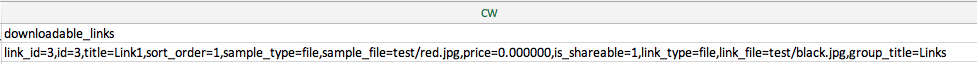

# ダウンロード可能な製品のインポート

ダウンロード可能な製品を読み込むフローは、[ バンドル製品](data-transfer-bundle-products.md)または[構成可能な製品](data-transfer-configurable-products.md)と同じです。 違いは、ダウンロード可能な製品には、[ ダウンロード可能なリンク ](../catalog/product-create-downloadable.md)と[ ダウンロード可能なサンプル ](../catalog/product-create-downloadable.md)とその画像が含まれていることです。

ダウンロード可能なリンクとサンプルのデフォルトのルートディレクトリは`<Magento-root-folder>/pub/media/import`です。 リモートストレージモジュールが有効になっている場合、ダウンロード可能なリンクとサンプルのデフォルトのルートディレクトリは`<remote-storage-root-folder>/media/import` ディレクトリです。

CSV ファイルには、`downloadable_links`と`downloadable_samples`の別々の列があります。

- **ダウンロード可能なリンク画像** – 次の例では、ダウンロード可能なリンク画像（`red.jpg`および`black.jpg`）が`<Magento-root-folder>/pub/media/import/test` フォルダーにあります。 リモートストレージが有効になっている場合、これらの画像は`<remote-storage-root-folder>/media/import/test` フォルダーにあります。

  {width="600" zoomable="yes"}

- **ダウンロード可能なサンプル画像** – 次の例では、ダウンロード可能なサンプル画像（`white.jpg`）が`<Magento-root-folder>/pub/media/import/test` フォルダーにあります。 リモートストレージが有効になっている場合、この画像は`<remote-storage-root-folder>/media/import/test` フォルダーにあります。

  {width="400" zoomable="yes"}

リモートストレージモジュールの有効化と管理について詳しくは、_設定ガイド_&#x200B;の[ リモートストレージの設定](https://experienceleague.adobe.com/docs/commerce-operations/configuration-guide/storage/remote-storage/remote-storage.html)を参照してください。
