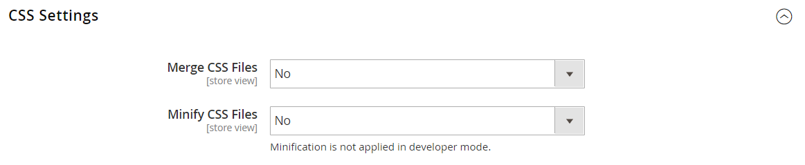
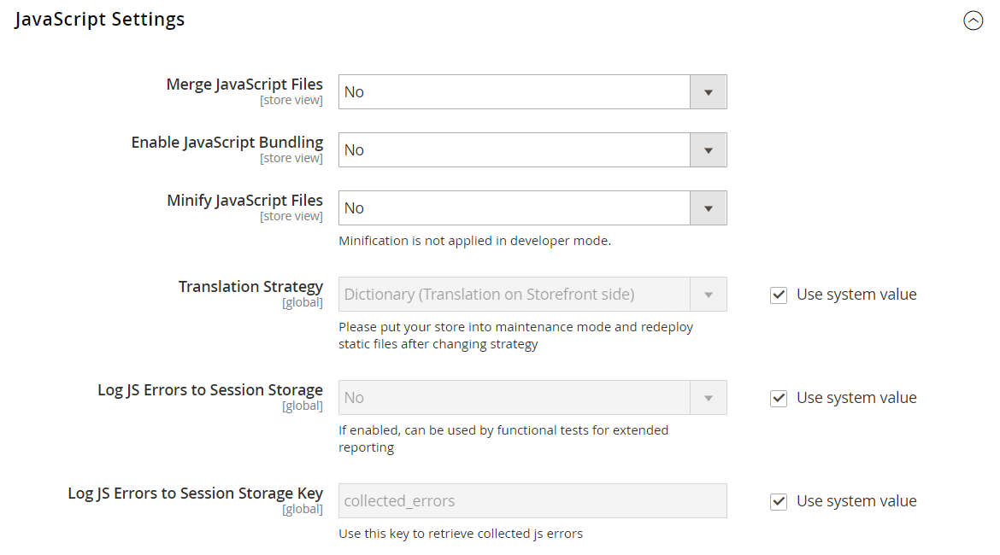
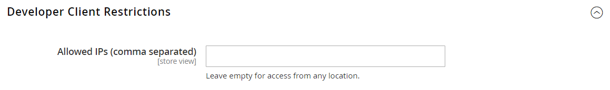

# 開発者ツール

高度な開発者ツールを使用して、フロントエンド開発時のコンパイルモードを決定し、IP アドレスの許可リストに加えるを作成し、テンプレートパスのヒントを表示します。 また、ストアフロントと Admin のインターフェイスでテキストを簡単にスポット変更できるツールも用意されています。

- [アクションログ](action-log.md)  (Adobe Commerceのみ )
- [フロントエンド開発ワークフロー](#frontend-development-workflow)
- [静的ファイル署名の使用](#static-file-signatures)
- [リソースファイルの最適化](#optimizing-resource-files)
- [開発者クライアントの制限](#client-restrictions)
- [テンプレートパスのヒント](#template-path-hints)
- [インラインを翻訳](#translate-inline)

## 操作モード

Adobe CommerceまたはMagento Open Sourceインスタンスをデプロイして、で実行できます。 _実稼動_ または _開発者モード_. 開発者向けに特別に設計されたツールと設定には、ストアがで実行されている間にのみアクセスできます _開発者モード_.

適切な権限を持つユーザが、サーバのコマンドラインからのみ操作モードを変更できます。 詳しくは、 [操作モードの設定](https://experienceleague.adobe.com/docs/commerce-operations/configuration-guide/cli/set-mode.html) （内） _設定ガイド_ を参照してください。

マーチャントドキュメントのほとんどのトピックは、実稼働モードで実行されているコマースインスタンスに適用されます。 ただし、次の設定とツールは、インストールが開発者モードで実行されている場合にのみ使用できます。

## フロントエンド開発ワークフロー

Frontend Development Workflow タイプは、開発中にクライアント側またはサーバー側で Less コンパイルを行うかどうかを決定します。 LESS は、追加の機能と規則を持ち、合理化されたコードを生成する CSS の拡張です。 クライアント側の低コンパイルは、テーマの開発にお勧めです。 サーバー側コンパイルがデフォルトのモードです。 開発ワークフローオプションは、実稼働モードのストアでは使用できません。
詳しくは、 [クライアント側の LESS コンパイルとサーバー側の LESS コンパイル](https://developer.adobe.com/commerce/frontend-core/guide/css/quickstart/compilation-mode/){:target=&quot;_blank&quot;}（Commerce 開発者向けドキュメント）。

>[!NOTE]
>
>フロントエンド開発ワークフローの設定は、 [開発者モード](../systems/developer-tools.md#operation-modes) のみ。

{width="600" zoomable="yes"}

1. 次の日： _管理者_ サイドバー、移動 **[!UICONTROL Stores]** > _[!UICONTROL Settings]_>**[!UICONTROL Configuration]**.

1. 左側のパネルで、を展開します。 **[!UICONTROL Advanced]** を選択します。 **[!UICONTROL Developer]**.

1. 展開  の **[!UICONTROL Front-end Development Workflow]** 」セクションに入力します。

1. 設定 **[!UICONTROL Workflow Type]** を次のいずれかに変更します。

   - `Client side less compilation`  — コンパイルは、ネイティブの `less.js` ライブラリ。
   - `Server side less compilation`  — コンパイルは、Less PHP ライブラリを使用してサーバー上で行われます。 これは実稼動用のデフォルトのモードです。

1. 完了したら、「 **[!UICONTROL Save Config]**.

## 静的ファイル署名

静的ファイルの URL に電子署名を追加すると、ブラウザーはそのファイルの新しいバージョンが利用可能かどうかを検出できます。 電子署名で追跡できる静的ファイルには、JavaScript、CSS、画像、フォントなどがあります。 署名は、ベース URL の直後にパスに追加されます。 ファイルの署名がブラウザーのキャッシュに保存されているものと異なる場合は、ファイルの新しいバージョンが使用されます。

詳しくは、 [静的コンテンツ署名](https://experienceleague.adobe.com/docs/commerce-operations/configuration-guide/cache/static-content-signing.html){:target=&quot;_blank&quot;}（Commerce 開発者向けドキュメント）。

>[!NOTE]
>
>静的ファイル設定は、 [開発者モード](../systems/developer-tools.md#operation-modes).

{width="600" zoomable="yes"}

設定の詳細なリストについては、 [_静的ファイル設定_](../configuration-reference/advanced/developer.md) （内） _設定リファレンス_.

**_署名済みの静的ファイルを有効にするには：_**

1. 次の日： _管理者_ サイドバー、移動 **[!UICONTROL Stores]** > _[!UICONTROL Settings]_>**[!UICONTROL Configuration]**.

1. 左側のパネルで、を展開します。 **[!UICONTROL Advanced]** を選択します。 **[!UICONTROL Developer]**.

1. 展開  の **[!UICONTROL Static Files Settings]** 」セクションに入力します。

1. 設定 **[!UICONTROL Sign Static Files]** から `Yes`.

1. 完了したら、「 **[!UICONTROL Save Config]**.

## リソースファイルの最適化

リソースファイルの読み込みに要する時間は、ファイルを結合してバンドルし、コードを最小限に抑えることで短縮できます。

- マージは、同じタイプの別々のファイルを 1 つのファイルに結合します。
- バンドルとは、ページの読み込みに必要な HTTP リクエストの数を減らすために、別々のファイルをグループ化する技術です。
- 縮小化により、スペース、改行、コメントが削除されますが、コードの機能には影響しません。 最小化したファイルは編集できないので、実稼動環境に移行する準備が整った場合にのみ、プロセスを適用する必要があります。

デフォルトでは、Adobe CommerceとMagento Open Sourceはファイルの結合、バンドル、最小化をおこなわず、どのファイル最適化方法を使用するかをプロジェクト開発者が決定する必要があります。

詳しくは、 [パフォーマンスのベストプラクティス](https://experienceleague.adobe.com/docs/commerce-operations/performance-best-practices/overview.html) を参照してください。

>[!NOTE]
>
>CSS および JavaScript ファイルは、 [開発者モード](../systems/developer-tools.md#operation-modes) のみ。

| ファイルタイプ | サポートされる操作 |
| --------------- | -------------------- |
| CSS ファイル | `MergeMinify` |
| JavaScript ファイル | `MergeBundleMinify` |
| テンプレートファイル | `Minify` |

{style="table-layout:auto"}

**_リソースファイルを最適化するには：_**

1. 次の日： _管理者_ サイドバー、移動 **[!UICONTROL Stores]** > _[!UICONTROL Settings]_>**[!UICONTROL Configuration]**.

1. 左側のパネルで、を展開します。 **[!UICONTROL Advanced]** を選択します。 **[!UICONTROL Developer]**.

1. CSS ファイルを最適化するには、を展開します。  の **[!UICONTROL CSS Settings]** 」セクションで次の操作を実行します。

   - 設定 **[!UICONTROL Merge CSS Files]** から `Yes`.
   - 設定 **[!UICONTROL Minify CSS Files]** から `Yes`.

   {width="600" zoomable="yes"}

[_CSS 設定_](../configuration-reference/advanced/developer.md)

1. JavaScript ファイルを最適化するには、を展開します。  の **[!UICONTROL JavaScript Settings]** 」セクションで次の操作を実行します。

   - 設定 **[!UICONTROL Merge JavaScript Files]** から `Yes`.
   - 設定 **[!UICONTROL Minify JavaScript Files]** から `Yes`.

   {width="600" zoomable="yes"}

1. PHTML テンプレートファイルを縮小するには、を展開します。  の **[!UICONTROL Template Settings]** セクションとセット **[!UICONTROL Minify Html]** から `Yes`.

   {width="600" zoomable="yes"}

1. 完了したら、「 **[!UICONTROL Save Config]**.

## クライアントの制限

次のようなツールを使用する前に [テンプレートパスヒント](#template-path-hints)ストアでの顧客の買い物中断を避けるために、IP アドレスを開発者クライアント制限許可リストに加えるに追加してください。 IP アドレスが不明な場合は、オンラインで検索できます。

>[!NOTE]
>
>開発者クライアントの制限は、 [開発者モード](../systems/developer-tools.md#operation-modes) のみ。

技術情報については、 [リクエストを許可するカスタム VCL](https://experienceleague.adobe.com/docs/commerce-cloud-service/user-guide/cdn/custom-vcl-snippets/fastly-vcl-allowlist.html) （内） _Commerce on Cloud Infrastructure ガイド_.

**_IP アドレスをに追加するには、次の手順を実行し許可リストに加えるます。_**

1. 次の日： _管理者_ サイドバー、移動 **[!UICONTROL Stores]** > _[!UICONTROL Settings]_>**[!UICONTROL Configuration]**.

1. 左側のパネルで、を展開します。 **[!UICONTROL Advanced]** を選択します。 **[!UICONTROL Developer]**.

1. 展開  の **[!UICONTROL Developer Client Restrictions]** 」セクションに入力します。

   {width="600" zoomable="yes"}

1. の場合 **[!UICONTROL Allow IPs]**、IP アドレスを入力します。

   複数の IP アドレスからアクセスする必要がある場合は、それぞれをコンマで区切ります。

1. 完了したら、「 **[!UICONTROL Save Config]**.

1. プロンプトが表示されたら、無効なキャッシュを更新します。

## テンプレートパスのヒント

テンプレートパスのヒントは、ページで使用される各テンプレートへのパスを含む表記を追加する診断ツールです。 テンプレートパスのヒントは、ストアフロントまたは管理者に対して有効にできます。

>[!NOTE]
>
>テンプレートパスのヒントは、 [開発者モード](../systems/developer-tools.md#operation-modes) のみ。

詳しくは、 [テンプレート、レイアウト、スタイルを検索する](https://developer.adobe.com/commerce/frontend-core/guide/themes/debug/){:target=&quot;_blank&quot;}（Commerce 開発者向けドキュメント）。

{width="700" zoomable="yes"}

### 手順 1:IP アドレスをに追加す許可リストに加えるる

テンプレートパスのヒントを使用する前に、IP アドレスを [許可リストに加える](#client-restrictions) 店内で買い物をする顧客に干渉するのを避ける。 完了したら、コマースキャッシュをクリアして、ストアからすべてのヒントを削除するようにしてください。

{width="600" zoomable="yes"}

### 手順 2：テンプレートパスのヒントを有効にする

1. 次の日： _管理者_ サイドバー、移動 **[!UICONTROL Stores]** > _[!UICONTROL Settings]_>**[!UICONTROL Configuration]**.

1. 左側のパネルで、を展開します。 **[!UICONTROL Advanced]** を選択します。 **[!UICONTROL Developer]**.

1. 展開  の **[!UICONTROL Debug]** 」セクションで次の操作を実行します。

   {width="600" zoomable="yes"}

   - ストアのテンプレートパスヒントを有効にするには、 **[!UICONTROL Enabled Template Path Hints for Storefront]** から `Yes`.

   - URL に `templatehints` パラメータ、設定 **URL パラメーターを使用してストアフロントのヒントを有効にする** から `Yes`. 次に、必要に応じてパラメーターの値を設定します。 デフォルト値は `magento`カスタム値を使用できます。 例えば、 `lorem`を使用する場合、 `mymagento.com?templatehints=lorem` テンプレートのヒントを表示します。

   - 管理者のテンプレートパスヒントを有効にするには、 **[!UICONTROL Enabled Template Path Hints for Admin]** から `Yes`.

   - ブロック名を含めるには、 **[!UICONTROL Add Block Class Type to Hints]** から `Yes`.

1. 完了したら、「 **[!UICONTROL Save Config]**.

### 手順 3：キャッシュのクリア

1. 次の日： _管理者_ サイドバー、移動 **[!UICONTROL System]** > _[!UICONTROL Tools]_>**[!UICONTROL Cache Management]**.

1. 右上隅で、 **[!UICONTROL Flush Magento Cache]**.

## インラインを翻訳

インライン翻訳ツールは、 [開発者モード](../systems/developer-tools.md#operation-modes) インターフェイス内のテキストをタッチアップして、声とブランドを反映させます。 「インライン翻訳」モードが有効になっている場合、編集可能なページ上のテキストはすべて赤い枠で囲まれます。 ストアフロントや管理者全体に表示されるフィールドラベル、メッセージ、その他のテキストを簡単に編集できます。 例えば、多くのテーマでは、 _マイアカウント_, _マイウィッシュリスト_、および _マイダッシュボード_&#x200B;を使用して、顧客が道を見つけるのに役立ちます。 ただし、単に次の単語を使用する方が良い場合があります。 _アカウント_, _ウィッシュリスト_、および _ダッシュボード_.

>[!NOTE]
>
>インライン翻訳ツールは、 [開発者モード](../systems/developer-tools.md#operation-modes).

詳しくは、 [翻訳の概要](https://developer.adobe.com/commerce/frontend-core/guide/translations/) （ Commerce 開発者向けドキュメント）を参照してください。

{width="700" zoomable="yes"}

ストアが複数の言語で使用可能な場合は、ロケールに合わせて翻訳されたテキストを微調整できます。 サーバ上では、インターフェイステキストは出力ブロックごとに別々の CSV ファイルに保持され、ロケール別に整理されます。 を使用する代わりに、代替のアプローチとして _インラインを翻訳_ ツールを使用すると、CSV ファイルをサーバー上で直接編集することもできます。 翻訳ファイルは、 `app/code/Magento/<module_name>/i18n/<language_locale>.csv`.

>[!NOTE]
>
>インライン翻訳ツールを使用するには、ブラウザーでポップアップを許可する必要があります。

### 手順 1：出力キャッシュを無効にする

1. 次の日： _管理者_ サイドバー、移動 **[!UICONTROL System]** > _[!UICONTROL Tools]_>**[!UICONTROL Cache Management]**.

1. 次のチェックボックスをオンにします。

   - `Blocks HTML output`
   - `Page Cache`
   - `Translations`

1. を設定します。 **[!UICONTROL Actions]** ～を制御する `Disable` をクリックします。 **[!UICONTROL Submit]**.

### 手順 2：インライン翻訳ツールの有効化

1. 次の日： _管理者_ サイドバー、移動 **[!UICONTROL Stores]** > _[!UICONTROL Settings]_>**[!UICONTROL Configuration]**.

1. 特定のストア表示を操作するには、 **[!UICONTROL Store View]** を更新します。

1. 左側のパネルで、を展開します。 **[!UICONTROL Advanced]** を選択します。 **[!UICONTROL Developer]**.

1. 展開  の **[!UICONTROL Translate Inline]** 」セクションに入力します。

   次をクリア： **[!UICONTROL Use Website]** チェックボックスをオンにして、必要に応じてこれらの設定を変更します。

   The _[!UICONTROL Enabled for Admin]_特定のストアビューを編集する際に、オプションは使用できません。

   {width="600" zoomable="yes"}

1. 設定 **[!UICONTROL Enabled for Storefront]** から `Yes`.

1. 完了したら、「 **[!UICONTROL Save Config]**.

1. プロンプトが表示されたら、無効なキャッシュを更新しますが、無効なキャッシュは現在のとおりに残します。

### 手順 3：テキストを更新する

1. ブラウザーでストアフロントを開き、編集するページに移動します。

   必要に応じて、言語選択を使用してストアの表示を変更します。 翻訳可能な各テキストの文字列は、赤でアウトライン表示されます。 テキストボックスの上にマウスポインターを置くと、ブックアイコン (  ) が表示されます。

1. ブックアイコンをクリックして、 _翻訳_ ウィンドウを開き、次の操作を実行します。

   - 特定のストア表示に対する変更の場合、 **[!UICONTROL Store View Specific]** チェックボックス。

   - 新しい **[!UICONTROL Custom]** テキスト。

1. 完了したら、「 **[!UICONTROL Submit]**.

   {width="700" zoomable="yes"}

1. ストアで変更を確認するには、ブラウザーを更新します。

1. ストア内の要素を変更する場合は、この手順を繰り返します。

### 手順 4：元の設定を復元する

1. ストアの管理者に戻ります。

1. 次の日： _管理者_ サイドバー、移動 **[!UICONTROL Stores]** > _[!UICONTROL Settings]_>**[!UICONTROL Configuration]**.

1. 設定 **[!UICONTROL Store View]** を編集済みの特定のビューに追加します。

1. 左側のパネルで、を展開します。 **[!UICONTROL Advanced]** を選択します。 **[!UICONTROL Developer]**.

1. 展開  の **[!UICONTROL Translate Inline]** 」セクションに入力します。

1. 設定 **[!UICONTROL Enabled for Frontend]** から `No`.

1. 完了したら、「 **[!UICONTROL Save Config]**.

1. 次の日： _管理者_ サイドバー、移動 **[!UICONTROL System]** > _[!UICONTROL Tools]_>**[!UICONTROL Cache Management]**.

1. 以前に無効にされた次の出力キャッシュのチェックボックスをオンにします。

   - `Blocks HTML output`
   - `Page Cache`
   - `Translations`

1. を設定します。 **[!UICONTROL Actions]** ～を制御する `Enable` をクリックします。 **[!UICONTROL Submit]**.

1. プロンプトが表示されたら、無効なキャッシュを更新します。

### 手順 5：ストア内の変更を確認する

ストアフロントに移動し、更新された各ページを調べて、変更が正しいことを確認します。 この例では、 `Customer Login` はに変更されました。 `Customer Sign In`. 特定のビューに変更が加えられた場合は、言語の選択を使用して正しいビューに切り替えます。

{width="700" zoomable="yes"}
