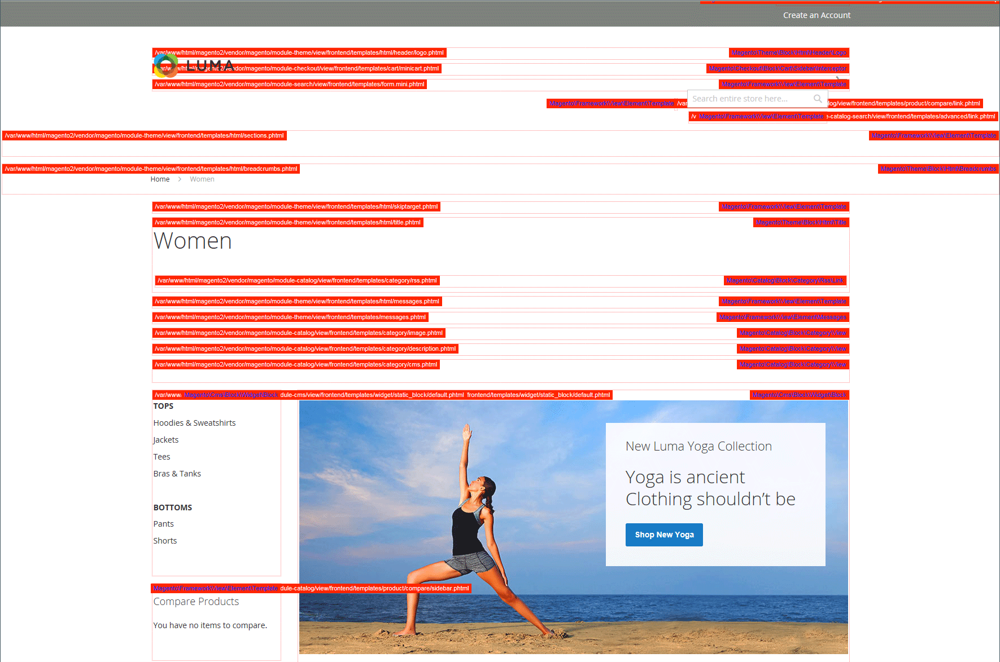
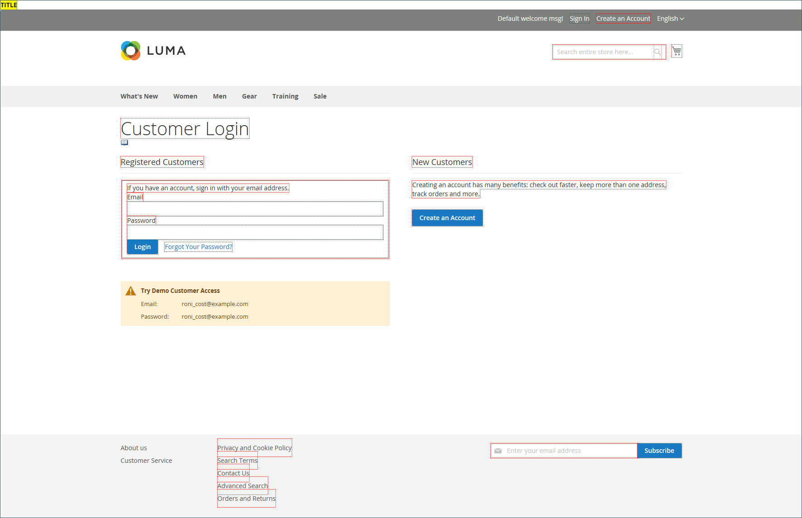
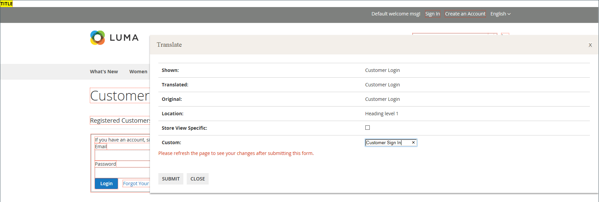
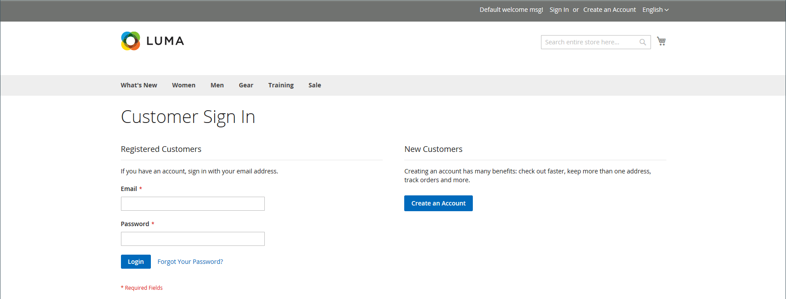

# 開発者用ツール

高度な開発者ツールを使用して、フロントエンド開発中にコンピレーションモードを決定し、IP アドレスの許可リストを作成し、テンプレートパスのヒントを表示します。 また、ストアフロントと管理者のインターフェイスで、テキストを簡単にスポット変更できるツールも用意されています。

- [ アクションログ ](action-log.md)  （Adobe Commerceのみ）
- [フロントエンド開発ワークフロー](#frontend-development-workflow)
- [静的ファイル署名の使用](#static-file-signatures)
- [リソースファイルの最適化](#optimizing-resource-files)
- [開発者クライアントの制限](#client-restrictions)
- [テンプレートのパスヒント](#template-path-hints)
- [インライン翻訳](#translate-inline)

## 操作モード

Adobe CommerceまたはMagento Open Source インスタンスをデプロイして、_実稼動_&#x200B;または&#x200B;_開発者モード_&#x200B;で実行できます。 開発者向けに特別に設計されたツールと構成設定は、ストアが&#x200B;_開発者モード_&#x200B;で実行されている間にのみアクセスできます。

操作モードは、適切な権限を持つユーザーがサーバーのコマンドラインからのみ変更できます。 詳しくは、_設定ガイド_&#x200B;の「[操作モードを設定](https://experienceleague.adobe.com/docs/commerce-operations/configuration-guide/cli/set-mode.html)」を参照してください。

マーチャントのドキュメントのほとんどのトピックは、実稼動モードで動作しているCommerce インスタンスに適用されます。 ただし、次の設定とツールは、インストールが開発者モードで実行されている場合にのみ使用できます。

## フロントエンド開発ワークフロー

フロントエンド開発ワークフロータイプは、開発中にクライアントサイドまたはサーバーサイドで少ないコンパイルが実行されるかどうかを決定します。Lessは、CSSの拡張機能であり、追加の機能と規則を持ち、合理化されたコードを生成します。クライアントサイド テーマ開発では、コンパイルを減らすことをお勧めします。サーバーサイドのコンパイルはデフォルトモードです。実稼動モードのストアでは、開発ワークフローオプションを使用できません。
Commerce開発者向けドキュメントの[ クライアントサイド LESS コンパイルとサーバーサイド ](https://developer.adobe.com/commerce/frontend-core/guide/css/quickstart/compilation-mode/){:target="_blank"}の比較を参照してください。

>[!NOTE]
>
>フロントエンド開発ワークフロー設定は、[開発者モード ](../systems/developer-tools.md#operation-modes)でのみ使用できます。

{width="600" zoomable="yes"}

1. _管理者_ サイドバーで、**[!UICONTROL Stores]** > _[!UICONTROL Settings]_>**[!UICONTROL Configuration]**に移動します。

1. 左側のパネルで、**[!UICONTROL Advanced]**&#x200B;を展開し、**[!UICONTROL Developer]**&#x200B;を選択します。

1. **[!UICONTROL Front-end Development Workflow]** セクションのを展開します。

1. **[!UICONTROL Workflow Type]**&#x200B;を次のいずれかに設定します：

   - `Client side less compilation` - コンパイルは、ネイティブ `less.js` ライブラリを使用してブラウザーで実行されます。
   - `Server side less compilation` - コンパイルは、Less PHP ライブラリを使用してサーバー上で行われます。 これは実稼動のデフォルトモードです。

1. 完了したら、**[!UICONTROL Save Config]**&#x200B;をクリックします。

## 静的ファイル署名

静的ファイルのURLにデジタル署名を追加すると、ブラウザーが新しいバージョンのファイルが使用可能な場合に検出できるようになります。 デジタル署名を使用して追跡できる静的ファイルには、JavaScript、CSS、画像、フォントなどがあります。 署名は、ベース URLの直後のパスに追加されます。 ファイルの署名がブラウザーのキャッシュに保存されているものと異なる場合は、新しいバージョンのファイルが使用されます。

Commerce開発者向けドキュメントの[静的コンテンツ署名](https://experienceleague.adobe.com/docs/commerce-operations/configuration-guide/cache/static-content-signing.html){:target="_blank"}を参照してください。

>[!NOTE]
>
>静的ファイル設定の設定は、[開発者モード ](../systems/developer-tools.md#operation-modes)で作業する場合にのみ使用できます。

{width="600" zoomable="yes"}

構成設定の詳細なリストについては、_構成参照_&#x200B;の&#x200B;[_静的ファイル設定_](../configuration-reference/advanced/developer.md)&#x200B;を参照してください。

**_署名済み静的ファイルを有効にするには:_**

1. _管理者_ サイドバーで、**[!UICONTROL Stores]** > _[!UICONTROL Settings]_>**[!UICONTROL Configuration]**に移動します。

1. 左側のパネルで、**[!UICONTROL Advanced]**&#x200B;を展開し、**[!UICONTROL Developer]**&#x200B;を選択します。

1. **[!UICONTROL Static Files Settings]** セクションのを展開します。

1. **[!UICONTROL Sign Static Files]**&#x200B;を`Yes`に設定します。

1. 完了したら、**[!UICONTROL Save Config]**&#x200B;をクリックします。

## リソースファイルの最適化

リソースファイルの読み込みにかかる時間は、ファイルの結合とバンドル、およびコードの最小化によって短縮できます。

- 結合すると、同じタイプの個別のファイルが1つのファイルに結合されます。
- バンドルとは、ページの読み込みに必要なHTTP リクエストの数を減らすために、個別のファイルをグループ化する手法です。
- 縮小すると、スペース、改行、コメントは削除されますが、コードの機能には影響しません。 最小化されたファイルは編集できないので、プロセスは本番環境に移行する準備ができたときにのみ適用する必要があります。

デフォルトでは、Adobe CommerceとMagento Open Sourceはファイルを結合、バンドル、または最小化しません。プロジェクト開発者は、使用するファイル最適化方法を決定する必要があります。

詳しくは、[ パフォーマンスのベストプラクティス ](https://experienceleague.adobe.com/docs/commerce-operations/performance-best-practices/overview.html)を参照してください。

>[!NOTE]
>
>CSS ファイルとJavaScript ファイルは、[開発者モード ](../systems/developer-tools.md#operation-modes)でのみ最適化できます。

| ファイルタイプ | サポートされる操作 |
| --------------- | -------------------- |
| CSS ファイル | `MergeMinify` |
| JavaScript ファイル | `MergeBundleMinify` |
| テンプレートファイル | `Minify` |

{style="table-layout:auto"}

**_リソースファイルを最適化するには:_**

1. _管理者_ サイドバーで、**[!UICONTROL Stores]** > _[!UICONTROL Settings]_>**[!UICONTROL Configuration]**に移動します。

1. 左側のパネルで、**[!UICONTROL Advanced]**&#x200B;を展開し、**[!UICONTROL Developer]**&#x200B;を選択します。

1. CSS ファイルを最適化するには、**[!UICONTROL CSS Settings]** セクションのを展開し、次の操作を行います。

   - **[!UICONTROL Merge CSS Files]**&#x200B;を`Yes`に設定します。
   - **[!UICONTROL Minify CSS Files]**&#x200B;を`Yes`に設定します。

   {width="600" zoomable="yes"}

   [_CSS設定_](../configuration-reference/advanced/developer.md)

1. JavaScript ファイルを最適化するには、**[!UICONTROL JavaScript Settings]** セクションのを展開し、次の操作を行います。

   - **[!UICONTROL Merge JavaScript Files]**&#x200B;を`Yes`に設定します。
   - **[!UICONTROL Minify JavaScript Files]**&#x200B;を`Yes`に設定します。

   {width="600" zoomable="yes"}

1. PHTML テンプレートファイルを縮小するには、**[!UICONTROL Template Settings]** セクションのを展開し、**[!UICONTROL Minify Html]**&#x200B;を`Yes`に設定します。

   {width="600" zoomable="yes"}

1. 完了したら、**[!UICONTROL Save Config]**&#x200B;をクリックします。

## クライアントの制限

[ テンプレートパスヒント ](#template-path-hints)などのツールを使用する前に、必ずDeveloper Client Restrictions ストアにIP アドレスを追加して、ストア内のお客様のショッピング体験が中断されないようにしてください。 IP アドレスがわからない場合は、オンラインで検索できます。

>[!NOTE]
>
>開発者クライアントの制限は、[開発者モード ](../systems/developer-tools.md#operation-modes)でのみ設定できます。

技術情報については、_Commerce on Cloud Infrastructure ガイド_&#x200B;の「[ リクエストを許可するためのカスタム VCL](https://experienceleague.adobe.com/docs/commerce-cloud-service/user-guide/cdn/custom-vcl-snippets/fastly-vcl-allowlist.html)」を参照してください。

**_IP アドレスをの許可リストに追加するには:_**

1. _管理者_ サイドバーで、**[!UICONTROL Stores]** > _[!UICONTROL Settings]_>**[!UICONTROL Configuration]**に移動します。

1. 左側のパネルで、**[!UICONTROL Advanced]**&#x200B;を展開し、**[!UICONTROL Developer]**&#x200B;を選択します。

1. **[!UICONTROL Developer Client Restrictions]** セクションのを展開します。

   {width="600" zoomable="yes"}

1. **[!UICONTROL Allow IPs]**&#x200B;にIP アドレスを入力します。

   複数のIP アドレスからのアクセスが必要な場合は、それぞれコンマで区切ります。

1. 完了したら、**[!UICONTROL Save Config]**&#x200B;をクリックします。

1. プロンプトが表示されたら、無効なキャッシュを更新します。

## テンプレートのパスヒント

テンプレートパスヒントは、ページで使用される各テンプレートにパスを含む表記法を追加する診断ツールです。 テンプレートパスヒントは、ストアフロントまたは管理者に対して有効にすることができます。

>[!NOTE]
>
>テンプレートパスヒントは、[開発者モード ](../systems/developer-tools.md#operation-modes)でのみ編集できます。

Commerce開発者向けドキュメントの[ テンプレート、レイアウト、スタイルの検索](https://developer.adobe.com/commerce/frontend-core/guide/themes/debug/){:target="_blank"}を参照してください。

{width="700" zoomable="yes"}

### ステップ 1：あなたのIP アドレスを追加します許可リスト

テンプレートのパスヒントを使用する前に、IP アドレスを[個のパス許可リスト](#client-restrictions)に追加して、店舗で買い物をする顧客に影響を与えないようにします。 完了したら、Commerce キャッシュをクリアして、ストアからすべてのヒントを削除します。

{width="600" zoomable="yes"}

### 手順2：テンプレートパスヒントを有効にする

1. _管理者_ サイドバーで、**[!UICONTROL Stores]** > _[!UICONTROL Settings]_>**[!UICONTROL Configuration]**に移動します。

1. 左側のパネルで、**[!UICONTROL Advanced]**&#x200B;を展開し、**[!UICONTROL Developer]**&#x200B;を選択します。

1. **[!UICONTROL Debug]** セクションのを展開し、次の操作を行います。

   {width="600" zoomable="yes"}

   - ストアのテンプレートパスヒントをアクティブにするには、**[!UICONTROL Enabled Template Path Hints for Storefront]**&#x200B;を`Yes`に設定します。

   - URLに`templatehints` パラメーターが含まれている場合にのみストアのテンプレートパスヒントを有効にするには、**URL パラメーター**&#x200B;を使用してストアフロントのヒントを有効にする`Yes`に設定します。 次に、必要に応じてパラメーターの値を設定します。 デフォルト値は`magento`ですが、カスタム値を使用できます。 例えば、値を`lorem`に変更すると、`mymagento.com?templatehints=lorem`を使用してテンプレートヒントを表示します。

   - 管理者のテンプレートパスヒントをアクティブにするには、**[!UICONTROL Enabled Template Path Hints for Admin]**&#x200B;を`Yes`に設定します。

   - ブロックの名前を含めるには、**[!UICONTROL Add Block Class Type to Hints]**&#x200B;を`Yes`に設定します。

1. 完了したら、**[!UICONTROL Save Config]**&#x200B;をクリックします。

### 手順3：キャッシュをクリアする

1. _管理者_ サイドバーで、**[!UICONTROL System]** > _[!UICONTROL Tools]_>**[!UICONTROL Cache Management]**に移動します。

1. 右上隅の「**[!UICONTROL Flush Magento Cache]**」をクリックします。

## インライン翻訳

[開発者モード ](../systems/developer-tools.md#operation-modes)のインライン翻訳ツールを使用して、インターフェイス内のテキストを修正し、声やブランドを反映させることができます。 「インラインを翻訳」モードがアクティブになっている場合、編集できるページ上のテキストはすべて赤で囲まれます。 ストアフロントと管理画面の全体に表示されるフィールドラベル、メッセージ、その他のテキストを簡単に編集できます。 例えば、多くのテーマでは、_マイアカウント_、_マイウィッシュリスト_、_マイダッシュボード_&#x200B;などの用語を使用して、お客様が使い方を見つけやすくしています。 ただし、_Account_、_Wishlist_、_Dashboard_&#x200B;という単語を使用することをお勧めします。

>[!NOTE]
>
>インライン翻訳ツールは、[開発者モード ](../systems/developer-tools.md#operation-modes)で作業する場合にのみ使用できます。

Commerce開発者向けドキュメントの[翻訳の概要](https://developer.adobe.com/commerce/frontend-core/guide/translations/)を参照してください。

{width="700" zoomable="yes"}

ストアが複数の言語で利用可能な場合は、ロケールの翻訳テキストを微調整できます。 サーバー上では、インターフェイス テキストは出力ブロックごとに個別のCSV ファイルに保持され、ロケール別に整理されます。 別のアプローチとして、_インライン翻訳_ ツールを使用するのではなく、サーバー上でCSV ファイルを直接編集することもできます。 翻訳ファイルは`app/code/Magento/<module_name>/i18n/<language_locale>.csv`に保存されます。

>[!NOTE]
>
>インライン翻訳ツールを使用するには、ブラウザーでポップアップを許可する必要があります。

### 手順1：出力キャッシュを無効にする

1. _管理者_ サイドバーで、**[!UICONTROL System]** > _[!UICONTROL Tools]_>**[!UICONTROL Cache Management]**に移動します。

1. 次のチェックボックスをオンにします。

   - `Blocks HTML output`
   - `Page Cache`
   - `Translations`

1. **[!UICONTROL Actions]** コントロールを`Disable`に設定し、**[!UICONTROL Submit]**&#x200B;をクリックします。

### 手順2：インライン翻訳ツールの有効化

1. _管理者_ サイドバーで、**[!UICONTROL Stores]** > _[!UICONTROL Settings]_>**[!UICONTROL Configuration]**に移動します。

1. 特定のストアビューで作業するには、更新する&#x200B;**[!UICONTROL Store View]**&#x200B;を設定します。

1. 左側のパネルで、**[!UICONTROL Advanced]**&#x200B;を展開し、**[!UICONTROL Developer]**&#x200B;を選択します。

1. **[!UICONTROL Translate Inline]** セクションのを展開します。

   これらの設定を変更するには、必要に応じて&#x200B;**[!UICONTROL Use Website]** チェックボックスをオフにします。

   特定のストアビューを編集する場合、_[!UICONTROL Enabled for Admin]_オプションは使用できません。

   {width="600" zoomable="yes"}

1. **[!UICONTROL Enabled for Storefront]**&#x200B;を`Yes`に設定します。

1. 完了したら、**[!UICONTROL Save Config]**&#x200B;をクリックします。

1. プロンプトが表示されたら、無効なキャッシュを更新しますが、無効なキャッシュは今のところそのままにしておきます。

### 手順3：テキストの更新

1. ブラウザーでストアフロントを開き、編集するページに移動します。

   必要に応じて、言語選択ツールを使用してストアビューを変更します。 翻訳可能なテキストの各文字列は赤色で概説されています。 テキストボックスの上にマウスポインターを置くと、ブックアイコン（）が表示されます。

1. ブックアイコンをクリックして&#x200B;_翻訳_ ウィンドウを開き、次の操作を行います。

   - 変更が特定のストアビューの場合は、**[!UICONTROL Store View Specific]** チェックボックスを選択します。

   - 新しい&#x200B;**[!UICONTROL Custom]** テキストを入力します。

1. 完了したら、**[!UICONTROL Submit]**&#x200B;をクリックします。

   {width="700" zoomable="yes"}

1. ストアで変更を確認するには、ブラウザーを更新します。

1. ストア内の任意の要素を変更するには、このプロセスを繰り返します。

### 手順4：元の設定を復元する

1. ストアの管理者に戻ります。

1. _管理者_ サイドバーで、**[!UICONTROL Stores]** > _[!UICONTROL Settings]_>**[!UICONTROL Configuration]**に移動します。

1. 編集された特定のビューに&#x200B;**[!UICONTROL Store View]**&#x200B;を設定します。

1. 左側のパネルで、**[!UICONTROL Advanced]**&#x200B;を展開し、**[!UICONTROL Developer]**&#x200B;を選択します。

1. **[!UICONTROL Translate Inline]** セクションのを展開します。

1. **[!UICONTROL Enabled for Frontend]**&#x200B;を`No`に設定します。

1. 完了したら、**[!UICONTROL Save Config]**&#x200B;をクリックします。

1. _管理者_ サイドバーで、**[!UICONTROL System]** > _[!UICONTROL Tools]_>**[!UICONTROL Cache Management]**に移動します。

1. 以前に無効化された次の出力キャッシュのチェックボックスを選択します。

   - `Blocks HTML output`
   - `Page Cache`
   - `Translations`

1. **[!UICONTROL Actions]** コントロールを`Enable`に設定し、**[!UICONTROL Submit]**&#x200B;をクリックします。

1. プロンプトが表示されたら、無効なキャッシュを更新します。

### 手順5：ストアの変更を確認する

ストアフロントに移動し、更新された各ページを確認して、変更が正しいことを確認します。 この例では、`Customer Login`が`Customer Sign In`に変更されました。 特定のビューに変更が加えられた場合は、言語選択ツールを使用して正しいビューに切り替えます。

{width="700" zoomable="yes"}
