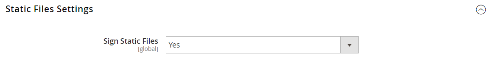

# デベロッパーツール

高度な開発者ツールを使用して、フロントエンド開発時のコンパイルモードの決定、IP アドレスの許可リストの作成、テンプレートパスヒントの表示を行います。 また、ストアフロントと管理者のインターフェイスで、テキストを簡単にスポット変更するためのツールもあります。

- [ アクションログ ](action-log.md)  （Adobe Commerceのみ）
- [フロントエンド開発ワークフロー](#frontend-development-workflow)
- [静的ファイル署名の使用](#static-file-signatures)
- [リソースファイルの最適化](#optimizing-resource-files)
- [開発者クライアントの制限](#client-restrictions)
- [テンプレートパスのヒント](#template-path-hints)
- [インライン翻訳](#translate-inline)

## 操作モード

Adobe CommerceまたはMagento Open Sourceインスタンスは、_実稼働モード_ または _開発者モード_ のいずれかで実行するようにデプロイできます。 開発者向けに特別に設計されたツールと設定は、ストアが _開発者モード_ で動作している場合にのみアクセスできます。

操作モードは、適切な権限を持つユーザーがサーバーのコマンドラインからのみ変更できます。 詳しくは、『 _設定ガイド_ の [ 操作モードの設定 ](https://experienceleague.adobe.com/docs/commerce-operations/configuration-guide/cli/set-mode.html) を参照してください。

マーチャントドキュメントのほとんどのトピックは、実稼動モードで実行されているCommerce インスタンスに適用されます。 ただし、次の設定とツールは、インストールが開発者モードで実行されている場合にのみ使用できます。

## フロントエンド開発ワークフロー

フロントエンド開発ワークフローのタイプは、開発中にクライアントサイドまたはサーバーサイドで少ないコンパイルが行われるかどうかを決定します。 Less は、追加の機能と規則を持ち、合理化されたコードを生成する CSS の拡張機能です。 テーマの開発には、クライアントサイドの LESS コンパイルをお勧めします。 サーバーサイドのコンパイルはデフォルトのモードです。 開発ワークフローオプションは、実稼動モードのストアでは使用できません。
Commerce開発者ドキュメントの [ クライアントサイドの LESS コンパイルとサーバーサイドの LESS コンパイルの比較 ](https://developer.adobe.com/commerce/frontend-core/guide/css/quickstart/compilation-mode/){:target=&quot;_blank&quot;} を参照してください。

>[!NOTE]
>
>フロントエンド開発ワークフローの設定は、[ 開発者モード ](../systems/developer-tools.md#operation-modes) でのみ使用できます。

{width="600" zoomable="yes"}

1. _管理者_ サイドバーで、**[!UICONTROL Stores]**/_[!UICONTROL Settings]_/**[!UICONTROL Configuration]**&#x200B;に移動します。

1. 左側のパネルで「**[!UICONTROL Advanced]**」を展開し、「**[!UICONTROL Developer]**」を選択します。

1. 「」を展開し、「**[!UICONTROL Front-end Development Workflow]**」セクションを展開します。

1. **[!UICONTROL Workflow Type]** を次のいずれかに設定します。

   - `Client side less compilation` - コンパイルは、ネイティブ `less.js` ライブラリを使用したブラウザーで行われます。
   - `Server side less compilation` - Less PHP ライブラリを使用して、サーバー上でコンパイルが行われます。 これは、実稼動用のデフォルトのモードです。

1. 完了したら、「**[!UICONTROL Save Config]**」をクリックします。

## 静的ファイル署名

静的ファイルの URL にデジタル署名を追加すると、ブラウザーはファイルの新しいバージョンが使用可能かどうかを検出できます。 デジタル署名で追跡できる静的ファイルには、JavaScript、CSS、画像、フォントなどがあります。 署名は、ベース URL の直後のパスに追加されます。 ファイルの署名がブラウザーのキャッシュに格納されている署名と異なる場合は、ファイルの新しいバージョンが使用されます。

Commerce開発者ドキュメントの [ 静的コンテンツ署名 ](https://experienceleague.adobe.com/docs/commerce-operations/configuration-guide/cache/static-content-signing.html){:target=&quot;_blank&quot;} を参照してください。

>[!NOTE]
>
>静的ファイル設定の設定は、[ 開発者モード ](../systems/developer-tools.md#operation-modes) で作業している場合にのみ使用できます。

{width="600" zoomable="yes"}

構成設定の詳細なリストについては、『構成リファレンス _の[_ 静的ファイル設定 _](../configuration-reference/advanced/developer.md)を参照してください_。

**_署名済み静的ファイルを有効にするには：_**

1. _管理者_ サイドバーで、**[!UICONTROL Stores]**/_[!UICONTROL Settings]_/**[!UICONTROL Configuration]**&#x200B;に移動します。

1. 左側のパネルで「**[!UICONTROL Advanced]**」を展開し、「**[!UICONTROL Developer]**」を選択します。

1. 「」を展開し、「**[!UICONTROL Static Files Settings]**」セクションを展開します。

1. **[!UICONTROL Sign Static Files]** を `Yes` に設定します。

1. 完了したら、「**[!UICONTROL Save Config]**」をクリックします。

## リソースファイルの最適化

リソースファイルの読み込みに要する時間は、ファイルを結合およびバンドルし、コードを最小限に抑えることで短縮できます。

- 結合すると、同じ種類の別々のファイルが 1 つのファイルに結合されます。
- バンドルは、ページの読み込みに必要な HTTP リクエスト数を減らすために、別々のファイルをグループ化する技術です。
- 縮小によってスペース、改行、コメントは削除されますが、コードの機能には影響しません。 最小化されたファイルは編集できないので、プロセスは、実稼動に移行する準備が整った場合にのみ適用してください。

デフォルトでは、Adobe CommerceとMagento Open Sourceはファイルの結合、バンドル、最小化を行わないので、プロジェクト開発者はどのファイル最適化方法を使用するかを決定する必要があります。

詳しくは、[ パフォーマンスのベストプラクティス ](https://experienceleague.adobe.com/docs/commerce-operations/performance-best-practices/overview.html) を参照してください。

>[!NOTE]
>
>CSS ファイルとJavaScript ファイルは、[ 開発者モード ](../systems/developer-tools.md#operation-modes) でのみ最適化できます。

| ファイルタイプ | サポートされる操作 |
| --------------- | -------------------- |
| CSS ファイル | `MergeMinify` |
| JavaScript ファイル | `MergeBundleMinify` |
| テンプレートファイル | `Minify` |

{style="table-layout:auto"}

**_リソースファイルを最適化するには：_**

1. _管理者_ サイドバーで、**[!UICONTROL Stores]**/_[!UICONTROL Settings]_/**[!UICONTROL Configuration]**&#x200B;に移動します。

1. 左側のパネルで「**[!UICONTROL Advanced]**」を展開し、「**[!UICONTROL Developer]**」を選択します。

1. CSS ファイルを最適化するには、「**[!UICONTROL CSS Settings]**」セクションの  を展開し、次の手順を実行します。

   - **[!UICONTROL Merge CSS Files]** を `Yes` に設定します。
   - **[!UICONTROL Minify CSS Files]** を `Yes` に設定します。

   {width="600" zoomable="yes"}

[_CSS 設定_](../configuration-reference/advanced/developer.md)

1. JavaScript ファイルを最適化するには、「**[!UICONTROL JavaScript Settings]**」セクションの  を展開し、次の手順を実行します。

   - **[!UICONTROL Merge JavaScript Files]** を `Yes` に設定します。
   - **[!UICONTROL Minify JavaScript Files]** を `Yes` に設定します。

   {width="600" zoomable="yes"}

1. PHTML テンプレートファイルを縮小するには、 「**[!UICONTROL Template Settings]**」セクションを展開し、**[!UICONTROL Minify Html]** を `Yes` に設定します。

   {width="600" zoomable="yes"}

1. 完了したら、「**[!UICONTROL Save Config]**」をクリックします。

## クライアントの制限

許可リストに加える [template path hints](#template-path-hints) などのツールを使用する前に、IP アドレスを Developer Client Restrictions に追加して、ストア内のお客様のショッピングエクスペリエンスが中断されないようにします。 IP アドレスがわからない場合は、オンラインで検索できます。

>[!NOTE]
>
>開発者クライアント制限は、[ 開発者モード ](../systems/developer-tools.md#operation-modes) でのみ設定できます。

Commerce技術情報については、_Cloud Infrastructure ガイドの [ リクエストを許可するためのカスタム VCL](https://experienceleague.adobe.com/docs/commerce-cloud-service/user-guide/cdn/custom-vcl-snippets/fastly-vcl-allowlist.html) を参照してください_。

**_IP アドレスを許可リストに追加するには_**

1. _管理者_ サイドバーで、**[!UICONTROL Stores]**/_[!UICONTROL Settings]_/**[!UICONTROL Configuration]**&#x200B;に移動します。

1. 左側のパネルで「**[!UICONTROL Advanced]**」を展開し、「**[!UICONTROL Developer]**」を選択します。

1. 「」を展開し、「**[!UICONTROL Developer Client Restrictions]**」セクションを展開します。

   {width="600" zoomable="yes"}

1. **[!UICONTROL Allow IPs]**:IP アドレスを入力します。

   複数の IP アドレスからアクセスする必要がある場合は、各アドレスをコンマで区切ります。

1. 完了したら、「**[!UICONTROL Save Config]**」をクリックします。

1. プロンプトが表示されたら、無効なキャッシュを更新します。

## テンプレートパスのヒント

テンプレートパスヒントは、ページで使用される各テンプレートへのパスを含む表記を追加する診断ツールです。 テンプレートパスのヒントは、ストアフロントまたは管理者に対して有効にできます。

>[!NOTE]
>
>テンプレートパスヒントは、[ 開発者モード ](../systems/developer-tools.md#operation-modes) でのみ編集できます。

Commerce開発者向けドキュメントの [ テンプレート、レイアウト、スタイルの検索 ](https://developer.adobe.com/commerce/frontend-core/guide/themes/debug/){:target=&quot;_blank&quot;} を参照してください。

{width="700" zoomable="yes"}

### 許可リストに加える手順 1：に IP アドレスを追加する

許可リストに加える テンプレートパスヒントを使用する前に、IP アドレスを [&#128279;](#client-restrictions) に追加して、ストアで買い物をしている顧客への干渉を避けます。 完了したら、必ずCommerceのキャッシュをクリアして、ストアからすべてのヒントを削除します。

{width="600" zoomable="yes"}

### 手順 2：テンプレートパスヒントを有効にする

1. _管理者_ サイドバーで、**[!UICONTROL Stores]**/_[!UICONTROL Settings]_/**[!UICONTROL Configuration]**&#x200B;に移動します。

1. 左側のパネルで「**[!UICONTROL Advanced]**」を展開し、「**[!UICONTROL Developer]**」を選択します。

1. **[!UICONTROL Debug]** のセクションの  を展開し、以下を実行します。

   {width="600" zoomable="yes"}

   - ストアに対してテンプレートパスヒントをアクティブにするには、**[!UICONTROL Enabled Template Path Hints for Storefront]** を `Yes` に設定します。

   - URL に `templatehints` パラメーターが含まれている場合にのみストアに対してテンプレート パス ヒントを有効にするには、**URL パラメーターを含むストアフロントのヒントを有効にする** を `Yes` に設定します。 必要に応じて、パラメーターの値を設定します。 デフォルト値は `magento` ですが、カスタム値を使用できます。 例えば、値を `lorem` に変更した場合、`mymagento.com?templatehints=lorem` を使用してテンプレートのヒントを表示します。

   - 管理者用のテンプレートパスヒントをアクティブにするには、**[!UICONTROL Enabled Template Path Hints for Admin]** を `Yes` に設定します。

   - ブロック名を含めるには、**[!UICONTROL Add Block Class Type to Hints]** を `Yes` に設定します。

1. 完了したら、「**[!UICONTROL Save Config]**」をクリックします。

### 手順 3：キャッシュのクリア

1. _管理者_ サイドバーで、**[!UICONTROL System]**/_[!UICONTROL Tools]_/**[!UICONTROL Cache Management]**&#x200B;に移動します。

1. 右上隅の「**[!UICONTROL Flush Magento Cache]**」をクリックします。

## インラインで翻訳

[ 開発者モード ](../systems/developer-tools.md#operation-modes) のインライン翻訳ツールを使用して、インターフェイスのテキストにタッチして、音声とブランドを反映させることができます。 インライン翻訳モードをアクティブにすると、ページ上の編集可能なテキストがすべて赤で描画されます。 フィールドラベル、メッセージなど、ストアフロントおよび管理者全体に表示されるテキストを簡単に編集できます。 例えば、多くのテーマでは、顧客がスムーズに作業できるように、_マイアカウント_、_マイウィッシュリスト_、_マイダッシュボード_ などの用語を使用しています。 ただし、単に _Account_、_Wishlist_、および _Dashboard_ という単語を使用することをお勧めします。

>[!NOTE]
>
>インライン翻訳ツールは、[ 開発者モード ](../systems/developer-tools.md#operation-modes) で作業している場合にのみ使用できます。

Commerce開発者向けドキュメントの [ 翻訳の概要 ](https://developer.adobe.com/commerce/frontend-core/guide/translations/) を参照してください。

{width="700" zoomable="yes"}

ストアが複数の言語で使用できる場合は、ロケールの翻訳済みテキストを微調整できます。 サーバー上では、インターフェイステキストは、出力ブロックごとに個別の CSV ファイルに保持され、ロケール別に整理されます。 別の方法として、_インライン翻訳_ ツールを使用する代わりに、CSV ファイルをサーバー上で直接編集することもできます。 翻訳ファイルは `app/code/Magento/<module_name>/i18n/<language_locale>.csv` に保存されます。

>[!NOTE]
>
>インライン翻訳ツールを使用するには、ブラウザーでポップアップを許可する必要があります。

### 手順 1：出力キャッシュを無効にする

1. _管理者_ サイドバーで、**[!UICONTROL System]**/_[!UICONTROL Tools]_/**[!UICONTROL Cache Management]**&#x200B;に移動します。

1. 次のチェックボックスをオンにします。

   - `Blocks HTML output`
   - `Page Cache`
   - `Translations`

1. **[!UICONTROL Actions]** コントロールを `Disable` に設定し、**[!UICONTROL Submit]** をクリックします。

### 手順 2：インライン翻訳ツールを有効にする

1. _管理者_ サイドバーで、**[!UICONTROL Stores]**/_[!UICONTROL Settings]_/**[!UICONTROL Configuration]**&#x200B;に移動します。

1. 特定のストア表示を操作するには、更新する **[!UICONTROL Store View]** を設定します。

1. 左側のパネルで「**[!UICONTROL Advanced]**」を展開し、「**[!UICONTROL Developer]**」を選択します。

1. 「」を展開し、「**[!UICONTROL Translate Inline]**」セクションを展開します。

   必要に応じて「**[!UICONTROL Use Website]**」チェックボックスをオフにして、これらの設定を変更します。

   特定のストア表示を編集する場合、_[!UICONTROL Enabled for Admin]_&#x200B;オプションは使用できません。

   {width="600" zoomable="yes"}

1. **[!UICONTROL Enabled for Storefront]** を `Yes` に設定します。

1. 完了したら、「**[!UICONTROL Save Config]**」をクリックします。

1. プロンプトが表示されたら、無効なキャッシュを更新しますが、無効なキャッシュは今のところそのままにしておきます。

### 手順 3：テキストを更新

1. ブラウザーでストアフロントを開き、編集するページに移動します。

   必要に応じて、言語選択を使用してストア表示を変更します。 翻訳可能なテキストの各文字列は、赤で囲まれます。 任意のテキストボックスにポインタを合わせると、ブックアイコン（）が表示されます。

1. ブックアイコンをクリックして _翻訳_ ウィンドウを開き、次の操作を行います。

   - 特定のストア表示に対する変更の場合は、「**[!UICONTROL Store View Specific]**」チェックボックスを選択します。

   - 新しい **[!UICONTROL Custom]** テキストを入力します。

1. 完了したら、「**[!UICONTROL Submit]**」をクリックします。

   {width="700" zoomable="yes"}

1. ストアで変更を確認するには、ブラウザーを更新します。

1. ストア内の変更する要素すべてについて、この手順を繰り返します。

### 手順 4：元の設定を復元する

1. ストアの管理者に戻ります。

1. _管理者_ サイドバーで、**[!UICONTROL Stores]**/_[!UICONTROL Settings]_/**[!UICONTROL Configuration]**&#x200B;に移動します。

1. 編集した特定のビューに **[!UICONTROL Store View]** を設定します。

1. 左側のパネルで「**[!UICONTROL Advanced]**」を展開し、「**[!UICONTROL Developer]**」を選択します。

1. 「」を展開し、「**[!UICONTROL Translate Inline]**」セクションを展開します。

1. **[!UICONTROL Enabled for Frontend]** を `No` に設定します。

1. 完了したら、「**[!UICONTROL Save Config]**」をクリックします。

1. _管理者_ サイドバーで、**[!UICONTROL System]**/_[!UICONTROL Tools]_/**[!UICONTROL Cache Management]**&#x200B;に移動します。

1. 以前に無効にした次の出力キャッシュのチェックボックスを選択します。

   - `Blocks HTML output`
   - `Page Cache`
   - `Translations`

1. **[!UICONTROL Actions]** コントロールを `Enable` に設定し、**[!UICONTROL Submit]** をクリックします。

1. プロンプトが表示されたら、無効なキャッシュを更新します。

### 手順 5：ストアでの変更の検証

ストアフロントに移動し、更新された各ページを調べて、変更が正しいことを確認します。 この例では、`Customer Login` が `Customer Sign In` に変更されました。 特定のビューを変更した場合は、言語選択を使用して正しいビューに切り替えます。

{width="700" zoomable="yes"}
