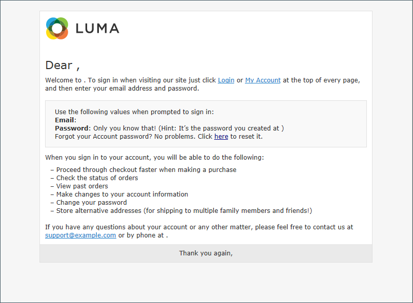
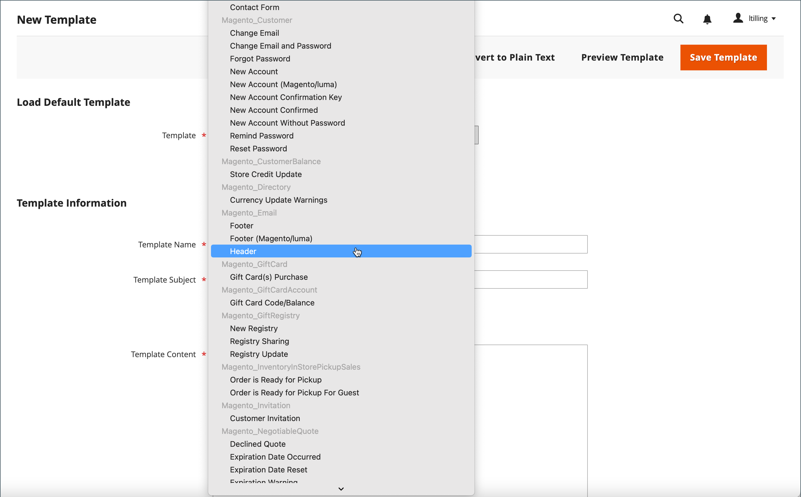
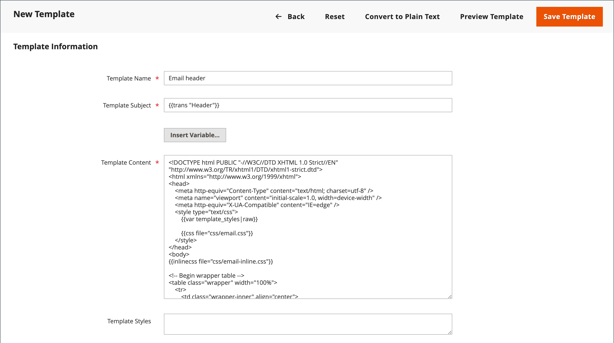
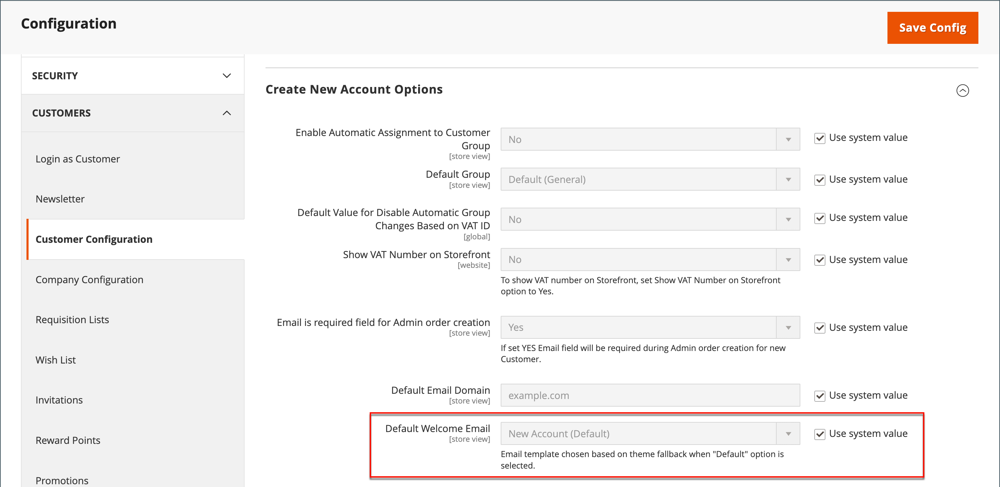

# メールテンプレートのカスタマイズ

Commerceには、システムから送信される各メッセージの本文セクション用のデフォルトのメールテンプレートが含まれています。 本文コンテンツのテンプレートは、ヘッダーテンプレートおよびフッターテンプレートと組み合わせて、完全なメッセージを作成します。 コンテンツはHTMLと CSS を使用して書式設定され、[variables](variables-predefined.md) と [widgets](../content-design/widgets.md) を追加して簡単に編集およびカスタマイズできます。 メールテンプレートは、web サイト、ストアまたはストア表示ごとにカスタマイズできます。 カスタムテンプレートを使用する場合、必ず [ システム設定 ](email-templates.md#configure-email-templates) を更新して、正しいテンプレートが使用されていることを確認します。

{width="500" zoomable="yes"}

デフォルトのテンプレートにはロゴやストア情報が含まれており、これ以上カスタマイズしなくても使用できます。 ただし、ベストプラクティスとして、各テンプレートを表示し、顧客に送信する前に必要な変更を加える必要があります。

- [ヘッダーテンプレート](email-template-custom.md#header-template)
- [フッターテンプレート](email-template-custom.md#footer-template)
- [メッセージテンプレート](email-template-custom.md#message-templates)

{width="700" zoomable="yes"}

## テンプレート情報

| フィールド | 説明 |
| ----- | ----------- |
| [!UICONTROL Template Name] | カスタムテンプレートの名前。 |
| [!UICONTROL Insert Variable] | テンプレートのカーソル位置に変数を挿入します。 |
| [!UICONTROL Template Subject] | テンプレートの件名は、「件名」列に表示され、リスト内のテンプレートの並べ替えやフィルタリングに使用できます。 |
| [!UICONTROL Template Content] | HTML内のテンプレートのコンテンツ。 |
| [!UICONTROL Template Styles] | テンプレートの書式設定に必要な CSS スタイル宣言は、_[!UICONTROL Template Styles]_のボックスに入力できます。 |

{style="table-layout:auto"}

## ヘッダーテンプレート

[ 設定 ](email-templates.md#configure-email-templates) を完了すると、メールヘッダーテンプレートには、ストアにリンクされたロゴが含まれます。 HTMLに関する基本的な知識がある場合は、[ 事前定義済みの変数 ](variables-predefined.md) を簡単に使用して、店舗の連絡先情報をヘッダーに追加できます。

### 手順 1. デフォルトテンプレートの読み込み

1. _管理者_ サイドバーで、**[!UICONTROL Marketing]**/_[!UICONTROL Communications]_/**[!UICONTROL Email Templates]**に移動します。

1. 「**[!UICONTROL Add New Template]**」をクリックします。

1. 「**[!UICONTROL Load default template]**」セクションで、「**[!UICONTROL Template]**」セレクターをクリックし、「`Magento_Email`」 > 「`Header`」を選択します。

   {width="600" zoomable="yes"}

1. 「**[!UICONTROL Load Template]**」をクリックします。

   テンプレートのHTMLコードと変数がフォームに表示されます。

### 手順 2. テンプレートのカスタマイズ

1. カスタムヘッダーの **[!UICONTROL Template Name]** を入力します。

1. テンプレートの整理に役立つ **[!UICONTROL Template Subject]** を入力します。

   グリッドでは、テンプレートのリストを並べ替えたり、_[!UICONTROL Subject]_列でフィルタリングしたりできます。

   {width="600" zoomable="yes"}

1. **[!UICONTROL Template Content]** のボックスで、必要に応じてHTMLを変更します。

   >[!NOTE]
   >
   >テンプレートコードを使用する場合は、二重中括弧で囲まれているものを上書きしないように注意してください。

1. [ 変数 ](variables-reference.md) を挿入するには、コード内の変数を配置する位置にカーソルを置き、**[!UICONTROL Insert Variable]** をクリックします。

1. 挿入する変数を選択します。

   {width="600" zoomable="yes"}

   変数を選択すると、その変数の [ マークアップタグ ](markup-tags.md) がコード内に挿入されます。

   ストアメールアドレス変数は、ヘッダーに最も多く含まれる変数ですが、任意のシステム変数または [ カスタム変数 ](variables-custom.md) のコードをテンプレートに直接入力できます。

1. CSS の宣言を行う必要がある場合は、「**[!UICONTROL Template Styles]**」ボックスにスタイルを入力します。

1. 作業内容を確認する準備ができたら、[**[!UICONTROL Preview Template]**] をクリックします。

   必要な変更をテンプレートに加えます。

1. 完了したら、「**[!UICONTROL Save Template]**」をクリックします。

   カスタムヘッダーが、使用可能なメールテンプレートのリストに表示されます。

### 手順 3. 設定の更新

1. _管理者_ サイドバーで、**[!UICONTROL Content]**/_[!UICONTROL Design]_/**[!UICONTROL Configuration]**に移動します。

1. グリッドで、設定するストア表示を見つけ、_[!UICONTROL Action]_列の&#x200B;**[!UICONTROL Edit]**をクリックします。

1. 下にスクロールして、「**[!UICONTROL Transactional Emails]**」セクションの  を展開します。

1. メール通知のデフォルトとして使用する **[!UICONTROL Header Template]** を選択します。

1. 完了したら、「**[!UICONTROL Save Config]**」をクリックします。

{width="600" zoomable="yes"}

## フッターテンプレート

メールテンプレートのフッターには、メールメッセージの終了ラインと署名ラインが含まれます。 スタイルに合わせてクロージングを変更し、会社名や住所などの追加情報を名前の下に追加できます。

### 手順 1. デフォルトテンプレートの読み込み

1. _管理者_ サイドバーで、**[!UICONTROL Marketing]**/_[!UICONTROL Communications]_/**[!UICONTROL Email Templates]**に移動します。

1. 「**[!UICONTROL Add New Template]**」をクリックします。

1. 「**[!UICONTROL Load default template]**」セクションで、「**[!UICONTROL Template]**」セレクターをクリックし、「`Magento_Email`」 > 「`Footer`」を選択します。

1. 「**[!UICONTROL Load Template]**」をクリックします。

   テンプレートのHTMLコードと変数がフォームに表示されます。

### 手順 2. テンプレートのカスタマイズとプレビュー

1. カスタムフッターの **[!UICONTROL Template Name]** を入力します。

1. テンプレートの整理に役立つ **[!UICONTROL Template Subject]** を入力します。

   グリッドでは、テンプレートを並べ替えたり、_[!UICONTROL Subject]_列でフィルタリングしたりできます。

   {width="600" zoomable="yes"}

1. **[!UICONTROL Template Content]** のボックスで、必要に応じてHTMLを変更します。

   >[!NOTE]
   >
   >テンプレートコードを使用する場合は、二重中括弧で囲まれているものを上書きしないように注意してください。

1. [ 変数 ](variables-reference.md) を挿入するには、コード内の変数を配置する位置にカーソルを置き、**[!UICONTROL Insert Variable]** をクリックします。

1. 挿入する変数を選択します。

   変数を選択すると、その変数の [ マークアップタグ ](markup-tags.md) がコード内に挿入されます。

   ストアの連絡先変数は、フッターに最も多く含まれる変数ですが、任意のシステム変数または [ カスタム変数 ](variables-custom.md) のコードをテンプレートに直接入力できます。

1. CSS の宣言を行う必要がある場合は、「**[!UICONTROL Template Styles]**」ボックスにスタイルを入力します。

### 手順 3. 設定の更新

1. _管理者_ サイドバーで、**[!UICONTROL Content]**/_[!UICONTROL Design]_/**[!UICONTROL Configuration]**に移動します。

1. グリッドで、設定するストア表示を見つけ、_[!UICONTROL Action]_列の&#x200B;**[!UICONTROL Edit]**をクリックします。

1. 下にスクロールして、「**[!UICONTROL Transactional Emails]**」セクションの  を展開します。

1. メール通知でデフォルトのフッターとして使用する **[!UICONTROL Footer Template]** を選択します。

1. 完了したら、「**[!UICONTROL Save Config]**」をクリックします。

{width="600" zoomable="yes"}

## メッセージテンプレート

各メッセージの本文のカスタマイズ手順は、ヘッダーやフッターのカスタマイズ手順と同じです。 唯一の違いは、通知をトリガーするアクティビティまたはイベントごとのメッセージテンプレートです。 テンプレートをそのまま使用することも、声やブランドに合わせてカスタマイズすることもできます。 テンプレートテキストに加えて、テンプレートに作成して組み込むことができる [ 事前定義済み ](variables-predefined.md) 変数と [ カスタム ](variables-custom.md) 変数が幅広く用意されています。

### 手順 1. デフォルトテンプレートの読み込み

1. _管理者_ サイドバーで、**[!UICONTROL Marketing]**/_[!UICONTROL Communications]_/**[!UICONTROL Email Templates]**に移動します。

1. 「**[!UICONTROL Add New Template]**」をクリックします。

   {width="600" zoomable="yes"}

1. 次の手順を実行します。

   - [**[!UICONTROL Load default template]**] で、カスタマイズする **[!UICONTROL Template]** を選択します。

   - 「**[!UICONTROL Load Template]**」をクリックします。

### 手順 2. テンプレートのカスタマイズ

1. **[!UICONTROL Template Name]**：カスタムテンプレートの名前を入力します。

1. 必要に応じて、**[!UICONTROL Template Subject]** を変更します。

   これはメッセージの最初の行で、デフォルトではあいさつ文になっています。 このままにすることも、より説明的な情報を入力することもできます。

1. テンプレートへの **[!UICONTROL Currently Used For]** パスをメモします。これは、設定の更新に使用されるパスです。

   {width="600" zoomable="yes"}

1. **[!UICONTROL Template Content]** のボックスで、必要に応じてHTMLを変更します。

   コンテンツは、HTMLタグ、CSS ディレクティブ、変数、テキストの組み合わせで構成されます。

   >[!NOTE]
   >
   >テンプレートコードを操作する場合は、二重中括弧で囲まれたコードを誤って入力しないように注意してください。

1. 変数を挿入するには、コード内の変数を表示する位置にカーソルを置きます。

   変数の選択はテンプレートによって異なり、許可された [ 事前定義済み ](variables-predefined.md) 変数や [ カスタム ](variables-custom.md) 変数が含まれます（使用可能な場合）。

1. 「**[!UICONTROL Insert Variable]**」をクリックし、挿入する変数を選択します。

   変数を挿入するコマンドは、中括弧で囲まれ、カーソル位置のコードに追加されます。 例：

   `customVar code=my_custom_variable`

1. CSS を宣言するには、**[!UICONTROL Template Styles]** にスタイルを入力します。

   {width="600" zoomable="yes"}

   >[!NOTE]
   >
   >カスタムスタイルは、_[!UICONTROL Template Styles]_に `{{template config_path="design/email/header_template"}}` が存在する場合にのみ、メールに適用されます。 デフォルトのヘッダーテンプレートを使用せずにカスタム CSS を使用するには、`<style>` のHTMLタグ内でカスタム CSS を指定する必要があります。

### 手順 3. 設定の更新

_[!UICONTROL Currently Used For]_のパンくずリストに、テンプレートの使用場所が表示されます。 この例では、テンプレートの設定は_[!UICONTROL Customer Configuration]_ ページ上の「_[!UICONTROL Create New Account Options]_」セクションと「_[!UICONTROL Default Welcome Email]_」フィールドにあります。

- ページ - [!UICONTROL Customer Configuration]
- セクション - [!UICONTROL Create New Account Options]
- フィールド - [!UICONTROL Default Welcome Email]

1. **[!UICONTROL Currently Used For]** のパンくずリストでリンクをクリックして、テンプレート設定ページを開きます。

   {width="600" zoomable="yes"}

1. 「」セクションを展開し、カスタマイズしたメールテンプレートのフィールドを見つけます。

1. 「**[!UICONTROL Use system value]**」チェックボックスをオフにして、カスタムテンプレートの名前をクリックします。

   {width="600" zoomable="yes"}

1. 完了したら、「**[!UICONTROL Save Config]**」をクリックします。

1. ワークスペースの上部にあるメッセージで、「**[!UICONTROL Cache Management]**」をクリックし、無効なキャッシュがあればクリアします。

### 手順 4. テンプレートのプレビューと保存

1. 作業内容を確認する準備ができたら、[**[!UICONTROL Preview Template]**] をクリックします。

1. 必要に応じてテンプレートを更新します。

1. 完了したら、「**[!UICONTROL Save Template]**」をクリックします。

   これで、カスタムテンプレートをメールテンプレートのリストで使用できるようになります。
