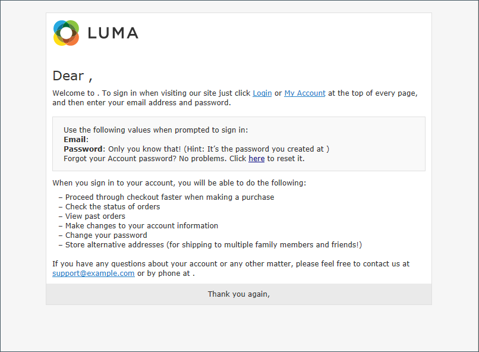
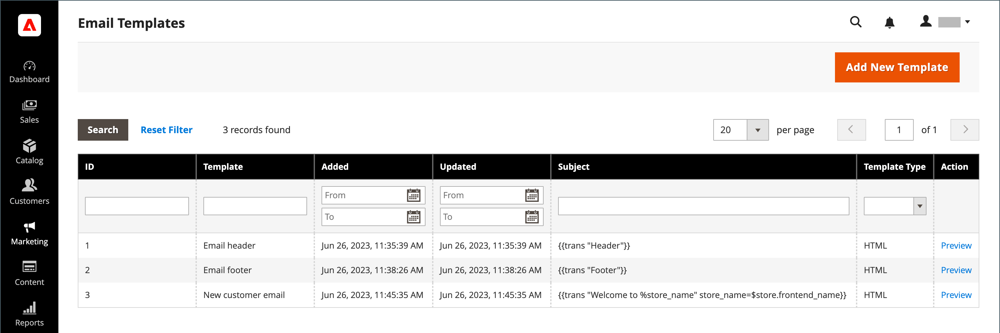
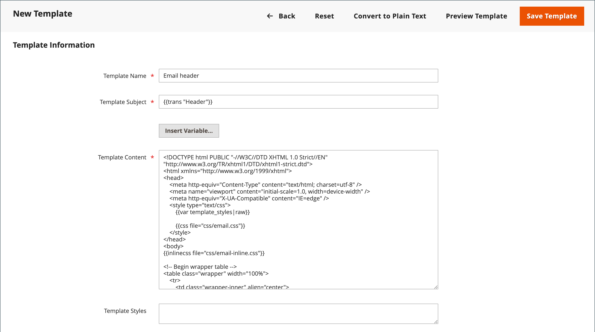
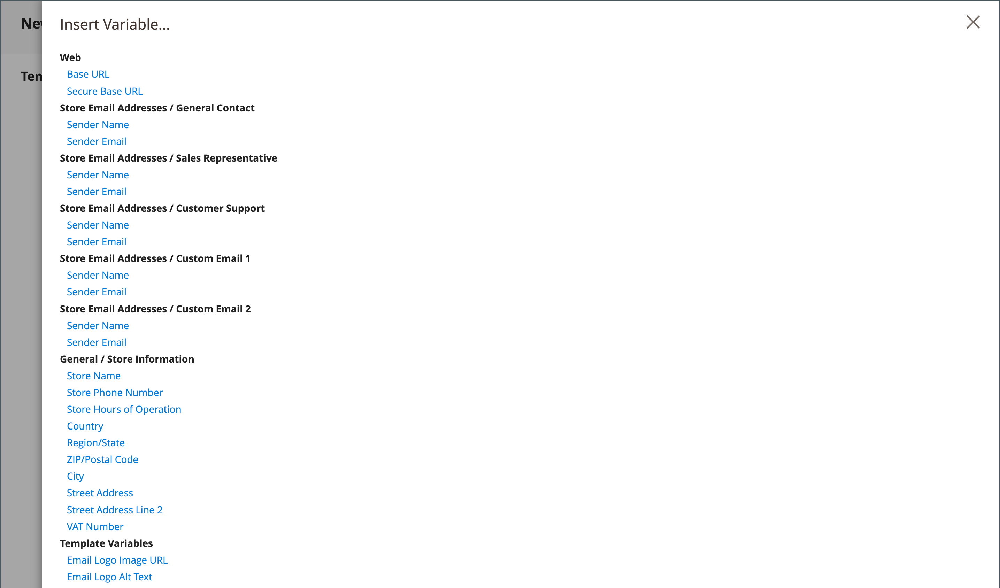
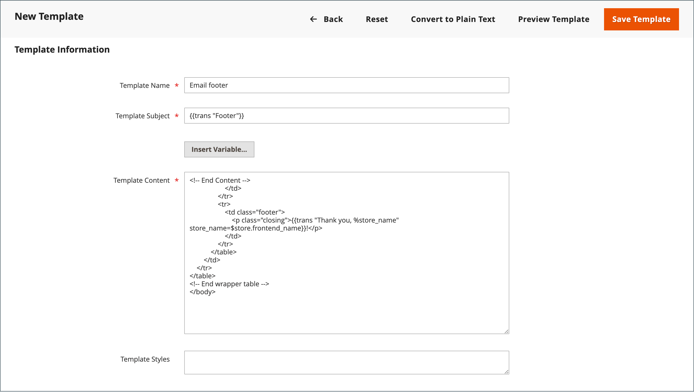
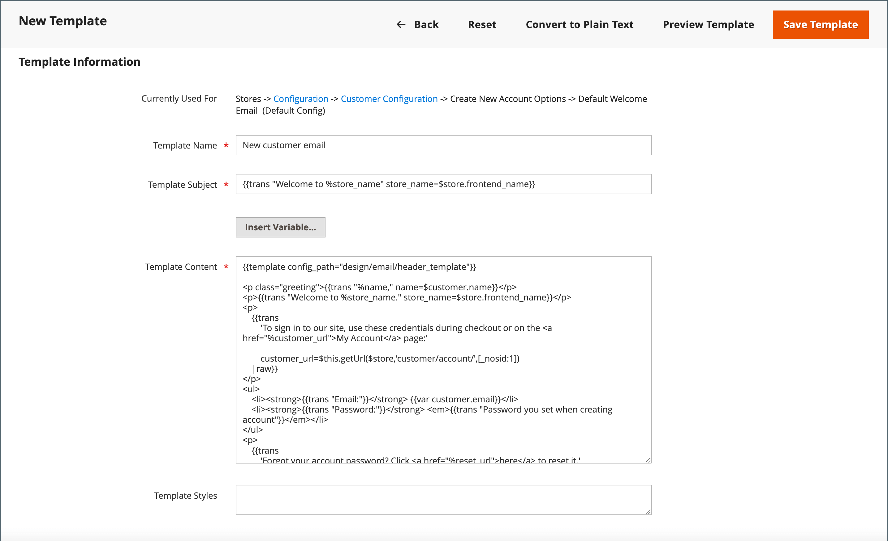
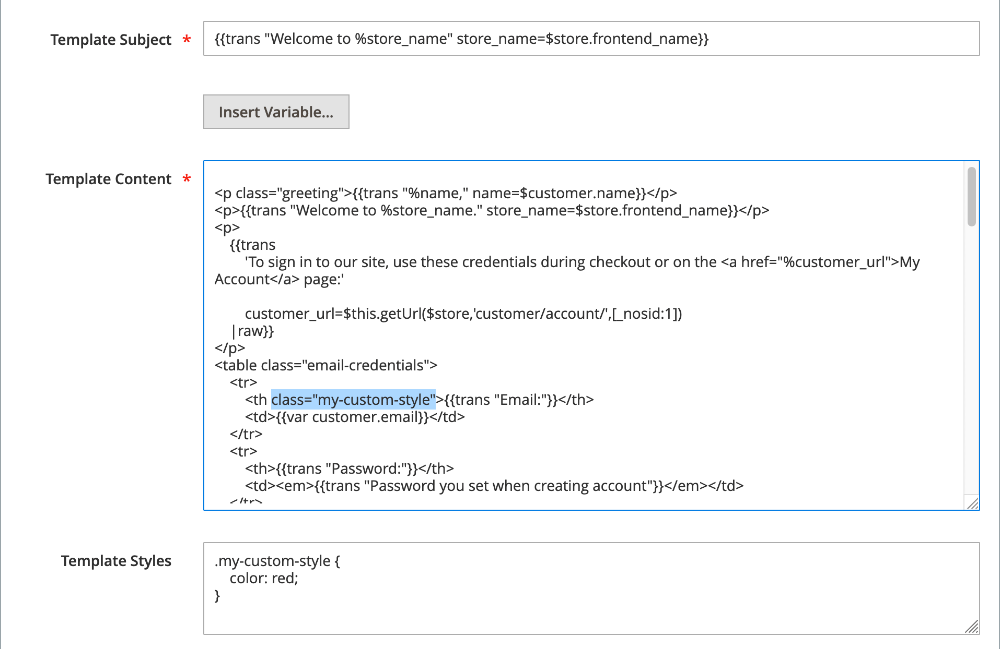
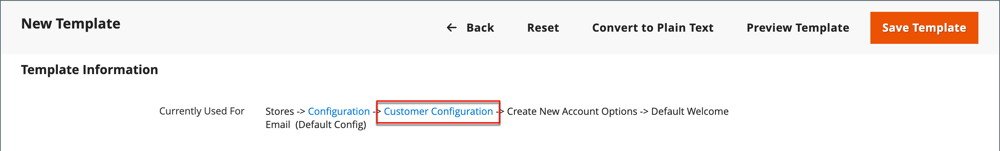

# メールテンプレートのカスタマイズ

Commerceには、システムによって送信される各メッセージの本文セクションのデフォルトのメールテンプレートが含まれています。 本文コンテンツのテンプレートとヘッダーおよびフッターのテンプレートを組み合わせて、メッセージ全体を作成します。 コンテンツはHTMLとCSSでフォーマットされ、[変数](variables-predefined.md)を追加して簡単に編集およびカスタマイズできます。 メールテンプレートは、web サイト、実店舗、実店舗の顧客像ごとにカスタマイズできます。 カスタムテンプレートを使用する場合は、必ず[&#x200B; システム設定](email-templates.md#configure-email-templates)を更新して、正しいテンプレートが使用されるようにしてください。 電子メールテンプレートをカスタマイズする際に条件文を使用する方法については、[開発者ドキュメント &#x200B;](https://developer.adobe.com/commerce/frontend-core/guide/templates/email/#theme-based-customizations-1)を参照してください。

{width="500" zoomable="yes"}

デフォルトのテンプレートにはロゴとストア情報が含まれており、それ以上カスタマイズしなくても使用できます。 ただし、ベストプラクティスとして、各テンプレートを表示し、必要な変更を加えてから顧客に送信する必要があります。

- [ヘッダーテンプレート](email-template-custom.md#header-template)
- [フッターテンプレート](email-template-custom.md#footer-template)
- [メッセージテンプレート](email-template-custom.md#message-templates)

{width="700" zoomable="yes"}

## テンプレート情報

| フィールド | 説明 |
| ----- | ----------- |
| [!UICONTROL Template Name] | カスタムテンプレートの名前。 |
| [!UICONTROL Insert Variable] | カーソル位置でテンプレートに変数を挿入します。 |
| [!UICONTROL Template Subject] | テンプレートの件名は「件名」列に表示され、リスト内のテンプレートの並べ替えやフィルタリングに使用できます。 |
| [!UICONTROL Template Content] | HTMLのテンプレートの内容。 |
| [!UICONTROL Template Styles] | テンプレートの書式設定に必要なCSS スタイル宣言は、_[!UICONTROL Template Styles]_&#x200B;ボックスに入力できます。 |

{style="table-layout:auto"}

## ヘッダーテンプレート

[設定](email-templates.md#configure-email-templates)を完了すると、メールヘッダーテンプレートにストアにリンクされたロゴが含まれます。 HTMLに関する基本的な知識があれば、[定義済みの変数](variables-predefined.md)を使用して、ストアの連絡先情報を簡単にヘッダーに追加できます。

### 手順1: デフォルトテンプレートの読み込み

1. _管理者_ サイドバーで、**[!UICONTROL Marketing]** > _[!UICONTROL Communications]_>**[!UICONTROL Email Templates]**&#x200B;に移動します。

1. **[!UICONTROL Add New Template]**&#x200B;をクリックします。

1. **[!UICONTROL Load default template]** セクションで、**[!UICONTROL Template]** セレクターをクリックし、`Magento_Email` > `Header`を選択します。

   {width="600" zoomable="yes"}

1. **[!UICONTROL Load Template]**&#x200B;をクリックします。

   テンプレートのHTML コードと変数がフォームに表示されます。

### 手順2: テンプレートのカスタマイズ

1. カスタムヘッダーの&#x200B;**[!UICONTROL Template Name]**&#x200B;を入力します。

1. テンプレートを整理するために&#x200B;**[!UICONTROL Template Subject]**&#x200B;を入力してください。

   グリッドでは、テンプレートのリストを&#x200B;_[!UICONTROL Subject]_&#x200B;列で並べ替え、フィルタリングできます。

   {width="600" zoomable="yes"}

1. **[!UICONTROL Template Content]** ボックスで、必要に応じてHTMLを変更します。

   >[!NOTE]
   >
   >テンプレートコードで作業する場合は、二重括弧で囲まれたものを上書きしないように注意してください。

1. [変数](variables-reference.md)を挿入するには、変数を配置するコード内にカーソルを置き、**[!UICONTROL Insert Variable]**&#x200B;をクリックします。

1. 挿入する変数を選択します。

   {width="600" zoomable="yes"}

   変数を選択すると、その変数の[&#x200B; マークアップタグ &#x200B;](markup-tags.md)がコードに挿入されます。

   Store Email Address変数は、ヘッダーに最もよく含まれる変数ですが、任意のシステムのコードまたは[&#x200B; カスタム変数](variables-custom.md)をテンプレートに直接入力できます。

1. CSSの宣言が必要な場合は、**[!UICONTROL Template Styles]** ボックスにスタイルを入力します。

1. 作業をレビューする準備ができたら、**[!UICONTROL Preview Template]**&#x200B;をクリックします。

   テンプレートに必要な変更を加えます。

1. 完了したら、**[!UICONTROL Save Template]**&#x200B;をクリックします。

   カスタムヘッダーが、使用可能なメールテンプレートのリストに表示されるようになりました。

### 手順3: 設定の更新

1. _管理者_ サイドバーで、**[!UICONTROL Content]** > _[!UICONTROL Design]_>**[!UICONTROL Configuration]**&#x200B;に移動します。

1. グリッドで、設定するストアビューを見つけ、_[!UICONTROL Action]_&#x200B;列の&#x200B;**[!UICONTROL Edit]**&#x200B;をクリックします。

1. 下にスクロールして、**[!UICONTROL Transactional Emails]** セクションのを展開します。

1. メール通知のデフォルトとして使用される&#x200B;**[!UICONTROL Header Template]**&#x200B;を選択します。

1. 完了したら、**[!UICONTROL Save Config]**&#x200B;をクリックします。

{width="600" zoomable="yes"}

## フッターテンプレート

メールテンプレートフッターには、メールメッセージのクロージング行と署名行が含まれます。 スタイルに合わせてクロージングを変更し、会社名や名前の下の住所などの追加情報を追加できます。

### 手順1: デフォルトテンプレートの読み込み

1. _管理者_ サイドバーで、**[!UICONTROL Marketing]** > _[!UICONTROL Communications]_>**[!UICONTROL Email Templates]**&#x200B;に移動します。

1. **[!UICONTROL Add New Template]**&#x200B;をクリックします。

1. **[!UICONTROL Load default template]** セクションで、**[!UICONTROL Template]** セレクターをクリックし、`Magento_Email` > `Footer`を選択します。

1. **[!UICONTROL Load Template]**&#x200B;をクリックします。

   テンプレートのHTML コードと変数がフォームに表示されます。

### 手順2: テンプレートのカスタマイズとプレビュー

1. カスタムフッターの&#x200B;**[!UICONTROL Template Name]**&#x200B;を入力します。

1. テンプレートを整理するために&#x200B;**[!UICONTROL Template Subject]**&#x200B;を入力してください。

   グリッドでは、テンプレートを&#x200B;_[!UICONTROL Subject]_&#x200B;列で並べ替え、フィルタリングできます。

   {width="600" zoomable="yes"}

1. **[!UICONTROL Template Content]** ボックスで、必要に応じてHTMLを変更します。

   >[!NOTE]
   >
   >テンプレートコードで作業する場合は、二重括弧で囲まれたものを上書きしないように注意してください。

1. [変数](variables-reference.md)を挿入するには、変数を配置するコード内にカーソルを置き、**[!UICONTROL Insert Variable]**&#x200B;をクリックします。

1. 挿入する変数を選択します。

   変数を選択すると、その変数の[&#x200B; マークアップタグ &#x200B;](markup-tags.md)がコードに挿入されます。

   Store Contact変数は、フッターに最もよく含まれる変数ですが、任意のシステムのコードまたは[&#x200B; カスタム変数](variables-custom.md)をテンプレートに直接入力できます。

1. CSSの宣言が必要な場合は、**[!UICONTROL Template Styles]** ボックスにスタイルを入力します。

### 手順3: 設定の更新

1. _管理者_ サイドバーで、**[!UICONTROL Content]** > _[!UICONTROL Design]_>**[!UICONTROL Configuration]**&#x200B;に移動します。

1. グリッドで、設定するストアビューを見つけ、_[!UICONTROL Action]_&#x200B;列の&#x200B;**[!UICONTROL Edit]**&#x200B;をクリックします。

1. 下にスクロールして、**[!UICONTROL Transactional Emails]** セクションのを展開します。

1. メール通知のデフォルトのフッターとして使用される&#x200B;**[!UICONTROL Footer Template]**&#x200B;を選択します。

1. 完了したら、**[!UICONTROL Save Config]**&#x200B;をクリックします。

{width="600" zoomable="yes"}

## メッセージテンプレート

各メッセージの本文をカスタマイズするプロセスは、ヘッダーまたはフッターをカスタマイズするプロセスと同じです。 唯一の違いは、通知をトリガーする各アクティビティまたはイベントのメッセージテンプレートです。 テンプレートをそのまま使用することも、声やブランドに合わせてカスタマイズすることもできます。 テンプレートテキストに加えて、テンプレートに作成して組み込むことができる、許可される[定義済み](variables-predefined.md)変数と[&#x200B; カスタム &#x200B;](variables-custom.md)変数の幅広い選択があります。

### 手順1: デフォルトテンプレートの読み込み

1. _管理者_ サイドバーで、**[!UICONTROL Marketing]** > _[!UICONTROL Communications]_>**[!UICONTROL Email Templates]**&#x200B;に移動します。

1. **[!UICONTROL Add New Template]**&#x200B;をクリックします。

   {width="600" zoomable="yes"}

1. 次の操作を行います。

   - **[!UICONTROL Load default template]**&#x200B;で、カスタマイズする&#x200B;**[!UICONTROL Template]**&#x200B;を選択します。

   - **[!UICONTROL Load Template]**&#x200B;をクリックします。

### 手順2: テンプレートのカスタマイズ

1. **[!UICONTROL Template Name]**&#x200B;に、カスタムテンプレートの名前を入力します。

1. 必要に応じて、**[!UICONTROL Template Subject]**&#x200B;を変更します。

   これはメッセージの最初の行で、デフォルトでは挨拶です。 そのままにしておくことも、より説明的なものを入力することもできます。

1. テンプレートへの&#x200B;**[!UICONTROL Currently Used For]** パス（設定の更新に使用するパス）をメモします。

   {width="600" zoomable="yes"}

1. **[!UICONTROL Template Content]** ボックスで、必要に応じてHTMLを変更します。

   コンテンツは、HTML タグ、CSS ディレクティブ、変数およびテキストの組み合わせで構成されます。

   >[!NOTE]
   >
   >テンプレートコードで作業する場合は、誤ってダブルブレースで囲まれたコードを入力しないように注意してください。

1. 変数を挿入するには、変数を表示するコード内にカーソルを置きます。

   変数の選択はテンプレートによって異なり、使用可能な場合は[定義済み](variables-predefined.md)変数と[&#x200B; カスタム &#x200B;](variables-custom.md)変数が含まれます。

1. **[!UICONTROL Insert Variable]**&#x200B;をクリックし、挿入する変数を選択します。

   変数を挿入するコマンドは、中括弧で囲まれ、カーソル位置のコードに追加されます。 例：

   `customVar code=my_custom_variable`

1. CSS宣言を行うには、**[!UICONTROL Template Styles]**&#x200B;にスタイルを入力します。

   {width="600" zoomable="yes"}

   >[!NOTE]
   >
   >カスタムスタイルは、`{{template config_path="design/email/header_template"}}`が&#x200B;_[!UICONTROL Template Styles]_&#x200B;に存在する場合にのみ、メールに適用されます。 デフォルトのヘッダーテンプレートを使用せずにカスタム CSSを使用するには、`<style>` HTML タグ内でそれらを指定する必要があります。

### 手順3: 設定の更新

_[!UICONTROL Currently Used For]_&#x200B;のパンくずリストは、テンプレートが使用される場所を示します。 この例では、テンプレート設定は&#x200B;_[!UICONTROL Customer Configuration]_ ページ、_[!UICONTROL Create New Account Options]_&#x200B;セクション、_[!UICONTROL Default Welcome Email]_ フィールドにあります。

- ページ - [!UICONTROL Customer Configuration]
- セクション - [!UICONTROL Create New Account Options]
- フィールド - [!UICONTROL Default Welcome Email]

1. **[!UICONTROL Currently Used For]** パンくずリストで、リンクをクリックしてテンプレート設定ページを開きます。

   {width="600" zoomable="yes"}

1. セクションのを展開し、カスタマイズした電子メールテンプレートのフィールドを見つけます。

1. 「**[!UICONTROL Use system value]**」チェックボックスをオフにして、カスタムテンプレートの名前をクリックします。

   {width="600" zoomable="yes"}

1. 完了したら、**[!UICONTROL Save Config]**&#x200B;をクリックします。

1. ワークスペースの上部にあるメッセージで、**[!UICONTROL Cache Management]**&#x200B;をクリックし、無効なキャッシュをクリアします。

### 手順4: テンプレートのプレビューと保存

1. 作業をレビューする準備ができたら、**[!UICONTROL Preview Template]**&#x200B;をクリックします。

1. 必要に応じてテンプレートを更新します。

1. 完了したら、**[!UICONTROL Save Template]**&#x200B;をクリックします。

   カスタムテンプレートがメールテンプレートのリストで使用できるようになりました。
