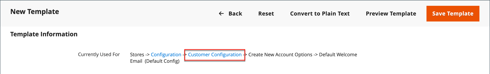

# メールテンプレートのカスタマイズ

Commerceには、システムから送信される各メッセージの本文セクション用のデフォルトのメールテンプレートが含まれています。 本文コンテンツのテンプレートは、ヘッダーテンプレートおよびフッターテンプレートと組み合わせて、完全なメッセージを作成します。 コンテンツはHTMLと CSS で書式設定されており、を使用して簡単に編集およびカスタマイズできます [変数](variables-predefined.md) および [ウィジェット](../content-design/widgets.md). メールテンプレートは、web サイト、ストアまたはストア表示ごとにカスタマイズできます。 カスタムテンプレートを使用している場合は、必ず次を更新します [システム設定](email-templates.md#configure-email-templates) を使用して、正しいテンプレートが使用されていることを確認します。

{width="500" zoomable="yes"}

デフォルトのテンプレートにはロゴやストア情報が含まれており、これ以上カスタマイズしなくても使用できます。 ただし、ベストプラクティスとして、各テンプレートを表示し、顧客に送信する前に必要な変更を加える必要があります。

- [ヘッダーテンプレート](email-template-custom.md#header-template)
- [フッターテンプレート](email-template-custom.md#footer-template)
- [メッセージテンプレート](email-template-custom.md#message-templates)

{width="700" zoomable="yes"}

## テンプレート情報

| フィールド | 説明 |
| ----- | ----------- |
| [!UICONTROL Template Name] | カスタムテンプレートの名前。 |
| [!UICONTROL Insert Variable] | テンプレートのカーソル位置に変数を挿入します。 |
| [!UICONTROL Template Subject] | テンプレートの件名は、「件名」列に表示され、リスト内のテンプレートの並べ替えやフィルタリングに使用できます。 |
| [!UICONTROL Template Content] | HTML内のテンプレートのコンテンツ。 |
| [!UICONTROL Template Styles] | テンプレートの書式設定に必要な CSS スタイル宣言は、 _[!UICONTROL Template Styles]_ボックス。 |

{style="table-layout:auto"}

## ヘッダーテンプレート

完了後 [設定](email-templates.md#configure-email-templates)の場合、メールヘッダーテンプレートには、ストアにリンクされたロゴが含まれています。 HTMLの基礎知識があれば、を簡単に使用できます [事前定義済みの変数](variables-predefined.md) ヘッダーにストアの連絡先情報を追加します。

### 手順 1. デフォルトテンプレートの読み込み

1. 日 _Admin_ サイドバー、に移動 **[!UICONTROL Marketing]** > _[!UICONTROL Communications]_>**[!UICONTROL Email Templates]**.

1. クリック **[!UICONTROL Add New Template]**.

1. が含まれる **[!UICONTROL Load default template]** セクションで、 **[!UICONTROL Template]** セレクターと選択 `Magento_Email` > `Header`.

   {width="600" zoomable="yes"}

1. クリック **[!UICONTROL Load Template]**.

   テンプレートのHTMLコードと変数がフォームに表示されます。

### 手順 2. テンプレートのカスタマイズ

1. を入力 **[!UICONTROL Template Name]** カスタムヘッダーの場合。

1. を入力 **[!UICONTROL Template Subject]** テンプレートの整理に役立ちます。

   グリッドでは、テンプレートのリストは、 _[!UICONTROL Subject]_列。

   {width="600" zoomable="yes"}

1. が含まれる **[!UICONTROL Template Content]** ボックスで、必要に応じてHTMLを変更します。

   >[!NOTE]
   >
   >テンプレートコードを使用する場合は、二重中括弧で囲まれているものを上書きしないように注意してください。

1. を挿入するには [変数](variables-reference.md)コード内の変数を配置する位置にカーソルを置き、クリックします **[!UICONTROL Insert Variable]**.

1. 挿入する変数を選択します。

   {width="600" zoomable="yes"}

   変数を選択すると、 [マークアップ タグ](markup-tags.md) 変数のは、コードに挿入されます。

   メールアドレスを格納変数は、ヘッダーに含まれる頻度が最も高い変数ですが、システムまたはのコードを入力できます。 [カスタム変数](variables-custom.md) テンプレートに直接移動します。

1. CSS 宣言を行う必要がある場合は、でスタイルを入力します **[!UICONTROL Template Styles]** ボックス。

1. 作業内容をレビューする準備ができたら、 **[!UICONTROL Preview Template]**.

   必要な変更をテンプレートに加えます。

1. 完了したら、 **[!UICONTROL Save Template]**.

   カスタムヘッダーが、使用可能なメールテンプレートのリストに表示されます。

### 手順 3. 設定の更新

1. 日 _Admin_ サイドバー、に移動 **[!UICONTROL Content]** > _[!UICONTROL Design]_>**[!UICONTROL Configuration]**.

1. グリッドで、設定するストア表示を見つけて、クリックします **[!UICONTROL Edit]** が含まれる _[!UICONTROL Action]_列。

1. 下にスクロールして展開  この **[!UICONTROL Transactional Emails]** セクション。

1. を選択します。 **[!UICONTROL Header Template]** これは、メール通知のデフォルトとして使用されます。

1. 完了したら、 **[!UICONTROL Save Config]**.

{width="600" zoomable="yes"}

## フッターテンプレート

メールテンプレートのフッターには、メールメッセージの終了ラインと署名ラインが含まれます。 スタイルに合わせてクロージングを変更し、会社名や住所などの追加情報を名前の下に追加できます。

### 手順 1. デフォルトテンプレートの読み込み

1. 日 _Admin_ サイドバー、に移動 **[!UICONTROL Marketing]** > _[!UICONTROL Communications]_>**[!UICONTROL Email Templates]**.

1. クリック **[!UICONTROL Add New Template]**.

1. が含まれる **[!UICONTROL Load default template]** セクションで、 **[!UICONTROL Template]** セレクターと選択 `Magento_Email` > `Footer`.

1. クリック **[!UICONTROL Load Template]**.

   テンプレートのHTMLコードと変数がフォームに表示されます。

### 手順 2. テンプレートのカスタマイズとプレビュー

1. を入力 **[!UICONTROL Template Name]** カスタムフッター用。

1. を入力 **[!UICONTROL Template Subject]** テンプレートの整理に役立ちます。

   グリッドでは、でテンプレートを並べ替えたりフィルターしたりできます _[!UICONTROL Subject]_列。

   {width="600" zoomable="yes"}

1. が含まれる **[!UICONTROL Template Content]** ボックスで、必要に応じてHTMLを変更します。

   >[!NOTE]
   >
   >テンプレートコードを使用する場合は、二重中括弧で囲まれているものを上書きしないように注意してください。

1. を挿入するには [変数](variables-reference.md)コード内の変数を配置する位置にカーソルを置き、クリックします **[!UICONTROL Insert Variable]**.

1. 挿入する変数を選択します。

   変数を選択すると、 [マークアップ タグ](markup-tags.md) 変数のは、コードに挿入されます。

   ストアの連絡先の変数は、フッターに最も多く含まれる変数ですが、任意のシステムまたはのコードを入力できます。 [カスタム変数](variables-custom.md) テンプレートに直接移動します。

1. CSS 宣言を行う必要がある場合は、でスタイルを入力します **[!UICONTROL Template Styles]** ボックス。

### 手順 3. 設定の更新

1. 日 _Admin_ サイドバー、に移動 **[!UICONTROL Content]** > _[!UICONTROL Design]_>**[!UICONTROL Configuration]**.

1. グリッドで、設定するストア表示を見つけて、クリックします **[!UICONTROL Edit]** が含まれる _[!UICONTROL Action]_列。

1. 下にスクロールして展開  この **[!UICONTROL Transactional Emails]** セクション。

1. を選択します。 **[!UICONTROL Footer Template]** これは、メール通知でデフォルトのフッターとして使用されます。

1. 完了したら、 **[!UICONTROL Save Config]**.

{width="600" zoomable="yes"}

## メッセージテンプレート

各メッセージの本文のカスタマイズ手順は、ヘッダーやフッターのカスタマイズ手順と同じです。 唯一の違いは、通知をトリガーするアクティビティまたはイベントごとのメッセージテンプレートです。 テンプレートをそのまま使用することも、声やブランドに合わせてカスタマイズすることもできます。 テンプレートテキストに加えて、の幅広い選択肢が用意されています [定義済み](variables-predefined.md) 変数と [custom](variables-custom.md) 作成してテンプレートに組み込むことができる変数。

### 手順 1. デフォルトテンプレートの読み込み

1. 日 _Admin_ サイドバー、に移動 **[!UICONTROL Marketing]** > _[!UICONTROL Communications]_>**[!UICONTROL Email Templates]**.

1. クリック **[!UICONTROL Add New Template]**.

   {width="600" zoomable="yes"}

1. 次の手順を実行します。

   - 次の下 **[!UICONTROL Load default template]**、を選択します **[!UICONTROL Template]** をカスタマイズします。

   - クリック **[!UICONTROL Load Template]**.

### 手順 2. テンプレートのカスタマイズ

1. の場合 **[!UICONTROL Template Name]**&#x200B;を入力し、カスタムテンプレートの名前を入力します。

1. 必要に応じて、 **[!UICONTROL Template Subject]**.

   これはメッセージの最初の行で、デフォルトではあいさつ文になっています。 このままにすることも、より説明的な情報を入力することもできます。

1. をメモします **[!UICONTROL Currently Used For]** テンプレートへのパス（設定の更新に使用されるパス）。

   {width="600" zoomable="yes"}

1. が含まれる **[!UICONTROL Template Content]** ボックスで、必要に応じてHTMLを変更します。

   コンテンツは、HTMLタグ、CSS ディレクティブ、変数、テキストの組み合わせで構成されます。

   >[!NOTE]
   >
   >テンプレートコードを操作する場合は、二重中括弧で囲まれたコードを誤って入力しないように注意してください。

1. 変数を挿入するには、コード内の変数を表示する位置にカーソルを置きます。

   変数の選択はテンプレートによって異なり、許可されている変数が含まれます [定義済み](variables-predefined.md) および [custom](variables-custom.md) 変数（使用可能な場合）。

1. クリック **[!UICONTROL Insert Variable]** 挿入する変数を選択します。

   変数を挿入するコマンドは、中括弧で囲まれ、カーソル位置のコードに追加されます。 例：

   `customVar code=my_custom_variable`

1. CSS を宣言するには、にスタイルを入力します **[!UICONTROL Template Styles]**.

   {width="600" zoomable="yes"}

   >[!NOTE]
   >
   >カスタムスタイルは、次の場合にのみメールに適用されます `{{template config_path="design/email/header_template"}}` がに存在する _[!UICONTROL Template Styles]_. デフォルトのヘッダーテンプレートを使用せずにカスタム CSS を使用するには、内で指定する必要があります。 `<style>` HTMLタグ。

### 手順 3. 設定の更新

この _[!UICONTROL Currently Used For]_パンくずリストには、テンプレートが使用される場所が表示されます。 この例では、テンプレート設定はにあります_[!UICONTROL Customer Configuration]_ ページ （内） _[!UICONTROL Create New Account Options]_セクションおよび_[!UICONTROL Default Welcome Email]_ フィールド。

- ページ - [!UICONTROL Customer Configuration]
- セクション - [!UICONTROL Create New Account Options]
- フィールド - [!UICONTROL Default Welcome Email]

1. が含まれる **[!UICONTROL Currently Used For]** パンくずリストのリンクをクリックして、テンプレート設定ページを開きます。

   {width="600" zoomable="yes"}

1. を展開  「」セクションをクリックし、カスタマイズしたメールテンプレートのフィールドを見つけます。

1. をクリア **[!UICONTROL Use system value]** カスタムテンプレートの名前をチェックボックスでクリックします。

   {width="600" zoomable="yes"}

1. 完了したら、 **[!UICONTROL Save Config]**.

1. ワークスペースの上部にあるメッセージで、 **[!UICONTROL Cache Management]** 無効なキャッシュをクリアします。

### 手順 4. テンプレートのプレビューと保存

1. 作業内容をレビューする準備ができたら、 **[!UICONTROL Preview Template]**.

1. 必要に応じてテンプレートを更新します。

1. 完了したら、 **[!UICONTROL Save Template]**.

   これで、カスタムテンプレートをメールテンプレートのリストで使用できるようになります。
