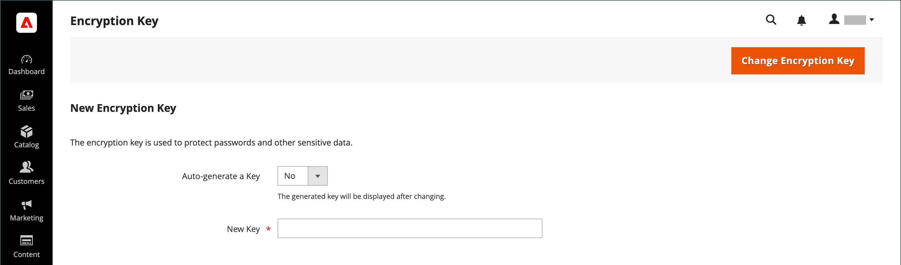

# 暗号化キー

>[!NOTE]
>
>これらの手順を完了しようとし、問題が発生した場合は、「[暗号化キーのローテーションのトラブルシューティング：CVE-2024-34102](https://experienceleague.adobe.com/en/docs/commerce-knowledge-base/kb/troubleshooting/known-issues-patches-attached/troubleshooting-encryption-key-rotation-cve-2024-34102) ナレッジベース」の記事を参照してください。

Adobe CommerceとMagento Open Sourceは、暗号化キーを使用してパスワードやその他の機密データを保護します。 業界標準の[!DNL ChaCha20-Poly1305] アルゴリズムを256 ビット キーと共に使用して、暗号化が必要なすべてのデータを暗号化します。 これには、クレジットカードのデータや統合（支払いと配送モジュール）パスワードが含まれます。 さらに、復号を必要としないすべてのデータをハッシュするために、強力なセキュアハッシュアルゴリズム（SHA-256）が使用されます。

最初のインストール時に、Commerceで暗号化キーを生成するか、独自のキーを入力するように求められます。 暗号化キーツールを使用すると、必要に応じてキーを変更できます。 セキュリティを強化するために、暗号化キーは定期的に変更する必要があり、いつでも元のキーが侵害される可能性があります。

技術情報については、_PHP開発者ガイド_&#x200B;の&#x200B;_インストールガイド_&#x200B;の[高度なオンプレミスインストール &#x200B;](https://experienceleague.adobe.com/docs/commerce-operations/installation-guide/advanced.html)および[&#x200B; データ再暗号化](https://developer.adobe.com/commerce/php/development/security/data-encryption/)を参照してください。

>[!IMPORTANT]
>
>- 暗号化キーを変更する手順に従う前に、次のファイルが書き込み可能であることを確認してください：`[your store]/app/etc/env.php`
>- 管理者設定の暗号化キー変更機能は非推奨（廃止予定）で、2.4.8で削除されました。 このページで説明するCLI コマンドを使用して、2.4.8にアップグレードした後で暗号化キーを変更する必要があります。
>- 暗号化キーを回転すると、すべての顧客および管理者セッション（統合ユーザーを除く）がすぐに無効になり、再度ログインする必要があります。

**暗号化キーを変更するには：**

次の手順では、端末へのアクセスが必要です。

1. [&#x200B; メンテナンスモード &#x200B;](https://experienceleague.adobe.com/en/docs/commerce-operations/configuration-guide/setup/application-modes#maintenance-mode)を有効にします。

   ```bash
   bin/magento maintenance:enable
   ```

1. cron ジョブを無効にします。

   _Cloud インフラプロジェクト :_

   ```bash
   ./vendor/bin/ece-tools cron:disable
   ```

   _オンプレミス プロジェクト_

   ```bash
   crontab -e
   ```

1. 次のいずれかの方法を使用して、暗号化キーを変更します。

   +++CLI コマンド

   新しいコマンドが存在することを確認します。

   ```bash
   bin/magento list | grep encryption:key:change
   ```

   次の出力が表示されます。

   ```bash
   encryption:key:change Change the encryption key inside the env.php file.
   ```

   この出力が表示された場合は、次のCLI コマンドを実行し、エラーなしで完了することを確認します。 特定のシステム設定値または支払いフィールドを再暗号化する必要がある場合は、_PHP開発ガイド_&#x200B;の再暗号化[&#128279;](https://developer.adobe.com/commerce/php/development/security/data-encryption/)に関する詳細な ガイドを参照してください。

   ```bash
   bin/magento encryption:key:change
   ```

   +++

   +++管理者設定

   >[!IMPORTANT]
   >
   >この機能は廃止され、2.4.8で削除されました。 Adobeでは、CLIを使用して暗号化キーを変更することをお勧めします。

   1. _管理者_ サイドバーで、**[!UICONTROL System]** > _[!UICONTROL Other Settings]_>**[!UICONTROL Manage Encryption Key]**&#x200B;に移動します。

      {width="700" zoomable="yes"}

   1. 次のいずれかの操作を行います。

      - 新しいキーを生成するには、**[!UICONTROL Auto-generate Key]**&#x200B;を`Yes`に設定します。
      - 別のキーを使用するには、**[!UICONTROL Auto-generate Key]**&#x200B;を`No`に設定します。 次に、**[!UICONTROL New Key]** フィールドに、使用するキーを入力または貼り付けます。

   1. **[!UICONTROL Change Encryption Key]**&#x200B;をクリックします。

      >[!NOTE]
      >
      >新しいキーの記録を安全な場所に保存します。 ファイルに問題が発生した場合は、データを復号化する必要があります。

   +++

1. キャッシュをフラッシュします。

   _Cloud インフラプロジェクト :_

   ```bash
   magento-cloud cc
   ```

   オンプレミス プロジェクト :_（_O）

   ```bash
   bin/magento cache:flush
   ```

1. cron ジョブを有効にします。

   _Cloud インフラプロジェクト :_

   ```bash
   ./vendor/bin/ece-tools cron:enable
   ```

   オンプレミス プロジェクト :_（_O）

   ```bash
   crontab -e
   ```

1. メンテナンスモードを無効にします。

   ```bash
   bin/magento maintenance:disable
   ```
