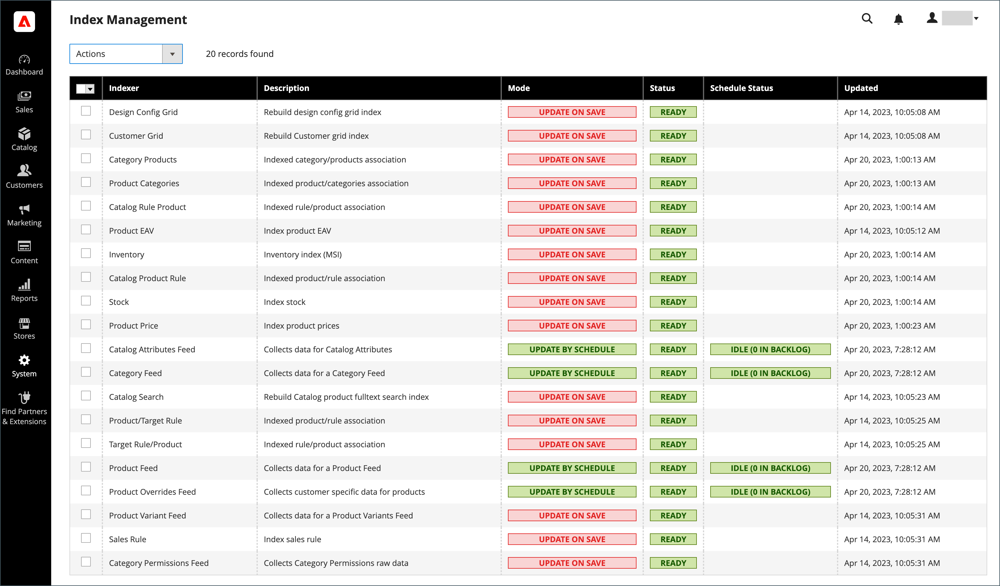

# インデックス管理

Adobe CommerceとMagento Open Sourceは、1つ以上の項目が変更されるたびに自動的にインデックスを再作成します。 インデックス再作成をトリガーにするアクションには、価格変更、カタログまたはショッピングカートの価格ルールの作成、新しいカテゴリの追加などが含まれます。 Commerceでは、パフォーマンスを最適化するために、インデクサーを使用してデータを特別なテーブルに蓄積します。 データの変更に伴い、インデックス付きテーブルを更新するか、インデックスを再作成する必要があります。 Commerceはバックグラウンドプロセスとしてインデックスを再作成し、プロセス中もストアにアクセスできます。

データのインデックス再作成は、処理を高速化し、顧客が待機する時間を短縮します。 例えば、商品の価格を4.99 ドルから3.99 ドルに変更した場合、Commerceはデータをインデックス再作成して、ストアの価格変更を表示します。 インデックスを作成しなければ、Commerceでは、ショッピングカートの価格ルール、バンドル価格、割引、階層価格など、あらゆる商品の価格を即座に計算する必要があります。 商品の価格を読み込むには、顧客が待つことを望んでいるよりも長い時間がかかる場合があります。

インデクサーは、保存時またはスケジュール時に更新するように設定できます。 すべてのインデックスでは、保存時にのみサポートするCustomer Gridを除くいずれかのオプションを使用できます。 保存時にインデックスを作成すると、Commerceは保存アクションで再インデックスを開始します。 インデックス管理ページは更新を完了し、キャッシュをフラッシュし、1分または2分以内に再インデックスメッセージが表示されます。 スケジュールでインデックスを再作成する場合、インデックスの再作成はcron ジョブとしてスケジュールに従って実行されます。 [cron ジョブ ](cron.md)が無効になったインデクサーの更新に使用できない場合、システムメッセージが表示されます。 インデックス再作成時も、ストアにアクセスできます。

>[!NOTE]
> ライブサーチ、カタログサービス、商品レコメンデーションを使用しているAdobe Commerceの販売者は、[SaaS ベースの価格インデクサー](https://experienceleague.adobe.com/en/docs/commerce/price-indexer/price-indexing)を使用できます。

再インデックスが必要な場合は、ページの上部に通知が表示されます。 インデックスとメッセージは、再インデックスモードと実行する潜在的なアクションに基づいてクリアされます。 インデックス作成について詳しくは、_PHP開発者ガイド_&#x200B;の「[ アプリケーションがインデックス作成を実装する方法](https://developer.adobe.com/commerce/php/development/components/indexing/#how-the-application-implements-indexing)」を参照してください。

{width="700" zoomable="yes"}

- Index Managementでは、フラットな商品カタログに対するプレゼンテーションが少し異なります。
- 複数の管理者ユーザーが自動インデックス再作成をトリガーするオブジェクトを更新する際の問題を回避するには、すべてのインデックスをスケジュールどおりに実行するように[cron ジョブ ](cron.md)に設定することをお勧めします。 そうしないと、オブジェクトが保存されるたびに、相互依存関係を持つオブジェクトがデッドロックの原因になる場合があります。 デッドロックの症状には、CPUの使用率の高さとMySQLのエラーが含まれます。 ベストプラクティスとして、スケジュールされたインデックス作成を使用することをお勧めします。
-  （Adobe Commerceのみ）デフォルトでは、インデックス再作成などの管理者アクションはシステムによって記録され、[ アクションログレポート ](action-log-report.md)で表示できます。 アクションのログは、ストアの高度な管理設定の[管理者アクションのログ ](action-log.md)で設定できます。

## インデックス再作成のベストプラクティス

Commerceでは、インデックス再作成とキャッシュの目的が異なります。 インデックスは、検索パフォーマンスの向上、ストアフロントのデータ検索の高速化などのデータベース情報を追跡します。 [ キャッシュ ](cache-management.md)は、読み込まれたデータ、画像、形式などを保存して、パフォーマンスの向上とストアフロントへのアクセスを実現します。

- 通常、Commerceでデータを更新する場合は、インデックスを再作成する必要があります。
- 大規模なストアまたは複数のストアがある場合は、インデックス再作成の可能性があるため、カテゴリや製品などのインデックスをスケジュールされたcron ジョブに設定することができます。 ピーク時間以外の時間にスケジュールのインデックスを設定することができます。
- インデックスを再作成する場合は、フラッシュキャッシュも実行する必要はありません。
- Commerceの新規インストールの場合は、キャッシュをフラッシュしてインデックスを再作成する必要があります。
- キャッシュをフラッシュしてインデックスを再作成しても、コンピューターのweb ブラウザーキャッシュはフラッシュされません。 ストアフロントの更新を完了した後、ブラウザーキャッシュをクリアします。

## 索引モードを変更

>[!IMPORTANT]
>
>[Adobe Commerce B2B](https://experienceleague.adobe.com/docs/commerce-admin/b2b/introduction.html)を使用し、Elasticsearchをフルテキスト （`catalogsearch_fulltext`）インデクサーとして設定しているストアの場合：一括権限が変更された後、または「権限」インデクサーが「スケジュール済み」モードになっている場合は、フルテキストインデックスを再実行する必要があります。

1. _管理者_ サイドバーで、**[!UICONTROL System]** > _[!UICONTROL Tools]_>**[!UICONTROL Index Management]**に移動します。

1. 変更する各インデクサーのチェックボックスをオンにします。

1. **[!UICONTROL Actions]**&#x200B;を次のいずれかに設定します：

   - `Update on Save`
   - `Update by Schedule`
   - `Invalidate index`

     >[!IMPORTANT]
     >
     >2.4.8で[!DNL Customer Grid] インデクサーの動作が変更されました。
     >
     >- **2.4.8**&#x200B;以前：[!DNL Customer Grid] インデクサーは[!UICONTROL Update on Save] オプションを使用してのみインデックスを再作成でき、[!UICONTROL Update by Schedule] オプションはサポートしていません。
     >- **2.4.8以降**: [!DNL Customer Grid] インデクサーは[!UICONTROL Update on Save]と[!UICONTROL Update by Schedule] モードの両方をサポートし、デフォルトは[!UICONTROL Update by Schedule]です。

1. 選択した各インデクサーに変更を適用するには、**[!UICONTROL Submit]**&#x200B;をクリックします。

   **インデックス管理列**

   | 列 | 説明 |
   | ------ |---------------------------------------------------------------------------------------------------------------------------------------------------------------------------------------------------------------------------------------------------------------------------------------------------------------------------------------------------------------------------------------------------------------------------------------------------------------------------------------------------------------------------------------------------------------------------------------------------------------------------------------------------------|
   | [!UICONTROL Indexer] | インデクサーの名前。 |
   | [!UICONTROL Description] | インデクサーの説明。 |
   | [!UICONTROL Mode] | 各インデクサーの現在の更新モードを示します。 オプション： **[!UICONTROL Update on Save]**- エンティティの変更が保存されるたびにインデックスが更新されるように設定されます。 これらのエンティティには、製品、カテゴリ、顧客が含まれます。 保存アクションが完了すると、一連の手順で変更の取得とインデックスの更新が開始されます。 インデックス管理ページは、1分または2分以内にインデックス再作成メッセージを更新してフラッシュします。 **[!UICONTROL Update on Schedule]** - インデックスは、[cron ジョブ ](cron.md)に従ってスケジュールに従って更新するように設定されています。 cron ジョブには、インデックス再作成のスケジュール間隔が含まれ、実行時にインデックスに更新を書き込みます。 |
   | [!UICONTROL Schedule Status] | スケジュールのステータス更新を表示します。 |
   | [!UICONTROL Status] | 次のいずれかを表示します： **[!UICONTROL Ready]**— インデックスは最新です。 **[!UICONTROL Suspended]** – インデックス再作成が一時停止されています。 **[!UICONTROL Processing]**– インデックス再作成は現在実行中です。 **[!UICONTROL Reindex Required]** – インデックス再作成が必要な変更が行われましたが、インデックスを自動的に更新できません。 [cron](cron.md)が使用可能で、正しく設定されているかどうかを確認します。 |
   | [!UICONTROL Updated] | インデックスが最後に更新された日時を示します。 |

   {style="table-layout:auto"}

## コマンドラインを使用してインデックスを再作成する

Commerceには、コマンドラインを使用して追加のインデックス再作成オプションが用意されています。 完全な詳細とコマンドオプションについては、_設定ガイド_&#x200B;の[Reindex](https://experienceleague.adobe.com/docs/commerce-operations/configuration-guide/cli/manage-indexers.html#reindex){:target="blank"}を参照してください。

## インデックストリガーイベント

## トリガーのインデックス再作成

| 索引タイプ | インデックス再作成イベント |
| ---------- | ---------------- |
| [!UICONTROL Product Prices] | 顧客グループの追加 構成設定の変更 |
| [!UICONTROL Flat catalog product data] | ストアを追加  ストアグループを追加 属性を追加、編集、削除（検索とフィルタリング用） |
| [!UICONTROL Flat catalog category data] | ストアを追加  ストアグループを追加 属性を追加、編集、削除（検索とフィルタリング用） |
| [!UICONTROL Catalog category/product index] | 商品の追加、編集、または削除（シングル、マス、インポート）  商品とカテゴリの関係を変更  カテゴリの追加、編集、削除  ストアの追加または削除  ストアグループの削除 Web サイトの削除 |
| [!UICONTROL Catalog search index] | 商品の追加、編集、または削除（シングル、マス、インポート）   ストアの追加または削除  ストアグループの削除 Web サイトの削除 |
| [!UICONTROL Stock status index] | 在庫設定の変更。 |
| [!UICONTROL Category permissions index] | ストアを追加  ストアグループを追加 属性を追加、削除、更新（検索とフィルタリング用） |

{style="table-layout:auto"}

>[!IMPORTANT]
>
>フラットカタログの使用は、ベストプラクティスとして推奨されなくなりました。 この機能を引き続き使用すると、パフォーマンスの低下やその他のインデックス作成の問題が発生することが知られています。 詳しくは、[ フラットカタログ製品を使用](../catalog/catalog-flat.md)を参照してください。

## アクションとコントロールのインデックス作成

| アクション | 結果 | コントロール |
| ------ | ------ | -------- |
| ストア、新しい顧客グループ、または`Actions that Cause a Full Reindex`にリストされているアクションを作成しています | 完全にインデックスを再作成 | 完全なインデックス再作成は、Adobe CommerceまたはMagento Open Source cron ジョブによって決定されたスケジュールに従って実行されます。 |
| 項目の一括読み込み（Commerceの読み込み/書き出し、Direct SQL クエリ、およびデータを直接追加、変更、削除するその他のメソッド） | 部分的なインデックス再作成（変更された項目のみがインデックス再作成されます） | Commerceのcron ジョブで決定された頻度で設定します。 |
| 範囲の変更（例：グローバルからweb サイトへ） | 部分的なインデックス再作成（変更された項目のみがインデックス再作成されます） | Commerceのcron ジョブで決定された頻度で設定します。 |

{style="table-layout:auto"}

## 完全なインデックス再作成をトリガーするイベント

| インデクサー | イベント |
| ------- | ----- |
| [!UICONTROL Catalog Category Flat Indexer] | Web ストアを作成 web ストアビューを作成 次のいずれかの属性を作成または削除します。  – 検索可能または詳細検索で表示 - フィルター可能  – 検索でフィルター可能  – 並べ替えに使用 既存の属性を前のいずれかにします。  フラット カテゴリ ストアフロント オプションを有効にする |
| [!UICONTROL Catalog Product Flat Indexer] | Web ストアを作成 web ストアビューを作成 次のいずれかの属性を作成または削除します：  – 検索可能または詳細検索で表示 - フィルター可能  – 検索でフィルター可能  – 並べ替えに使用 既存の属性を前のいずれかにします。  フラット カテゴリ ストアフロント オプションを有効にする |
| [!UICONTROL Stock status indexer] | システム構成で次の&#x200B;_カタログ在庫オプション_&#x200B;が変更された場合： `Stock Options` – 在庫切れ商品の表示 `Product Stock Options` – 在庫の管理 |
| [!UICONTROL Price Indexer] | 顧客グループの追加。  システム構成で次のカタログ在庫オプションのいずれかが変更された場合： `Stock Options` – 在庫切れ商品の表示 `Product Stock Options` – 在庫の管理 `Price` - カタログの価格範囲 |
| [!UICONTROL Category or Product Indexer] | ストアビューの作成または削除  ストアの削除 web サイトの削除 |

{style="table-layout:auto"}
