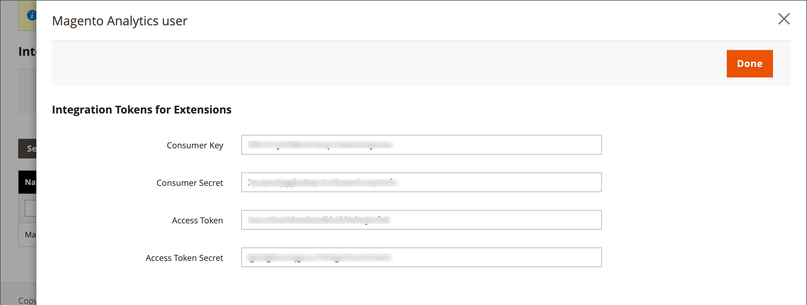

# 統合

Commerce管理者で統合を定義すると、サードパーティ統合用の OAuth 資格情報とリダイレクト URL の場所が設定され、統合に必要な使用可能な API リソースが特定されます。 統合登録プロセスについて詳しくは、Commerce開発者向けドキュメントの [OAuth ベースの認証 ](https://developer.adobe.com/commerce/webapi/get-started/authentication/gs-authentication-oauth/) を参照してください。

{width="700" zoomable="yes"}

## オンボーディングワークフロー

1. **統合を認証** - **[!UICONTROL System]**/_[!UICONTROL Extensions]_/**[!UICONTROL Integrations]**&#x200B;ページに移動し、関連する統合を見つけて認証します。
1. **ログインの検証と確立** - プロンプトが表示されたら、リクエストされたアクセスを受け入れます。 サードパーティにリダイレクトされた場合は、システムにログインするか、アカウントを作成します。 ログインに成功したら、統合ページに戻ります。
1. **認証済み統合の確認を受信** - システムは、統合が正常に認証されたことを示す通知を送信します。 統合を設定して資格情報を受け取ると、アクセスまたはリクエストトークンを呼び出す必要はなくなります。

## 統合の追加

1. _管理者_ サイドバーで、**[!UICONTROL System]**/_[!UICONTROL Extensions]_/**[!UICONTROL Integrations]**&#x200B;に移動します。

   {width="600" zoomable="yes"}

1. 次の統合情報を入力します。

   - 統合の **[!UICONTROL Name]** と連絡先の **[!UICONTROL Email]** アドレスを入力します。

   - トークン交換に OAuth を使用する際に OAuth 認証情報を送信できる **[!UICONTROL Callback URL]** を入力します。 `https://` の使用を強くお勧めします。

   - これらのAdobe CommerceまたはMagento Open Source統合資格情報を使用して、ユーザーをサードパーティアカウントにリダイレクトする **[!UICONTROL Identity Link URL]** を入力します。

   >[!NOTE]
   >
   > HTTPS URL が [!UICONTROL Callback URL] フィールドと [!UICONTROL Identity Link URL] フィールドに保存されるまで、[!UICONTROL Integrations] グリッドの各統合名の近くに `Integration not secure` 警告ラベルがリマインダーとして表示されます。

   - プロンプトが表示されたら、パスワードを入力して ID を確認します。

1. 左側のパネルで「**[!UICONTROL API]**」を選択し、次の操作を実行します。

   - **[!UICONTROL Resource Access]** を次のいずれかに設定します。

      - `All`
      - `Custom`

   - カスタムアクセスの場合は、必要な各リソースのチェックボックスをオンにします。

     {width="600" zoomable="yes"}

1. 完了したら、「**[!UICONTROL Save]**」をクリックします。

## 統合のアクティブ化

デフォルトでは、保存済みの統合は `Inactive` ステータスでグリッドに表示されます。 有効にするには、次の手順を実行します。

1. _管理者_ サイドバーで、**[!UICONTROL System]**/_[!UICONTROL Extensions]_/**[!UICONTROL Integrations]**&#x200B;に移動します。

1. 新しく作成した統合を見つけて、**[!UICONTROL Activate]** リンクをクリックします。

1. 右上隅の「**[!UICONTROL Allow]**」をクリックします。

   拡張機能の統合トークンを表示します。 この情報を暗号化された安全な場所にコピーして、統合で使用できるようにします。

   {width="600" zoomable="yes"}

1. 右上隅の「**[!UICONTROL Done]**」をクリックします。

## 統合の再認証

新しい統合アクセストークンおよびアクセストークン秘密鍵を生成するには、管理者から統合を再認証しました。

1. _管理者_ サイドバーで、**[!UICONTROL System]**/_[!UICONTROL Extensions]_/**[!UICONTROL Integrations]**&#x200B;に移動します。

1. **[!UICONTROL Active]** ステータスの統合を見つけます。

1. 列 _[!UICONTROL Activate]_、**[!UICONTROL Reauthorize]**&#x200B;をクリックします。

1. 「**[!UICONTROL Reauthorize]**」をクリックして、API リソースへのアクセスを承認します。

1. 拡張機能の新しい統合トークンを保存し、「**[!UICONTROL Done]**」をクリックします。

## API ゲストアクセスのセキュリティ設定の変更

デフォルトでは、CMS、カタログ、その他のストアリソースへの匿名ゲストによるアクセスは許可されません。 設定を変更する必要がある場合は、次の操作を行います。

1. _管理者_ サイドバーで、**[!UICONTROL Stores]**/_[!UICONTROL Settings]_/**[!UICONTROL Configuration]**&#x200B;に移動します。

1. 左側のパネルで「**[!UICONTROL Services]**」を展開し、「**[!UICONTROL Magento Web API]**」を選択します。

1. 「」を展開し、「**[!UICONTROL Web API Security Setting]**」セクションを展開します。

   {width="600" zoomable="yes"}

1. **[!UICONTROL Allow Anonymous Guest Access]** を `Yes` に設定します。

1. 完了したら、「**[!UICONTROL Save Config]**」をクリックします。

詳しくは、Commerce開発者向けドキュメントの [ 匿名 web API へのアクセスの制限 ](https://developer.adobe.com/commerce/webapi/rest/use-rest/anonymous-api-security/) を参照してください。

## 統合の削除

1. _管理者_ サイドバーで、**[!UICONTROL System]**/_[!UICONTROL Extensions]_/**[!UICONTROL Integrations]**&#x200B;に移動します。

1. 既存の統合を見つけて、「**[!UICONTROL Delete]**」列のアイコン（）をクリックします。

1. アクションを確定するには、「**[!UICONTROL OK]**」をクリックします。
