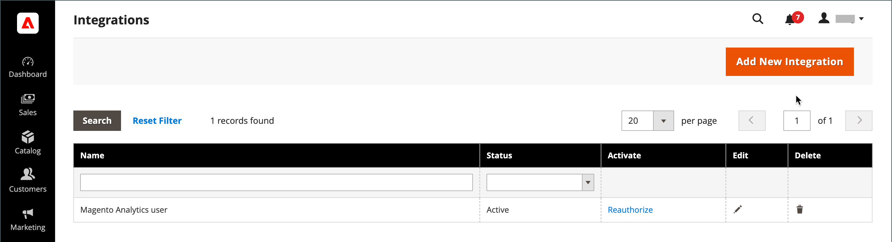
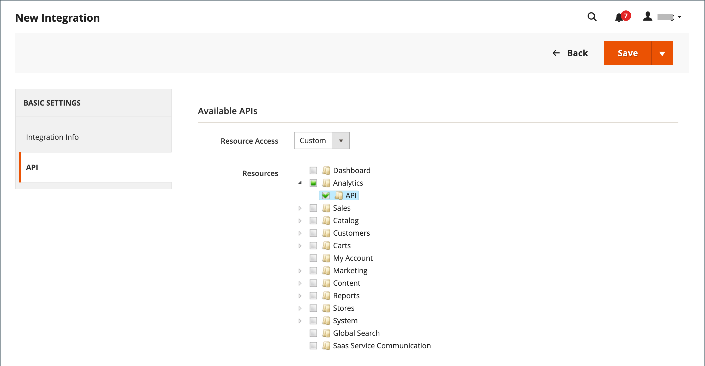
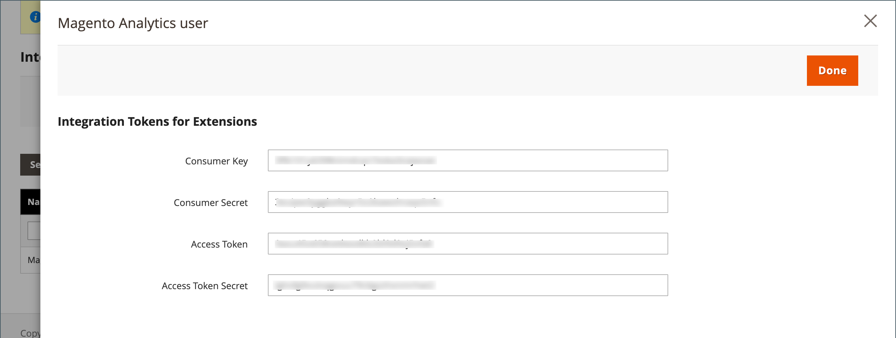

# 連携

Commerce管理者で統合を定義すると、サードパーティ統合のOAuth資格情報とリダイレクト URLの場所が設定され、統合に必要な使用可能なAPI リソースが特定されます。 統合登録プロセスについて詳しくは、Commerce開発者向けドキュメントの[OAuth ベース認証](https://developer.adobe.com/commerce/webapi/get-started/authentication/gs-authentication-oauth/)を参照してください。

{width="700" zoomable="yes"}

## オンボーディングワークフロー

1. **統合を承認** - **[!UICONTROL System]** > _[!UICONTROL Extensions]_>**[!UICONTROL Integrations]**&#x200B;ページに移動し、関連する統合を見つけて承認します。
1. **ログインを確認して確立** – 要求されたアクセスを許可するよう求められたら、承認します。 サードパーティにリダイレクトされた場合は、システムにログインするか、アカウントを作成します。 ログインが成功したら、統合ページに戻ります。
1. **承認済み統合の確認を受け取る** - システムは、統合が正常に承認されたという通知を送信します。 統合を設定して資格情報を受け取った後、アクセストークンまたはリクエストトークンを呼び出す必要がなくなりました。

## 統合の追加

1. _管理者_ サイドバーで、**[!UICONTROL System]** > _[!UICONTROL Extensions]_>**[!UICONTROL Integrations]**&#x200B;に移動します。

   {width="600" zoomable="yes"}

1. 次の統合情報を入力します。

   - 統合の&#x200B;**[!UICONTROL Name]**&#x200B;と連絡先&#x200B;**[!UICONTROL Email]**&#x200B;のアドレスを入力してください。

   - トークン交換にOAuthを使用する場合にOAuth認証情報を送信できる&#x200B;**[!UICONTROL Callback URL]**&#x200B;を入力します。 `https://`を使用することを強くお勧めします。

   - **[!UICONTROL Identity Link URL]**&#x200B;を入力して、これらのAdobe CommerceまたはMagento Open Sourceの統合資格情報を持つサードパーティのアカウントにユーザーをリダイレクトします。

   >[!NOTE]
   >
   > HTTPS URLが[!UICONTROL Callback URL]および[!UICONTROL Identity Link URL]のフィールドに保存されるまで、`Integration not secure`警告ラベルは、[!UICONTROL Integrations] グリッドの各統合名の近くにリマインダーとして表示されます。

   - プロンプトが表示されたら、パスワードを入力してIDを確認します。

1. 左側のパネルで、**[!UICONTROL API]**&#x200B;を選択し、次の操作を行います。

   - **[!UICONTROL Resource Access]**&#x200B;を次のいずれかに設定します：

      - `All`
      - `Custom`

   - カスタムアクセスの場合は、必要な各リソースのチェックボックスを選択します。

     {width="600" zoomable="yes"}

1. 完了したら、**[!UICONTROL Save]**&#x200B;をクリックします。

## 統合の有効化

デフォルトでは、保存済みの統合機能が`Inactive` ステータスのグリッドに表示されます。 アクティブ化するには、次の手順を実行します。

1. _管理者_ サイドバーで、**[!UICONTROL System]** > _[!UICONTROL Extensions]_>**[!UICONTROL Integrations]**&#x200B;に移動します。

1. 新しく作成した統合を見つけて、**[!UICONTROL Activate]** リンクをクリックします。

1. 右上隅の「**[!UICONTROL Allow]**」をクリックします。

   このアクションは、拡張機能の統合トークンを表示します。 この情報を安全で暗号化された場所にコピーして、統合で使用します。

   拡張機能の{width="600" zoomable="yes"}

1. 右上隅の「**[!UICONTROL Done]**」をクリックします。

## 統合の再認証

新しい統合アクセストークンとアクセストークン秘密鍵を生成するには、管理者から統合を再認証します。

1. _管理者_ サイドバーで、**[!UICONTROL System]** > _[!UICONTROL Extensions]_>**[!UICONTROL Integrations]**&#x200B;に移動します。

1. **[!UICONTROL Active]** ステータスの統合を検索します。

1. _[!UICONTROL Activate]_&#x200B;列で、**[!UICONTROL Reauthorize]**&#x200B;をクリックします。

1. **[!UICONTROL Reauthorize]**&#x200B;をクリックして、API リソースへのアクセスを承認します。

1. 拡張機能の新しい統合トークンを保存し、**[!UICONTROL Done]**&#x200B;をクリックします。

## API ゲストアクセスセキュリティ設定の変更

デフォルトでは、CMS、カタログ、その他のストアリソースへの匿名ゲストのアクセスは許可されていません。 設定を変更する必要がある場合は、次の操作を行います。

1. _管理者_ サイドバーで、**[!UICONTROL Stores]** > _[!UICONTROL Settings]_>**[!UICONTROL Configuration]**&#x200B;に移動します。

1. 左側のパネルで、**[!UICONTROL Services]**&#x200B;を展開し、**[!UICONTROL Magento Web API]**&#x200B;を選択します。

1. **[!UICONTROL Web API Security Setting]** セクションのを展開します。

   {width="600" zoomable="yes"}

1. **[!UICONTROL Allow Anonymous Guest Access]**&#x200B;を`Yes`に設定します。

1. 完了したら、**[!UICONTROL Save Config]**&#x200B;をクリックします。

詳しくは、Commerce開発者向けドキュメントの[匿名web APIへのアクセスの制限](https://developer.adobe.com/commerce/webapi/rest/use-rest/anonymous-api-security/)を参照してください。

## 統合の削除

1. _管理者_ サイドバーで、**[!UICONTROL System]** > _[!UICONTROL Extensions]_>**[!UICONTROL Integrations]**&#x200B;に移動します。

1. 既存の統合を検索し、**[!UICONTROL Delete]**&#x200B;列のアイコン（）をクリックします。

1. アクションを確認するには、**[!UICONTROL OK]**&#x200B;をクリックします。
