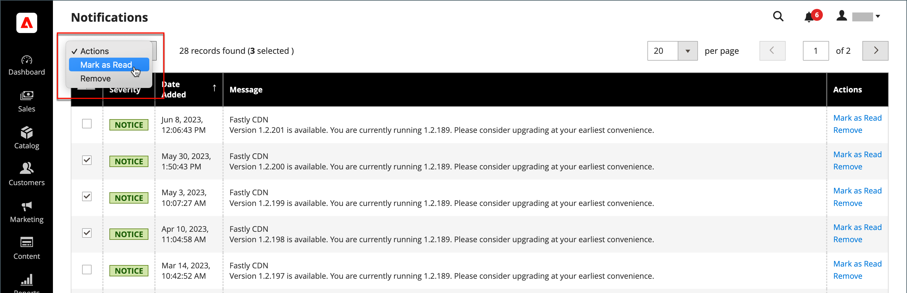

# システム通知

The _通知_ ページには、すべてのメッセージが重大度別に表示され、最新のメッセージが一番上に表示されます。 「アクション」コマンドを使用すると、個々のメッセージを既読としてマークしたり、詳細情報を表示したり、インボックスからメッセージを削除したりできます。

1. 次のいずれかの操作を行って、 _[!UICONTROL Notifications]_ページ：

   - 次をクリック： _通知_ アイコンをクリックします。 1 つ以上の新しいメッセージが表示された場合は、 **[!UICONTROL See All]**.

   - 次の日： _管理者_ サイドバー、移動 **[!UICONTROL System]** > _[!UICONTROL Other Settings]_>**[!UICONTROL Notifications]**.

1. Adobe Analytics の **[!UICONTROL Action]** 」列で、次のいずれかの操作を行います。

   - 詳しくは、 **[!UICONTROL Read Details]** をクリックすると、リンクされたページが新しいウィンドウで開きます。

   - メッセージをインボックスに保持するには、 **[!UICONTROL Mark As Read]**.

     {width="700" zoomable="yes"}

   - メッセージを削除するには、 **[!UICONTROL Remove]**.

1. 複数のメッセージにアクションを適用するには、次のいずれかの操作を行います。

   - 管理する各メッセージの最初の列にあるチェックボックスを選択します。
   - 複数のメッセージを選択するには、 **[!UICONTROL Mass Actions]** 必要に応じてコントロールします。

1. を設定します。 **[!UICONTROL Actions]** コントロールを次のいずれかに設定します。

   - `Mark as Read`
   - `Remove`

1. クリック **[!UICONTROL Submit]** をクリックしてプロセスを完了します。
