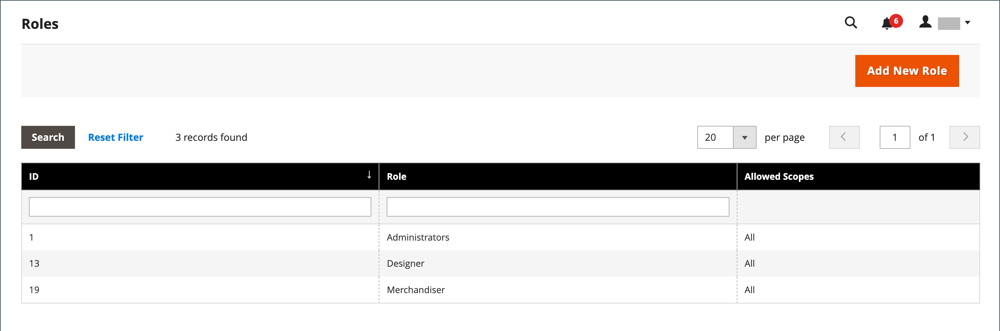

# ユーザーの役割

ユーザーに管理者への制限付きアクセス権を付与するには、最初の手順として、適切なレベルの権限を持つ役割を作成します。 役割を保存した後、新しいユーザーを追加し、制限付きの役割を割り当てて、管理者への制限付きアクセス権を付与することができます。

{width="600" zoomable="yes"}

## ロールを定義

1. 次の日： _管理者_ サイドバー、移動 **[!UICONTROL System]** > _[!UICONTROL Permissions]_>**[!UICONTROL User Roles]**.

1. 右上隅で、 **[!UICONTROL Add New Role]**.

1. 役割を定義する手順を実行します。

### 手順 1：ロール名を追加する

1. の下 _[!UICONTROL Role Information]_、説明的な&#x200B;**[!UICONTROL Role Name]**.

1. の下 _[!UICONTROL Current User Identity Verification]_、パスワードを入力します。

   {width="600" zoomable="yes"}

### 手順 2：リソースの割り当て

>[!IMPORTANT]
>
>リソースを割り当てる際は、特定の役割のアクセスを制限する場合は、権限ツールへのアクセスを必ず無効にしてください。 そうしないと、ユーザーは自分の権限を変更できます。

1. 設定 **[!UICONTROL Role Scopes]** を次のいずれかに変更します。

   - `All`
   - `Custom`

   に設定した場合、 `Custom` マルチサイトインストールの場合は、web サイトのチェックボックスを選択し、役割を使用するストアを選択します。

   {width="600" zoomable="yes"}

   >[!NOTE]
   >
   >を持つユーザー `Custom` 役割の範囲では、Web サイトやカテゴリを作成したり、製品をカテゴリに割り当てたり、次の場所で製品を編集したりすることはできません： _[!UICONTROL All Store Views]_制限付きストアに割り当てられた場合の範囲。 また、他の操作を実行することはできません_ global _アクセス権のない範囲に影響を与えるアクション。

1. の下 _[!UICONTROL Roles Resources]_，設定&#x200B;**[!UICONTROL Resource Access]**から `Custom`.

1. Adobe Analytics の **[!UICONTROL Resource]** ツリー構造で、ロールがアクセスできる各管理機能のチェックボックスを選択します。

   税金設定へのアクセス権を持つ管理者ロールを作成するには、「売上/税金」リソースと「システム/税金」リソースの両方を選択します。 デフォルトとは異なる地域用に Web サイトを設定する場合 [出発点](../stores-purchase/shipping-settings.md#point-of-origin)の場合は、そのロールのシステム/配送先リソースへのアクセスを許可する必要があります。 配送先設定は、カタログ価格に使用される店舗税率を決定します。

   {width="600" zoomable="yes"}

   使用可能な権限のリストには、バンドルされた拡張機能およびインストールされた拡張機能のその他のオプションが含まれる場合があります。 各機能の最上位の権限を選択することで、ユーザーに使用可能なすべての権限を割り当てます。

   >[!NOTE]
   >
   >管理者ユーザーは、 **[!UICONTROL Sales / Archive]** 表示する役割の範囲の権限 _[!UICONTROL Invoices]_,_[!UICONTROL Credit Memos]_、および _[!UICONTROL Shipments]_注文 [タブ](../stores-purchase/order-processing.md).

1. 完了したら、「 **[!UICONTROL Save Role]**.

   役割がグリッドに表示され、ユーザーアカウントに割り当てられるようになりました。

## ユーザーにロールを割り当てる

1. 次から： _[!UICONTROL Roles]_グリッドで、編集モードでレコードを開きます。

1. の下 _[!UICONTROL Current User Identity Verification]_」に、ユーザーアカウントのパスワードを入力します。

1. 左側のパネルで、を選択します。 **[!UICONTROL Role Users]**.

   The _[!UICONTROL Role Users]_オプションは、新しい役割が保存された後にのみ表示されます。

   {width="600" zoomable="yes"}

1. 特定のユーザーレコードを検索するには、次の手順を実行します。

   - 列の上部にある検索フィルターに値を入力し、 **入力**.

   - 完全なリストに戻る準備が整ったら、 **[!UICONTROL Reset Filter]**.

1. ロールに割り当てるユーザーのチェックボックスをオンにします。

1. クリック **[!UICONTROL Save Role]**.

## ロールの編集

1. 次の日： _管理者_ サイドバー、移動 **[!UICONTROL System]** > _[!UICONTROL Permissions]_>**[!UICONTROL User Roles]**.

1. グリッドの上にあるフィルターを使用してロールを探し、ロール名をクリックします。

1. 必要な変更を加えます。

   役割の設定については、ユーザーの役割を作成する手順を確認してください。

1. プロンプトが表示されたら、ID を確認するためのパスワードを入力します。

1. 次をクリック： **[!UICONTROL Save Role]**.

## ロールの削除

1. 次の日： _管理者_ サイドバー、移動 **[!UICONTROL System]** > _[!UICONTROL Permissions]_>**[!UICONTROL User Roles]**.

1. グリッドの上のフィルターを使用して役割を見つけ、編集モードで開きます。

1. 右上隅で、 **[!UICONTROL Delete Role]**.

1. アクションを確定するには、 **[!UICONTROL OK]**.

## ユーザーの役割のデモ

ユーザーの役割の管理については、このビデオをご覧ください。

>[!VIDEO](https://video.tv.adobe.com/v/343654?quality=12)

## 役割のリソース

次のリソースへのアクセスをカスタムロールに割り当てることができます。 各リソースに関連付けられている機能の詳細については、リンクされたページを参照してください。

 - Adobe Commerceのみ

 - B2B でAdobe Commerceのみ利用可能

| リソース |   |   |
| --- | --- | --- |
| [`Dashboard`](../getting-started/admin-dashboard.md) |  |  |
| [`Sales`](../stores-purchase/sales-menu.md) | [`Operations`](../stores-purchase/orders.md) |  |
|  | [`Quotes`](../b2b/quotes.md)   [`Orders`](../stores-purchase/orders.md) [`Invoices`](../stores-purchase/invoices.md) [`Shipments`](../stores-purchase/shipments.md) [`Credit Memos`](../stores-purchase/credit-memos.md) [`Billing Agreements`](../stores-purchase/paypal-billing-agreements.md) [`Returns`](../stores-purchase/returns.md)  [`Transactions`](../stores-purchase/transactions.md) |
|  | [`Archive`](action-log-archive.md)![Adobe Commerce] |  |
|  | [`Shopping Cart Management`](../stores-purchase/cart.md) |  |
| [`Catalog`](../catalog/catalog-menu.md) | [`Category Permissions`](../catalog/categories.md)  |  |
|  | [`Inventory`](../inventory-management/introduction.md) | [`Products`](../catalog/products-list.md) [`Categories`](../catalog/categories.md) |
|  | [`Shared Catalog`](../b2b/catalog-shared-create.md)  | [`Manage Shared Catalog`](../b2b/catalog-shared-manage.md) |
| [`Customers`](../customers/guide-overview.md) | [`All Customers`](../customers/customers-all.md) [`Now Online`](../customers/now-online.md) [`Customer Groups`](../customers/customer-groups.md) [`Segments`](../customers/customer-segments.md)  |  |
|  | [`Login as Customer`](../customers/login-as-customer.md) | `Allow Login as Customer Button` `View Login as Customer Log`  |
|  | [`Companies`](../b2b/account-companies.md)  | [`Manage Companies`](../b2b/account-company-manage.md)  `Add New Company`  `Delete Company`  `Reimburse Balance` |
| [`Carts`](../stores-purchase/shopping-assisted-cart-manage.md) | [`Manage carts`](../stores-purchase/shopping-assisted-cart-manage.md) |  |
| [`My Account`](../customers/account-dashboard-my-account.md) |  |  |
| [`Marketing`](../merchandising-promotions/marketing-menu.md) | [`Promotions`](../merchandising-promotions/marketing-menu.md#uicontrol-promotions) | [`Catalog Price Rule`](../merchandising-promotions/price-rules-catalog.md)  [`Cart Price Rules`](../merchandising-promotions/price-rules-cart.md)  [`Related Products Rules`](../merchandising-promotions/product-related-rules.md) [`Gift Card Accounts`](../stores-purchase/product-gift-card-accounts.md)  |
|  | [`Private Sales`](../merchandising-promotions/events-private-sales.md)  | [`Events`](../merchandising-promotions/event-create.md)  [`Invitations`](../merchandising-promotions/invitations.md) |
|  | `Communications` | [`Email Templates`](email-templates.md)  [`Newsletter Template`](../merchandising-promotions/newsletter-template.md)  [`Newsletter Queue`](../merchandising-promotions/newsletter-queue.md)  [`Newsletter Subscribers`](../merchandising-promotions/newsletter-subscribers.md)  [`Email Reminders`](../merchandising-promotions/email-reminder-rules.md) |
|  | `Sales Channel` | [`Amazon Sales Channel`](https://experienceleague.adobe.com/docs/commerce-channels/amazon/overview.html) |
|  | [`SEO & Search`](../merchandising-promotions/marketing-menu.md#uicontrol-seo--search) | [`Search Terms`](../catalog/search-terms.md)  [`Search Synonyms`](../catalog/search-terms.md#search-synonyms)  [`URL Rewrites`](../merchandising-promotions/url-rewrite-custom.md)  [`Site Map`](../merchandising-promotions/sitemap-xml.md) |
|  | [`User Content`](../merchandising-promotions/product-reviews-moderate.md) | [`All Reviews`](../merchandising-promotions/product-reviews.md)  [`Pending Reviews`](../merchandising-promotions/product-reviews-moderate.md)   |  |
| [`Content`](../content-design/content-menu.md) | [`Elements`](../content-design/content-menu.md#uicontrol-elements)) | [`Pages`](../content-design/pages.md) [`Hierarchy`](../content-design/page-hierarchy.md)  [`Blocks`](../content-design/blocks.md) [`Dynamic Blocks`](../content-design/dynamic-blocks.md)  [`Widgets`](../content-design/widgets.md) [`Media Gallery`](../content-design/media-gallery.md) |  |
|  | [`Design`](../content-design/introduction.md#design) | [`Themes`](../content-design/themes.md) [`Schedule`](../content-design/schedule.md) |  |
|  | [コンテンツのステージング](../content-design/content-staging.md)   |  |
| [`Reports`](../getting-started/reports-menu.md) | [`Marketing`](../getting-started/marketing-reports.md) | `Shopping Cart` [`Search Terms`](../catalog/search-terms.md#search-terms-report) `Newsletter Problem Reports` |  |
|  | [`Reviews`](../getting-started/review-reports.md)  |  |
|  | [`Sales`](../getting-started/sales-reports.md) |  |
|  | `System Insights`  | [`Site-Wide Analysis Tool`](https://experienceleague.adobe.com/docs/commerce-operations/tools/site-wide-analysis-tool/access.html) |
|  | [`Customers`](../getting-started/customer-reports.md) [`Products`](../getting-started/product-reports.md) [`Private Sales`](../getting-started/private-sales-reports.md)  [`Statistics`](../getting-started/reports-menu.md#uicontrol-statistics) [`Business Intelligence`](../getting-started/business-intelligence.md) |  |
| [`Stores`](../stores-purchase/stores.md) | [`Settings`](../stores-purchase/stores-menu.md) | [`All Stores`](../stores-purchase/stores.md) [`Configuration`](../configuration-reference/guide-overview.md) [`Terms and Conditions`](../stores-purchase/terms-and-conditions.md) [`Order Status`](../stores-purchase/order-status.md) |  |
|  | [`Inventory`](../inventory-management/sources-stocks.md) | [`Sources`](../inventory-management/sources-manage.md) [`Stocks`](../inventory-management/stocks-manage.md) |  |
|  | [`Taxes`](../stores-purchase/taxes.md) |  |  |
|  | [`Currency`](../stores-purchase/currency.md) | [`Currency Rates`](../stores-purchase/currency-update.md) [`Currency Symbols`](../stores-purchase/currency-configuration.md#step-5-customize-currency-symbols-optional) |  |
|  | [`Attributes`](../catalog/product-attributes.md) | [`Product`](../catalog/attribute-product-create.md) [`Update Attributes`](../catalog/attribute-product-create.md) [`Attribute Set`](../catalog/attribute-sets.md) [`Ratings`](../merchandising-promotions/product-reviews.md#create-custom-ratings) |
|  | [`Other Settings`](../stores-purchase/stores-menu.md) | [`Customer Groups`](../customers/customer-groups.md) |
| [`System`](system-menu.md) | [`Data Transfer`](data-transfer.md) | [`Import`](data-import.md) [`Export`](data-export.md) [`Import/Export Tax Rates`](data-transfer-tax-rates.md) [`Import History`](data-import.md#import-history) |  |
|  | [`Magento Connect`](../getting-started/commerce-marketplace.md) | `Connect Manager` `Package Extensions` |  |
|  | [`Tools`](system-menu.md#tools) | [`Cache Management`](cache-management.md) [`Backups`](backups.md) [`Index Management`](index-management.md) [`Change Indexer Mode`](index-management.md) |  |
|  | [`Permissions`](permissions.md) | [`All Users`](permissions-users-all.md) [`Locked Users`](permissions-users-all.md#locked-users) [`User Roles`](permissions-user-roles.md) |
| [`Action Log`](action-log.md) | [`Report`](action-log.md) [`Archive`](action-log-archive.md) |
|  | [`Other Settings`](system-menu.md) | [`Notifications`](notifications.md) [`Custom Variables`](variables-custom.md) [`Manage Encryption Key`](encryption-key.md) |  |
| [`Global Search`](../getting-started/admin-workspace.md#workspace-search) |  |  |

{style="table-layout:auto"}
