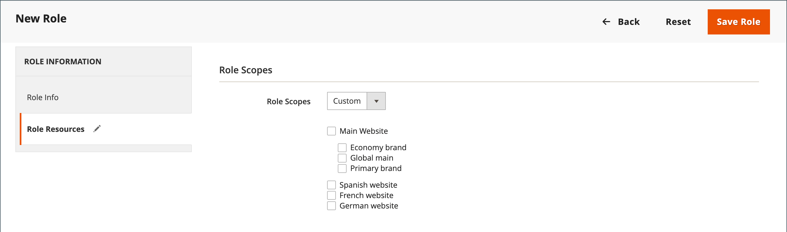
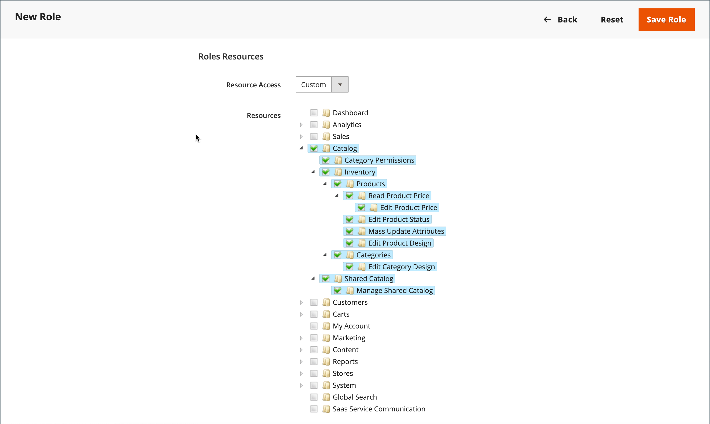

# ユーザーロール

制限されたユーザーに管理者へのアクセス権を付与するには、最初の手順として、適切なレベルの権限を持つ役割を作成します。 役割が保存されたら、新しいユーザーを追加し、制限された役割を割り当てて、管理者への制限付きアクセス権を付与できます。

{width="600" zoomable="yes"}

## 役割の定義

1. _管理者_ サイドバーで、**[!UICONTROL System]** > _[!UICONTROL Permissions]_>**[!UICONTROL User Roles]**&#x200B;に移動します。

1. 右上隅の「**[!UICONTROL Add New Role]**」をクリックします。

1. 役割を定義する手順を完了します。

### 手順1：役割の名前を追加する

1. _[!UICONTROL Role Information]_&#x200B;の下に、わかりやすい&#x200B;**[!UICONTROL Role Name]**&#x200B;を入力します。

1. _[!UICONTROL Current User Identity Verification]_&#x200B;で、パスワードを入力します。

   {width="600" zoomable="yes"}

### 手順2：リソースの割り当て

>[!IMPORTANT]
>
>リソースを割り当てる場合、特定の役割へのアクセスを制限する場合は、必ず権限ツールへのアクセスを無効にしてください。 それ以外の場合、ユーザーは自分の権限を変更できます。

1. **[!UICONTROL Role Scopes]**&#x200B;を次のいずれかに設定します：

   - `All`
   - `Custom`

   マルチサイトインストールで`Custom`に設定されている場合は、web サイトとストアのチェックボックスを選択し、役割を使用する場所を指定します。

   {width="600" zoomable="yes"}

   >[!NOTE]
   >
   >`Custom`の役割スコープを持つユーザーは、制限されたストアに割り当てられている場合、web サイトとカテゴリの作成、カテゴリへの製品の割り当て、または&#x200B;_[!UICONTROL All Store Views]_&#x200B;スコープでの製品の編集を行うことはできません。 これらのユーザーは、アクセス権を持たないスコープに影響を与える他の_ グローバル _アクションも実行できません。

1. _[!UICONTROL Roles Resources]_&#x200B;で、**[!UICONTROL Resource Access]**&#x200B;を`Custom`に設定します。

   >[!NOTE]
   >
   >管理者にログインするために2要素認証（2FA）が必要な場合は、この役割でリソース `Permissions` > `Two Factor Auth`を有効にしてください。 そうでない場合、この`Custom`の役割スコープを持つ新しく作成されたユーザーは、管理者に初めてアクセスする際に2FAを設定できません。

1. **[!UICONTROL Resource]** ツリー構造で、役割がアクセスできる各管理者機能のチェックボックスを選択します。

   税設定へのアクセス権を持つ管理者ロールを作成するには、Sales/TaxとSystem/Taxの両方のリソースを選択します。 既定の[出荷元の出荷場所](../stores-purchase/shipping-settings.md#point-of-origin)とは異なる地域のweb サイトを設定する場合は、その役割のシステム/出荷リソースへのアクセスを許可する必要があります。 出荷設定は、カタログの価格に使用されるストアの税率を決定します。

   {width="600" zoomable="yes"}

   使用可能な権限のリストには、バンドルされた拡張機能とインストールされた拡張機能に関する追加オプションが含まれている場合があります。 各機能の最上位の権限を選択すると、ユーザーに対して使用可能なすべての権限が割り当てられます。

   >[!NOTE]
   >
   >**[!UICONTROL Sales / Archive]**、_[!UICONTROL Invoices]_&#x200B;および&#x200B;_[!UICONTROL Credit Memos]_&#x200B;件の順序&#x200B;_[!UICONTROL Shipments]_&#x200B;タブ [を表示するには、管理者ユーザーが役割の範囲に対して](../stores-purchase/order-processing.md)権限を持っている必要があります。

1. 完了したら、**[!UICONTROL Save Role]**&#x200B;をクリックします。

   役割がグリッドに表示され、ユーザーアカウントに割り当てることができます。

## ユーザーへの役割の割り当て

1. _[!UICONTROL Roles]_&#x200B;グリッドから、レコードを編集モードで開きます。

1. _[!UICONTROL Current User Identity Verification]_&#x200B;で、ユーザーアカウントのパスワードを入力します。

1. 左側のパネルで、**[!UICONTROL Role Users]**&#x200B;を選択します。

   _[!UICONTROL Role Users]_&#x200B;オプションは、新しい役割が保存された後にのみ表示されます。

   {width="600" zoomable="yes"}

1. 特定のユーザーレコードを検索するには、次の操作を行います。

   - 列の上部にある検索フィルターに値を入力し、**Enter**&#x200B;を押します。

   - 完全なリストに戻る準備ができたら、**[!UICONTROL Reset Filter]**&#x200B;をクリックします。

1. 役割に割り当てるユーザーのチェックボックスをオンにします。

1. **[!UICONTROL Save Role]**&#x200B;をクリックします。

## 役割の編集

1. _管理者_ サイドバーで、**[!UICONTROL System]** > _[!UICONTROL Permissions]_>**[!UICONTROL User Roles]**&#x200B;に移動します。

1. グリッドの上にあるフィルターを使用して役割を見つけ、役割の名前をクリックします。

1. 必要な変更を加える：

   役割の設定について詳しくは、ユーザーロールを作成する手順を参照してください。

1. プロンプトが表示されたら、パスワードを入力してIDを確認します。

1. **[!UICONTROL Save Role]**&#x200B;をクリックします。

## 役割の削除

1. _管理者_ サイドバーで、**[!UICONTROL System]** > _[!UICONTROL Permissions]_>**[!UICONTROL User Roles]**&#x200B;に移動します。

1. グリッドの上にあるフィルターを使用して役割を見つけ、編集モードで開きます。

1. 右上隅の「**[!UICONTROL Delete Role]**」をクリックします。

1. アクションを確認するには、**[!UICONTROL OK]**&#x200B;をクリックします。

## ユーザー役割のデモ

このビデオでは、ユーザーの役割の管理について説明します。

>[!VIDEO](https://video.tv.adobe.com/v/3443508?captions=jpn&quality=12&learn=on)

## 役割のリソース

次のリソースへのアクセスは、カスタムの役割に割り当てることができます。 各リソースに関連付けられている機能について詳しくは、リンクされたページを参照してください。

 - Adobe Commerceのみ

 - Adobe Commerce B2Bでのみ利用可能

| リソース |   |   |
| --- | --- | --- |
| [`Dashboard`](../getting-started/admin-dashboard.md) |  |  |
| [`Sales`](../stores-purchase/sales-menu.md) | [`Operations`](../stores-purchase/orders.md) |  |
| [`Quotes`](../b2b/quotes.md)   [`Orders`](../stores-purchase/orders.md) [`Invoices`](../stores-purchase/invoices.md) [`Shipments`](../stores-purchase/shipments.md) [`Credit Memos`](../stores-purchase/credit-memos.md) [`Billing Agreements`](../stores-purchase/paypal-billing-agreements.md) [`Returns`](../stores-purchase/returns.md)  [`Transactions`](../stores-purchase/transactions.md) |  |  |
|  | [`Archive`](action-log-archive.md)![Adobe Commerce] |  |
|  | [`Shopping Cart Management`](../stores-purchase/cart.md) |  |
| [`Catalog`](../catalog/catalog-menu.md) | [`Category Permissions`](../catalog/categories.md)  |  |
|  | [`Inventory`](../inventory-management/introduction.md) | [`Products`](../catalog/products-list.md) [`Categories`](../catalog/categories.md) |
|  | [`Shared Catalog`](../b2b/catalog-shared-create.md)  | [`Manage Shared Catalog`](../b2b/catalog-shared-manage.md) |
| [`Customers`](../customers/guide-overview.md) | [`All Customers`](../customers/customers-all.md) [`Now Online`](../customers/now-online.md) [`Customer Groups`](../customers/customer-groups.md) [`Segments`](../customers/customer-segments.md)  |  |
|  | [`Login as Customer`](../customers/login-as-customer.md) | `Allow Login as Customer Button` `View Login as Customer Log`  |
|  | [`Companies`](../b2b/account-companies.md)  | [`Manage Companies`](../b2b/account-company-manage.md)  `Add New Company`  `Delete Company`  `Reimburse Balance` |
| [`Carts`](../stores-purchase/shopping-assisted-cart-manage.md) | [`Manage carts`](../stores-purchase/shopping-assisted-cart-manage.md) |  |
| [`My Account`](../customers/account-dashboard-my-account.md) |  |  |
| [`Marketing`](../merchandising-promotions/marketing-menu.md) | [`Promotions`](../merchandising-promotions/marketing-menu.md#uicontrol-promotions) | [`Catalog Price Rule`](../merchandising-promotions/price-rules-catalog.md)  [`Cart Price Rules`](../merchandising-promotions/price-rules-cart.md)  [`Related Products Rules`](../merchandising-promotions/product-related-rules.md) [`Gift Card Accounts`](../stores-purchase/product-gift-card-accounts.md)  |
|  | [`Private Sales`](../merchandising-promotions/events-private-sales.md)  | [`Events`](../merchandising-promotions/event-create.md)  [`Invitations`](../merchandising-promotions/invitations.md) |
|  | `Communications` | [`Email Templates`](email-templates.md)  [`Newsletter Template`](../merchandising-promotions/newsletter-template.md)  [`Newsletter Queue`](../merchandising-promotions/newsletter-queue.md)  [`Newsletter Subscribers`](../merchandising-promotions/newsletter-subscribers.md)  [`Email Reminders`](../merchandising-promotions/email-reminder-rules.md) |
|  | `Sales Channel` | [`Amazon Sales Channel`](https://experienceleague.adobe.com/docs/commerce-channels/amazon/overview.html?lang=ja) |
|  | [`SEO & Search`](../merchandising-promotions/marketing-menu.md#uicontrol-seo--search) | [`Search Terms`](../catalog/search-terms.md)  [`Search Synonyms`](../catalog/search-terms.md#search-synonyms)  [`URL Rewrites`](../merchandising-promotions/url-rewrite-custom.md)  [`Site Map`](../merchandising-promotions/sitemap-xml.md) |
|  | [`User Content`](../merchandising-promotions/product-reviews-moderate.md) | [`All Reviews`](../merchandising-promotions/product-reviews.md)  [`Pending Reviews`](../merchandising-promotions/product-reviews-moderate.md)   |
| [`Content`](../content-design/content-menu.md) | [`Elements`](../content-design/content-menu.md#uicontrol-elements) | [`Pages`](../content-design/pages.md) [`Hierarchy`](../content-design/page-hierarchy.md)  [`Blocks`](../content-design/blocks.md) [`Dynamic Blocks`](../content-design/dynamic-blocks.md)  [`Widgets`](../content-design/widgets.md) [`Media Gallery`](../content-design/media-gallery.md) |
|  | [`Design`](../content-design/introduction.md#design) | [`Themes`](../content-design/themes.md) [`Schedule`](../content-design/schedule.md) |
|  | [&#x200B; コンテンツステージング &#x200B;](../content-design/content-staging.md)   |  |
| [`Reports`](../getting-started/reports-menu.md) | [`Marketing`](../getting-started/marketing-reports.md) | `Shopping Cart` [`Search Terms`](../catalog/search-terms.md#search-terms-report) `Newsletter Problem Reports` |
|  | [`Reviews`](../getting-started/review-reports.md)  |  |
|  | [`Sales`](../getting-started/sales-reports.md) |  |
|  | `System Insights`  | [`Site-Wide Analysis Tool`](https://experienceleague.adobe.com/docs/commerce-operations/tools/site-wide-analysis-tool/access.html?lang=ja) |
|  | [`Customers`](../getting-started/customer-reports.md) [`Products`](../getting-started/product-reports.md) [`Private Sales`](../getting-started/private-sales-reports.md)  [`Statistics`](../getting-started/reports-menu.md#uicontrol-statistics) [`Business Intelligence`](../getting-started/business-intelligence.md) |  |
| [`Stores`](../stores-purchase/stores.md) | [`Settings`](../stores-purchase/stores-menu.md) | [`All Stores`](../stores-purchase/stores.md) [`Configuration`](../configuration-reference/guide-overview.md) [`Terms and Conditions`](../stores-purchase/terms-and-conditions.md) [`Order Status`](../stores-purchase/order-status.md) |
|  | [`Inventory`](../inventory-management/sources-stocks.md) | [`Sources`](../inventory-management/sources-manage.md) [`Stocks`](../inventory-management/stocks-manage.md) |
|  | [`Taxes`](../stores-purchase/taxes.md) |  |
|  | [`Currency`](../stores-purchase/currency.md) | [`Currency Rates`](../stores-purchase/currency-update.md) [`Currency Symbols`](../stores-purchase/currency-configuration.md#step-5-customize-currency-symbols-optional) |
|  | [`Attributes`](../catalog/product-attributes.md) | [`Product`](../catalog/attribute-product-create.md) [`Update Attributes`](../catalog/attribute-product-create.md) [`Attribute Set`](../catalog/attribute-sets.md) [`Ratings`](../merchandising-promotions/product-reviews.md#create-custom-ratings) |
|  | [`Other Settings`](../stores-purchase/stores-menu.md) | [`Customer Groups`](../customers/customer-groups.md) |
| [`System`](system-menu.md) | [`Data Transfer`](data-transfer.md) | [`Import`](data-import.md) [`Export`](data-export.md) [`Import/Export Tax Rates`](data-transfer-tax-rates.md) [`Import History`](data-import.md#import-history) |
|  | [`Magento Connect`](../getting-started/commerce-marketplace.md) | `Connect Manager` `Package Extensions` |
|  | [`Tools`](system-menu.md#tools) | [`Cache Management`](cache-management.md) [`Backups`](backups.md) [`Index Management`](index-management.md) [`Change Indexer Mode`](index-management.md) |
|  | [`Permissions`](permissions.md) | [`All Users`](permissions-users-all.md) [`Locked Users`](permissions-users-all.md#locked-users) [`User Roles`](permissions-user-roles.md) |
| [`Action Log`](action-log.md) | [`Report`](action-log.md) [`Archive`](action-log-archive.md) |  |
|  | [`Other Settings`](system-menu.md) | [`Notifications`](notifications.md) [`Custom Variables`](variables-custom.md) [`Manage Encryption Key`](encryption-key.md) |
| [`Global Search`](../getting-started/admin-workspace.md#workspace-search) |  |  |

{style="table-layout:auto"}
