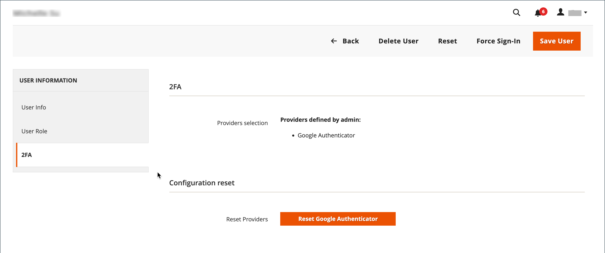

# 管理者ユーザーアカウントの管理

ストアを初めてインストールすると、完全な管理アクセス権を付与するログイン資格情報を使用して、デフォルトの管理者アカウントが作成されます。 ベストプラクティスとして、完全な管理者アクセス権を持つ別のユーザーアカウントを作成してください。 これにより、1 つのアカウントを日常の管理活動に使用し、もう 1 つを「スーパー管理者」アカウントとして予約できます。 これは、通常の資格情報を忘れた場合や、何らかの理由で使用できなくなった場合に役立ちます。

他のチームメンバーやサービスプロバイダーがアクセスを必要とする場合は、それらのメンバーに対して個別のユーザーアカウントを作成し、特定のビジネスニーズに基づいて制限付きアクセスを割り当てることができます。 管理者でユーザーがアクセスできる web サイトやストアを制限するには、まず [ 役割を作成 ](permissions-user-roles.md) する必要があります。範囲は限られており、必要なリソースのみが選択されています。 次に、その役割を特定のユーザーアカウントに割り当てることができます。 制限付き役割に割り当てられた管理者ユーザーは、その役割に関連付けられた Web サイトまたはストアのデータのみを表示および変更できますが、グローバル設定やデータは変更できません。

>[!NOTE]
>
>Adobe IDを持ち、Adobe CommerceおよびAdobe Business Products への効率的なログインを必要とするAdobe Commerce マーチャントは、Commerce認証をAdobe IMS認証ワークフローと統合できます。 この統合がCommerce ストアに対して有効になると、各管理者ユーザーは、Commerce資格情報ではなく、Adobe資格情報を使用してログインする必要があります。 [Adobe Identity Management Service （IMS）統合の概要 ](https://experienceleague.adobe.com/docs/commerce-admin/start/admin/ims/adobe-ims-integration-overview.html?lang=ja) を参照してください。

一時的なユーザーまたは役割の場合は、ユーザーアカウントの有効期限を設定することもできます。

<!--  update this to a better info-graphic  -->

## ユーザーの作成

1. _管理者_ サイドバーで、**[!UICONTROL System]**/_[!UICONTROL Permissions]_/**[!UICONTROL All Users]**&#x200B;に移動します。

1. 右上隅の「**[!UICONTROL Add New User]**」をクリックします。

   既存のユーザーを編集するには、グリッド内のユーザー名をクリックします。 必要に応じて、「_[!UICONTROL User Info]_」セクションと「_[!UICONTROL User Role]_」セクションを変更できます。

1. _[!UICONTROL Account Information]_&#x200B;セクションで、次の操作を行います。

   {width="600" zoomable="yes"}

   - アカウントの **[!UICONTROL User Name]** を入力します。

     ユーザー名は覚えやすいものにする必要があります。 大文字と小文字は区別されません。 例えば、ユーザー名が `John` の場合、`john` としてログインすることもできます。

   - 次の情報を入力します。

      - **[!UICONTROL First Name]**
      - **[!UICONTROL Last Name]**
      - **[!UICONTROL Email address]**

     各ユーザーアカウントには、一意のメールアドレスが必要です。

   - アカウントの **[!UICONTROL Password]** を入力します。

     >[!NOTE]
     >
     >管理者パスワードは 7 文字以上で、文字と数字の両方を含める必要があります。 その他のパスワードオプションについては、[Admin Security の設定 ](security-admin.md) を参照してください。

   - **[!UICONTROL Password Confirmation]**: パスワードを再入力して、正しく入力されていることを確認します。

   - ストアに複数の言語がある場合は、**[!UICONTROL Interface Locale]** を管理インターフェイスに使用される言語に設定します。

1. **[!UICONTROL This Account is]** を `Active` に設定します。

1. カレンダーアイコンをクリックして、ユーザーアカウントの **[!UICONTROL Expiration Date]** を設定します。

   ユーザーまたは役割が一時的な場合は、有効期限を定義すると役立ちます。 有効期限が切れると、ユーザーアカウントのステータスが `Inactive` に変わり、必要に応じて更新することができます。

1. _[!UICONTROL Current User Identity Verification]_&#x200B;の下に、ユーザーアカウントのパスワードを入力します。

>[!IMPORTANT]
>
>_[!UICONTROL Account Information]_&#x200B;のセクションが完了したら、ユーザーを保存できます。 新しいユーザーが&#x200B;_[!UICONTROL Users]_ グリッドに表示されますが、役割が割り当てられるまで、ユーザー名はログインできません。

## ユーザーの役割の割り当て

1. 左側のパネルで「**[!UICONTROL User Role]**」をクリックします。

   グリッドには、既存のすべてのユーザーの役割が一覧表示されます。 新しいストアの場合、_[!UICONTROL Administrators]_&#x200B;が使用可能な唯一の役割です。

   {width="600" zoomable="yes"}

1. _[!UICONTROL Assigned]_&#x200B;列で、ユーザーの役割を選択します。

   [ 既存の役割を表示するか、追加のユーザー役割を定義する ](permissions-user-roles.md) ことができます。 役割を定義したら、ユーザーアカウントを編集して新しい役割を割り当てる必要があります。

## 2FA プロバイダの検証またはリセット

1. 管理者ユーザーアカウントを開きます。

1. 左側のパネルで「**[!UICONTROL 2FA]**」をクリックします。

   {width="600" zoomable="yes"}

1. _管理者_ ユーザーが使用できる 2FA ソリューションを確認し、ログイン前に、使用するソリューションをインストールするように各ユーザーにアドバイスします。

   _Admin_ へのログインに必要な 2FA ソリューションは 1 つだけです。

1. ユーザーが 2FA ソリューションを再インストールする必要がある場合は、現在の 2FA 設定をリセットできます。

   この場合、ユーザーは再度ログインする前に、設定プロセスを繰り返す必要があります。 例えば、新しいスマートフォンがあり、Google Authenticator を再インストールする必要がある場合です。 ユーザーの現在の 2FA 設定をクリアするには、クリアするソリューションごとに **[!UICONTROL Reset (Provider)]** をクリックします。 プロンプトが表示されたら、「**[!UICONTROL OK]**」をクリックして確認します。

   [2FA の設定 ](security-two-factor-authentication.md) へのリンクが記載されたメールがユーザーに届きます。 リンクは 1 回だけ使用できます。 ユーザーが複数回ログインしようとすると、試行のたびに新しいリンクが送信されます。

1. 「**[!UICONTROL Save User]**」をクリックします。

1. プロンプトが表示されたら、パスワードを入力して ID を確認し、再度「**[!UICONTROL Save User]**」をクリックします。

   _[!UICONTROL Users]_&#x200B;グリッドが開き、すべてのユーザーが一覧表示されます。

## 管理者ユーザーの削除

1. _管理者_ サイドバーで、**[!UICONTROL System]**/_[!UICONTROL Permissions]_/**[!UICONTROL All Users]**&#x200B;に移動します。

1. グリッドの上にあるフィルターを使用してユーザーアカウントを見つけ、ユーザー名をクリックします。

1. プロンプトが表示されたら、パスワードを入力して ID を確認します。

1. 右上隅の「**[!UICONTROL Delete User]**」をクリックします。

1. アクションを確定するには、「**[!UICONTROL OK]**」をクリックします。

## パスワードを忘れた場合の E メールのリセット

管理者のメールテンプレート設定は、ユーザーがパスワードを忘れたり、リセットしたりしたときに送信されるメールを決定します。 この構成では、メッセージの送信者として表示されるストアの連絡先と、パスワード回復リンクが有効なままである期間を指定します。

**_管理者のメールテンプレートを設定するには：_**

1. _管理者_ サイドバーで、**[!UICONTROL Stores]**/_[!UICONTROL Setting]_/**[!UICONTROL Configuration]**&#x200B;に移動します。

1. 左側のパネルで「**[!UICONTROL Advanced]**」を展開し、「**[!UICONTROL Admin]**」を選択します。

1. 「**[!UICONTROL Admin User Emails]**」セクションの  を展開します。

   {width="600" zoomable="yes"}

1. 管理者ユーザーがパスワードを忘れた場合に送信されるテンプレートに **[!UICONTROL Forgot Password Email Template]** を設定します。

1. メッセージの送信者として表示されるストアの連絡先に **[!UICONTROL Forgot and Reset Email Sender]** を設定します。

1. 管理者通知のデフォルトとして使用されるメールテンプレートに **[!UICONTROL User Notification Template]** を設定します。

1. 完了したら、「**[!UICONTROL Save Config]**」をクリックします。

## ロックされたユーザー

ビジネスのセキュリティを確保するために、管理者に [ ログイン ](../getting-started/admin-signin.md) することに 6 回失敗すると、デフォルトでユーザーアカウントがロックされます。 現在ロックされているユーザーアカウントは、すべてロックされたユーザーグリッドに表示されます。 完全な管理者権限を持つ他のユーザーがアカウントをロック解除できます。

追加のパスワードセキュリティ対策を [ 詳細管理者 ](../configuration-reference/advanced/admin.md#security) 設定で実装できます。 [Admin Security](security-admin.md) を参照してください。

{width="300"}

**_管理者アカウントのロックを解除するには：_**

1. _管理者_ サイドバーで、**[!UICONTROL System]**/_[!UICONTROL Permissions]_/**[!UICONTROL Locked Users]**&#x200B;に移動します。

1. グリッドで、ロックされたアカウントのチェックボックスを選択します。

   {width="600" zoomable="yes"}

1. 左上隅の **[!UICONTROL Actions]** を `Unlock` に設定します。

1. **[!UICONTROL Submit]** をクリックして、アカウントのロックを解除します。
