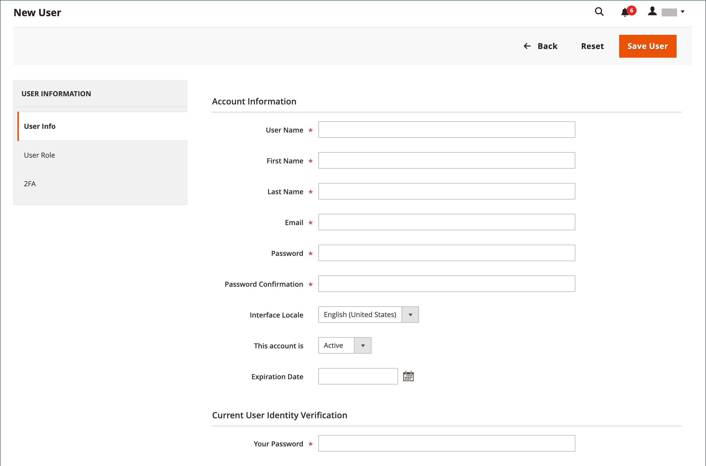
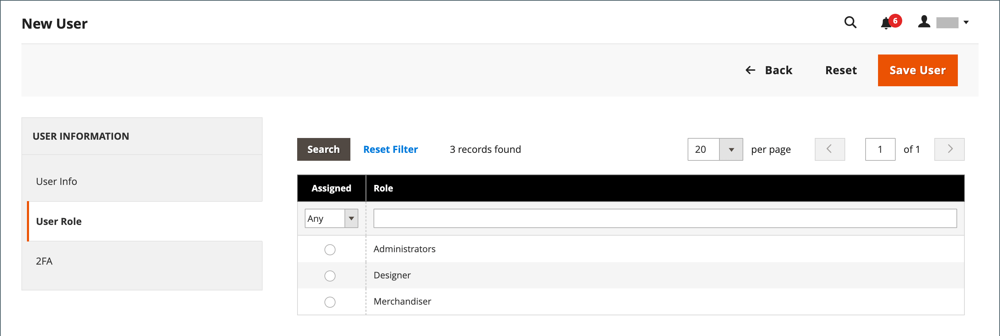
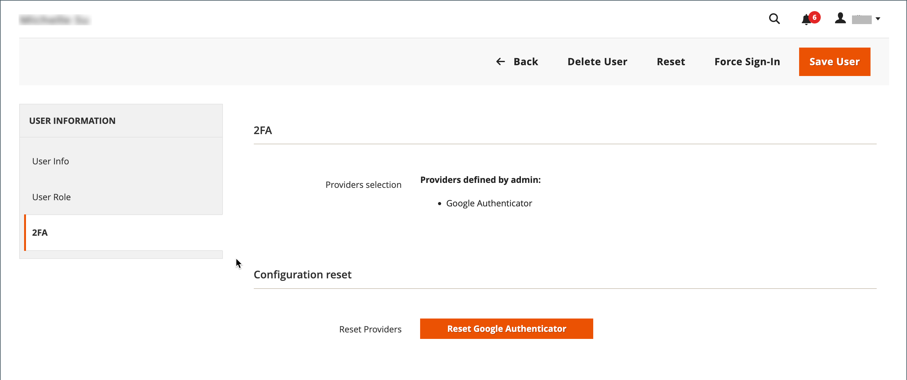
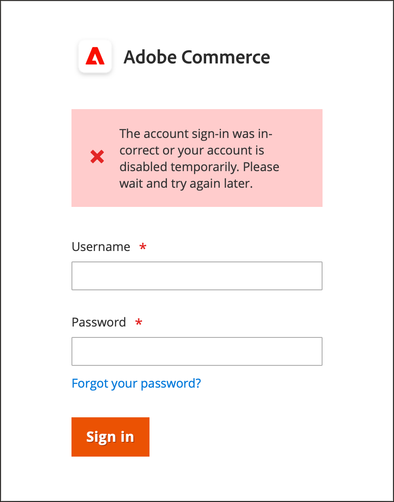
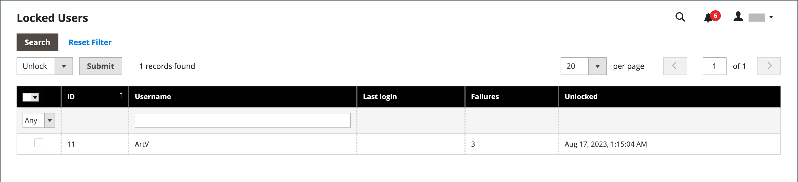

# 管理者ユーザーアカウントの管理

ストアを最初にインストールすると、デフォルトの管理者アカウントがログイン資格情報で作成され、完全な管理アクセスが可能になります。 ベストプラクティスとして、完全な管理者アクセス権を持つ別のユーザーアカウントを作成する必要があります。 これにより、日常的な管理業務に1つのアカウントを使用し、もう1つのアカウントを「スーパー管理者」アカウントとして予約できます。 これは、通常の資格情報を忘れた場合や、何らかの理由で使用できなくなる場合に役立ちます。

他のチームメンバーやサービスプロバイダーがアクセスを必要とする場合は、個々のユーザーアカウントを作成し、特定のビジネスニーズに基づいてアクセス制限を割り当てることができます。 管理者でユーザーがアクセスできるweb サイトまたはストアを制限するには、まず、範囲が制限され、必要なリソースのみが選択された役割[&#128279;](permissions-user-roles.md)を作成する必要があります。 次に、役割を特定のユーザーアカウントに割り当てます。 制限付き役割に割り当てられている管理者ユーザーは、役割に関連付けられているweb サイトまたはストアのデータのみを表示および変更できますが、グローバル設定またはデータを変更することはできません。

>[!NOTE]
>
>Adobe Commerceを使用しており、Adobe IDおよびAdobe Business製品への効率的なログインを希望するAdobe Commerce販売者は、Commerce認証とAdobe IMS認証ワークフローを統合できます。 この統合がCommerce ストアで有効になった後、各管理者ユーザーは、Commerceの資格情報ではなく、Adobeの資格情報を使用してログインする必要があります。 [Adobe Identity Management Service （IMS）統合の概要](https://experienceleague.adobe.com/docs/commerce-admin/start/admin/ims/adobe-ims-integration-overview.html?lang=ja)を参照してください。

一時的なユーザーまたは役割の場合は、ユーザーアカウントの有効期限を設定することもできます。

<!--  update this to a better info-graphic  -->

## ユーザーの作成

1. _管理者_ サイドバーで、**[!UICONTROL System]** > _[!UICONTROL Permissions]_>**[!UICONTROL All Users]**&#x200B;に移動します。

1. 右上隅の「**[!UICONTROL Add New User]**」をクリックします。

   既存のユーザーを編集するには、グリッドのユーザー名をクリックします。 必要に応じて、_[!UICONTROL User Info]_&#x200B;および&#x200B;_[!UICONTROL User Role]_ セクションを変更できます。

1. _[!UICONTROL Account Information]_&#x200B;セクションで、次の操作を行います。

   {width="600" zoomable="yes"}

   - アカウントの&#x200B;**[!UICONTROL User Name]**&#x200B;を入力してください。

     ユーザー名は覚えやすくする必要があります。 大文字と小文字を区別しません。 例えば、ユーザー名が`John`の場合、`john`としてログインすることもできます。

   - 次の情報を入力します。

      - **[!UICONTROL First Name]**
      - **[!UICONTROL Last Name]**
      - **[!UICONTROL Email address]**

     各ユーザーアカウントには一意のメールアドレスが必要です。

   - アカウントの&#x200B;**[!UICONTROL Password]**&#x200B;を入力してください。

     >[!NOTE]
     >
     >管理者パスワードは、7文字以上の長さ（デフォルト）で、文字と数字の両方を含める必要があります。 パスワードの最小長は、管理者セキュリティ設定で設定できます。 その他のパスワードオプションについては、[管理者セキュリティの設定](security-admin.md)を参照してください。

   - **[!UICONTROL Password Confirmation]**&#x200B;の場合、パスワードを再入力して、正しく入力されていることを確認します。

   - ストアに複数の言語がある場合は、管理者インターフェイスに使用する言語に&#x200B;**[!UICONTROL Interface Locale]**&#x200B;を設定します。

1. **[!UICONTROL This Account is]**&#x200B;を`Active`に設定します。

1. カレンダーアイコンをクリックして、ユーザーアカウントの&#x200B;**[!UICONTROL Expiration Date]**&#x200B;を設定します。

   有効期限の定義は、ユーザーまたは役割が一時的な場合に役立ちます。 有効期限が切れると、ユーザーアカウントのステータスが`Inactive`に変わり、必要に応じて更新できます。

1. _[!UICONTROL Current User Identity Verification]_&#x200B;で、ユーザーアカウントのパスワードを入力します。

>[!IMPORTANT]
>
>_[!UICONTROL Account Information]_&#x200B;セクションが完了したら、ユーザーを保存できます。 新しいユーザーは&#x200B;_[!UICONTROL Users]_ グリッドに表示されますが、ユーザー名は役割が割り当てられるまでログインできません。

## ユーザーの役割の割り当て

1. 左側のパネルで、**[!UICONTROL User Role]**&#x200B;をクリックします。

   グリッドには、既存のすべてのユーザーロールが一覧表示されます。 新しいストアの場合、_[!UICONTROL Administrators]_&#x200B;は利用可能な唯一の役割です。

   {width="600" zoomable="yes"}

1. _[!UICONTROL Assigned]_&#x200B;列で、ユーザーの役割を選択します。

   既存のユーザーを[表示したり、追加のユーザー役割を定義したりできます](permissions-user-roles.md)。 役割を定義したら、新しい役割を割り当てるためにユーザーアカウントを編集する必要があります。

## 2FA プロバイダーの確認またはリセット

1. Admin ユーザーアカウントを開きます。

1. 左側のパネルで、**[!UICONTROL 2FA]**&#x200B;をクリックします。

   {width="600" zoomable="yes"}

1. _管理者_&#x200B;のユーザーが利用できる2FA ソリューションを確認し、各ユーザーに対して、ログインする前に使用するソリューションをインストールするようにアドバイスします。

   _管理者_&#x200B;にログインするには、1つの2FA ソリューションによる認証が必要です。

1. ユーザーが2FA ソリューションを再インストールする必要がある場合は、現在の2FA設定をリセットできます。

   これには、ユーザーが再度ログインする前に、設定プロセスを繰り返す必要があります。 例えば、新しいスマートフォンを使用している場合、Google Authenticatorを再インストールする必要があります。 ユーザーの現在の2FA設定を消去するには、消去するソリューションごとに&#x200B;**[!UICONTROL Reset (Provider)]**&#x200B;をクリックします。 プロンプトが表示されたら、**[!UICONTROL OK]**&#x200B;をクリックして確認します。

   ユーザーは、[configure 2FA](security-two-factor-authentication.md)へのリンクを含む電子メールを受信します。 リンクは1回のみ使用できます。 ユーザーが複数回ログインしようとすると、試行のたびに新しいリンクが送信されます。

1. **[!UICONTROL Save User]**&#x200B;をクリックします。

1. プロンプトが表示されたら、パスワードを入力してIDを確認し、**[!UICONTROL Save User]**&#x200B;を再度クリックします。

   _[!UICONTROL Users]_&#x200B;グリッドが開き、すべてのユーザーが一覧表示されます。

## 管理者ユーザーの削除

1. _管理者_ サイドバーで、**[!UICONTROL System]** > _[!UICONTROL Permissions]_>**[!UICONTROL All Users]**&#x200B;に移動します。

1. グリッドの上にあるフィルターを使用してユーザーアカウントを見つけ、ユーザー名をクリックします。

1. プロンプトが表示されたら、パスワードを入力してIDを確認します。

1. 右上隅の「**[!UICONTROL Delete User]**」をクリックします。

1. アクションを確認するには、**[!UICONTROL OK]**&#x200B;をクリックします。

## パスワードを忘れた場合とメールアドレスをリセットした場合

管理者メールテンプレート設定は、ユーザーがパスワードを忘れてリセットしたときに送信されるメールを決定します。 この設定では、メッセージの送信者として表示されるストア連絡先と、パスワード回復リンクが有効な期間を指定します。

**_管理者メールテンプレートを設定するには:_**

1. _管理者_ サイドバーで、**[!UICONTROL Stores]** > _[!UICONTROL Setting]_>**[!UICONTROL Configuration]**&#x200B;に移動します。

1. 左側のパネルで、**[!UICONTROL Advanced]**&#x200B;を展開し、**[!UICONTROL Admin]**&#x200B;を選択します。

1. **[!UICONTROL Admin User Emails]** セクションのを展開します。

   {width="600" zoomable="yes"}

1. 管理者ユーザーがパスワードを忘れたときに送信されるテンプレートに&#x200B;**[!UICONTROL Forgot Password Email Template]**&#x200B;を設定します。

1. メッセージの送信者として表示されるストア連絡先に&#x200B;**[!UICONTROL Forgot and Reset Email Sender]**&#x200B;を設定します。

1. 管理者通知のデフォルトとして使用される電子メールテンプレートに&#x200B;**[!UICONTROL User Notification Template]**&#x200B;を設定します。

1. 完了したら、**[!UICONTROL Save Config]**&#x200B;をクリックします。

## ロックされたユーザー

ビジネスのセキュリティを確保するために、管理者に[&#x200B; ログイン &#x200B;](../getting-started/admin-signin.md)する際に6回失敗した後、ユーザーアカウントはデフォルトでロックされます。 現在ロックされているユーザーアカウントは、ロックされたユーザーグリッドに表示されます。 アカウントは、完全な管理者の権限を持つ他のユーザーがロックを解除できます。

追加のパスワードセキュリティ対策は、[詳細管理者](../configuration-reference/advanced/admin.md#security)設定で実装できます。 [管理者セキュリティ &#x200B;](security-admin.md)を参照してください。

{width="300"}

**_管理者アカウントのロックを解除するには:_**

1. _管理者_ サイドバーで、**[!UICONTROL System]** > _[!UICONTROL Permissions]_>**[!UICONTROL Locked Users]**&#x200B;に移動します。

1. グリッドで、ロックされたアカウントのチェックボックスを選択します。

   {width="600" zoomable="yes"}

1. 左上隅で、**[!UICONTROL Actions]**&#x200B;を`Unlock`に設定します。

1. 「**[!UICONTROL Submit]**」をクリックしてアカウントのロックを解除します。
