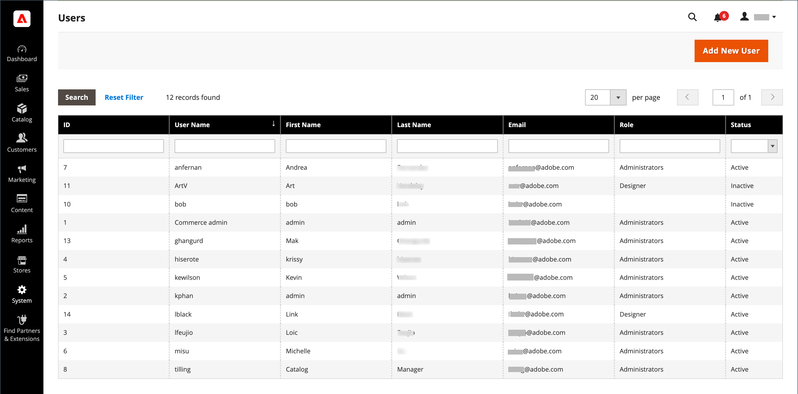

# 管理者権限

Adobe CommerceとMagento Open Sourceは、役割と権限を使用して、管理者に対する様々なレベルのアクセスを作成します。 ストアを最初に設定すると、完全な権限を持つ管理者の役割用の一連のログイン資格情報を受け取ります。 ただし、サイトで作業している他のユーザーに対しては、権限のレベルを「知る必要がある」という基準で制限できます。 例えば、デザインチームのメンバーには、コンテンツデザインツールのみのアクセス権を付与でき、顧客や注文の情報を含むエリアのアクセス権を付与することはできません。

さらに、管理者アクセスを、特定のサイトのみ、または一連のサイトとそれに関連するデータに制限することができます。 同じCommerce インストールに別々のストアを持つ複数のブランドまたはビジネスユニットがある場合、各ビジネスユニットに管理者アクセスを提供できますが、データを非表示にして他の管理者ユーザーから保護する必要があります。

管理者ユーザーのアクセスが特定の web サイトまたはストアに制限されている場合、権限のないユーザーは表示されないか、灰色で表示されます。 許可された Web サイトや店舗の売上高やその他のデータのみがユーザーに表示されます。

-  （Adobe Commerceのみ）デフォルトでは、ユーザーがストアに変更を加えると、そのユーザーが実行したすべてのアクションが自動的にログ（記録）されます。 管理者アクションは、で確認できます。 [アクションログレポート](action-log-report.md). ログインの設定 [管理アクションログ](action-log.md) ストアの高度な管理設定で指定します。

{width="700" zoomable="yes"}
