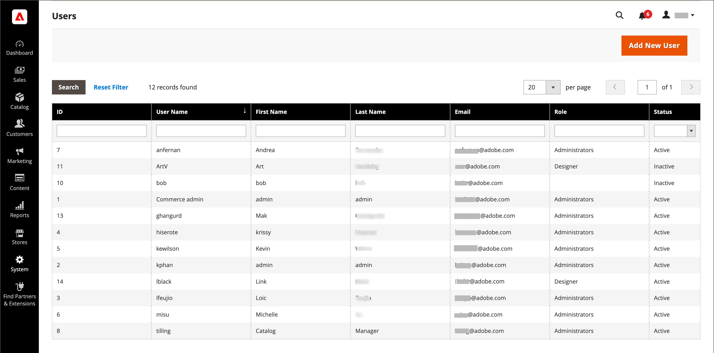

# 管理者権限

Adobe CommerceとMagento Open Sourceでは、ロールと権限を使用して、管理者に対する様々なレベルのアクセス権を設定します。 ストアを最初に設定すると、完全な権限を持つ管理者ロールの一連のログイン資格情報が届きます。 ただし、サイトで作業する他のユーザーの「知る必要がある」基準で、権限のレベルを制限できます。 たとえば、デザインチームのメンバーには、コンテンツデザインツールのみにアクセス権を与え、顧客や注文情報のある領域にはアクセス権を与えることはできません。

さらに、特定のサイトまたは一連のサイトとその関連データに対する管理者アクセスのみを制限できます。 同じCommerce インストールに複数のブランドまたは事業部が別々のストアを持つ場合は、各事業部に管理者アクセス権を付与しながら、他の管理者ユーザーからデータを非表示にしたり保護したりできます。

管理者ユーザーのアクセスが特定のweb サイトまたはストアに制限されている場合、許可されていないサイトは表示されないか、グレー表示になります。 許可されたweb サイトおよびストアの販売およびその他のデータのみがユーザーに表示されます。

-  （Adobe Commerceのみ）デフォルトでは、ユーザーがストアに変更を適用したときに実行したすべてのアクションが自動的に記録（記録）されます。 管理者アクションは、[&#x200B; アクションログレポート &#x200B;](action-log-report.md)で確認できます。 ストアの高度な管理者設定で[管理者アクション ログ &#x200B;](action-log.md)へのログインを設定します。

{width="700" zoomable="yes"}
