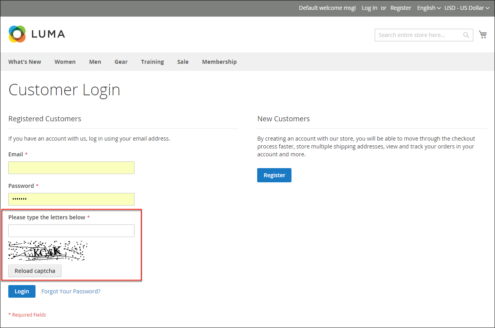
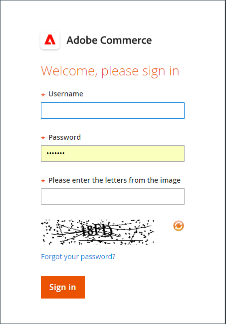

# CAPTCHA

CAPTCHAとは、コンピューター（または「ボット」）ではなく、人間がサイトとやり取りすることを保証するビジュアルデバイスです。 CAPTCHAは、_Completely Automated Public Turing testの頭字語で、コンピューターと人間を区別します_。 これは、管理者アクセスと、登録された顧客によって開始されたさまざまなストアフロントアクションの両方に使用できます。 Adobe CommerceとMagento Open Sourceは、このトピックと[Google reCAPTCHA](security-google-recaptcha.md)に記載されている標準CAPTCHAをサポートしています。

CAPTCHAは、画像の右上隅にあるリロードアイコンをクリックすることで、必要に応じて何度でもリロードできます。 CAPTCHAは完全に設定可能であり、毎回、または定義された数のログイン試行失敗後にのみ設定できます。

{width="700" zoomable="yes"}

## 管理者用CAPTCHAの設定

セキュリティをさらに強化するために、管理者のログインとパスワードを忘れたページにCAPTCHAを追加できます。 管理者ユーザーは、画像の右上隅にある「_リロード_ 」アイコンをクリックして、表示されたCAPTCHAをリロードできます。 リロード数は無制限です。

{width="300"}でログイン

1. _管理者_ サイドバーで、**[!UICONTROL Stores]** > _[!UICONTROL Settings]_>**[!UICONTROL Configuration]**に移動します。

1. 左側のパネルで、**[!UICONTROL Advanced]**&#x200B;を展開し、**[!UICONTROL Admin]**&#x200B;を選択します。

1. 右上隅で、**[!UICONTROL Store View]**&#x200B;を`Default`に設定します。

   Commerce インストールの[scope](../getting-started/websites-stores-views.md#scope-settings)に複数のweb サイトが含まれる場合は、CAPTCHA設定を適用するweb サイトを選択します。

1. **[!UICONTROL CAPTCHA]** セクションのを展開します。

1. **[!UICONTROL Enable CAPTCHA in Admin]**&#x200B;を`Yes`に設定します。 次に、残りのオプションを次のように入力します。

   {width="600" zoomable="yes"}

   - CAPTCHA シンボルに使用する&#x200B;**[!UICONTROL Font]**&#x200B;の名前を入力します（デフォルト：`LinLibertine`）。

     独自のフォントを追加するには、フォントファイルがCommerceのインストールと同じディレクトリに存在し、`app/code/Magento/Captcha/etc`のCaptcha モジュールの`config.xml` ファイルで宣言されている必要があります。

   - CAPTCHAを使用する次の&#x200B;**[!UICONTROL Forms]**&#x200B;のいずれかを選択します。 複数のフォームを選択するには、Ctrl キー（PC）またはCommand キー（Mac）を押します。

      - `Admin Login`
      - `Admin Forgot Password`

   - **[!UICONTROL Displaying Modes]**&#x200B;を次のいずれかに設定します：

      - `Always` – 管理者にログインするには、常にCAPTCHAが必要です。
      - `After number of attempts to login` – このオプションは、管理者ログインフォームにのみ適用されます。 選択すると、_[!UICONTROL Number of Unsuccessful Attempts to Login]_フィールドが表示されます。 許可するログイン試行回数を入力します。 0 （ゼロ）の値は、表示モードを`Always`に設定することと似ています。

     失敗したログイン試行回数を追跡するには、1つの電子メールアドレスと1つのIP アドレスからログインするたびにカウントされます。 同じIP アドレスから許可されるログイン試行の最大数は1,000です。 この制限は、CAPTCHAが有効になっている場合にのみ適用されます。

   - **[!UICONTROL Number of Unsuccessful Attempts to Login]**&#x200B;の場合、CAPTCHAが表示されるまでに管理者がログインを試すことができる回数を入力します。 0に設定した場合（`0`）、CAPTCHAは常に必要です。

   - **[!UICONTROL CAPTCHA Timeout (minutes)]**&#x200B;の場合、CAPTCHAの有効期限が切れるまでの分数を入力します。 CAPTCHAの有効期限が切れると、管理者はページを再読み込みする必要があります。

   - **[!UICONTROL Number of Symbols]**&#x200B;を入力してCAPTCHAに表示します。 最大8つの（`8`）記号を使用できます。 各CAPTCHAで変化するシンボルの可変数の場合は、範囲（`5-8`など）を入力します。

   - **[!UICONTROL Symbols Used in CAPTCHA]**&#x200B;に、CAPTCHAでランダムに表示する文字（a ～ zおよびA ～ Z）と数字（0 ～ 9）を入力します。 `i`、`l`、`1`など、他のシンボルと区別しにくいシンボルは、CAPTCHA シンボルのデフォルトセットには含まれません。

   - CAPTCHAに示すように、管理者が大文字または小文字を正確に入力することを求める場合は、**[!UICONTROL Case Sensitive]**&#x200B;を`Yes`に設定します。

1. 完了したら、**[!UICONTROL Save Config]**&#x200B;をクリックします。

## ストアフロントのCAPTCHAの設定

お客様は、アカウントにログインするたびに、またはログインに失敗した後に、CAPTCHAを入力する必要があります。 さらに、ストアフロント全体で使用される多数のフォームを設定して、CAPTCHAによる検証を必要とすることができます。

{width="700" zoomable="yes"}

1. _管理者_ サイドバーで、**[!UICONTROL Stores]** > _[!UICONTROL Settings]_>**[!UICONTROL Configuration]**に移動します。

1. 左側のパネルで、**[!UICONTROL Customers]**&#x200B;を展開し、**[!UICONTROL Customer Configuration]**&#x200B;を選択します。

1. **[!UICONTROL CAPTCHA]** セクションのを展開します。

{width="600" zoomable="yes"}

1. **[!UICONTROL Enable CAPTCHA on Storefront]**&#x200B;を`Yes`に設定します。 次に、残りのオプションを次のように入力します。

   - CAPTCHA シンボルに使用する&#x200B;**[!UICONTROL Font]**&#x200B;の名前を入力します（デフォルト：`LinLibertine`）。

     独自のフォントを追加するには、フォントファイルがCommerce インストールと同じディレクトリに存在し、CAPTCHA モジュールの`config.xml` ファイルで宣言されている必要があります。

   - CAPTCHAを使用する次の&#x200B;**[!UICONTROL Forms]**&#x200B;のいずれかを選択します。 複数のフォームを選択するには、Ctrl キー（PC）またはCommand キー（Mac）を押します。

      - `Applying coupon code`
      - `Checkout/Placing Order`
      - `Create user`
      - `Login`
      - `Forgot password`
      - `Contact Us`
      - `Change password`
      - `Share Wishlist Form`
      - `Payflow Pro` （[ セキュリティパッチ ](https://experienceleague.adobe.com/docs/commerce-knowledge-base/kb/troubleshooting/payments/paypal-payflow-pro-active-carding-activity.html) _ナレッジベース_&#x200B;の記事を参照）
      - `Send to Friend Form`  （Magento Open Sourceのみ）
      - `Add Gift Card Code`  （Adobe Commerceのみ）
      - `Create company`  （Adobe Commerce B2Bでのみ利用可能）

   - **[!UICONTROL Displaying Mode]**&#x200B;を次のいずれかに設定します：

      - `Always` – 選択したフォームにアクセスするには、常にCAPTCHAが必要です。
      - `After number of attempts to login` — CAPTCHAが表示されるまでのログイン試行回数を入力します。 0 （ゼロ）の値は「Always」と似ています。 選択すると、失敗したログイン試行回数が表示されます。 このオプションは、パスワードを忘れたフォームには適用されません。このフォームを有効にすると、常にCAPTCHAが表示されます。

   - **[!UICONTROL Number of Unsuccessful Attempts to Login]**&#x200B;の場合、CAPTCHAが表示されるまでに顧客が正常にログインできない回数を入力します。 0に設定した場合（`0`）、CAPTCHAは常に使用されます。

   - **[!UICONTROL CAPTCHA Timeout (minutes)]**&#x200B;の場合、CAPTCHAの有効期限が切れるまでの分数を入力します。 CAPTCHAの有効期限が切れると、顧客はページを再読み込みして新しいCAPTCHAを生成する必要があります。

   - **[!UICONTROL Number of Symbols]**&#x200B;を入力してCAPTCHAに表示します。 最大8つの（`8`）記号を使用できます。 各CAPTCHAで変化するシンボルの可変数の場合は、範囲（`5-8`など）を入力します。

   - **[!UICONTROL Symbols Used in CAPTCHA]**&#x200B;に、CAPTCHAでランダムに表示する文字（a ～ zおよびA ～ Z）と数字（0 ～ 9）を入力します。 既定の文字セットには、`I`や`1`などの類似した記号は含まれていません。 最適な結果を得るには、ユーザーが容易に識別できる記号を使用します。

   - CAPTCHAに示されているとおりに大文字または小文字の文字を入力することを顧客に要求する場合は、**[!UICONTROL Case Sensitive]**&#x200B;を`Yes`に設定します。

1. 完了したら、**[!UICONTROL Save Config]**&#x200B;をクリックします。
