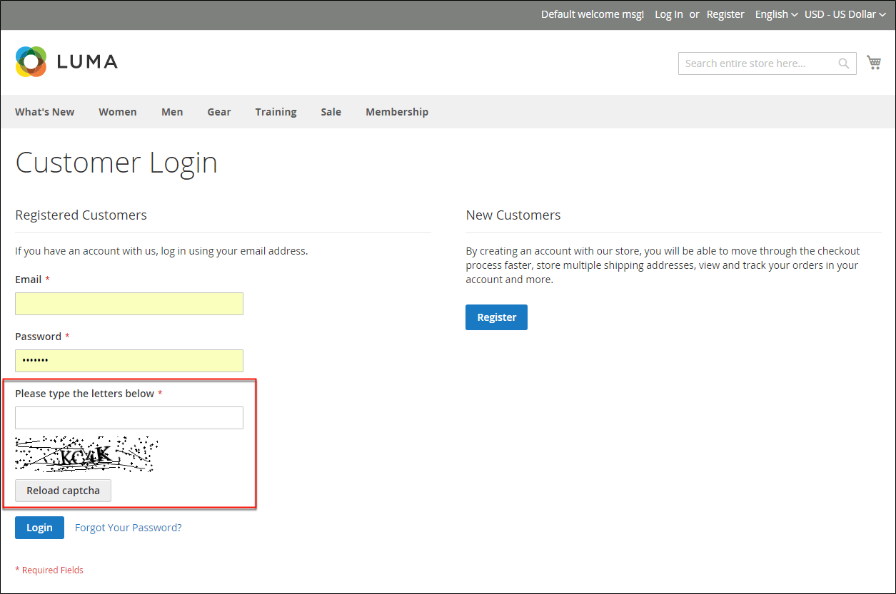

# CAPTCHA

CAPTCHA は、コンピューター（または「ボット」）ではなく人間がサイトとやり取りしていることを保証する視覚的なデバイスです。 CAPTCHA は、_Completely Automated Public Turing test to tell Computers and Humans Apart_ の頭字語です。 管理者アクセスと、登録済み顧客によって開始された様々なストアフロントアクションの両方に使用できます。 Adobe CommerceとMagento Open Sourceは、このトピックで説明されている標準の CAPTCHA と [&#128279;](security-google-recaptcha.md)0&rbrace;Google reCAPTCHA&rbrace; をサポートしています。

画像の右上隅にある「再読み込み」アイコンをクリックして、CAPTCHA を必要な回数だけ再読み込みできます。 CAPTCHA は完全に設定可能で、毎回または定義した回数のログイン試行に失敗した後にのみ表示されるように設定できます。

{width="700" zoomable="yes"}

## 管理者用の CAPTCHA の設定

セキュリティのレベルを高めるために、管理者のログインとパスワードを忘れた場合のページに CAPTCHA を追加できます。 管理者ユーザーは、画像の右上隅にある _再読み込み_ アイコンをクリックして、表示された CAPTCHA を再読み込みできます。 リロードの回数に制限はありません。

{width="300"}

1. _管理者_ サイドバーで、**[!UICONTROL Stores]**/_[!UICONTROL Settings]_/**[!UICONTROL Configuration]**&#x200B;に移動します。

1. 左側のパネルで「**[!UICONTROL Advanced]**」を展開し、「**[!UICONTROL Admin]**」を選択します。

1. 右上隅の **[!UICONTROL Store View]** を `Default` に設定します。

   Commerce インストールの [ 範囲 ](../getting-started/websites-stores-views.md#scope-settings) に複数の web サイトが含まれている場合は、CAPTCHA 設定を適用する web サイトを選択します。

1. 「」を展開し、「**[!UICONTROL CAPTCHA]**」セクションを展開します。

1. **[!UICONTROL Enable CAPTCHA in Admin]** を `Yes` に設定します。 その後、残りのオプションを次のように設定します。

   {width="600" zoomable="yes"}

   - CAPTCHA シンボルに使用する **[!UICONTROL Font]** の名前を入力します（デフォルト：`LinLibertine`）。

     独自のフォントを追加するには、フォントファイルがCommerceのインストール先と同じディレクトリにあり、`app/code/Magento/Captcha/etc` の Captcha モジュールの `config.xml` ファイルで宣言されている必要があります。

   - CAPTCHA を使用する場所として、以下のいずれかの **[!UICONTROL Forms]** を選択します。 複数のフォームを選択するには、Ctrl キー（PC）または Command キー（Mac）を押したままにします。

      - `Admin Login`
      - `Admin Forgot Password`

   - **[!UICONTROL Displaying Modes]** を次のいずれかに設定します。

      - `Always` – 管理者にログインするには、常に CAPTCHA が必要です。
      - `After number of attempts to login` – このオプションは、管理者ログインフォームにのみ適用されます。 選択すると、_[!UICONTROL Number of Unsuccessful Attempts to Login]_&#x200B;フィールドが表示されます。 許可するログイン試行回数を入力します。 値が 0 （ゼロ）の場合は、表示モードを `Always` に設定する場合と似ています。

     失敗したログイン試行の回数を追跡するために、1 つのメールアドレスおよび 1 つの IP アドレスからのログイン試行がカウントされます。 同じ IP アドレスから許可されるログイン試行回数の上限は 1,000 です。 この制限は、CAPTCHA が有効な場合にのみ適用されます。

   - **[!UICONTROL Number of Unsuccessful Attempts to Login]**：管理者がログインを試みる回数を入力します。この回数を超えると CAPTCHA が表示されます。 ゼロ（`0`）に設定した場合、CAPTCHA は常に必須です。

   - **[!UICONTROL CAPTCHA Timeout (minutes)]**:CAPTCHA の有効期限が切れるまでの分数を入力します。 CAPTCHA の有効期限が切れたら、管理者はページをリロードする必要があります。

   - CAPTCHA に表示する **[!UICONTROL Number of Symbols]** を入力します。 最大 8 個の（`8`）記号を使用できます。 各 CAPTCHA で変化するシンボルの数を可変にするには、範囲（`5-8` など）を入力します。

   - **[!UICONTROL Symbols Used in CAPTCHA]**:CAPTCHA でランダムに表示する文字（a ～ z と A ～ Z）および数字（0 ～ 9）を入力します。 `i`、`l`、`1` などの他のシンボルと区別しにくいシンボルは、CAPTCHA シンボルのデフォルトセットには含まれません。

   - 管理者に、CAPTCHA に示すように大文字と小文字を区別して入力させたい場合は、**[!UICONTROL Case Sensitive]** を `Yes` に設定します。

1. 完了したら、「**[!UICONTROL Save Config]**」をクリックします。

## ストアフロントの CAPTCHA の設定

顧客は、アカウントにログインするたびに、またはログインに何度か失敗した後に、CAPTCHA を入力する必要が生じる場合があります。 さらに、ストアフロント全体で使用される多数のフォームを、CAPTCHA による検証を必要とするように設定できます。

{width="700" zoomable="yes"}

1. _管理者_ サイドバーで、**[!UICONTROL Stores]**/_[!UICONTROL Settings]_/**[!UICONTROL Configuration]**&#x200B;に移動します。

1. 左側のパネルで「**[!UICONTROL Customers]**」を展開し、「**[!UICONTROL Customer Configuration]**」を選択します。

1. 「」を展開し、「**[!UICONTROL CAPTCHA]**」セクションを展開します。

{width="600" zoomable="yes"}

1. **[!UICONTROL Enable CAPTCHA on Storefront]** を `Yes` に設定します。 その後、残りのオプションを次のように設定します。

   - CAPTCHA シンボルに使用する **[!UICONTROL Font]** の名前を入力します（デフォルト：`LinLibertine`）。

     独自のフォントを追加するには、フォントファイルがCommerceのインストール先と同じディレクトリにあり、CAPTCHA モジュールの `config.xml` ファイルで宣言されている必要があります。

   - CAPTCHA を使用する場所として、以下のいずれかの **[!UICONTROL Forms]** を選択します。 複数のフォームを選択するには、Ctrl キー（PC）または Command キー（Mac）を押したままにします。

      - `Applying coupon code`
      - `Checkout/Placing Order`
      - `Create user`
      - `Login`
      - `Forgot password`
      - `Contact Us`
      - `Change password`
      - `Share Wishlist Form`
      - `Payflow Pro` （[ セキュリティパッチ ](https://experienceleague.adobe.com/docs/commerce-knowledge-base/kb/troubleshooting/payments/paypal-payflow-pro-active-carding-activity.html)_ナレッジベース_ 記事を参照）
      - `Send to Friend Form`  （Magento Open Sourceのみ）
      - `Add Gift Card Code`  （Adobe Commerceのみ）
      - `Create company`  （Adobe Commerce B2B でのみ使用可能）

   - **[!UICONTROL Displaying Mode]** を次のいずれかに設定します。

      - `Always` – 選択したフォームにアクセスするには、常に CAPTCHA が必要です。
      - `After number of attempts to login` — CAPTCHA が表示されるまでのログイン試行回数を入力します。 値が 0 （ゼロ）の場合は、「常に」に似ています。 選択すると、失敗したログインの試行回数が表示されます。 このオプションは、「パスワードを忘れた場合」フォームには適用されません。このフォームを有効にすると、常に CAPTCHA が表示されます。

   - **[!UICONTROL Number of Unsuccessful Attempts to Login]**：顧客がログインに失敗した回数を入力します。この回数を超えると CAPTCHA が表示されます。 ゼロ（`0`）に設定すると、常に CAPTCHA が使用されます。

   - **[!UICONTROL CAPTCHA Timeout (minutes)]**:CAPTCHA の有効期限が切れるまでの分数を入力します。 CAPTCHA の有効期限が切れたら、新しい CAPTCHA を生成するために、顧客はページをリロードする必要があります。

   - CAPTCHA に表示する **[!UICONTROL Number of Symbols]** を入力します。 最大 8 個の（`8`）記号を使用できます。 各 CAPTCHA で変化するシンボルの数を可変にするには、範囲（`5-8` など）を入力します。

   - **[!UICONTROL Symbols Used in CAPTCHA]**:CAPTCHA でランダムに表示する文字（a ～ z と A ～ Z）および数字（0 ～ 9）を入力します。 デフォルトの文字セットには、`I` や `1` などの類似の記号は含まれていません。 最適な結果を得るには、ユーザーが識別しやすい記号を使用します。

   - CAPTCHA に示されているとおりに大文字と小文字を区別して入力するよう顧客に求める場合は、**[!UICONTROL Case Sensitive]** を `Yes` に設定します。

1. 完了したら、「**[!UICONTROL Save Config]**」をクリックします。
