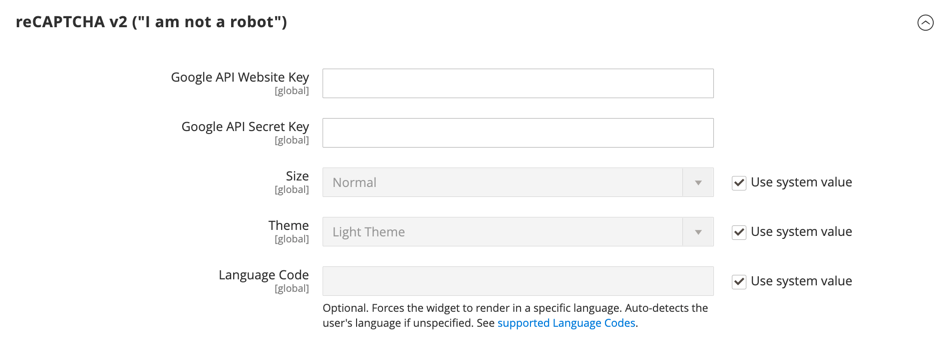
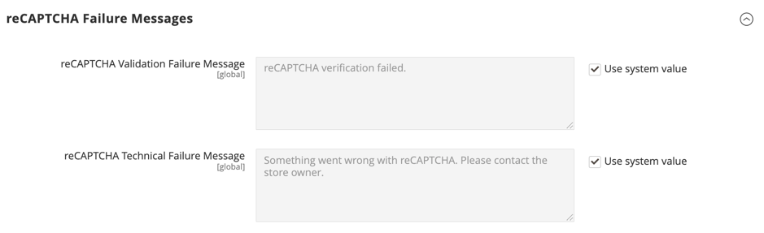

# Google reCAPTCHA V3およびV2

[Google reCAPTCHA](https://developers.google.com/recaptcha)を使用すると、コンピューター（または「ボット」）ではなく、人間がWeb サイトと対話できるようになります。 標準のAdobe CommerceおよびMagento Open Source [CAPTCHA](security-captcha.md)とは異なり、Google reCAPTCHAは、様々な表示オプションとメソッドを備えた強化されたセキュリティを提供します。 その他のweb サイトトラフィック情報は、Google reCAPTCHA アカウントのダッシュボードで確認できます。

Google reCAPTCHAは、管理者とストアフロント用に個別に設定されます。

- 管理者の場合は、[ ログイン ](../getting-started/admin-signin.md) ページでGoogle reCAPTCHAを使用できます。また、ユーザーがパスワードのリセットをリクエストした場合にも使用できます。 標準のCommerce [CAPTCHA](security-captcha.md)も有効になっている場合、Google reCAPTCHAは問題なく同時に使用できます。

- ストアフロントの場合、Google reCAPTCHAを使用して[お客様アカウント ](../customers/customer-sign-in.md)にログインし、[お問い合わせ](../getting-started/store-details.md#contact-us-form) ページからメッセージを送信し、その他の多数のストアフロントの場所で使用できます。

  {width="700" zoomable="yes"}

Google reCAPTCHAは、いくつかの方法で実装できます。

- _reCAPTCHA v3 Invisible_ — アルゴリズムを使用してユーザーのインタラクションを評価し、スコアに基づいてユーザーが人間である可能性を判断します。

- _reCAPTCHA v2 Invisible_ — ユーザーの操作なしでバックグラウンド検証を実行します。 ユーザーと顧客は自動的に検証されますが、課題を完了するために特定の画像を選択する必要がある場合があります。

- _reCAPTCHA v2 （「I am not a robot」）_ — 「I&#39;m not a robot」 _チェックボックスでリクエストを検証します。_

>[!IMPORTANT]
>
>Google reCAPTCHAを設定する前に、`PHP.ini` ファイルに次の設定が含まれていることを確認してください：`allow_url_fopen = 1`。 これには開発者のサポートが必要になる場合があります。 インストールガイドの「[必要なPHP設定](https://experienceleague.adobe.com/docs/commerce-operations/installation-guide/prerequisites/php-settings.html){:target="_blank"}」を参照してください。

## 手順1:Google reCAPTCHA キーの生成

Google reCAPTCHAを有効にするには、一対のAPI キーが必要です。 これらのキーは、reCAPTCHA サイトから無料で入手できます。 キーを生成する前に、使用するreCAPTCHAのタイプを把握しておく必要があります。

1. Google reCAPTCHA Admin Consoleを開き、アカウントにログインします。

1. **[!UICONTROL Label]**&#x200B;の場合、内部参照のキーを識別する名前を入力します。

   Adobe CommerceまたはMagento Open Sourceのインストールで使用されるreCAPTCHA タイプごとに1つのキーのセットが必要です。 例：`Commerce Invisible`

1. **[!UICONTROL reCAPTCHA type]**&#x200B;に対して、使用するメソッドを選択します。

   - _reCAPTCHA v3 Invisible_
   - _reCAPTCHA v2 Invisible_
   - _reCAPTCHA v2 （&quot;I am not a robot&quot;）_

1. **[!UICONTROL Domain]**&#x200B;に、ストアのドメインを入力します。 例：mystore.com

   異なるドメインを持つ複数のストアがある場合は、各ドメインを別々の行に入力します。

   - ストアドメインとサブドメインを追加します。
   - テスト用に必要に応じて、`localhost`、その他のローカル VM ドメイン、ステージング ドメインを追加できます。

1. クラウドプロジェクトの選択

1. **[!UICONTROL Accept the reCAPTCHA Terms of Service]**&#x200B;のチェックボックスをオンにします。

1. （オプション） Googleで問題や疑わしいトラフィックが検出された場合に通知を送信するには、「**[!UICONTROL Send alerts to owners]**」チェックボックスをオンにします。

1. **[!UICONTROL Submit]**&#x200B;をクリックして登録を完了し、キーを受け取ります。

   >[!IMPORTANT]
   >
   >すべてのキーがreCAPTCHAのすべてのタイプに適用されるわけではなく、誤って適用すると、予期しない動作が発生する可能性があります。 例えば、reCAPTCHA v2 「I&#39;m not a robot」用に生成されたGoogle reCAPTCHA キーは&#x200B;_reCAPTCHA v2 Invisible_&#x200B;では機能せず、reCAPTCHAが有効になっている機能がブロックされる可能性があります。

## 手順2：管理者用Google reCAPTCHAの設定

[!BADGE PaaSのみ]{type=Informative url="https://experienceleague.adobe.com/en/docs/commerce/user-guides/product-solutions" tooltip="Adobe Commerce on Cloud プロジェクト（Adobeで管理されるPaaS インフラストラクチャ）とオンプレミス プロジェクトにのみ適用されます。"}

1. Admin アカウントにログインします。

1. 管理者サイドバーで、**[!UICONTROL Stores]** > _[!UICONTROL Settings]_>**[!UICONTROL Configuration]**に移動します。

1. 右上隅で、**[!UICONTROL Store View]**&#x200B;を`Default Config`に設定します。

1. 左側のパネルで、**[!UICONTROL Security]**&#x200B;を展開し、**[!UICONTROL Google reCAPTCHA Admin Panel]**&#x200B;をクリックします。

   >[!NOTE]
   >
   >設定する各フィールドの&#x200B;**[!UICONTROL Use system value]** チェックボックスをオフにします。

1. _[!DNL reCAPTCHA v2 ("I am not a robot")]_を使用するには、**[!UICONTROL reCAPTCHA v2 ("I am not a robot")]**セクションを展開し、次の操作を行います。

   - **[!UICONTROL Google API Website Key]**&#x200B;に、Google reCAPTCHA アカウントを登録したときに、このreCAPTCHA タイプ用に作成されたweb サイト キーを入力します。

   - **[!UICONTROL Google API Secret Key]**&#x200B;に、Google reCAPTCHA アカウントに関連付けられている秘密鍵を入力します。

   - **[!UICONTROL Size]**&#x200B;の場合、表示するGoogle reCAPTCHA ボックスのサイズを選択します。 オプション：`Normal (default)` / `Compact`

   - **[!UICONTROL Theme]**&#x200B;で、Google reCAPTCHA ボックスのスタイル設定に使用するテーマを選択します。 オプション：`Light Theme (default)` / `Dark Theme`

   - **[!UICONTROL Language Code]**&#x200B;の場合、2文字のコードを入力して、Google reCAPTCHA テキストとメッセージに使用する[言語を指定します](https://developers.google.com/recaptcha/docs/language)。

   {width="600" zoomable="yes"}

1. _[!DNL reCAPTCHA v2 Invisible]_を使用するには、**[!UICONTROL reCAPTCHA v2 Invisible]**セクションを展開し、次の操作を行います。

   - **[!UICONTROL Google API Website Key]**&#x200B;に、Google reCAPTCHA アカウントを登録したときに、このreCAPTCHA タイプ用に作成されたweb サイト キーを入力します。

   - **[!UICONTROL Google API Secret Key]**&#x200B;に、Google reCAPTCHA アカウントに関連付けられている秘密鍵を入力します。

   - **[!UICONTROL Invisible Badge Position]**&#x200B;で、各ページで使用するバッジの位置を選択します。 オプション：`Inline` / `Bottom Right` / `Bottom Left`

   - **[!UICONTROL Theme]**&#x200B;で、Google reCAPTCHA ボックスのスタイル設定に使用するテーマを選択します。 オプション：`Light Theme (default)` / `Dark Theme`

   - **[!UICONTROL Language Code]**&#x200B;の場合、Google reCAPTCHA テキストとメッセージに使用される[言語を指定する2文字のコードを入力します](https://developers.google.com/recaptcha/docs/language)。

   {width="600" zoomable="yes"}

1. _[!DNL reCAPTCHA v3 Invisible]_を使用するには、**[!UICONTROL reCAPTCHA v3 Invisible]**セクションを展開し、次の操作を行います。

   - **[!UICONTROL Google API Website Key]**&#x200B;に、Google reCAPTCHA アカウントを登録したときに、このreCAPTCHA タイプ用に作成されたweb サイト キーを入力します。

   - **[!UICONTROL Google API Secret Key]**&#x200B;に、Google reCAPTCHA アカウントに関連付けられている秘密鍵を入力します。

   - ユーザーとのやり取りが潜在的なリスクとしてフラグ付けされるタイミングを特定するには、**[!UICONTROL Minimum Score Threshold]**&#x200B;を入力します。ここでは、1.0は典型的なユーザーとのやり取りであり、0.0はボットである可能性が高いです。 既定：`0.5`

   - **[!UICONTROL Invisible Badge Position]**&#x200B;で、各ページで使用する位置を選択します。 オプション：`Inline` / `Bottom Right` / `Bottom Left`

   - **[!UICONTROL Theme]**&#x200B;で、Google reCAPTCHA ボックスのスタイル設定に使用するテーマを選択します。 オプション：`Light Theme (default)` / `Dark Theme`

   - **[!UICONTROL Language Code]**&#x200B;の場合、Google reCAPTCHA テキストとメッセージに使用される[言語を指定する2文字のコードを入力します](https://developers.google.com/recaptcha/docs/language)。

   {width="600" zoomable="yes"}

1. **[!UICONTROL reCAPTCHA Validation Failure Messages]**&#x200B;を展開し、検証が失敗した場合や完了できなかった場合に管理者に表示されるメッセージを入力します。

   {width="600" zoomable="yes"}

1. **[!UICONTROL Admin Panel]** セクションを展開し、必要に応じて次の設定を行います。

   - 管理者サインインページに使用するreCAPTCHA タイプに&#x200B;**[!UICONTROL Enable for Login]**&#x200B;を設定します。

   - パスワードのリセット要求に使用するreCAPTCHA タイプに&#x200B;**[!UICONTROL Enable for Forgot Password]**&#x200B;を設定します。

   {width="600" zoomable="yes"}

## 手順3：ストアフロント用にGoogle reCAPTCHAを設定する

1. _[!UICONTROL Security]_の下の左側のパネルで、**[!UICONTROL Google reCAPTCHA Storefront]**を選択します。

1. ストアフロントで使用する各reCAPTCHA タイプのセクションを完了します。

   各reCAPTCHA タイプのオプションについて詳しくは、_手順2：管理者_&#x200B;用にGoogle reCAPTCHAを設定するを参照してください。

1. **[!UICONTROL reCAPTCHA Validation Failure Messages]**&#x200B;を展開し、検証が失敗した場合や完了できなかった場合にストアフロントに表示されるメッセージを入力します。

1. **[!UICONTROL Storefront]** セクションを展開します。

   >[!NOTE]
   >
   >設定する各フィールドの&#x200B;**[!UICONTROL Use system value]** チェックボックスをオフにします。

1. 各ストアフロントの場所フィールドを、使用するように設定したreCAPTCHAのタイプに設定します。

   {{recaptcha-forms-list}}

   {width="600" zoomable="yes"}

## 手順4：設定の保存

1. 設定が完了したら、**[!UICONTROL Save Config]**&#x200B;をクリックします。

1. ワークスペースの上部にあるメッセージで「**[!UICONTROL Cache Management]**」をクリックし、無効なキャッシュを1つずつ更新します。
