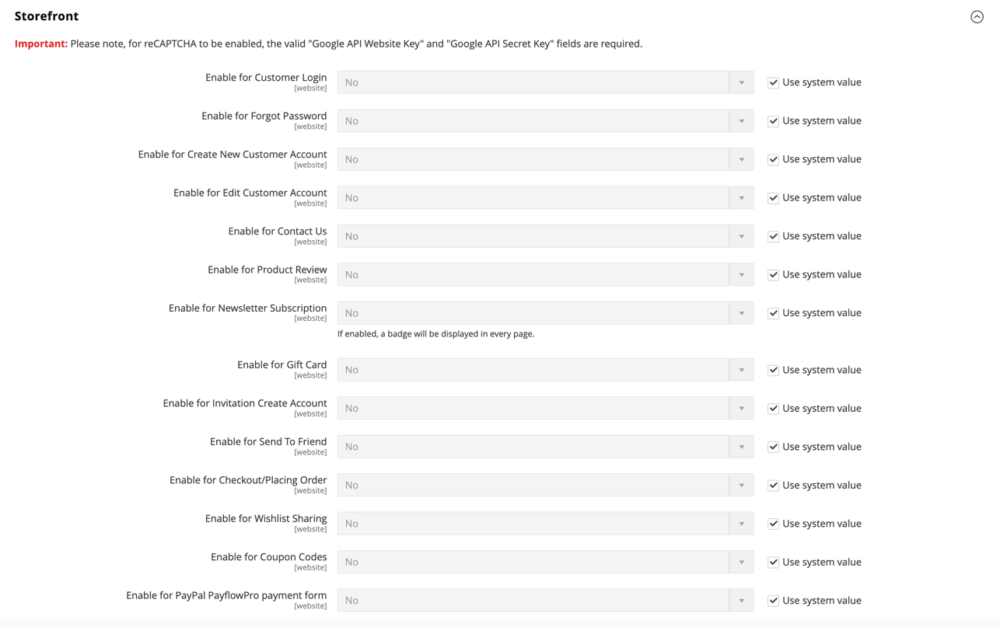

# Google reCAPTCHA

[Google reCAPTCHA](https://developers.google.com/recaptcha) は、人間がコンピューター（または「ボット」）ではなく、Web サイトとやり取りしていることを確認します。 標準のAdobe CommerceとMagento Open Sourceとは異なり [CAPTCHA](security-captcha.md)Google reCAPTCHA は、様々な表示オプションや方法を選択することで、セキュリティを強化します。 追加の Web サイトトラフィック情報は、Google reCAPTCHA アカウントのダッシュボードで確認できます。

Google reCAPTCHA は、管理者とストアフロント用に個別に設定されます。

- 管理者の場合、Google reCAPTCHA を [ログイン](../getting-started/admin-signin.md) ページに表示され、ユーザーがパスワードのリセットを要求したときに表示されます。 標準のコマースの場合 [CAPTCHA](security-captcha.md) また、Google reCAPTCHA を同時に使用しても問題はありません。

- ストアフロントの場合、Google reCAPTCHA を使用して、 [顧客アカウント](../customers/customer-sign-in.md)、 [お問い合わせ](../getting-started/store-details.md#contact-us-form) ページ、および他の多数のストアフロントの場所で使用できます。

  {width="700" zoomable="yes"}

Google reCAPTCHA は、次の複数の方法で実装できます。

- _reCAPTCHA v3 Invisible_  — アルゴリズムを使用してユーザーのインタラクションを評価し、スコアに基づいてユーザーが人間である可能性を判断します。

- _reCAPTCHA v2 Invisible_  — ユーザーの操作を必要とせずに、バックグラウンド検証を実行します。 ユーザーとお客様は自動的に検証されますが、課題を解決するために特定の画像を選択する必要が生じる場合があります。

- _reCAPTCHA v2(「I am not a robot」)_  — リクエストを _「私はロボットではない」_ チェックボックス。

>[!IMPORTANT]
>
>Google reCAPTCHA を設定する前に、 `PHP.ini` ファイルには次の設定が含まれます。 `allow_url_fopen = 1`. 開発者の支援が必要になる場合があります。 詳しくは、 [必要な PHP 設定](https://experienceleague.adobe.com/docs/commerce-operations/installation-guide/prerequisites/php-settings.html)『インストールガイド』の {:target=&quot;_blank&quot;}。

## 手順 1:Google reCAPTCHA キーを生成する

Google reCAPTCHA を有効にするには、API キーのペアが必要です。 これらのキーは、reCAPTCHA サイトから無料で入手できます。 キーを生成する前に、使用する reCAPTCHA のタイプを把握しておく必要があります。

1. Google reCAPTCHA ページを開き、アカウントにログインします。

1. の場合 **[!UICONTROL Label]**&#x200B;内部参照のキーを識別する名前を入力します。

   Adobe CommerceまたはMagento Open Sourceインストールで使用される reCAPTCHA タイプごとに 1 組のキーが必要です。 例： `Commerce Invisible`

1. の場合 **[!UICONTROL reCAPTCHA type]**、使用するメソッドを選択します。

   - _reCAPTCHA v3 Invisible_
   - _reCAPTCHA v2 Invisible_
   - _reCAPTCHA v2(「I am not a robot」)_

1. の場合 **[!UICONTROL Domain]**、ストアのドメインを入力します。 例： mystore.com

   異なるドメインの店舗が複数ある場合は、各ドメインを別々の行に入力します。

   - ストアドメインと任意のサブドメインを追加します。
   - 次の項目を追加できます。 `localhost`、その他のローカル VM ドメイン、およびテストに必要なステージングドメイン。

1. チェックボックスを選択して、 **[!UICONTROL Accept the reCAPTCHA Terms of Service]**.

1. （オプション） **[!UICONTROL Send alerts to owners]** Googleが問題または疑わしいトラフィックを検出した場合に通知を送信するチェックボックス。

1. クリック **[!UICONTROL Submit]** をクリックして登録を完了し、キーを受け取ります。

   >[!IMPORTANT]
   >
   >すべてのキーがすべてのタイプの reCAPTCHA に適用できるわけではなく、それらを誤って適用すると、予期しない動作が発生する可能性があります。 例えば、 reCAPTCHA v2 用に生成されたGoogle reCAPTCHA キー「I&#39;m not a robot」は、 _reCAPTCHA v2 Invisible_ また、reCAPTCHA が有効になっている機能をブロックすることもできます。

## 手順 2:Google reCAPTCHA を管理者に設定する

1. 管理者アカウントにログインします。

1. 管理者のサイドバーで、 **[!UICONTROL Stores]** > _[!UICONTROL Settings]_>**[!UICONTROL Configuration]**.

1. 右上隅で、 **[!UICONTROL Store View]** から `Default Config`.

1. 左側のパネルで、を展開します。 **[!UICONTROL Security]** をクリックします。 **[!UICONTROL Google reCAPTCHA Admin Panel]**.

   >[!NOTE]
   >
   >次をクリア： **[!UICONTROL Use system value]** 」チェックボックスをオンにします。

1. 次を使用するには： _[!DNL reCAPTCHA v2 ("I am not a robot")]_、を展開します。**[!UICONTROL reCAPTCHA v2 ("I am not a robot")]**」セクションで次の操作を実行します。

   - の場合 **[!UICONTROL Google API Website Key]**」をクリックし、Google reCAPTCHA アカウントの登録時にこの reCAPTCHA タイプ用に作成された Web サイトキーを入力します。

   - の場合 **[!UICONTROL Google API Secret Key]**」に、Google reCAPTCHA アカウントに関連付けられている秘密鍵を入力します。

   - の場合 **[!UICONTROL Size]**&#x200B;に設定し、表示するGoogle reCAPTCHA ボックスのサイズを選択します。 オプション： `Normal (default)` / `Compact`

   - の場合 **[!UICONTROL Theme]**、 Google reCAPTCHA ボックスのスタイル設定に使用するテーマを選択します。 オプション： `Light Theme (default)` / `Dark Theme`

   - の場合 **[!UICONTROL Language Code]**&#x200B;を入力し、2 文字のコードを入力して [Google reCAPTCHA テキストおよびメッセージに使用される言語](https://developers.google.com/recaptcha/docs/language).

   {width="600" zoomable="yes"}

1. 次を使用するには： _[!DNL reCAPTCHA v2 Invisible]_、を展開します。**[!UICONTROL reCAPTCHA v2 Invisible]**」セクションで次の操作を実行します。

   - の場合 **[!UICONTROL Google API Website Key]**」をクリックし、Google reCAPTCHA アカウントの登録時にこの reCAPTCHA タイプ用に作成された Web サイトキーを入力します。

   - の場合 **[!UICONTROL Google API Secret Key]**」に、Google reCAPTCHA アカウントに関連付けられている秘密鍵を入力します。

   - の場合 **[!UICONTROL Invisible Badge Position]**」で、各ページで使用するバッジの位置を選択します。 オプション： `Inline` / `Bottom Right` / `Bottom Left`

   - の場合 **[!UICONTROL Theme]**「 Google reCAPTCHA 」ボックスのスタイル設定に使用するテーマを選択します。 オプション： `Light Theme (default)` / `Dark Theme`

   - の場合 **[!UICONTROL Language Code]**&#x200B;を使用する場合は、 [Google reCAPTCHA テキストおよびメッセージに使用される言語](https://developers.google.com/recaptcha/docs/language).

   {width="600" zoomable="yes"}

1. 次を使用するには： _[!DNL reCAPTCHA v3 Invisible]_、を展開します。**[!UICONTROL reCAPTCHA v3 Invisible]**」セクションで次の操作を実行します。

   - の場合 **[!UICONTROL Google API Website Key]**」をクリックし、Google reCAPTCHA アカウントの登録時にこの reCAPTCHA タイプ用に作成された Web サイトキーを入力します。

   - の場合 **[!UICONTROL Google API Secret Key]**」に、Google reCAPTCHA アカウントに関連付けられている秘密鍵を入力します。

   - 次を入力します。 **[!UICONTROL Minimum Score Threshold]** ユーザーインタラクションが潜在的なリスクとしてフラグ付けされるタイミングを識別する。ここで、1.0 は一般的なユーザーインタラクションで、0.0 はボットである可能性が高くなります。 デフォルト： `0.5`

   - の場合 **[!UICONTROL Invisible Badge Position]**」で、各ページで使用する位置を選択します。 オプション： `Inline` / `Bottom Right` / `Bottom Left`

   - の場合 **[!UICONTROL Theme]**「 Google reCAPTCHA 」ボックスのスタイル設定に使用するテーマを選択します。 オプション： `Light Theme (default)` / `Dark Theme`

   - の場合 **[!UICONTROL Language Code]**&#x200B;を使用する場合は、 [Google reCAPTCHA テキストおよびメッセージに使用される言語](https://developers.google.com/recaptcha/docs/language).

   {width="600" zoomable="yes"}

1. 展開 **[!UICONTROL reCAPTCHA Validation Failure Messages]** 検証が失敗した場合や完了できない場合に管理者に表示されるメッセージを入力します。

   {width="600" zoomable="yes"}

1. を展開します。 **[!UICONTROL Admin Panel]** 」セクションで次の設定を行い、必要に応じて設定します。

   - 設定 **[!UICONTROL Enable for Login]** を reCAPTCHA タイプに変更します。

   - 設定 **[!UICONTROL Enable for Forgot Password]** を reCAPTCHA タイプに設定します。

   {width="600" zoomable="yes"}

## 手順 3：ストアフロント用のGoogle reCAPTCHA の設定

1. の下の左側のパネル _[!UICONTROL Security]_を選択します。**[!UICONTROL Google reCAPTCHA Storefront]**.

1. ストアフロントで使用する各 reCAPTCHA タイプのセクションを完了します。

   詳しくは、 _手順 2:Google reCAPTCHA を管理者に設定する_ を参照してください。

1. 展開 **[!UICONTROL reCAPTCHA Validation Failure Messages]** 検証が失敗した場合や完了できない場合にストアフロントに表示されるメッセージを入力します。

1. を展開します。 **[!UICONTROL Storefront]** 」セクションに入力します。

   >[!NOTE]
   >
   >次をクリア： **[!UICONTROL Use system value]** 」チェックボックスをオンにします。

1. 各ストアフロントの場所フィールドを、使用するように設定した reCAPTCHA のタイプに設定します。

   - [!UICONTROL Enable for Customer Login]
   - [!UICONTROL Enable for Forgot Password]
   - [!UICONTROL Enable for Create New Customer Account]
   - [!UICONTROL Enable for Edit Customer Account]
   - [!UICONTROL Enable for Create New Company Account]  (B2B では、Adobe Commerceでのみ使用可能 )
   - [!UICONTROL Enable for Contact Us]
   - [!UICONTROL Enable for Product Review]
   - [!UICONTROL Enable for Newsletter Subscription]
   - [!UICONTROL Enable for Gift Card]  (Adobe Commerceのみ )
   - [!UICONTROL Enable for Invitation Create Account]
   - [!UICONTROL Enable for Send To Friend]
   - [!UICONTROL Enable for Checkout/Placing Order]
   - [!UICONTROL Enable for Wishlist Sharing]
   - [!UICONTROL Enable for Coupon Codes]
   - [!UICONTROL Enable for PayPal PayflowPro payment form]

   {width="600" zoomable="yes"}

## 手順 4：設定を保存する

1. 設定が完了したら、 **[!UICONTROL Save Config]**.

1. ワークスペース上部のメッセージで、 **[!UICONTROL Cache Management]** 無効なキャッシュを更新します。
