# セキュリティスキャン

セキュリティリスクやマルウェアがないかAdobe CommerceとMagento Open Sourceのサイトをモニタリングし、セキュリティアップデートや通知を受け取ります。

- Insightを利用して、ストアのリアルタイムのセキュリティステータスを把握できます。
- ベストプラクティスにもとづいた提案を受け取り、問題解決に役立てることができます。
- セキュリティスキャンを毎週、毎日、またはオンデマンドで実行するようにスケジュールします。
- 潜在的なマルウェアを特定するために、21,000回以上のセキュリティテストを実施。
- サイトの進捗状況を追跡、監視する過去のセキュリティレポートにアクセスできます。
- 成功したチェックと失敗したチェック、および推奨されるアクションを表示するスキャンレポートにアクセスします。

セキュリティスキャンツールは、[Commerce/Magento アカウント &#x200B;](../getting-started/commerce-account-create.md)のダッシュボードから無料で利用できます。 技術情報については、_Commerce on Cloud Infrastructure ガイド_&#x200B;の「[&#x200B; セキュリティスキャンツールの設定](https://experienceleague.adobe.com/ja/docs/commerce-on-cloud/user-guide/launch/overview#set-up-the-security-scan-tool)」を参照してください。

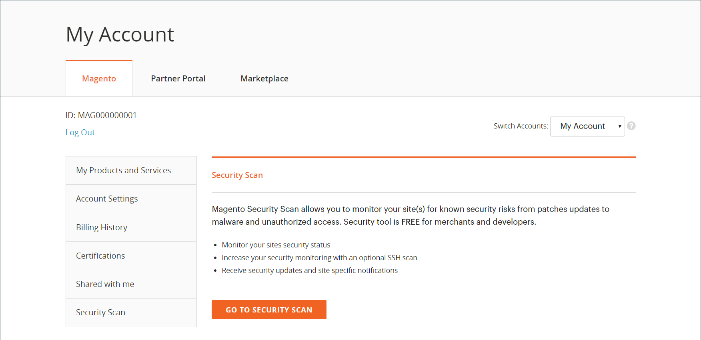{width="600" zoomable="yes"}

## ワークフロー

Adobe CommerceまたはMagento Open Source サイトのセキュリティスキャンツールを設定するには、次の2つの手順を実行します。

1. [セキュリティスキャン用にサイトを設定する](#step-1-set-up-your-site-for-security-scanning)
2. [自動セキュリティスキャンの設定](#step-2-configure-automatic-security-scans)

### ステップ 1：セキュリティスキャン用にサイトを設定する

1. Commerce ホームページから、[Commerce/Magento アカウント &#x200B;](../getting-started/commerce-account-create.md)にログインします。

2. セキュリティスキャンツールの使用条件を確認し、同意します。

   1. 左側のパネルで、**[!UICONTROL Security Scan]**&#x200B;を選択します。
   1. **[!UICONTROL Go to Security Scan]**&#x200B;をクリックします。
   1. **[!UICONTROL Terms and Conditions]**&#x200B;を読み取ります。
   1. **[!UICONTROL Agree]**&#x200B;をクリックして続行します。

3. _[!UICONTROL Monitored Websites]_&#x200B;ページで、**[!UICONTROL +Add Site]**&#x200B;をクリックします。

   ドメインが異なる複数のサイトがある場合は、ドメインごとに個別のスキャンを設定します。

   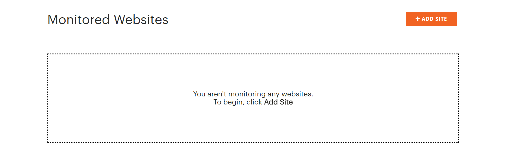{width="600" zoomable="yes"}

4. セキュリティスキャンツールに確認コードを生成して追加し、サイトドメインの所有権を確認します。

   確認コードを追加するプロセスは、使用しているストアフロントの種類によって異なります。 ストアフロントタイプの手順に従います。

>[!BEGINTABS]

>[!TAB Commerce ストアフロント ]

1. **[!UICONTROL Site URL]**&#x200B;と&#x200B;**[!UICONTROL Site Name]**&#x200B;を入力します。
1. **[!UICONTROL Generate Confirmation Code]**&#x200B;をクリックします。
1. 「**コピー**」をクリックして、確認コードをクリップボードにコピーします。

   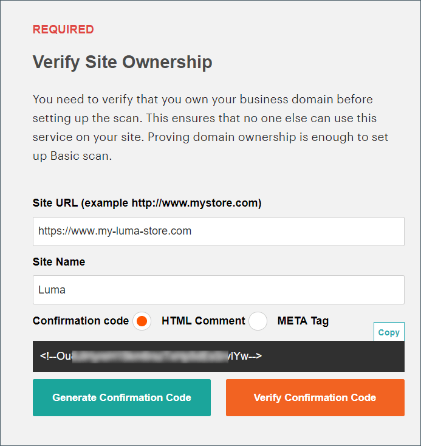{width="400" zoomable="yes"}

1. 完全な管理者権限を持つユーザーとしてストアの管理者にログインし、次の操作を行います。

   1. _管理者_ サイドバーで、**[!UICONTROL Content]** > _[!UICONTROL Design]_>**[!UICONTROL Configuration]**&#x200B;に移動します。
   1. リストで自分のサイトを検索し、**[!UICONTROL Edit]**&#x200B;をクリックします。
   1. **[!UICONTROL HTML Head]** セクションのを展開します。
   1. **[!UICONTROL Scripts and Style Sheets]**&#x200B;までスクロールし、既存のコードの最後にあるテキストボックスをクリックします。 確認コードをテキストボックスに貼り付けます。

      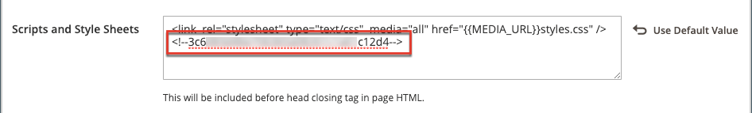{width="600" zoomable="yes"}

   1. 完了したら、**[!UICONTROL Save Configuration]**&#x200B;をクリックします。

1. Commerce アカウントの&#x200B;_[!UICONTROL Security Scan]_&#x200B;ページに戻り、**[!UICONTROL Verify Confirmation Code]**&#x200B;をクリックしてドメインの所有権を確立します。

>[!TAB PWA ストアフロント ]

1. **[!UICONTROL Site URL]**&#x200B;と&#x200B;**[!UICONTROL Site Name]**&#x200B;を入力します。

1. **[!UICONTROL Confirmation Code]**&#x200B;で、`META Tag` オプションを選択し、**[!UICONTROL Generate Code]**&#x200B;をクリックします。

1. 生成された確認コード META タグをクリップボードにコピーするには、**[!UICONTROL Copy]**&#x200B;をクリックします。

   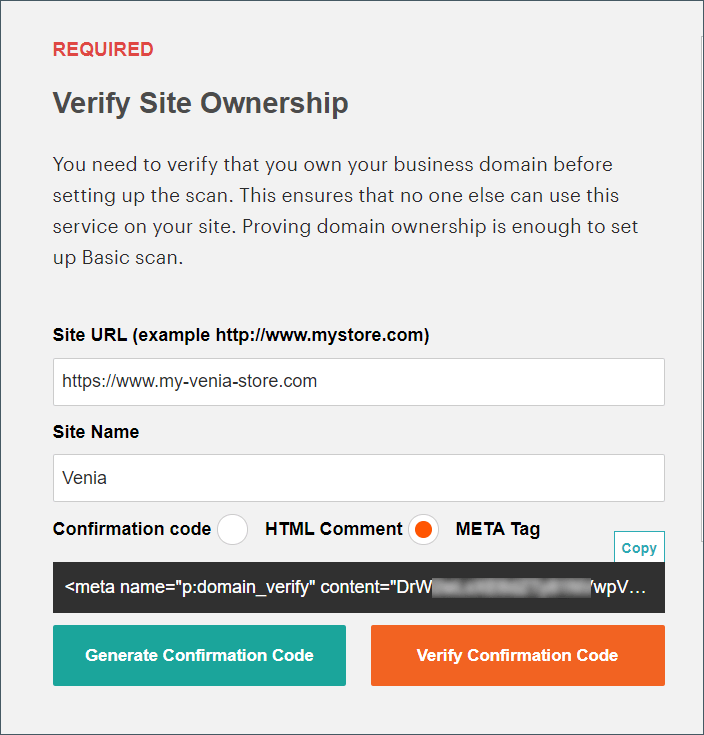{width="400" zoomable="yes"}

1. PWA Studio ストアフロントプロジェクトディレクトリに移動し、次の操作を行います。

   1. PWA Studio プロジェクト ディレクトリで、`packages > venia-concept > template.html`に移動します。
   1. コピーした確認コード（生成されたMETA タグ）をHTML ヘッドに追加し、変更内容を保存します。

      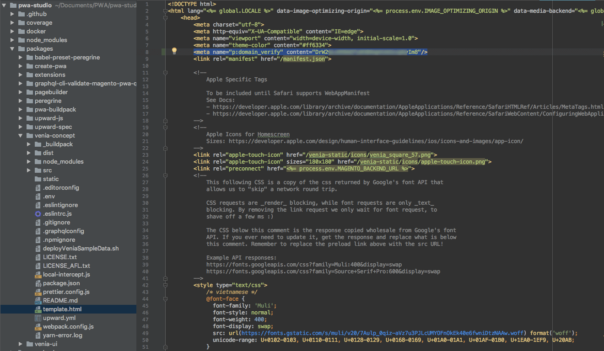{width="600" zoomable="yes"}

   1. PWA Studio CLIに戻り、yarnを使用してプロジェクトの依存関係をインストールし、project build コマンドを実行します。

      ```sh
      yarn install &&
      yarn build
      ```

   1. *クラウドプロジェクト*&#x200B;で、`pwa` フォルダーを作成し、ストアフロントプロジェクトの`dist` フォルダー内にコンテンツをコピーします。

      ```sh
      mkdir pwa && cp -r <path to your storefront project>/dist/* pwa
      ```

   1. Git CLI ツールを使用して、これらの変更をステージング、コミット、Cloud プロジェクトにプッシュします。

      ```sh
      git add . &&
      git commit -m "Added storefront file bundles" &&
      git push origin
      ```

      ビルドプロセスが完了すると、変更内容がPWA ストアフロントにデプロイされます。

1. Commerce アカウントの&#x200B;_[!UICONTROL Security Scan]_&#x200B;ページに戻り、**[!UICONTROL Verify Confirmation Code]**&#x200B;をクリックしてドメインの所有権を確立します。

>[!TAB AEM ストアフロント ]

1. **[!UICONTROL Site URL]**&#x200B;と&#x200B;**[!UICONTROL Site Name]**&#x200B;を入力します。

1. **[!UICONTROL Confirmation Code]**&#x200B;で、`HTML Content`または`META Tag` オプションを選択し、**[!UICONTROL Generate Code]**&#x200B;をクリックします。

1. **[!UICONTROL Copy]**&#x200B;をクリックして、生成された確認コードをクリップボードにコピーします。

   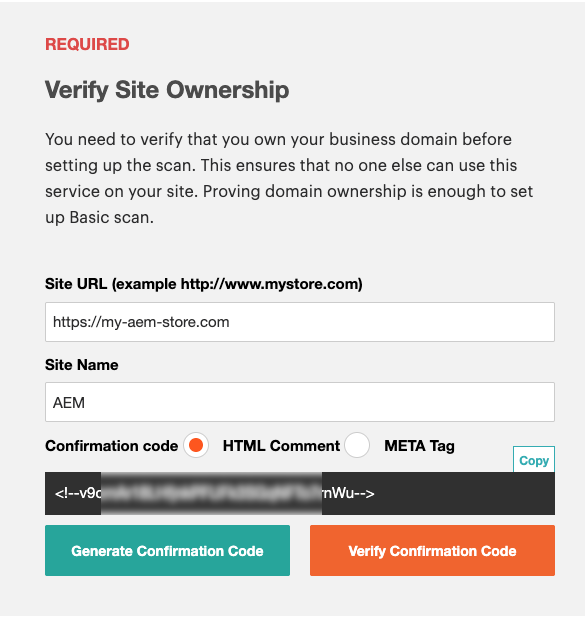{width="400" zoomable="yes"}

1. AEM ストアフロントプロジェクトディレクトリに移動し、次の操作を行います。

   1. AEM ストアフロントプロジェクトディレクトリで、`head.html`に移動します。
   1. コピーした確認コード（生成されたHTML コンテンツまたはMETA タグ）を`head.html` ファイルに追加し、変更内容を保存します。

   >[!NOTE]
   >
   >サイト所有権の検証は、確認がAEM ストアフロントプロジェクトディレクトリの`head.html` ファイルに直接追加された場合にのみ機能します。 ドキュメントオーサリングやユニバーサルエディターなどのweb ページ編集ツールでは追加できません。

   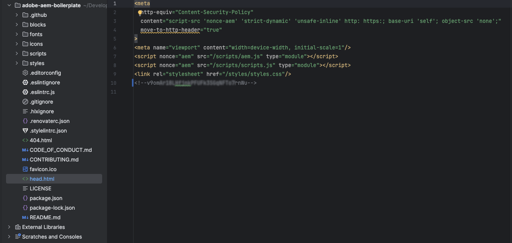{width="600" zoomable="yes"}

1. Git CLI ツールを使用して、これらの変更をステージングし、コミットし、プロジェクトリポジトリにプッシュします。

   ```sh
   git add . &&
   git commit -m "Added security scan confirmation code" &&
   git push origin
   ```

   ビルドプロセスが完了すると、変更内容がAEM ストアフロントにデプロイされます。

1. Commerce アカウントの&#x200B;_[!UICONTROL Security Scan]_&#x200B;ページに戻り、**[!UICONTROL Verify Confirmation Code]**&#x200B;をクリックしてドメインの所有権を確立します。

>[!ENDTABS]

### 手順2：自動セキュリティスキャンの設定

1. サイトの所有権を正常に検証したら、次のいずれかの種類の&#x200B;**[!UICONTROL Set Automatic Security Scan]** オプションを設定します。

   **毎週スキャン （推奨）**:

   スキャンが毎週行われる&#x200B;**[!UICONTROL Week Day]**、**[!UICONTROL Time]**&#x200B;および&#x200B;**[!UICONTROL Time Zone]**&#x200B;を選択します。

   デフォルトでは、スキャンは毎週真夜中の土曜日、UTCに開始され、日曜日の初めまで継続される予定です。

   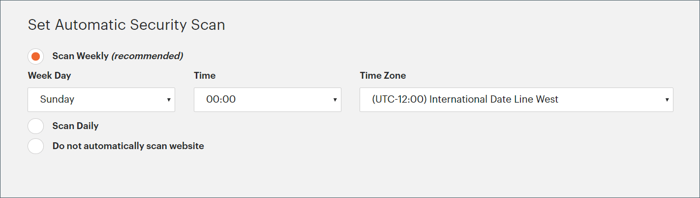{width="500" zoomable="yes"}

   **毎日スキャン**:

   スキャンが毎日行われる&#x200B;**[!UICONTROL Time]**&#x200B;と&#x200B;**[!UICONTROL Time Zone]**&#x200B;を選択します。

   デフォルトでは、スキャンは毎日UTCの午前0時に開始するようにスケジュールされています。

   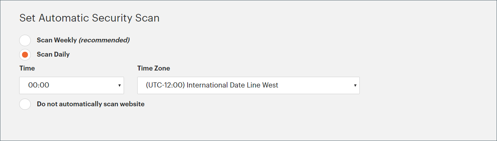{width="500" zoomable="yes"}

1. 完了したスキャンとセキュリティ更新の通知を受信する&#x200B;**[!UICONTROL Email Address]**&#x200B;を入力します。

   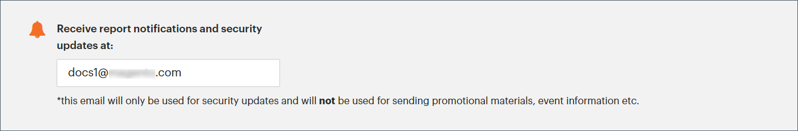{width="400" zoomable="yes"}

1. 完了したら、**[!UICONTROL Submit]**&#x200B;をクリックします。

   ドメインの所有権が確認されると、そのサイトはCommerce アカウントの監視対象Web サイト リストに表示されます。

1. ドメインが異なる複数のweb サイトがある場合は、このプロセスを繰り返して、それぞれにセキュリティスキャンを設定します。

## スキャン失敗の管理

セキュリティスキャンツールを使用すると、レポートビューから直接スキャンエラーを管理できます。 特定のスキャン失敗を偽陽性としてマークし、リスクスコアから除外できます。

### スキャン失敗の管理の利点

スキャンエラーの管理は、次の方法でストアのセキュリティの概要をより正確に維持するのに役立ちます。

- セキュリティレポートの誤検出を減らします。
- 注意が必要な関連セキュリティの問題を重視する。
- ストアの真のセキュリティステータスをより明確に把握する。
- 既知の誤検出についてサポートに連絡する必要がなくなります。
- すでに調査したスキャン失敗を自己管理することで、時間を節約できます。

スキャン失敗を偽陽性としてマークする一般的なシナリオには、次のようなものがあります。

- スキャンツールが検出しなかったセキュリティパッチを既に適用している場合。
- 検出された問題が特定のストア設定に適用されない場合。
- 代替のセキュリティ対策を導入した場合。
- スキャン失敗が、ビジネスニーズに合わせて意図的に設定した設定に基づいている場合。

### スキャン失敗を無視

偽陽性として識別したスキャン エラーを管理するには、次の手順に従います。

1. _[!UICONTROL Monitored Websites]_&#x200B;ページで、管理するサイトの&#x200B;**[!UICONTROL View Report]**&#x200B;をクリックします。

1. レポートビューで、偽陽性としてマークする失敗したスキャンを探します。

1. 特定のスキャン失敗については、**[!UICONTROL Ignore]**&#x200B;をクリックしてください。

   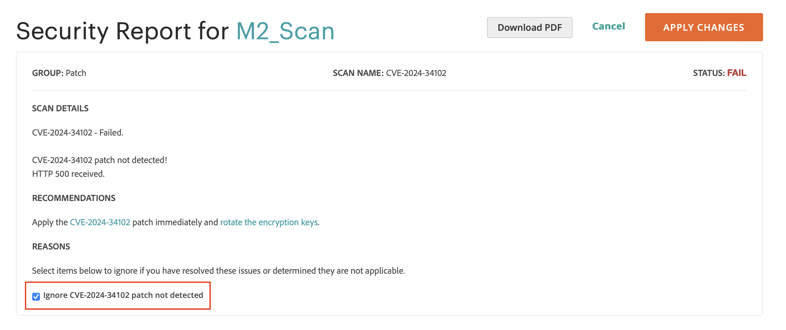{width="600" zoomable="yes"}

1. **[!UICONTROL Apply Changes]**&#x200B;をクリックして選択内容を保存します。

無視されたスキャン失敗は&#x200B;_[!UICONTROL Ignored Results]_&#x200B;セクションに移動し、リスクスコアから除外されます。

### スキャン失敗の無視を停止

以前に無視したスキャン失敗をアクティブなモニタリングに復元する必要がある場合は、次の手順に従います。

1. レポートビューで、_[!UICONTROL Ignored Results]_&#x200B;セクションまでスクロールします。

1. 復元するスキャン失敗の場合は、**[!UICONTROL Stop Ignoring]**&#x200B;をクリックします。

   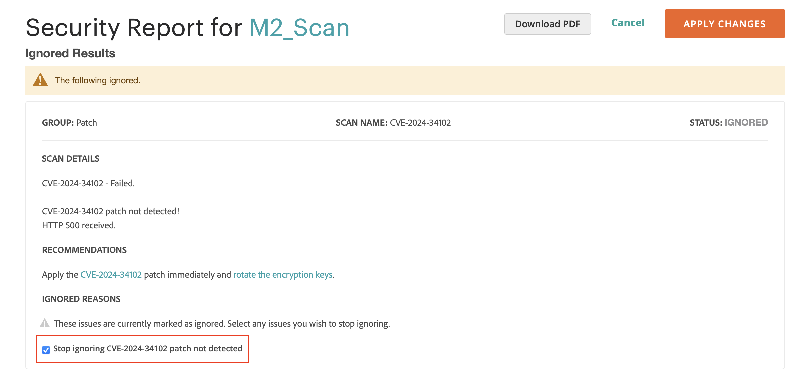{width="600" zoomable="yes"}

1. **[!UICONTROL Apply Changes]**&#x200B;をクリックして選択内容を保存します。

スキャン失敗は&#x200B;_[!UICONTROL Failed Scans]_&#x200B;セクションに戻り、リスクスコアに含まれます。

### 無視されたスキャンのエラーを表示

無視された結果はレポートの別のセクションに表示され、リスクスコアはアクティブなスキャンエラーのみを反映するように自動的に更新されます。 変更を適用する前に複数の項目を選択することで、一度に複数のスキャン失敗を管理できます。

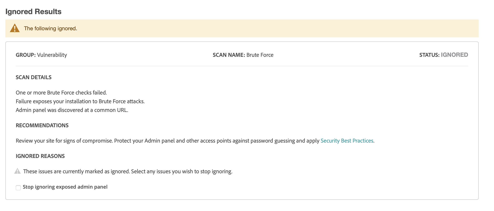{width="600" zoomable="yes"}
