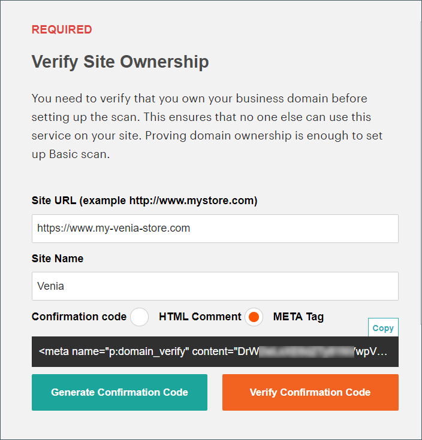

# セキュリティスキャン

拡張されたセキュリティスキャンを使用すると、PWAを含む各Adobe CommerceおよびMagento Open Sourceサイトを監視して、既知のセキュリティリスクやマルウェアを調べ、パッチの更新およびセキュリティの通知を受けることができます。

- ストアのリアルタイムのセキュリティステータスを把握できます。
- 問題を解決するのに役立つ、ベストプラクティスに基づいた提案を受け取ります。
- セキュリティスキャンをスケジュールして、毎週、毎日、またはオンデマンドで実行します。
- 21,000 を超えるセキュリティテストを実行して、潜在的なマルウェアを特定します。
- サイトの進行状況を追跡および監視する履歴セキュリティレポートにアクセスします。
- 成功したチェックと失敗したチェックを表示するスキャン レポートにアクセスします。推奨されるアクションも表示されます。

セキュリティスキャンツールは、のダッシュボードから無料で使用できます [Commerce アカウント](../getting-started/commerce-account-create.md). 技術情報については、を参照してください [セキュリティスキャンツールの設定](https://experienceleague.adobe.com/docs/commerce-cloud-service/user-guide/launch/overview.html#set-up-the-security-scan-tool) が含まれる _クラウドインフラストラクチャー上のCommerce ガイド_.

{width="600" zoomable="yes"}

## セキュリティスキャンを実行

1. Commerceのホームページに移動し、にサインインします [Commerce アカウント](../getting-started/commerce-account-create.md) 次の手順を実行します。

   - 左パネルで、を選択します。 **[!UICONTROL Security Scan]**.
   - クリック **[!UICONTROL Go to Security Scan]**.
   - を読み取る **[!UICONTROL Terms and Conditions]**.
   - クリック **[!UICONTROL Agree]** 続行します。

1. 日 _[!UICONTROL Monitored Websites]_ページ、クリック&#x200B;**[!UICONTROL +Add Site]**.

   異なるドメインを持つ複数のサイトがある場合は、ドメインごとに個別のスキャンを設定する必要があります。

   {width="600" zoomable="yes"}

1. 確認コードを追加してサイト ドメインの所有権を確認するには、次のいずれかの操作を行います。

   **Commerce ストアフロント**:

   - を入力 **[!UICONTROL Site URL]** および **[!UICONTROL Site Name]**.
   - クリック **[!UICONTROL Generate Confirmation Code]**.
   - クリック **コピー** をクリックして、確認コードをクリップボードにコピーします。

     {width="400" zoomable="yes"}

   - 完全な管理者権限を持つユーザーとしてストアの管理者にログインし、次の手順を実行します。

      - が含まれる _Admin_ サイドバー、に移動 **[!UICONTROL Content]** > _[!UICONTROL Design]_>**[!UICONTROL Configuration]**.
      - リストでサイトを見つけて、 **[!UICONTROL Edit]**.
      - を展開  この **[!UICONTROL HTML Head]** セクション。
      - Scroll down to **[!UICONTROL Scripts and Style Sheets]** 既存のコードの末尾にあるテキストボックスをクリックして、確認コードをテキストボックスに貼り付けます。

        {width="600" zoomable="yes"}

      - 完了したら、 **[!UICONTROL Save Configuration]**.

   **PWAストアフロント**:

   - を入力 **[!UICONTROL Site URL]** および **[!UICONTROL Site Name]**.

   - の場合 **[!UICONTROL Confirmation Code]**、を選択します `META Tag` オプションを選択し、をクリックします **[!UICONTROL Generate Code]**.

   - クリック **[!UICONTROL Copy]** 生成した確認コードの META タグをクリップボードにコピーします。

     {width="400" zoomable="yes"}

   - PWA Studioストアフロントのプロジェクトディレクトリに移動して、次の手順を実行します。

      - PWA Studioプロジェクトディレクトリの下で、に移動します `packages > venia-concept > template.html`.
      - コピーした確認コード（生成された META タグ）をHTMLヘッダーに追加し、変更内容を保存します。

        {width="600" zoomable="yes"}

      - PWA Studio CLI に戻り、yarn を使用してプロジェクトの依存関係をインストールし、project build コマンドを実行します。

        ```sh
        yarn install &&
        yarn build
        ```

      - *クラウドプロジェクト内*、を作成します `pwa` フォルダーを作成して、ストアフロントプロジェクト内のコンテンツをコピーします。 `dist` フォルダー。

        ```sh
        mkdir pwa && cp -r <path to your storefront project>/dist/* pwa
        ```

      - Git CLI ツールを使用して、これらの変更をステージング、コミットし、クラウドプロジェクトにプッシュします。

        ```sh
        git add . &&
        git commit -m "Added storefront file bundles" &&
        git push origin
        ```

        ビルドプロセスが完了すると、変更内容がPWAストアフロントにデプロイされます。

1. に戻る _[!UICONTROL Security Scan]_Commerce アカウントにアクセスして、**[!UICONTROL Verify Confirmation Code]**：ドメインの所有権を確立します。

1. 確認が成功したら、以下を設定します **[!UICONTROL Set Automatic Security Scan]** 次のいずれかのタイプのオプション。

   **毎週スキャン （推奨）**:

   - を選択します。 **[!UICONTROL Week Day]**, **[!UICONTROL Time]**、および **[!UICONTROL Time Zone]** スキャンは毎週行われることです。
   - デフォルトでは、スキャンは毎週午前 0 時（土曜日、UTC）に開始され、毎週早朝（日曜日）まで継続するようにスケジュールされています。

     {width="500" zoomable="yes"}

   **毎日スキャン**:

   - を選択します。 **[!UICONTROL Time]**、および **[!UICONTROL Time Zone]** スキャンは毎日行われます。
   - デフォルトでは、スキャンは毎日、午前 0 時（UTC）に開始するようにスケジュールされています。

     {width="500" zoomable="yes"}

1. を入力 **[!UICONTROL Email Address]** 完了したスキャンとセキュリティ更新の通知を受信する場所。

   {width="400" zoomable="yes"}

1. 完了したら、 **[!UICONTROL Submit]**.

   ドメインの所有権が確認されると、そのサイトはCommerce アカウントの監視対象 Web サイトリストに表示されます。

1. 異なるドメインを持つ複数の web サイトがある場合は、このプロセスを繰り返して、それぞれのセキュリティスキャンを設定します。
