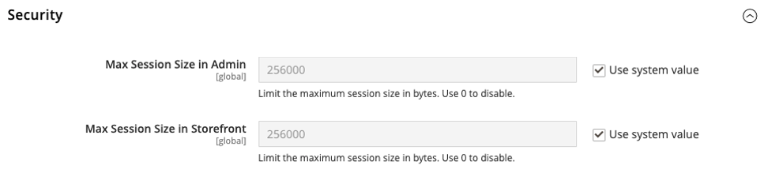
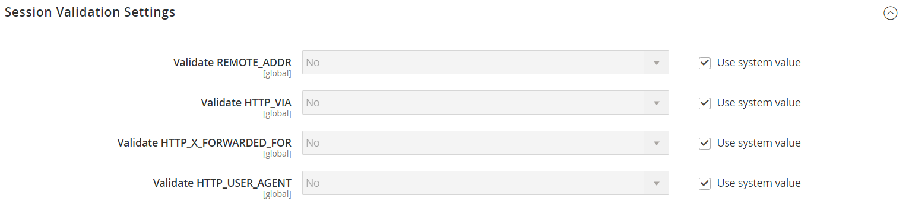

# セッション管理

[ セッション管理](https://cheatsheetseries.owasp.org/cheatsheets/Session_Management_Cheat_Sheet.html)は、API セキュリティのサービス拒否（DoS）対策のベストプラクティスです。 セッションは、訪問者がサイトに滞在する時間を表し、管理者ユーザーまたは顧客がアカウントにログインしている時間とは関係ありません。

セッションは、同じユーザーに関連付けられたネットワーク HTTP リクエストおよび応答トランザクションのシーケンスです。 これは、クライアント（管理者）がサーバーにアクセスしたときにデータに関連付ける方法です。 セッションは、アクセス権やローカライゼーション設定などの変数を設定するために使用されます。これらの変数は、セッション中にユーザーがweb アプリケーションと行うあらゆるインタラクションに適用されます。

## セッションサイズ

管理者ユーザーとストアフロント訪問者の最大セッションサイズを制限するには、次の設定値を使用します。

- **[!UICONTROL Max Session Size in Admin]** - セッションの最大サイズをバイト単位で制限します。 `0`を使用して無効にします。
- **[!UICONTROL Max Session Size in Storefront]** - セッションの最大サイズをバイト単位で制限します。 `0`を使用して無効にします。

>[!TIP]
>
>両方の設定はバイト単位で測定され、デフォルトでは`256000` バイト（または256 KB）になります。

**_最大セッションサイズを設定するには:_**

1. _管理者_ サイドバーで、**[!UICONTROL Stores]** > _[!UICONTROL Settings]_>**[!UICONTROL Configuration]**に移動します。

1. 左側のパネルで、**[!UICONTROL Advanced]**&#x200B;を展開し、**[!UICONTROL System]**&#x200B;を選択します。

1. **[!UICONTROL Security]** セクションのを展開して、セッション設定にアクセスします。

   {width="600" zoomable="yes"}

1. 新しいセッションサイズをバイト単位で入力します。

   >[!WARNING]
   >
   >値を低く設定すると、問題が発生する可能性があります。 デフォルトの256000 バイト以下のいずれかのオプションを設定すると、警告メッセージが表示されます。 **[!UICONTROL No]**&#x200B;をクリックすると、システムは値を`256000`に変更します。

1. **[!UICONTROL Save Config]**&#x200B;をクリックします。

### 管理者セッション

最大セッションサイズを超えると、エラーメッセージが表示され、セッションサイズの制約が`var/log` ディレクトリに記録されます。

セッションサイズを小さく設定した後に管理者にアクセスできなくなった場合は、CLIを使用して設定をリセットします。

```bash
bin/magento config:set system/security/max_session_size_admin 256000
```

### ストアフロントセッション

最大セッションサイズを超えると、エラーは表示されませんが、システムはセッションサイズの制約を`var/log` ディレクトリに記録します。

## セッションの検証

Adobe CommerceとMagento Open Sourceを使用すると、セッション固定攻撃の可能性や、ユーザーセッションのポイズニングやハイジャックの試みに対する保護対策として、セッション変数を検証できます。 セッション検証設定は、各ストア訪問中にセッション変数を検証する方法と、セッション IDがストアのURLに含まれているかどうかを決定します。

技術情報については、_設定ガイド_&#x200B;の「[ セッションストレージにRedisを使用する](https://experienceleague.adobe.com/docs/commerce-operations/configuration-guide/cache/redis/redis-session.html)」を参照してください。

{width="600" zoomable="yes"}

検証では、ユーザーの`$_SESSION` データに保存されているセッションデータと検証変数の値を比較することで、訪問者が自分が誰であるかを確認します。 情報が期待どおりに送信されず、対応する変数が空の場合、検証は失敗します。 セッション検証設定に応じて、セッション変数が検証プロセスに失敗した場合、クライアントセッションはすぐに終了します。

すべての検証変数を有効にすると、攻撃を防ぐことができますが、サーバーのパフォーマンスにも影響する可能性があります。 デフォルトでは、すべてのセッション変数の検証は無効になっています。 Adobe CommerceまたはMagento Open Sourceのインストールに最適な組み合わせを見つけるために、設定を試すことをお勧めします。 すべての検証変数をアクティブ化すると、過度に制限されることがあり、プロキシサーバーを通過するか、ファイアウォールの背後から発信するインターネット接続を持つ顧客へのアクセスを妨げる可能性があります。 セッション変数とその使用方法について詳しくは、Linux® システムのシステム管理ドキュメントを参照してください。

**_セッション検証を設定するには:_**

1. _管理者_ サイドバーで、**[!UICONTROL Stores]** > _[!UICONTROL Settings]_>**[!UICONTROL Configuration]**に移動します。

1. 左側のパネルで、_[!UICONTROL General]_を展開し、**[!UICONTROL Web]**を選択します。

1. **[!UICONTROL Session Validation Settings]** セクションのを展開します。

1. 各設定オプションを設定します。

   - **[!UICONTROL Validate REMOTE_ADDR]** — リクエストのIP アドレスが`$_SESSION`変数に格納されているものと一致することを確認するには、`Yes`に設定します。

   - **[!UICONTROL Validate HTTP_VIA]** – 受信リクエストのプロキシアドレスが`$_SESSION`変数に保存されているものと一致することを確認するには、`Yes`に設定します。

   - **[!UICONTROL Validate HTTP_X_FORWARDED_FOR]** — リクエストの転送用アドレスが`$_SESSION`変数に格納されているアドレスと一致することを確認するには、`Yes`に設定します。

   - **[!UICONTROL Validate HTTP_USER_AGENT]** — セッション中にストアにアクセスするために使用されるブラウザーまたはデバイスが、`$_SESSION`変数に保存されているものと一致することを確認するには、`Yes`に設定します。

1. 完了したら、**[!UICONTROL Save Config]**&#x200B;をクリックします。

## 管理者セッションの有効期間

セキュリティ対策として、_Admin_&#x200B;は最初、キーボードが非アクティブになってから900秒（15分）後にタイムアウトするように設定されます。 自身のワークスタイルに合わせて、セッションの有効期間を調整できます。

**_管理者セッションの有効期間を調整するには:_**

1. _管理者_ サイドバーで、**[!UICONTROL Stores]** > _[!UICONTROL Settings]_>**[!UICONTROL Configuration]**に移動します。

1. 下にスクロールして、左側のパネルで&#x200B;**[!UICONTROL Advanced]**&#x200B;を展開します。

1. **[!UICONTROL Admin]**&#x200B;をクリックします。

1. **[!UICONTROL Security]** セクションのを展開します。

1. **[!UICONTROL Admin Session Lifetime (seconds)]**&#x200B;に、セッションがタイムアウトするまでにアクティブな状態を維持する秒数を入力します。

   {width="600" zoomable="yes"}

1. 完了したら、**[!UICONTROL Save Config]**&#x200B;をクリックします。
