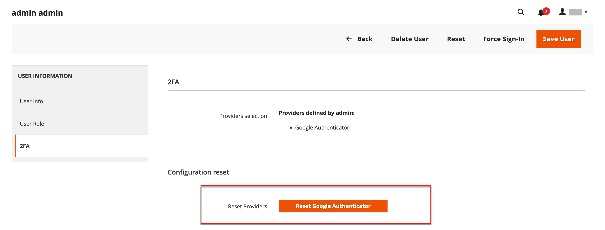

# 二要素認証の管理

二要素認証（2FA）で _Admin_ にログインできないユーザーは、問題の同期やトラブルシューティングを試みることができます。 また、アカウントに関連付けられた認証をリセットすることもできます。 リセットした場合、ユーザーは再度ログインし、必要な認証を再設定する必要があります。

2FA でのログインに問題がある場合は、次の点を考慮してください。

- 一部のモバイルアプリには同期オプションが含まれています。 このオプションは、アプリとサーバーを再接続し、デバイスとサーバーの時間設定を同期します。
- デバイスを取り消したり、認証システムをリセットしたりすると、ユーザーが接続しやすくなります。
- Adobe CommerceまたはMagento Open Sourceのインストールに対する web キャッシュと Cookie のクリアも役に立ちます。 Googleなどの認証者は、生成された Cookie を使用してアクセスと期間を保存します。 特定のブラウザーおよびストアドメインの Cookie をクリアします。
- Cookie をブロックすると、[!DNL Google Authenticator] などの一部のオーセンティケーターは検証プロセスを完了できなくなります。 ブラウザーに、Adobe Commerceのインストールに対して cookie を許可するルールを追加します。

コマンドラインからの認証機能のリセットや、より高度なトラブルシューティング情報については、開発者向けドキュメントの [&#x200B; 二要素認証 &#x200B;](https://developer.adobe.com/commerce/testing/functional-testing-framework/two-factor-authentication/) を参照してください。

**_ユーザーアカウントの認証をリセットするには：_**

>[!NOTE]
>
>他のユーザーの 2FA プロバイダーをリセットするには、`All` の権限を持つ _管理者_ であるか、自分の役割で [!UICONTROL System] > [!UICONTROL Permissions] > [!UICONTROL Two Factor Auth] および [!UICONTROL System] > [!UICONTROL Permissions] > [!UICONTROL All Users] を選択できる `Custom` 権限が必要です。 詳しくは、「[&#x200B; ユーザーの役割 &#x200B;](permissions-user-roles.md)」を参照してください。

1. _管理者_ サイドバーで、**[!UICONTROL System]**/_[!UICONTROL Permissions]_/**[!UICONTROL All Users]**&#x200B;に移動します。

1. ユーザーを選択し、アカウントを編集モードで開きます。

1. 「_[!UICONTROL Current User Identity Verification]_」セクションまでスクロールし、パスワードを入力します。

1. 左側のパネルで「**[!UICONTROL 2FA]**」をクリックします。

1. 「_[!UICONTROL Configuration reset]_」セクションで、「**[!UICONTROL Reset]**」をクリックし、「**[!UICONTROL OK]**」をクリックして確認します。

   {width="600" zoomable="yes"}

   必要な 2FA メソッドを自分のアカウントに復元したい場合は、_サインオン_ ページからそれぞれを再設定する必要があります。

1. 完了したら、「**[!UICONTROL Save User]**」をクリックします。
