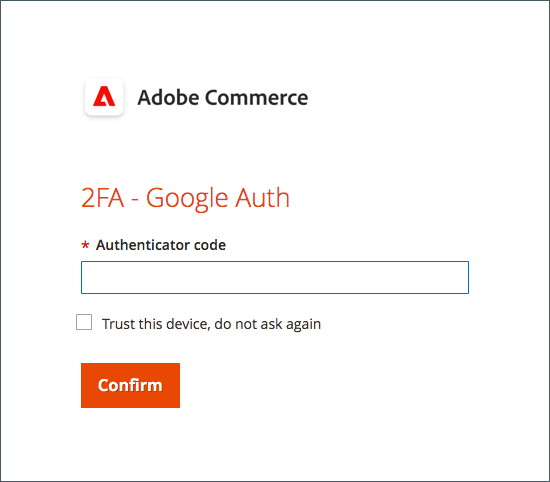
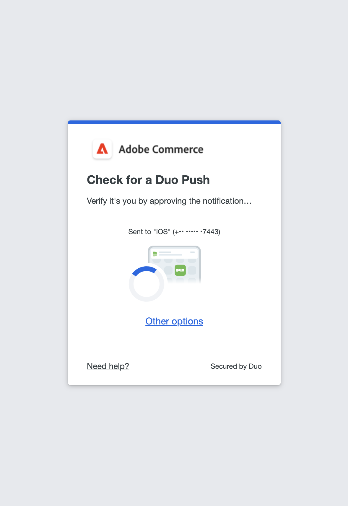
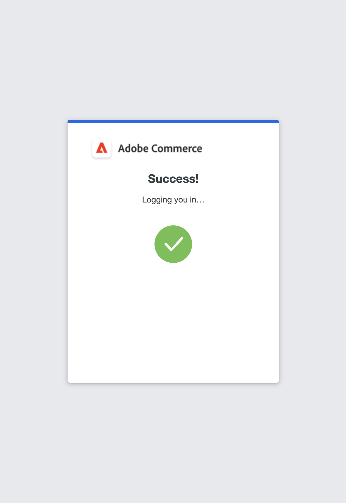
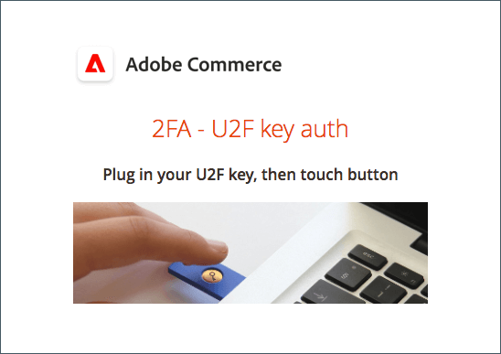

# ユーザーアカウントの2要素認証の設定

これらの手順では、Adobe CommerceまたはMagento Open Sourceへの初回ログイン時に2要素認証を設定する方法と、次のアプリとデバイスを使用してIDを認証する方法について説明します。

詳細な手順については、[管理者ログイン ](../getting-started/admin-signin.md)を参照してください。

>[!NOTE]
>
>[!DNL Adobe Identity Management Services] （IMS）認証を有効にしているストアでは、ネイティブ Adobe CommerceとMagento Open Source 2FAが無効になっています。 Adobeの資格情報を使用してCommerce インスタンスにログインしている管理者ユーザーは、多くの管理者タスクで再認証を行う必要はありません。 認証は、管理者ユーザーが現在のセッションにログインしたときにAdobe IMSによって処理されます。 [[!DNL Adobe Identity Management Service]  （IMS）統合の概要](../getting-started/adobe-ims-integration-overview.md)を参照してください。

## [!DNL Google Authenticator]

### 手順1: [!DNL Google Authenticator]を設定する

1. アカウントの資格情報を入力し、_管理者_&#x200B;にログインします。 QR コードが表示された新しい認証画面。

1. モバイルデバイスで&#x200B;**[!UICONTROL Google Authenticator]** アプリを開きます。

1. プラス記号（**+**）をクリックしてエントリを追加し、スマートフォンのカメラでスキャンするQR コードが表示されている赤いボックスを並べます。

1. 電話でQR コードが認識され、エントリが追加されたら、_管理者_ **[!UICONTROL Authenticator code]** フィールドにその6桁のコードを入力します。

1. 完了したら、**[!UICONTROL Confirm]**&#x200B;をクリックします。

   {width="300"}

### 手順2: [!DNL Google Authenticator]でログイン

1. アカウントの資格情報を入力し、Commerce _管理者_&#x200B;にログインします。

   {width="300"}

1. モバイルデバイスで[!DNL Google Authenticator]を開きます。

1. プロンプトが表示されたら、6桁の認証コードを入力します。

1. 今後のログイン用に認証を保存するには、**[!UICONTROL Trust this device, do not ask again]** チェックボックスを選択します。

1. 完了したら、**[!UICONTROL Confirm]**&#x200B;をクリックします。

## [!DNL Duo Security]

[!DNL Duo]様は無料トライアルを提供しており、アカウントに関連付けられているユーザー数に応じて課金されます。 [の指示に従ってアカウントを設定し、アプリをダウンロードしてください](https://duo.com/product/multi-factor-authentication-mfa/duo-mobile-app)。

### 手順1: [!DNL Duo Security]を設定する

1. アカウントの資格情報を入力し、_管理者_&#x200B;にログインします。

1. [!DNL Duo]設定ページが表示されたら、**[!UICONTROL Get Started]**&#x200B;をクリックし、次の操作を行います。

   {width="300"}

1. オプションを選択します。 Touch ID、Duo Mobile、セキュリティキー、または電話番号を選択できます。 この例では、「Duo Mobile」または「Phone Number」オプションを示します。

1. プロンプトが表示されたら、電話番号を入力し、**[!UICONTROL Continue]**&#x200B;をクリックします。

   電話番号のパスコードを送信して確認することで、所有権を確認します。

1. 電話の種類に応じて[!DNL Duo Mobile]をインストールするように求められたら、「**[!UICONTROL I have Duo Mobile]**」をクリックします。

1. [!DNL Duo Mobile]を開き、QR コードをスキャンして、認証者とAdobe Commerceを同期します。 アクティベーションが完了すると、チェックマークが表示されます。

1. 必要に応じて、さらにデバイスを追加するか、スキップできます。 これで設定が完了し、Duoでログインできるようになります。

   {width="300"}

### 手順2: [!DNL Duo Security]でログイン

次の例は、`Ask me to choose an authenticator method`のオプションを示しています。

1. プロンプトが表示されたら、_管理者_&#x200B;の資格情報を入力してログインします。

   {width="300"}

1. 「Duoでログイン」を選択して、Duo Mobile アプリでプッシュ通知を取得するか、Touch IDでログインするか、設定中に設定した別のオプションで続行します。

1. Duo アプリ/タッチ ID/テキストメッセージからリクエストを承認すると、正常にログインできます。

   {width="300"}

## [!DNL Authy]

[!DNL Authy]は、ユーザーに無料でアプリとサービスを提供しています。 お使いのデバイスまたはブラウザーにアプリをダウンロードして設定するには、その指示に従ってください。 詳しくは、[[!DNL Authy]  ドキュメント ](https://authy.com/features/setup/)を参照してください。

### 手順1:Authyの設定

1. アカウントの資格情報を入力し、_管理者_&#x200B;にログインします。

   ![[!DNL Authy]登録](./assets/storefront-2fa-authy-auth.png){width="300"}

1. Authyに登録するように求められた場合は、次の操作を行います。

   - 国を選択。

   - 電話番号を入力してください。

   - **[!UICONTROL Verification method]**&#x200B;を選択：`SMS`または`Call Me`

   **[!UICONTROL Continue]**&#x200B;をクリックします。 SMS テキストまたは電話を通じてメッセージが携帯電話に送信されます。

1. 受け取った確認コードを入力し、**[!UICONTROL Verify]**&#x200B;をクリックします。

1. 完了したら、**[!UICONTROL Confirm]**&#x200B;をクリックします。

   ![[!DNL Authy]確認コード ](./assets/storefront-2fa-authy-verify.png){width="300"}

### 手順2: [!DNL Authy]でログイン

1. アカウントの資格情報を入力し、_管理者_&#x200B;にログインします。

   ![[!DNL Authy] - ログイン ](./assets/storefront-2fa-authy-access.png){width="300"}

1. 認証するには、次のいずれかの方法を選択します。

   - `Use one touch` — [!DNL Authy] アプリにアラートを送信します。 アプリで、アクセスを承認します。
   - `Use authy token` — [!DNL Authy] アプリのコードを入力するよう求めるプロンプトが表示されます。

1. ログインに問題がある場合は、コードの受信に使用する方法を選択します。 次に、受け取ったコードを入力して、_管理者_&#x200B;にアクセスします。

   アプリには、これらの追加の緊急手段が含まれています。

   - `Send me a code via SMS` – 設定されたモバイル デバイスにテキスト SMS メッセージが送信されます。
   - `Send me a code via phone call` — ユーザーはコード付きの電話を受け取ります。

   お客様のアカウントが確認され、開きます。

## U2F （[!DNL Yubikey]およびその他のデバイス）

ソリューションプロバイダーの指示に従って、U2F デバイスを設定します。 詳しくは、[!UICONTROL Yubico]の[[!DNL YubiKey]](https://support.yubico.com/hc/en-us/articles/360013790339-Getting-Started-with-Your-YubiKey)などのベンダーのドキュメントを参照してください。

1. アカウントの資格情報を入力し、_管理者_&#x200B;にログインします。

   {width="300"}

1. キーのボタンを押します。

   認証は直ちにトリガーされ、_管理者_&#x200B;が開きます。

1. コンピューターのUSB ポートに&#x200B;**[!UICONTROL U2F key]**&#x200B;を挿入します。
