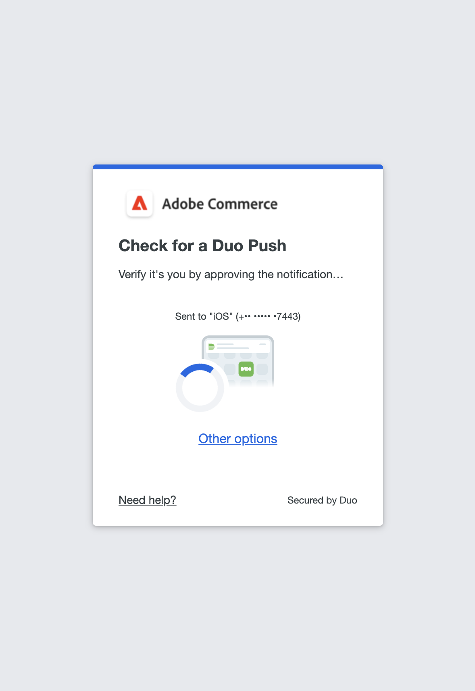

# ユーザーアカウントの二要素認証の設定

これらの手順では、Adobe CommerceまたはMagento Open Sourceへの最初のログイン時に二要素認証を設定する方法と、次のアプリやデバイスを使用して ID を認証する方法を示します。

手順について詳しくは、を参照してください [管理者によるログイン](../getting-started/admin-signin.md).

>[!NOTE]
>
>が有効になっているストア [!DNL Adobe Identity Management Services] （IMS）認証では、ネイティブのAdobe CommerceとMagento Open Source 2FA が無効になっています。 Adobe資格情報を使用してCommerce インスタンスにログインしている管理者ユーザーは、多くの管理タスクで再認証する必要はありません。 Adobe IMSは、管理者ユーザーが現在のセッションにログインする際に認証を処理します。 参照： [[!DNL Adobe Identity Management Service] （IMS）統合の概要](../getting-started/adobe-ims-integration-overview.md).

## [!DNL Google Authenticator]

### 手順 1：の設定 [!DNL Google Authenticator]

1. アカウントの認証情報を入力し、にログインします _Admin_. 新しい認証画面が開き、QR コードが表示されます。

1. を開きます **[!UICONTROL Google Authenticator]** お使いのモバイルデバイス上のアプリ。

1. プラス記号（ **+** ）を入力し、赤いボックスに QR コードを並べて、スマートフォンのカメラでスキャンします。

1. 電話が QR コードを認識してエントリを追加したら、その 6 桁のコードをに入力します _Admin_ **[!UICONTROL Authenticator code]** フィールド。

1. 完了したら、 **[!UICONTROL Confirm]**.

   {width="300"}

### 手順 2：でログインする [!DNL Google Authenticator]

1. アカウントの資格情報を入力し、Commerceにログインします _Admin_.

   {width="300"}

1. 開く [!DNL Google Authenticator] お使いのモバイルデバイス。

1. プロンプトが表示されたら、6 桁の認証コードを入力します。

1. 今後のログインのために認証を保存するには、 **[!UICONTROL Trust this device, do not ask again]** チェックボックス。

1. 完了したら、 **[!UICONTROL Confirm]**.

## [!DNL Duo Security]

[!DNL Duo] は無料トライアルを提供し、アカウントに関連付けられているユーザーの数に応じて課金されます。 に従う [アカウントの設定とアプリのダウンロード手順](https://duo.com/product/multi-factor-authentication-mfa/duo-mobile-app).

### 手順 1：の設定 [!DNL Duo Security]

1. アカウントの認証情報を入力し、にログインします _Admin_.

1. いつ [!DNL Duo] 設定ページが表示されたら、 **[!UICONTROL Start setup]** 次の手順を実行します。

   {width="300"}

1. デバイスを選択します。

1. プロンプトが表示されたら、電話番号を入力し、 **[!UICONTROL Continue]**.

   この例ではモバイルデバイスを使用しているため、お客様の電話番号をリクエストしています。

1. インストールを要求するメッセージが表示されたら、 [!DNL Duo Mobile] 電話の種類に対して、 **[!UICONTROL I have Duo Mobile]**.

1. 開く [!DNL Duo Mobile] そして、QR コードをスキャンして、認証者をAdobe Commerceと同期します。 アクティベーションが完了すると、チェックマークが表示されます。

1. デバイスの設定を構成するには、サインイン時に実行する操作を選択します。

   - `Ask me to choose an authenticator method` — ログイン時および認証時に、 _Admin_.
   - `Automatically send this device a Duo Push` — アクセスを許可または拒否するメッセージをデバイスに送信します。
   - `Automatically call this device` — アクセス用に入力するパスコードを呼び出し、提供します。

   {width="300"}

### 手順 2：でログインする [!DNL Duo Security]

次の例は、のオプションを示しています `Ask me to choose an authenticator method`:

1. プロンプトが表示されたら、 _Admin_ ログインするための資格情報。

   {width="300"}

1. 認証に使用する方法を選択します。

   - `Send Me a Push` — クリックすると、に対するプッシュ通知を受信します [!DNL Duo Mobile]. 認証を承認します。
   - `Call Me`  – このオプションをクリックして、コードを含むコールを受け取り、パスコードを入力します。
   - `Enter a Passcode`  – パスコードを受け取って入力するには、このオプションをクリックします。

1. プッシュまたはコードを完了すると、に完全にログインします _Admin_.

## [!DNL Authy]

[!DNL Authy] は、ユーザーにアプリとサービスを無料で提供します。 指示に従って、デバイスまたはブラウザー用のアプリをダウンロードして設定します。 詳しくは、 [[!DNL Authy] 詳細を見る](https://authy.com/features/setup/).

### 手順 1:Authy の設定

1. アカウントの認証情報を入力し、にログインします _Admin_.

   ![[!DNL Authy] 登録](./assets/storefront-2fa-authy-auth.png){width="300"}

1. Authy に登録するように求められたら、次の操作を行います。

   - 国を選択します。

   - 電話番号を入力します。

   - 「」を選択します **[!UICONTROL Verification method]**: `SMS` または `Call Me`

   クリック **[!UICONTROL Continue]**. メッセージは、SMS テキストまたは通話を通じて電話に送信されます。

1. 受け取った確認コードを入力し、をクリックします **[!UICONTROL Verify]**.

1. 完了したら、 **[!UICONTROL Confirm]**.

   ![[!DNL Authy] 確認コード](./assets/storefront-2fa-authy-verify.png){width="300"}

### 手順 2：でログインする [!DNL Authy]

1. アカウントの認証情報を入力し、にログインします _Admin_.

   ![[!DNL Authy] - サインイン](./assets/storefront-2fa-authy-access.png){width="300"}

1. 次のいずれかの認証方法を選択します。

   - `Use one touch` — アラートをユーザーに送信します [!DNL Authy] アプリ。 アプリで、アクセスを受け入れます。
   - `Use authy token`  – からコードを入力するように求めるプロンプト [!DNL Authy] アプリ。

1. ログインできない場合は、コードの受け取りに使用する方法を選択します。 次に、受け取ったコードを入力して、 _Admin_.

   アプリには、これらの追加の緊急時方法が含まれています。

   - `Send me a code via SMS` — テキスト SMS メッセージが設定済みのモバイルデバイスに送信されます。
   - `Send me a code via phone call` — ユーザーがコード付きの電話を受け取ります。

   アカウントが検証され、開かれます。

## U2F （[!DNL Yubikey] とその他のデバイス）

ソリューションプロバイダーの指示に従って、U2F デバイスを設定します。 詳しくは、次のようなベンダードキュメントを参照してください [[!DNL YubiKey]](https://support.yubico.com/hc/en-us/articles/360013790339-Getting-Started-with-Your-YubiKey) 作成者： [!UICONTROL Yubico].

1. アカウントの認証情報を入力し、にログインします _Admin_.

   {width="300"}

1. キーのボタンを押します。

   認証はすぐにトリガーし、を開きます _Admin_.

1. を挿入する **[!UICONTROL U2F key]** をコンピューターの USB ポートに接続します。
