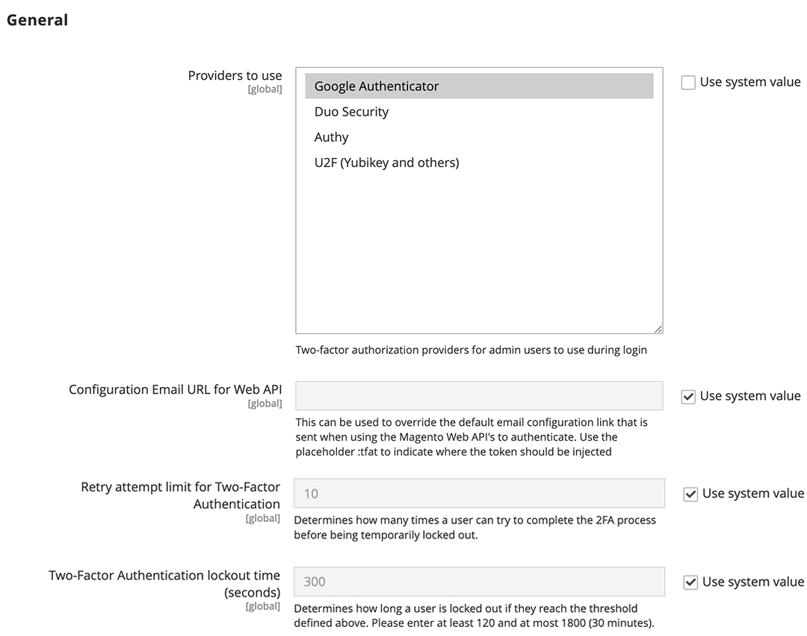

# 2 要素認証（2FA）

Commerce _Admin_ Adobe CommerceまたはMagento Open Sourceのインストールでは、ストア、注文、顧客データへのアクセスが可能になります。 データへの不正アクセスを防ぐため、にログインしようとするすべてのユーザー _Admin_ 認証プロセスを完了して、ユーザーの ID を確認する必要があります。

>[!NOTE]
>
>2 要素認証（2FA）の実装は、次のものに適用されます。 _Admin_ のみ。カスタマーアカウントでは使用できません。 Commerce アカウントを保護する二要素認証には、別の設定があります。 詳細については、次を参照してください： [Commerce アカウントを保護](../getting-started/commerce-account-secure.md).

2 要素認証が広く使用されており、同じアプリで異なる web サイトのアクセスコードを生成するのが一般的です。 この追加認証により、自分だけがユーザーアカウントにログインできるようになります。 パスワードを紛失した場合、またはボットがパスワードを推測した場合、二要素認証により保護レイヤーが追加されます。 例えば、Google Authenticator を使用してストアの管理者、Commerce アカウント、Google アカウントのコードを生成することができます。

{width="300"}

Adobe Commerceは、複数のプロバイダーの 2FA メソッドをサポートしています。 ID を確認するために、ユーザーがログイン時に入力するワンタイムパスワード（OTP）を生成するアプリのインストールを必要とする場合があります。 ユニバーサル第 2 係数（U2F）デバイスは、キーフォブに似ており、ID を確認するための一意のキーを生成します。 他のデバイスは、USB ポートに挿入されたときに ID を確認します。 ストア管理者は、ユーザー ID を検証するために、使用可能な 2FA メソッドを 1 つ以上要求できます。 2FA 設定は、Adobe Commerceのインストールに関連付けられているすべての web サイトとストアに適用されます。

ユーザーがに初めてログインしたとき _Admin_、それぞれ設定する必要があります [2FA](../configuration-reference/security/2fa.md) 必要な方法と、関連するアプリまたはデバイスを使用して id を検証します。 この初期設定後、ユーザーはログインするたびに設定されたメソッドのいずれかを使用して認証する必要があります。 各ユーザーの 2FA 情報は、ユーザーに記録されます _Admin_ アカウントおよび次になることができます [reset](security-two-factor-authentication-manage.md) 必要に応じて、 サインイン プロセスの詳細については、次を参照してください [_Admin_ ログイン](../getting-started/admin-signin.md).

>[!NOTE]
>
>AdobeIdentity Management サービス（IMS）認証を有効にしているストアでは、ネイティブのAdobe CommerceとMagento Open Source 2FA が無効になっています。 Adobe資格情報を使用してCommerce インスタンスにログインしている管理者ユーザーは、多くの管理タスクで再認証する必要はありません。 Adobe IMSは、管理者ユーザーが現在のセッションにログインする際に認証を処理します。 参照： [AdobeIdentity Management サービス（IMS）の統合の概要](https://experienceleague.adobe.com/docs/commerce-admin/start/admin/ims/adobe-ims-integration-overview.html).

これを見ていいよ [ビデオデモ](https://video.tv.adobe.com/v/339104?quality=12&learn=on) を参照してください。

## 必要な 2FA プロバイダーの設定

1. 日 _Admin_ サイドバー、に移動 **[!UICONTROL Stores]** > _[!UICONTROL Settings]_>**[!UICONTROL Configuration]**.

1. 左側のパネルで、を展開します **[!UICONTROL Security]** を選択します **[!UICONTROL 2FA]**.

1. が含まれる _[!UICONTROL General]_セクションで、使用するプロバイダーを選択します。

   | プロバイダ | 関数 |
   |--- |--- |
   | [!UICONTROL Google Authenticator] | ユーザー認証用にアプリケーション内に 1 回限りのパスワードを生成します。 |
   | [!UICONTROL Duo Security] | SMS およびプッシュ通知を提供します。 |
   | [!UICONTROL Authy] | 時間に依存する 6 桁のコードを生成し、SMS または音声通話 2FA 保護またはトークンを配信します。 |
   | [!UICONTROL U2F Devices (Yubikey and others)] | 次のような物理デバイスを使用して認証します [[!DNL YubiKey]](https://www.yubico.com/). |

   複数の方法を選択するには、Ctrl キー（PC）または Command キー（Mac）を押したまま、各項目をクリックします。

1. 必要な 2FA 方式ごとに設定を完了します。

   {width="600" zoomable="yes"}

1. 完了したら、 **[!UICONTROL Save Config]**.

   ユーザーがに初めてログインしたとき _Admin_&#x200B;必要な 2FA メソッドをそれぞれ設定する必要があります。 この初期設定の後、ログインするたびに、設定されたメソッドのいずれかで認証する必要があります。

## 2FA プロバイダー設定

必要な 2FA 方式ごとに設定を完了します。

### Google

ログイン時にワンタイムパスワード（OTP）を使用できる期間を変更するには、 **[!UICONTROL Use system value]** チェックボックス。 次に、秒数を **[!UICONTROL OTP Window]** が有効である。

{width="600" zoomable="yes"}

>[!NOTE]
>
>Adobe Commerce 2.4.7 以降では、管理者のワンタイムパスワード（OTP）の有効期限が切れた後に、システムが OTP ウィンドウ設定を受け入れる時間（秒単位）を制御します。 この値は 30 秒未満にする必要があります。 システムのデフォルト設定はです。 `29`.   バージョン 2.4.6 では、OTP ウィンドウの設定によって、有効な過去および未来の OTP コードの数が決まります。 値 `1` 現在の OTP コードに、過去と未来の 1 つのコードを加えたものが、任意の時点で有効であることを示します。

### [!DNL Duo Security]

Duo Security アカウントから次の資格情報を入力します。

- 統合キー
- 秘密鍵
- API ホスト名

{width="600" zoomable="yes"}

### [!DNL Authy]

1. からの API キーを入力 [!DNL Authy] アカウント。

1. 認証時に表示されるデフォルトのメッセージを変更するには、次のチェックボックスをオフにします **[!UICONTROL Use system value]** チェックボックス。 次に、を入力します **[!UICONTROL OneTouch Message]** 表示する。

   {width="600" zoomable="yes"}

### U2F デバイス （[!DNL Yubikey] とその他名）

ストアドメインは、認証プロセス中にデフォルトで使用されます。 カスタムドメインを認証の課題に使用するには、次のチェックボックスをオフにします **[!UICONTROL Use system value]** チェックボックス。 次に、を入力します **[!UICONTROL WebAPi Challenge Domain]**.

{width="600" zoomable="yes"}
