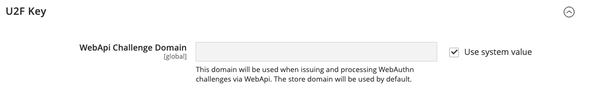

# 二段階認証 (2FA)

コマース _管理者_ Adobe CommerceまたはMagento Open Sourceのインストールで、ストア、注文、顧客データにアクセスできます。 データへの不正なアクセスを防ぐために、 _管理者_ は、認証プロセスを完了して id を検証する必要があります。

>[!NOTE]
>
>この 2 要素認証 (2FA) の実装は、 _管理者_ のみ、およびは顧客アカウントでは使用できません。 コマースアカウントを保護する 2 要素認証には、別々の設定があります。 詳しくは、 [コマースアカウントを保護](../getting-started/commerce-account-secure.md).

2 要素認証は広く使用されており、同じアプリで異なる Web サイトのアクセスコードを生成するのが一般的です。 これにより、自分だけが自分のユーザーアカウントにログインできるようになります。 パスワードを失った場合や、ボットがパスワードを推測した場合、2 要素認証によって保護の層が 1 層追加されます。 例えば、Google Authenticator を使用して、ストアの管理者、コマースアカウント、Googleアカウントのコードを生成できます。

{width="300"}

Adobe Commerceは、複数のプロバイダーからの 2FA メソッドをサポートしています。 ユーザーが ID を検証するためにサインイン時に入力する 1 回限りのパスワード (OTP) を生成するアプリをインストールする必要がある場合もあります。 ユニバーサルセカンドファクタ (U2F) デバイスは、キーフォブに似ており、ID を検証するための一意のキーを生成します。 他のデバイスは、USB ポートに挿入されたときに ID を確認します。 ストア管理者は、ユーザー ID を検証するために使用可能な 1 つ以上の 2FA メソッドを必要とすることができます。 2FA 設定は、Adobe Commerceインストールに関連付けられているすべての Web サイトおよびストアに適用されます。

ユーザーが初めて _管理者_&#x200B;を設定する場合、 [2FA](../configuration-reference/security/2fa.md) メソッドを使用し、関連するアプリまたはデバイスを使用して id を確認します。 この初期設定の後、ユーザーはログインするたびに、設定済みのメソッドの 1 つを使用して認証する必要があります。 各ユーザーの 2FA 情報は、 _管理者_ アカウントで、 [リセット](security-two-factor-authentication-manage.md) 必要に応じて。 ログインプロセスの詳細については、次を参照してください： [_管理者_ ログイン](../getting-started/admin-signin.md).

>[!NOTE]
>
>AdobeIdentity Managementサービス (IMS) の認証を有効にしたストアでは、ネイティブのAdobe CommerceとMagento Open Source2FA が無効になっています。 コマースインスタンスにログインしている管理者Adobeは、多くの管理者タスクを再認証する必要はありません。 認証は、管理者Adobe IMSが現在のセッションにログインする際にユーザーによって処理されます。 詳しくは、 [AdobeIdentity Managementサービス (IMS) 統合の概要](https://experienceleague.adobe.com/docs/commerce-admin/start/admin/ims/adobe-ims-integration-overview.html).

これを見て [ビデオデモ](https://video.tv.adobe.com/v/339104?quality=12&learn=on) ：管理での 2 要素認証の概要。

## 必要な 2FA プロバイダーの設定

1. 次の日： _管理者_ サイドバー、移動 **[!UICONTROL Stores]** > _[!UICONTROL Settings]_>**[!UICONTROL Configuration]**.

1. 左側のパネルで、を展開します。 **[!UICONTROL Security]** を選択します。 **[!UICONTROL 2FA]**.

1. Adobe Analytics の _[!UICONTROL General]_セクションで、**[!UICONTROL Provider to use]**.

   | プロバイダー | 関数 |
   |--- |--- |
   | [!UICONTROL Google Authenticator] | ユーザー認証用に、アプリケーションで 1 回限りのパスワードを生成します。 |
   | [!UICONTROL Duo Security] | SMS とプッシュ通知を提供します。 |
   | [!UICONTROL Authy] | 時間に依存する 6 桁のコードを生成し、SMS または音声呼び出し 2FA 保護またはトークンを配信します。 |
   | [!UICONTROL U2F Devices (Yubikey and others)] | 物理デバイスを使用して認証（例： ） [[!DNL YubiKey]](https://www.yubico.com/). |

   複数の方法を選択するには、Ctrl キー (PC) または Command キー (Mac) を押しながら各項目をクリックします。

1. 必要な各 2FA メソッドの設定を完了します。

   {width="600" zoomable="yes"}

1. 完了したら、「 **[!UICONTROL Save Config]**.

   ユーザーが初めて _管理者_&#x200B;を設定する場合、必要な各 2FA メソッドを設定する必要があります。 この初期設定の後、ログインするたびに、設定済みのメソッドの 1 つを使用して認証する必要があります。

## 2FA プロバイダ設定

必要な各 2FA メソッドの設定を完了します。

### Google

サインイン中に 1 回限りのパスワード (OTP) を使用できる時間を変更するには、 **[!UICONTROL Use system value]** チェックボックス。 次に、必要な秒数を入力します。 **[!UICONTROL OTP Window]** を有効にします。

{width="600" zoomable="yes"}

### [!DNL Duo Security]

Duo セキュリティアカウントから次の資格情報を入力します。

- 統合キー
- 秘密鍵
- API ホスト名

{width="600" zoomable="yes"}

### [!DNL Authy]

1. API キーを [!DNL Authy] アカウント。

1. 認証時に表示されるデフォルトのメッセージを変更するには、 **[!UICONTROL Use system value]** チェックボックス。 次に、 **[!UICONTROL OneTouch Message]** 表示する

   {width="600" zoomable="yes"}

### U2F デバイス ([!DNL Yubikey] その他

ストアドメインは、認証プロセス中にデフォルトで使用されます。 認証の課題にカスタムドメインを使用するには、 **[!UICONTROL Use system value]** チェックボックス。 次に、 **[!UICONTROL WebAPi Challenge Domain]**.

{width="600" zoomable="yes"}
