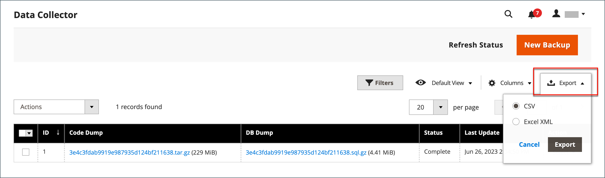

# サポートツール

{{ee-feature}}

サポートツールは、システムの既知の問題を特定するように設計されています。 開発および最適化プロセス中のリソースとして、また、サポートチームが問題を特定して解決するのに役立つ診断ツールとして使用できます。

## データコレクター

データコレクターは、アドビのサポートチームがAdobe Commerceのインストールに関する問題のトラブルシューティングに必要な、お使いのシステムに関する情報を収集します。 作成されるバックアップは完了するまでに数分かかり、コードとデータベースダンプの両方が含まれます。 データは、CSV または Excel XML ファイルにエクスポートできます。

{width="600" zoomable="yes"}

### データコレクターの実行

1. _管理者_ サイドバーで、**[!UICONTROL System]**/_[!UICONTROL Support]_/**[!UICONTROL Data Collector]**&#x200B;に移動します。

1. 右上隅の「**[!UICONTROL New Backup]**」をクリックします。

   バックアップの生成には数分かかります。 「**[!UICONTROL Refresh Status]**」をクリックすると、処理の結果を監視できます。 完了すると、バックアップが _[!UICONTROL Data Collector]_&#x200B;グリッドに表示されます。

1. バックアップの詳細を含むログを表示するには、次の手順を実行します。

   - 「_[!UICONTROL Action]_」列で「**[!UICONTROL Show Log]**」を選択します。

   - **[!UICONTROL Back]** をクリックしてグリッドに戻ります。

   {width="600" zoomable="yes"}

### バックアップデータの書き出し

1. 最初の列で、エクスポートするバックアップのチェックボックスを選択します。

1. **[!UICONTROL Export]** メニューを使用して、エクスポートデータの形式を選択します。

   {width="600" zoomable="yes"}

1. Web ブラウザーのダウンロード場所からファイルにアクセスして **[!UICONTROL Save]** きます。

### バックアップデータのダウンロード

バックアップの生成後、コードと DB データのコピーをダウンロードできます。

1. グリッド内で必要なバックアップ図形を見つけます。

1. ステータスが `Complete` であることを確認します。

1. _[!UICONTROL Code Dump]_&#x200B;列または&#x200B;_[!UICONTROL DB Dump]_ 列のエンティティ名をクリックします。

ダウンロードプロセスが自動的に開始します。

## バックアップデータの削除

1. _管理者_ サイドバーで、**[!UICONTROL System]**/_[!UICONTROL Support]_/**[!UICONTROL Data Collector]**&#x200B;に移動します。

1. 削除するバックアップデータを検索して選択します。

1. 「_[!UICONTROL Action]_」列で「**[!UICONTROL Delete]**」をクリックします。

1. アクションを確定するには、「**[!UICONTROL OK]**」をクリックします。

## システムレポート

システムレポートツールを使用すると、システムのスナップショットを定期的に完全または部分的に作成し、後で参照するために保存できます。 コード開発サイクルの前後のパフォーマンス設定や、サーバー設定に対する変更を比較できます。 システムレポートツールを使用すると、調査を開始するためにサポートが必要とする情報の準備と送信に費やす時間を大幅に短縮できます。

システムレポートグリッドでは、既存のレポートの表示とダウンロード、レポートの削除、レポートの作成を行うことができます。

### システムレポートへのアクセス

_管理者_ サイドバーで、**[!UICONTROL System]**/_[!UICONTROL Support]_/**[!UICONTROL System Report]**&#x200B;に移動します。

{width="600" zoomable="yes"}

### レポートの生成

1. 「**[!UICONTROL New Report]**」をクリックします。

1. **[!UICONTROL Groups]** リストで、レポートに含める情報のセットを選択します。 デフォルトでは、すべてのグループが選択されます。

   {width="600" zoomable="yes"}

1. 右上隅の「**[!UICONTROL Create]**」をクリックします。

   選択したレポートタイプの数によっては、レポートの生成に数分かかることがあります。 レポートの準備が整うと、生成された日時と共にグリッドの上部に表示されます。

### モジュール情報の表示

インストールされているモジュールに関する有用な情報を確認できます。

**_インストールされている各モジュールのレポート情報を表示するには：_**

1. _管理者_ サイドバーで、**[!UICONTROL System]**/_[!UICONTROL Support]_/**[!UICONTROL System Report]**&#x200B;に移動します。
1. 「**[!UICONTROL New Report]**」をクリックします。
1. リストから `Modules` を選 **[!UICONTROL Groups]** します。
1. 「**[!UICONTROL Create]**」をクリックします。
1. レポートが生成されたら、**[!UICONTROL Select]** をクリックし、**[!UICONTROL View]** をクリックして、すべてのモジュールバージョンを表示します。
1. 「**[!UICONTROL Download]**」をクリックして、レポートをダウンロードします。

### システムレポートの管理

グリッドの「**[!UICONTROL Action]**」列で、次のいずれかを選択します。

- `View` – この関数を使用して、レポートの詳細を表示します。
- `Delete` – この関数を使用して、生成されたレポートをリストから削除します。
- `Download` – この関数を使用して、レポートをHTMLファイルとして保存します。

### システムレポートの詳細の表示

1. 必要なレポートの _[!UICONTROL Actions]_&#x200B;列で「**[!UICONTROL View]**」を選択します。

1. 左側のパネルで  を展開し、レポートの各セクションで詳細を表示します。

   {width="600" zoomable="yes"}

### 使用可能なシステムレポート

| レポートグループ | 含まれる情報 |
| ------------ | -------------------- |
| [!UICONTROL General] | Adobe Commerceのバージョン   データ数   キャッシュステータス   インデックスステータス |
| [!UICONTROL Environment] | 環境情報  MySQL ステータス |
| [!UICONTROL Data] | URL キーによる重複カテゴリ  URL キーによる重複製品  SKU による重複製品   増分による重複注文   メールによる重複ユーザー   破損したカテゴリデータ |
| [!UICONTROL Modules] | カスタムモジュール一覧   無効なモジュール一覧   すべてのモジュール一覧 |
| [!UICONTROL Configuration] | 構成   出荷方法 `app/etc/env.php`  支払方法   支払機能マトリックスからのデータ   支払機能 |
| [!UICONTROL Logs] | ログファイル   上位のシステムメッセージ   今日の上位のシステムメッセージ   上位のデバッグメッセージ   今日の上位のデバッグメッセージ   上位の例外メッセージ   今日の上位の例外メッセージ |
| [!UICONTROL Attributes] | ユーザー定義 EAV 属性   新規 EAV 属性   エンティティ・タイプ   すべての EAV 属性   カテゴリ EAV 属性   製品 EAV 属性   顧客 EAV 属性   顧客アドレス EAV 属性  RMA 品目 EAV 属性 |
| [!UICONTROL Events] | カスタムのグローバルイベント   カスタム管理イベント   カスタムのフロントエンドイベント   カスタムのドキュメントイベント   カスタム Crontab イベント   カスタム SOAP イベント   カスタム イベント   コアのグローバルイベント   コア管理イベント   コア Crontend イベント   コア Crontab イベント   コア REST イベント   コア SOAP イベント   すべてのグローバルイベント    すべての管理イベント   すべてのフロントエンドイベント   すべてのドキュメントイベント   すべての REST イベント   すべてのSOAP イベント   すべての Crontab イベント |
| [!UICONTROL Cron] | ステータスコード別の Cron スケジュール   ジョブコード別の Cron スケジュール  Cron スケジュールキューのエラー  Cron スケジュールリスト   カスタムグローバル Cron ジョブ   カスタム設定可能な Cron ジョブ   コアグローバル Cron ジョブ   コア設定可能な Cron ジョブ   すべてのグローバル Cron ジョブ   すべての設定可能な Cron ジョブ |
| [!UICONTROL Design] | Adminhtml テーマリスト   フロントエンドテーマリスト |
| [!UICONTROL Stores] | Web サイトツリー  Web サイトのリスト   ストアのリスト   ストアの表示リスト |
| OMS コネクタ  _（OMS 統合で表示）_ | コネクタのバージョン   コネクタの監視   メッセージの処理結果 |

{style="table-layout:auto"}
