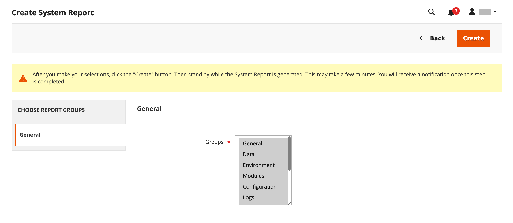

# サポートツール

{{ee-feature}}

サポートツールは、システム内の既知の問題を特定するために設計されています。 開発および最適化プロセスのリソースとして、またサポートチームが問題を特定して解決するための診断ツールとして使用できます。

## システムレポート

システムレポートツールを使用すると、システムの定期的な完全または部分的なスナップショットを取得し、後で参照するために保存できます。 コード開発サイクルの前後のパフォーマンス設定、またはサーバー設定の変更を比較できます。 システムレポートツールは、調査を開始するためにサポートが必要とする情報の準備と提出にかかる時間を大幅に短縮することができます。

「システムレポート」グリッドから、既存のレポートの表示とダウンロード、レポートの削除、レポートの作成を行うことができます。

### システムレポートへのアクセス

_管理者_ サイドバーで、**[!UICONTROL System]** > _[!UICONTROL Support]_>**[!UICONTROL System Report]**&#x200B;に移動します。

{width="600" zoomable="yes"}

### レポートの生成

1. **[!UICONTROL New Report]**&#x200B;をクリックします。

1. **[!UICONTROL Groups]** リストで、レポートに含める各情報セットを選択します。 デフォルトでは、すべてのグループが選択されています。

   {width="600" zoomable="yes"}

1. 右上隅の「**[!UICONTROL Create]**」をクリックします。

   選択したレポートタイプの数によっては、レポートが生成されるまでに数分かかる場合があります。 レポートの準備が整うと、生成された日時とともにグリッドの上部に表示されます。

### モジュール情報を表示

インストールされているモジュールに関する有用な情報を見つけることができます。

**_インストールされている各モジュールのレポート情報を表示するには:_**

1. _管理者_ サイドバーで、**[!UICONTROL System]** > _[!UICONTROL Support]_>**[!UICONTROL System Report]**&#x200B;に移動します。
1. **[!UICONTROL New Report]**&#x200B;をクリックします。
1. **[!UICONTROL Groups]** リストから`Modules`を選択します。
1. **[!UICONTROL Create]**&#x200B;をクリックします。
1. レポートが生成されたら、**[!UICONTROL Select]**&#x200B;をクリックし、**[!UICONTROL View]**&#x200B;をクリックしてすべてのモジュールバージョンを表示します。
1. レポートをダウンロードするには、**[!UICONTROL Download]**&#x200B;をクリックします。

### システムレポートの管理

グリッドの&#x200B;**[!UICONTROL Action]**&#x200B;列で、次のいずれかを選択します。

- `View` – この関数を使用して、レポートの詳細を表示します。
- `Delete` – 生成されたレポートをリストから削除するには、この関数を使用します。
- `Download` – この関数を使用して、レポートをHTML ファイルとして保存します。

### システムレポートの詳細を表示

1. 必要なレポートについては、_[!UICONTROL Actions]_&#x200B;列の&#x200B;**[!UICONTROL View]**&#x200B;を選択してください。

1. 左側のパネルで、レポートの各セクションを展開して、詳細を表示します。

   {width="600" zoomable="yes"}

### 利用可能なシステムレポート

| レポートグループ | 含まれる情報 |
| ------------ | -------------------- |
| [!UICONTROL General] | Adobe Commerce Version Data Count  キャッシュステータス  Index Status |
| [!UICONTROL Environment] | 環境情報 MySQL ステータス |
| [!UICONTROL Data] | URL キーでカテゴリを複製 URL キーで製品を複製 SKUで製品を複製  インクリメント Idで注文を複製  メールでユーザーを複製 壊れたカテゴリーデータ |
| [!UICONTROL Modules] | カスタムモジュールリスト  無効なモジュールリスト  すべてのモジュールリスト |
| [!UICONTROL Configuration] | `app/etc/env.php` 配送方法 支払い方法 支払い機能マトリックスからの設定  データ |
| [!UICONTROL Logs] | ログファイル  上位のシステムメッセージ  今日の上位のシステムメッセージ  上位のデバッグメッセージ  今日の上位のデバッグメッセージ  上位の例外メッセージ  今日の上位の例外メッセージ |
| [!UICONTROL Attributes] | ユーザー定義EAV属性 新しいEAV属性  エンティティタイプ  すべてのEAV属性  カテゴリーEAV属性 製品EAV属性 顧客EAV属性 顧客アドレス EAV属性 RMA項目EAV属性 |
| [!UICONTROL Events] | カスタムグローバルイベント   カスタム管理イベント   カスタムフロントエンドイベント   カスタムドキュメントイベント   カスタム Crontab イベント   カスタム REST イベント   カスタム SOAP イベント   コア管理イベント   コア管理イベント   コア管理イベント   コア管理イベント   コア REST イベント   コア SOAP イベント  すべてのグローバルイベント  すべての管理イベント  すべてのフロントエンドイベント {All REST イベント  すべてのSOAP}すべてのREST イベント イベント  すべてのCrontab イベント    |
| [!UICONTROL Cron] | ステータスコード別のCron スケジュール   ジョブコード別のCron スケジュール  Cron スケジュールキューのエラー Cron スケジュールリスト   カスタムのグローバル Cron ジョブ   カスタム設定可能なCron ジョブ   コアのグローバル Cron ジョブ   コア設定可能なCron ジョブ  すべてのグローバル Cron ジョブ  すべての設定可能なCron ジョブ |
| [!UICONTROL Design] | Adminhtml テーマ リスト   フロントエンド テーマ リスト |
| [!UICONTROL Stores] | Web サイトツリー Web サイトリスト   ストアリスト   ストアビューリスト |
| OMS コネクタ  _（OMS統合で表示）_ | コネクタバージョン   コネクタ監視  メッセージ処理結果 |

{style="table-layout:auto"}
