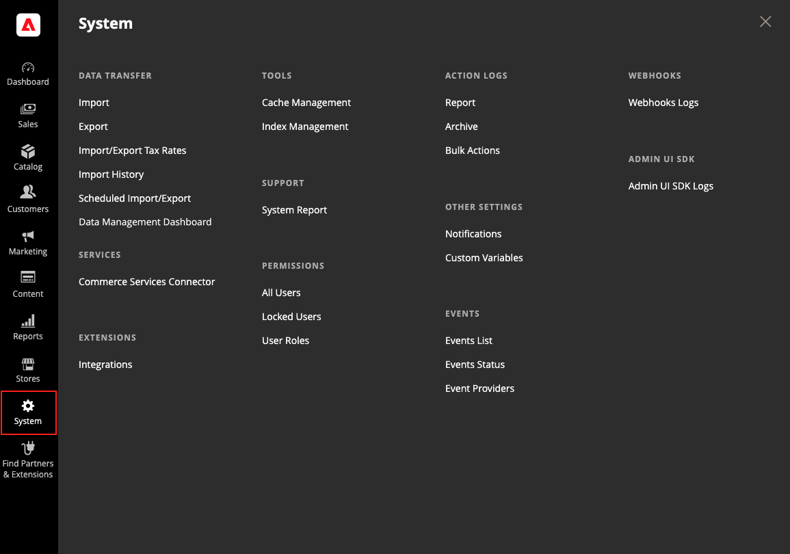

# [!UICONTROL System] メニュー

[!UICONTROL System] メニューには、データのインポートとエクスポート、システムキャッシュとインデックスの管理、権限の管理、バックアップ、システム通知、カスタム変数の管理を行うツールが含まれています。

{width="600" zoomable="yes"}

**_[!UICONTROL System] メニューを表示するには：_**

_管理者_ サイドバーで、「**[!UICONTROL System]**」をクリックします。

## [!UICONTROL Data Transfer]

これらの [ ツール ](data-transfer.md) を使用すると、1 回の操作で複数のレコードを管理できます。 新しい品目をインポートしたり、既存の製品および税率を更新、置換および削除できます。

## [!UICONTROL Extensions]

ストアの [ サードパーティの統合 ](integrations.md) および拡張機能を管理します。

## [!UICONTROL Tools]

このツールのコレクションを使用して、[ キャッシュ ](cache-management.md) および [ インデックス ](index-management.md) 管理、[ バックアップ ](backups.md)、インストール設定などのシステムリソースを管理します。

## [!UICONTROL Support]

 （Adobe Commerceのみ）

[ サポートツール ](support.md) は、開発および最適化プロセス中のリソースとして、また、アドビのサポートチームがシステムの問題を特定し解決するのに役立つ診断ツールとして使用できます。

## [!UICONTROL Permissions]

Adobe CommerceとMagento Open Sourceは、[ 役割と権限 ](permissions.md) を使用して、管理者ユーザーに対して異なるレベルのアクセスを作成します。 これらのツールを使用すると、管理者は、サイトで作業するユーザーに対して _知っておく必要がある_ 権限を付与できます。

## [!UICONTROL Action Log]

 （Adobe Commerceのみ）

[ アクションログ ](action-log.md) は、ストアで作業する管理者のアクティビティを追跡します。 ほとんどのイベントで使用できる情報には、アクション、ユーザーの名前、成功か失敗か、アクションのターゲットとなったオブジェクトの ID などがあります。 管理アクションアーカイブには、サーバーに保存されている CSV ログファイルが一覧表示されます。

## [!UICONTROL Other Settings]

インボックスで [ 通知 ](notifications.md) を管理し、[ カスタム変数 ](variables-custom.md) を作成して、新しい [ 暗号化キー ](encryption-key.md) を生成します。
