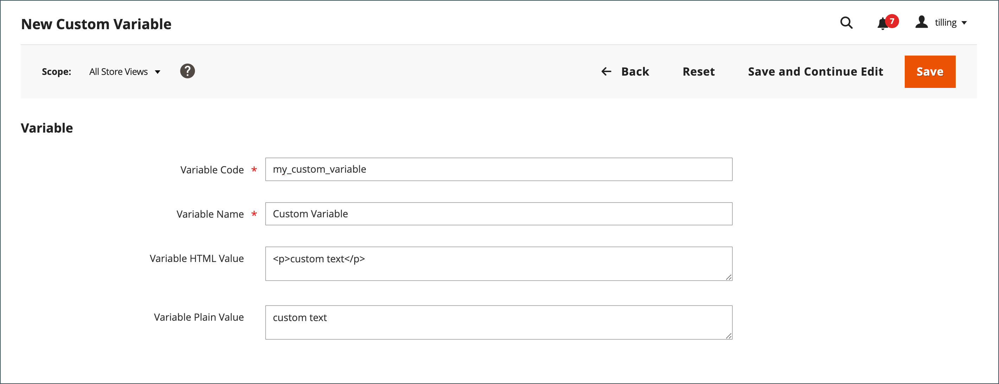

# カスタム変数の追加

ビジネスの特定のニーズに対応するために、カスタム変数を作成し、[ ページ ](../content-design/pages.md)、[ ブロック ](../content-design/blocks.md)、[ メールテンプレート ](email-templates.md)に挿入できます。 _変数を挿入_ ボタンをクリックすると表示される許可された変数のリストには、[定義済み](variables-predefined.md)とカスタム変数の両方が含まれます。 特定のメールテンプレートで使用可能な変数のリストは、テンプレートに関連付けられたデータによって決まります。 頻繁に使用されるメールテンプレートと関連する変数の一覧については、[変数リファレンス ](variables-reference.md)を参照してください。

{width="600" zoomable="yes"}

>[!NOTE]
>
>事前定義済みの変数またはカスタム変数のみが、電子メールとニュースレターのテンプレートで使用できます。

## 手順1：カスタム変数の作成

1. _管理者_ サイドバーで、**[!UICONTROL System]** > _[!UICONTROL Other Settings]_>**[!UICONTROL Custom Variables]**に移動します。

1. **[!UICONTROL Add New Variable]**&#x200B;をクリックします。

1. **[!UICONTROL Variable Code]**&#x200B;の識別子を入力します。スペースを含めずに、すべての小文字を使用します。

   必要に応じて、アンダースコア文字またはハイフンを使用してスペースを表すことができます。 例：`my_custom_variable`

1. 内部参照に使用される&#x200B;**[!UICONTROL Variable Name]**&#x200B;を入力します。 例：`My Custom Variable`

1. 変数に関連付けられている値を入力するには、次のいずれかの操作を行います。

   - **[!UICONTROL Variable HTML Value]**&#x200B;に、単純なHTML タグでフォーマットされた変数値を入力します。 例：

     `<b>This formatted content appears in place of the variable.</b>`

   - **[!UICONTROL Variable Plain Value]**&#x200B;の場合は、変数の値を書式なしでプレーンテキストとして入力します。 例：

     `This unformatted content appears in place of the variable.`

   >[!TIP]
   >
   >スペースが必要な場合は、テキストボックスの右下隅をドラッグします。

   {width="600" zoomable="yes"}

1. 完了したら、**[!UICONTROL Save]**&#x200B;をクリックします。

## 手順2：カスタム変数をコンテンツに挿入する

[!DNL Page Builder]を使用してカスタム変数を挿入します。

1. 変数をコンテンツに追加するページ、ブロック、カテゴリ、または製品を開きます。

1. **[!UICONTROL Content]** セクションのを展開します。

1. **[!UICONTROL Edit with Page Builder]**&#x200B;をクリックします。

1. 左側のパネルで、**[!UICONTROL Elements]**&#x200B;をクリックし、次のいずれかの操作を行います。

   - 変数を挿入する既存のテキスト領域をクリックします。

   - 新しい&#x200B;**[!UICONTROL Text]** オブジェクトをステージにドラッグします。

1. エディターツールバーの右端にある（）をクリックして、変数を挿入します。

   ![[!DNL Page Builder] ステージとパネル ](./assets/variable-custom-pagebuilder-stage.png){width="600" zoomable="yes"}

1. リストで、挿入するカスタム変数を選択し、**[!UICONTROL Insert Variable]**&#x200B;をクリックします。

   {width="600" zoomable="yes"}

   変数識別子は、エディターにプレースホルダーとして表示されます。

   ![[!DNL Page Builder] ステージ – 変数プレースホルダー](./assets/pagebuilder-variable-inserted.png){width="600" zoomable="yes"}

1. 完了したら、**[!UICONTROL Save]**&#x200B;をクリックします。
