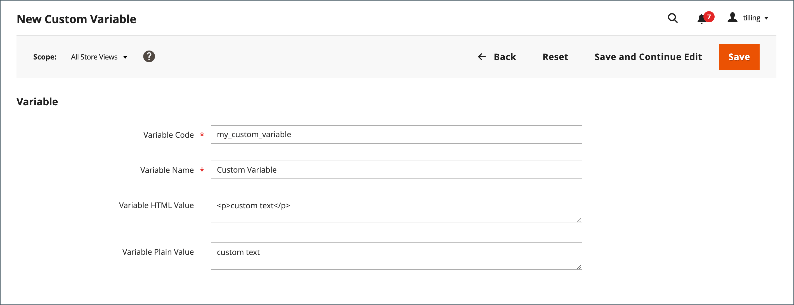

# カスタム変数の追加

ビジネスの具体的なニーズを満たすために、カスタム変数を作成し、 [ページ](../content-design/pages.md), [ブロック](../content-design/blocks.md)、および [電子メールテンプレート](email-templates.md). 許可された変数のリスト。 _変数を挿入_ ボタンに次の両方を含める： [定義済み](variables-predefined.md) およびカスタム変数。 特定の E メールテンプレートで使用可能な変数のリストは、テンプレートに関連付けられているデータによって決まります。 詳しくは、 [変数リファレンス](variables-reference.md) を参照してください。

{width="600" zoomable="yes"}

>[!NOTE]
>
>電子メールおよびニュースレターのテンプレートで使用できるのは、定義済みまたはカスタムの変数のみです。

## 手順 1：カスタム変数の作成

1. 次の日： _管理者_ サイドバー、移動 **[!UICONTROL System]** > _[!UICONTROL Other Settings]_>**[!UICONTROL Custom Variables]**.

1. クリック **[!UICONTROL Add New Variable]**.

1. 次の識別子を入力 **[!UICONTROL Variable Code]**&#x200B;の場合は、スペースを含まないすべての小文字を使用します。

   必要に応じて、アンダースコア文字やハイフンを使用してスペースを表すことができます。 例： `my_custom_variable`

1. を入力します。 **[!UICONTROL Variable Name]**：内部参照に使用されます。 例： `My Custom Variable`

1. 変数に関連付けられている値を入力するには、次のいずれかの操作を行います。

   - の場合 **[!UICONTROL Variable HTML Value]**&#x200B;の場合は、単純なHTMLタグで書式設定された変数値を入力します。 例：

     `<b>This formatted content appears in place of the variable.</b>`

   - の場合 **[!UICONTROL Variable Plain Value]**&#x200B;を使用する場合は、変数の値を書式設定のないプレーンテキストとして入力します。 例：

     `This unformatted content appears in place of the variable.`

   >[!TIP]
   >
   >領域が必要な場合は、テキストボックスの右下隅をドラッグします。

   {width="600" zoomable="yes"}

1. 完了したら、「 **[!UICONTROL Save]**.

## 手順 2：コンテンツにカスタム変数を挿入する

用途 [!DNL Page Builder] をクリックして、カスタム変数を挿入します。

1. 変数をコンテンツに追加するページ、ブロック、カテゴリまたは製品を開きます。

1. 展開  の **[!UICONTROL Content]** 」セクションに入力します。

1. クリック **[!UICONTROL Edit with Page Builder]**.

1. 左側のパネルで、 **[!UICONTROL Elements]** 次のいずれかの操作を行います。

   - 変数を挿入する既存のテキスト領域をクリックします。

   - 新しい **[!UICONTROL Text]** オブジェクトをステージに追加します。

1. エディターツールバーの右端にある  ) をクリックして、変数を挿入します。

   ![[!DNL Page Builder] ステージとパネル](./assets/variable-custom-pagebuilder-stage.png){width="600" zoomable="yes"}

1. リストで、挿入するカスタム変数を選択し、 **[!UICONTROL Insert Variable]**.

   {width="600" zoomable="yes"}

   変数識別子は、エディターでプレースホルダーとして表示されます。

   ![[!DNL Page Builder] stage - variable placeholder](./assets/pagebuilder-variable-inserted.png){width="600" zoomable="yes"}

1. 完了したら、「 **[!UICONTROL Save]**.
