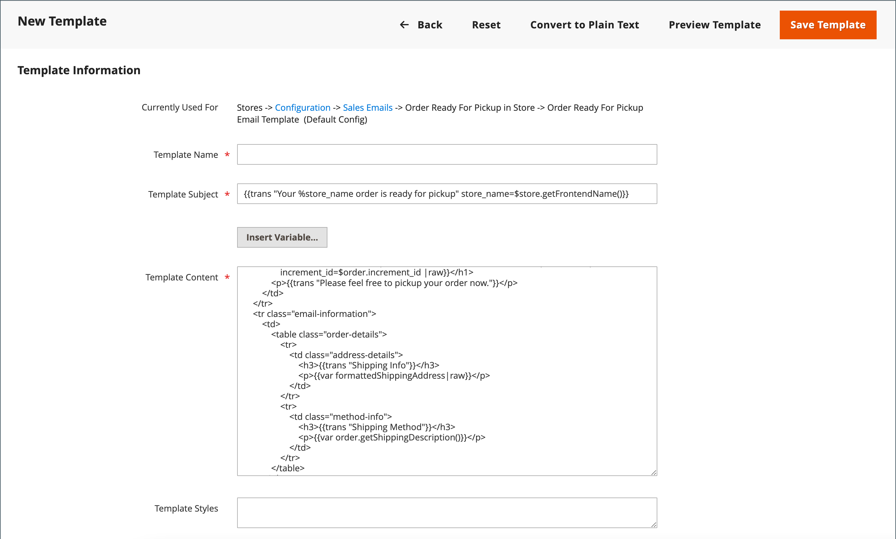

# 事前定義済みの変数の使用

[ 定義済み ](variables-predefined.md) 変数を使用すると、[ メール ](email-templates.md) および [ ニュースレター ](../merchandising-promotions/newsletters.md) テンプレート、その他のタイプのコンテンツを簡単にパーソナライズできます。 「変数を挿入 [ ボタンをクリックすると、許可されている ](variables-predefined.md) 事前定義済みの）変数のリストが表示されます。 次の画像に示すように、特定のメールテンプレートで使用可能な変数のリストは、テンプレートに関連付けられているデータによって決定されます。 よく使用されるメールテンプレートとそれに関連する変数のリストについては、[ 変数リファレンス ](variables-reference.md) を参照してください。

{width="700" zoomable="yes"}

## メールテンプレートへの変数の追加

1. _管理者_ サイドバーで、**[!UICONTROL Marketing]**/_[!UICONTROL Communications]_/**[!UICONTROL Email Templates]**&#x200B;に移動します。

1. 次のいずれかの操作を行います。

   - 既存のテンプレートに変数を追加するには、リストでテンプレートをクリックして、編集モードで開きます。

   - 新しいテンプレートで変数を使用するには、「**[!UICONTROL Add New Template]**」をクリックしてデフォルトのテンプレートコードをカスタマイズします。 [ メッセージテンプレート ](email-template-custom.md#message-templates) を参照してください。

1. [_[!UICONTROL Load default template]_] で、カスタマイズする&#x200B;**[!UICONTROL Template]**&#x200B;を選択します。

1. テンプレートを適用するには、「**[!UICONTROL Load Template]**」をクリックします。

   「_[!UICONTROL Currently used for]_」フィールドには、テンプレートの設定パスが表示されます。_[!UICONTROL Template Subject]_ と _[!UICONTROL Template Content]_&#x200B;は、選択したテンプレートを基準にして自動的に生成されます。

   - **[!UICONTROL Template Subject]** – このテキストは、メールの件名に表示されます。

   - **[!UICONTROL Template Content]** – このテキストは、送信されたメールの完全なコンテンツで表示されます。

   {width="600" zoomable="yes"}

1. **[!UICONTROL Template Name]** を入力します。

1. このメールテンプレートで使用できる [ 事前定義済み ](variables-predefined.md) 変数のリストについては、「**[!UICONTROL Insert Variable]**」をクリックします。

   テンプレートに挿入する変数を決定します。 次に、右上隅にある「_閉じる_ （X）」をクリックします。 （後でこれに戻ります）。

1. テンプレートのモックアップを表示するには、ボタンバーの「**[!UICONTROL Preview Template]**」をクリックします。

   新しいタブでプレビューが開いたら、他のコンテンツを基準として変数を配置する場所を指定します。 その後、元のタブに戻って続行します。

   {width="600" zoomable="yes"}

1. **[!UICONTROL Template Content]** ボックスで、変数を表示する位置に挿入ポイントを置き、[**[!UICONTROL Insert Variable...]**] をクリックします。

1. 使用可能な変数の一覧で、テンプレートに挿入する変数をクリックします。

1. 完了したら、「**[!UICONTROL Save Template]**」をクリックします。

## テンプレートをプレーンテキストに変換

1. テンプレートを編集モードで開きます。

1. ページの上部にある「**[!UICONTROL Convert to Plain Text]**」をクリックします。

1. タグを取り除くかどうかを確認するメッセージが表示されたら、[**[!UICONTROL OK]**] をクリックします。

1. プレーンテキストのバージョンを保存するには、「**[!UICONTROL Save Template]**」をクリックします。

## HTMLのバージョンを復元する

1. ページの上部にある「**[!UICONTROL Return HTML Version]**」をクリックします。

1. テンプレートのHTMLバージョンを保存するには、「**[!UICONTROL Save Template]**」をクリックします。
